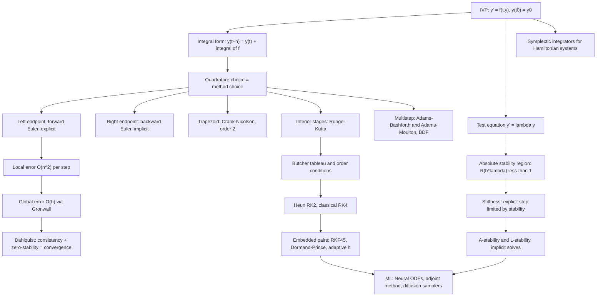

# Topic 08: Numerical ODE Solvers

## 1. Master Overview

An initial value problem $\mathbf{y}'(t) = \mathbf{f}(t, \mathbf{y})$, $\mathbf{y}(t_0) = \mathbf{y}_0$ specifies a trajectory implicitly: it says where you are and how fast you are moving, but not where you will be. Picard–Lindelöf guarantees that a unique trajectory exists when $\mathbf{f}$ is Lipschitz in $\mathbf{y}$ — and almost never tells you how to write it down. Planetary motion, chemical kinetics, circuit dynamics, epidemic models, and the sampling process of a diffusion model all have this form and all require numerical integration.

Every numerical method answers the same question: *given the trajectory up to $t_n$, how do I advance one step $h$?* Forward Euler answers it with the crudest possible model — believe the current slope for the whole step — and its error analysis sets the entire template: a **local truncation error** of $O(h^2)$ per step accumulates over $O(1/h)$ steps into a **global error** of $O(h)$, provided the method is *zero-stable* so that errors do not amplify. That statement, sharpened, is the **Dahlquist equivalence theorem**: consistency plus zero-stability is equivalent to convergence, the fundamental theorem of the subject.

Higher accuracy comes from sampling $\mathbf{f}$ more cleverly within the step. Runge–Kutta methods take several trial slopes and combine them, with the coefficients recorded in a Butcher tableau and constrained by *order conditions* — RK4 needs eight equations satisfied for fourth order. Multistep methods (Adams–Bashforth, Adams–Moulton, BDF) instead reuse past values, achieving high order with a single new evaluation. But accuracy is not the only concern: **stiff** problems, where the fastest mode decays far faster than the solution changes, force explicit methods to take absurdly small steps for *stability*, not accuracy. The cure is implicit methods and A-stability — backward Euler and the trapezoidal rule remain stable for any step size on the whole left half-plane, at the cost of solving a nonlinear system per step.

> [!NOTE]
> Stability, not accuracy, decides the step size in most real problems. For $y' = \lambda y$ with $\lambda = -1000$, forward Euler *diverges* unless $h \lt 2/1000$, even though the solution decays to nothing in a microsecond and 3-digit accuracy would be plenty. Backward Euler integrates the same problem with $h = 1$. This one asymmetry motivates half the field.

## 2. First-Principles Framework

- **Phenomenon**: Dynamics is specified by rates, not by positions; closed-form solutions exist only for a vanishing fraction of models.
- **Goal**: Produce $\mathbf{y}_n \approx \mathbf{y}(t_n)$ with a provable global error bound, at controllable cost, without instability destroying the answer.
- **Governing relations**: The exact integral form $\mathbf{y}(t_{n+1}) = \mathbf{y}(t_n) + \int_{t_n}^{t_{n+1}}\mathbf{f}(s, \mathbf{y}(s))\,ds$; every method is a quadrature rule for that integral applied to an unknown integrand.
- **Two error budgets**: Local truncation error $\tau_n = O(h^{p+1})$ per step; global error $O(h^{p})$ after Gronwall accumulation — one order is always lost.
- **Two stability notions**: *Zero-stability* ($h \to 0$, controls error growth and gives convergence via Dahlquist); *absolute stability* ($h$ fixed, tested on $y' = \lambda y$, controls whether the numerical solution decays when the true one does).
- **Design principle**: Match the method to the spectrum. Nonstiff and smooth: explicit RK with adaptive steps. Stiff: implicit, A-stable or L-stable. Hamiltonian and long-time: symplectic, giving bounded energy error over exponentially long times.
- **Cost ledger**: Explicit RK pays $s$ evaluations of $\mathbf{f}$ per step; multistep methods pay $1$–$2$ regardless of order; implicit methods pay a Newton solve with Jacobian $I - h\,\partial\mathbf{f}/\partial\mathbf{y}$ per step, which is cheap relative to the thousands of explicit steps it replaces on a stiff problem.
- **Error floor**: Total error is $C_1h^{p} + C_2\varepsilon_{\text{mach}}/h$, so refinement helps only down to $h \sim \varepsilon_{\text{mach}}^{1/(p+1)}$ — one more reason high order pays.

**Reading order.** Derive forward Euler from the integral identity, prove its $O(h)$ global bound with Gronwall, then read every other method as an improvement along exactly one of four axes: order (Runge–Kutta, multistep), stability (implicit, A- and L-stability), efficiency (embedded pairs and step control), or structure (symplectic and reversible integrators). The ODE theory itself — existence, uniqueness, phase portraits, the matrix exponential — is developed in the companion modules linked below rather than repeated here.

## 3. Mermaid Concept Map

## 4. Common Misconceptions

| Misconception | Mathematical Reality | Correct Mental Model |
|---|---|---|
| *"A method of order $p$ has error $O(h^{p+1})$."* | $O(h^{p+1})$ is the *local* error of one step. Over $T/h$ steps the errors accumulate to a *global* error $O(h^{p})$ — one order is always lost. | Local error per step, global error over the interval; the order quoted for a method is the global one. |
| *"Smaller $h$ always means a more accurate answer."* | Total error is $C_1 h^{p} + C_2\varepsilon_{\text{mach}}/h$: truncation falls but round-off rises, so there is an optimal $h \sim \varepsilon^{1/(p+1)}$ below which accuracy degrades. | Two competing error sources, exactly as in numerical differentiation (Topic 05). |
| *"Explicit methods are just cheaper versions of implicit ones."* | No explicit Runge–Kutta method can be A-stable — its stability function is a polynomial, and polynomials are unbounded. Implicit methods have rational stability functions that can stay bounded on the whole left half-plane. | The explicit/implicit divide is about *stability regions*, not merely convenience. |
| *"Stiffness means the solution changes rapidly."* | A stiff problem is one whose *fastest transient* decays far faster than the solution scale of interest; the solution itself is typically smooth and slow after the transient. | Stiffness is a ratio $\vert\lambda_{\max}\vert/\vert\lambda_{\min}\vert$ of the Jacobian spectrum relative to the integration interval — a property of the problem *and* the interval. |
| *"RK4 is always the best general-purpose method."* | RK4 with a fixed step is neither adaptive nor stiff-capable; its real stability interval on the negative axis is only $(-2.785, 0)$. Production solvers use embedded pairs (Dormand–Prince) or BDF for stiff systems. | RK4 is the right default for smooth nonstiff problems; step control and stiffness detection are what a real solver adds. |
| *"An energy-conserving system will be conserved by an accurate solver."* | RK4 applied to a harmonic oscillator loses energy steadily; forward Euler gains it. Only *symplectic* methods keep the energy error bounded over exponentially long times, even at low order. | Structure preservation is a separate axis from order; a first-order symplectic method can beat RK4 over long integrations. |
| *"Adaptive step control chases the global error."* | Standard controllers estimate the *local* error per step from an embedded lower-order formula, and control it — global error is only controlled indirectly. | Per-step error control with $h_{\text{new}} = h\,(\text{tol}/\text{err})^{1/(p+1)}$; global accuracy follows from stability, not from the controller. |

## 5. Directory Inventory

| File | Contents |
|---|---|
| [`README.md`](README.md) | Master overview, first-principles framework, concept map, misconceptions, references. |
| [`first_principles.ipynb`](first_principles.ipynb) | Definitions (local/global error, order, zero- and A-stability, Butcher tableau), theorem statements, six complete proofs (Euler local error, Euler global $O(h)$ via the discrete Gronwall lemma, stability regions of forward/backward Euler, A-stability of the trapezoidal rule, RK2 order conditions, symplecticity of the Störmer–Verlet map), adaptive step control, multistep methods, and ML applications. |
| [`exercises.ipynb`](exercises.ipynb) | 20 fully solved problems: Level 0 concept checks (4), Level 1 foundations (6), Level 2 AI/ML and physics applications (6), Level 3 challenge proofs (4). |

**Related modules**: [`../../differential_equations/`](../../differential_equations/) for the analytical theory (existence and uniqueness, phase planes, Laplace transforms), [`../../calculus/15_ordinary_differential_equations/`](../../calculus/15_ordinary_differential_equations/) for the calculus foundations and the matrix exponential, [`../06_numerical_integration_quadrature/`](../06_numerical_integration_quadrature/) for the quadrature rules every method is built from, and [`../02_root_finding_methods/`](../02_root_finding_methods/) for the Newton solves inside every implicit step. This topic covers only the *numerics*; the ODE theory itself lives in those modules.

## 6. References

1. **Hairer, E., Nørsett, S. P., & Wanner, G.** *Solving Ordinary Differential Equations I: Nonstiff Problems* (2nd ed.), Springer. — The definitive treatment of Runge–Kutta order conditions, trees, and step control.
2. **Hairer, E., & Wanner, G.** *Solving Ordinary Differential Equations II: Stiff and Differential-Algebraic Problems* (2nd ed.), Springer. — Stiffness, A- and L-stability, BDF, Rosenbrock and implicit RK methods.
3. **Hairer, E., Lubich, C., & Wanner, G.** *Geometric Numerical Integration* (2nd ed.), Springer. — Symplectic integrators, backward error analysis, and long-time energy behaviour.
4. **Burden, R. L., & Faires, J. D.** *Numerical Analysis* (9th ed.). — Ch. 5: Initial value problems, Euler, Runge–Kutta, multistep, adaptive methods, stability.
5. **Butcher, J. C.** *Numerical Methods for Ordinary Differential Equations* (3rd ed.), Wiley. — Tableaux, trees, and the algebraic theory of order conditions.
6. **Heath, M. T.** *Scientific Computing: An Introductory Survey* (2nd ed.). — Ch. 9: Initial value problems for ODEs, with an accessible stability discussion.
7. **LeVeque, R. J.** *Finite Difference Methods for Ordinary and Partial Differential Equations*, SIAM (2007). — Chs. 5–8: Convergence, zero-stability, absolute stability, and stiff solvers.
8. **Iserles, A.** *A First Course in the Numerical Analysis of Differential Equations* (2nd ed.), Cambridge. — Chs. 1–4: A compact, rigorous account of order, stability, and Dahlquist barriers.
9. **Chen, R. T. Q., Rubanova, Y., Bettencourt, J., & Duvenaud, D.** (2018). *Neural Ordinary Differential Equations*, NeurIPS. — Continuous-depth networks and the adjoint sensitivity method.
10. **Song, Y., Sohl-Dickstein, J., Kingma, D. P., Kumar, A., Ermon, S., & Poole, B.** (2021). *Score-Based Generative Modeling through Stochastic Differential Equations*, ICLR. — Diffusion sampling as an ODE/SDE integration problem; the probability-flow ODE.
11. **Dormand, J. R., & Prince, P. J.** (1980). *A family of embedded Runge–Kutta formulae*, J. Comput. Appl. Math. 6(1). — The `RK45` / `dopri5` pair used by SciPy and MATLAB.
