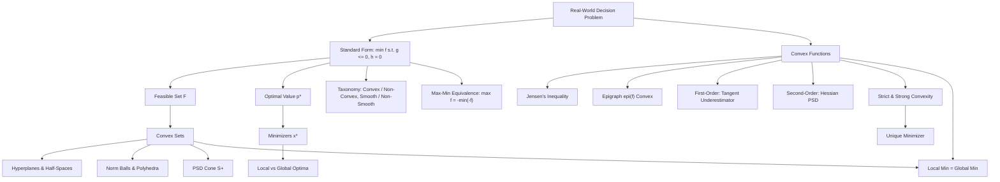

# Topic 01: Optimization Problem Formulation & Convexity

## 1. Master Overview

Optimization is the mathematical discipline of selecting the best element from a set of feasible alternatives. Every problem in the field can be compressed into a single standard form: minimize an objective $f(\mathbf{x})$ over decision variables $\mathbf{x} \in \mathbb{R}^n$, subject to inequality constraints $g_i(\mathbf{x}) \le 0$ and equality constraints $h_j(\mathbf{x}) = 0$. Translating a real question into this form — identifying the variables, the objective, and the constraints — is the first and most consequential modeling skill, because the formulation chosen largely determines whether the problem is tractable at all.

The second theme of this module is convexity, the single most important structural property in optimization. Convex sets contain the line segment between any two of their points; convex functions lie below their chords and above their tangent planes. When a convex objective is minimized over a convex feasible set, the landscape has no spurious valleys: every local minimum is automatically global, and efficient algorithms with certificates of optimality exist.

This module builds the full vocabulary of formulation (feasible set, optimal value $p^*$, minimizers, local versus global optima, the max-min equivalence, and the taxonomy of problem classes), then develops convex analysis from first principles: convex sets, convex and strictly/strongly convex functions, epigraphs, Jensen's inequality, and the first- and second-order characterizations of convexity.

> [!NOTE]
> The true watershed in optimization is not linear versus nonlinear but convex versus non-convex. Convex problems with millions of variables are solved reliably to global optimality every day, while a tiny non-convex problem can be NP-hard. Reformulating a model so that it becomes convex is often the decisive step.

## 2. First-Principles Framework

The framework below reconstructs the module from a single observed phenomenon to its structural consequences:

- **Phenomenon**: Countless questions in science, engineering, and machine learning reduce to choosing the best feasible alternative — the lowest energy state, the smallest loss, the cheapest design satisfying specifications.
- **Goal**: Express any such question in the universal standard form $\min f(\mathbf{x})$ subject to $g_i(\mathbf{x}) \le 0$, $h_j(\mathbf{x}) = 0$, and identify structure that makes it solvable.
- **Governing equation(s)**: The defining inequality of convexity, $f(\theta \mathbf{x} + (1-\theta)\mathbf{y}) \le \theta f(\mathbf{x}) + (1-\theta) f(\mathbf{y})$ for all $\theta \in [0,1]$, together with the feasible-set definition $\mathcal{F} = \{\mathbf{x} \in \mathcal{D} : g_i(\mathbf{x}) \le 0,\ h_j(\mathbf{x}) = 0\}$.
- **Formulation**: Convexity is verified through equivalent characterizations — the epigraph is a convex set, the tangent plane is a global underestimator ($f(\mathbf{y}) \ge f(\mathbf{x}) + \nabla f(\mathbf{x})^T(\mathbf{y}-\mathbf{x})$), or the Hessian is positive semidefinite ($\nabla^2 f \succeq 0$).
- **Consequence**: For convex problems, local optimality implies global optimality; strict convexity yields uniqueness of the minimizer; convexity-preserving operations (nonnegative sums, pointwise maxima, affine composition) let large models be certified convex piece by piece.

## 3. Mermaid Concept Map

The map traces the path from a raw decision problem, through the standard form and its vocabulary, into the two pillars of convex analysis (convex sets and convex functions) and their joint consequence:

## 4. Common Misconceptions

Each row contrasts a tempting but wrong belief with the precise mathematical fact and the mental picture that prevents the error:

| Misconception | Mathematical Reality | Correct Mental Model |
|---|---|---|
| *"A minimizer always exists once the problem is written down."* | The optimal value $p^*$ is an infimum and may not be attained: $f(x) = e^x$ has $p^* = 0$ with no minimizer; an infeasible problem has $p^* = +\infty$. | Existence must be proved separately (e.g., Weierstrass on a compact set, or coercivity); $p^*$ and $\mathbf{x}^*$ are distinct objects. |
| *"Maximization needs its own separate theory."* | $\max f(\mathbf{x})$ over $\mathcal{F}$ equals $-\min(-f(\mathbf{x}))$ over the same set, with identical optimizers. | Every result about minimization translates verbatim; concave maximization is convex minimization in disguise. |
| *"Convexity of a function is about its domain being nice."* | Convexity requires both a convex domain and the chord inequality; $f(x) = 1/x$ satisfies the Hessian test on the non-convex set $x \neq 0$ yet is not convex there. | Check the domain first: a convex function is a convex set (the epigraph) seen from the side. |
| *"Strict convexity and strong convexity are the same."* | $f(x) = x^4$ is strictly convex but not strongly convex: $f''(0) = 0$, so no quadratic lower bound $\frac{\mu}{2}x^2$ with $\mu \gt 0$ exists globally. | Strong convexity demands uniform positive curvature ($\nabla^2 f \succeq \mu I$); strict convexity only forbids flat chords. |
| *"Non-convex problems have many local minima, so convex problems must have one minimizer."* | A convex function can have an entire convex set of minimizers, e.g. $f(x, y) = x^2$ minimized along the whole $y$-axis. | Convexity makes the set of minimizers convex; only strict convexity collapses it to a single point. |
| *"The pointwise maximum of nice functions is nice, so it is smooth."* | $\max(f_1, f_2)$ of convex functions is always convex but generally non-smooth at crossing points, e.g. $\lvert x\rvert = \max(x, -x)$. | Convexity survives the max operation; differentiability does not. Taxonomy axes (convex/non-convex, smooth/non-smooth) are independent. |
| *"Jensen's inequality only concerns probability."* | Jensen states $f(\sum_i \theta_i \mathbf{x}_i) \le \sum_i \theta_i f(\mathbf{x}_i)$ for any convex weights; expectations are one instance. | Jensen is the finite (and limiting) extension of the two-point convexity definition — the definition iterated by induction. |

## 5. Directory Inventory

This module contains the following core files:

| File | Description |
|---|---|
| [`README.md`](README.md) | Module overview, first-principles framework, concept map, misconceptions, and canonical references. |
| [`first_principles.ipynb`](first_principles.ipynb) | Markdown-only theory notebook: intuition, rigorous definitions (standard form, convex sets and functions, epigraph, strong convexity), six complete proofs (Jensen, first- and second-order characterizations, local-global theorem, max/intersection closure, uniqueness), computational insights, and physics/ML applications. |
| [`exercises.ipynb`](exercises.ipynb) | Markdown-only exercise notebook: 20 fully solved problems in four levels — Concept Check (4), Foundation (6), Applications in AI/ML & Physics (6), and Challenge (4, including log-sum-exp and the PSD cone). |

## 6. References

1. **Boyd, S., & Vandenberghe, L.** (2004). *Convex Optimization*. Cambridge University Press.
   - *Chapters 2 & 3*: Convex sets and convex functions; *Sections 4.1–4.2*: optimization problems and convexity of problems.
2. **Nocedal, J., & Wright, S. J.** (2006). *Numerical Optimization* (2nd ed.). Springer.
   - *Chapter 1*: Introduction and problem classification; *Section 2.1*: what characterizes a solution.
3. **Bertsekas, D. P.** (2009). *Convex Optimization Theory*. Athena Scientific.
   - *Chapter 1*: Basic concepts of convex analysis; companion volume *Nonlinear Programming* (3rd ed., 2016), Appendix B.
4. **Nesterov, Y.** (2018). *Lectures on Convex Optimization* (2nd ed.). Springer.
   - *Chapter 2*: Smooth convex optimization — convexity classes, strict and strong convexity.
5. **Rockafellar, R. T.** (1970). *Convex Analysis*. Princeton University Press.
   - *Parts I–II*: Convex sets, epigraphs, and convex functions in full generality.
6. **Luenberger, D. G., & Ye, Y.** (2016). *Linear and Nonlinear Programming* (4th ed.). Springer.
   - *Chapter 1*: Formulation and classification; *Chapter 7*: basic properties of convex functions and convex programming.
7. **Hiriart-Urruty, J.-B., & Lemaréchal, C.** (2001). *Fundamentals of Convex Analysis*. Springer.
   - *Chapters A–B*: Convex sets and functions, Jensen-type inequalities, epigraphical calculus.
