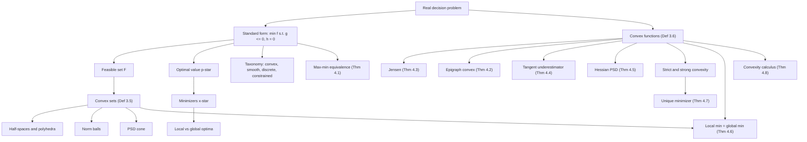

# Module 01 — Optimization Problem Formulation and Convexity

Optimization is the mathematics of choosing the best element of a feasible set. Every problem in
the field compresses into one standard form: minimize an objective $f(\mathbf{x})$ over decision
variables $\mathbf{x} \in \mathbb{R}^n$ subject to inequality constraints $g_i(\mathbf{x}) \le 0$
and equality constraints $h_j(\mathbf{x}) = 0$. Translating a real question into that form —
naming the variables, the objective, and the rules — is the first and most consequential modeling
skill, because the formulation largely decides whether the problem is tractable at all.

The second theme is convexity, the structural property that decides how much a local computation
can certify. Convex sets contain the segment between any two of their points; convex functions lie
below their chords and above their tangent planes. When a convex objective is minimized over a
convex feasible set, the landscape has no spurious valleys: every local minimum is global, the
minimizer set is convex, and strict convexity collapses it to a single point.

This module builds the vocabulary of formulation (feasible set, optimal value $p^{\star}$,
minimizers, local versus global, the max-min equivalence, the four-axis taxonomy) and then develops
convex analysis from the two-point definition: convex sets, convex and strictly and strongly convex
functions, epigraphs, Jensen's inequality, the first- and second-order characterizations, the
convexity calculus, and the local-equals-global theorem with a full proof.

> [!NOTE]
> If $f$ and $\mathcal{F}$ are both convex, every local minimizer of $f$ over $\mathcal{F}$ is a
> global minimizer and the set of minimizers is convex. This is why the real watershed in
> optimization is convex versus non-convex, not linear versus nonlinear: convex problems with
> millions of variables are solved to global optimality daily, while a small non-convex problem
> can be NP-hard.

## Prerequisites

| Direction | Module | Why |
|---|---|---|
| Upstream | [calculus/12 — Hessian, Jacobian, curvature](../../calculus/12_hessian_jacobian_curvature/) | The second-order characterization is a statement about $\nabla^2 f$. |
| Upstream | [linear_algebra/06 — Eigenvalues and spectral theory](../../linear_algebra/06_eigenvalues_eigenvectors_spectral_theory/) | Positive semidefiniteness is read off the spectrum of a symmetric matrix. |
| Downstream | [optimization/02 — Unconstrained optimality conditions](../02_unconstrained_optimality_conditions/) | Stationarity becomes a global certificate precisely under the convexity proved here. |
| Downstream | [optimization/06 — KKT conditions and duality](../06_kkt_conditions_and_duality/) | Strong duality and KKT sufficiency need convexity of the objective and the feasible set. |
| Downstream | [information_theory/04 — KL divergence and $f$-divergences](../../information_theory/04_kl_divergence_and_f_divergences/) | Nonnegativity of KL is Jensen's inequality applied to a convex generator. |

## Learning outcomes

After this module you can:

- Put an arbitrary decision problem into standard form and name its feasible set, optimal value, and minimizer set as three separate objects.
- State and use the max-min equivalence to reduce every maximization to a minimization.
- Decide whether a set is convex by exhibiting it as an intersection of half-spaces, balls, or sublevel sets.
- Certify convexity of a function by any of the three equivalent routes: the chord inequality, the epigraph, or the derivative tests.
- Compute the Hessian of a small objective, read its eigenvalues, and classify the function as convex, strictly convex, or $\mu$-strongly convex.
- Prove that a local minimizer of a convex problem is global, and that strict convexity makes it unique.
- Build large convex models from convex atoms, and recognize the exact point where a composition rule fails without its monotonicity hypothesis.

## Concept map

## Notation

| Symbol | Meaning | Convention fixed here |
|---|---|---|
| $\mathcal{D}$, $\mathcal{F}$ | problem domain, feasible set | $\mathcal{F} \subseteq \mathcal{D}$ after the constraints are imposed |
| $f$, $g_i$, $h_j$ | objective, inequality constraints, equality constraints | constraints always written $g_i \le 0$ and $h_j = 0$ |
| $p^{\star}$, $\mathbf{x}^{\star}$ | optimal value, a minimizer | $p^{\star}$ is an infimum and always exists; $\mathbf{x}^{\star}$ may not |
| $\theta$ | convex-combination weight | $\theta \in [0,1]$ throughout |
| $\operatorname{epi} f$, $S_\alpha$ | epigraph, $\alpha$-sublevel set | epigraph lives in $\mathbb{R}^{n+1}$ |
| $\nabla f$, $\nabla^2 f$ | gradient, Hessian | Hessian symmetric for $f \in \mathcal{C}^2$ |
| $\succeq$, $\succ$ | positive semidefinite, positive definite | Loewner order on $\mathbb{S}^n$ |
| $\mu$ | strong-convexity modulus | $\nabla^2 f \succeq \mu I$ with $\mu \gt 0$ |
| $A^\top$ | transpose | $A^\top$, never $A^T$ |
| $\lVert \mathbf{x} \rVert$ | norm | $\lVert \cdot \rVert$, never $\lvert\lvert \cdot \rvert\rvert$ |
| $\operatorname{argmin}$ | set of minimizers | written with `\operatorname`, never `\argmin` |

## Core results

| Result | Statement | Proved in |
|---|---|---|
| Theorem 4.1 — max-min equivalence | $\sup_{\mathcal{F}} f = -\inf_{\mathcal{F}}(-f)$, with the same optimizers | Proof 5.1 |
| Theorem 4.2 — epigraph characterization | $f$ convex $\iff$ $\operatorname{epi} f$ convex | Proof 5.2 |
| Theorem 4.3 — Jensen's inequality | $f\left(\sum_i \theta_i \mathbf{x}_i\right) \le \sum_i \theta_i f(\mathbf{x}_i)$ for convex weights | Proof 5.3 |
| Theorem 4.4 — first-order test | $f$ convex $\iff$ $f(\mathbf{y}) \ge f(\mathbf{x}) + \nabla f(\mathbf{x})^\top(\mathbf{y}-\mathbf{x})$ | Proof 5.4 |
| Theorem 4.5 — second-order test | for $f \in \mathcal{C}^2$ on open convex $C$: $f$ convex $\iff \nabla^2 f \succeq 0$ | Proof 5.5 |
| Theorem 4.6 — local equals global | convex $f$ on convex $\mathcal{F}$: every local minimizer is global, $\operatorname{argmin}$ convex | Proof 5.6 |
| Theorem 4.7 — uniqueness | strictly convex $f$ on convex $\mathcal{F}$: at most one minimizer | Proof 5.7 |
| Theorem 4.8 — convexity calculus | sums, suprema, intersections, affine precomposition, monotone composition preserve convexity | Proof 5.8 |
| Lemma 4.9 — exact chord gap | for $q = \tfrac{1}{2}\mathbf{z}^\top Q\mathbf{z} + \mathbf{c}^\top\mathbf{z}$ the chord gap equals $\tfrac{1}{2}\theta(1-\theta)(\mathbf{x}-\mathbf{y})^\top Q(\mathbf{x}-\mathbf{y})$ | Proof 5.9 |

## Common misconceptions

| Misconception | Mathematical reality | Correct mental model |
|---|---|---|
| *"A minimizer always exists once the problem is written down."* | The optimal value is an infimum and may not be attained: $f(x) = e^x$ on $\mathbb{R}$ has $p^{\star} = 0$ with no minimizer, and an infeasible problem has $p^{\star} = +\infty$. | Existence is proved separately, by Weierstrass on a compact set or by coercivity; $p^{\star}$ and $\mathbf{x}^{\star}$ are different objects. |
| *"Maximization needs its own theory."* | $\max f$ over $\mathcal{F}$ equals $-\min(-f)$ over the same set, with identical optimizers (Theorem 4.1). | Every minimization result translates verbatim; concave maximization is convex minimization in a mirror. |
| *"Convexity of a function is only about curvature."* | Convexity requires a convex domain as well: $f(x) = 1/x^2$ has $f''(x) = 6/x^4 \gt 0$ everywhere on the non-convex set $\{x \neq 0\}$, yet the chord from $-1$ to $1$ leaves the domain and $f$ is not convex there. | Check the domain first; a convex function is a convex set — its epigraph — seen from the side. |
| *"Strict and strong convexity are the same."* | $f(x) = x^4$ is strictly convex but not strongly convex: $f''(0) = 0$, so no bound $f \ge \frac{\mu}{2}x^2$ with $\mu \gt 0$ holds near the origin. | Strong convexity is uniform positive curvature, $\nabla^2 f \succeq \mu I$; strict convexity only forbids flat chords. |
| *"A convex problem has exactly one minimizer."* | Convexity makes the minimizer set convex, not a singleton: $f(x,y) = x^2$ is minimized along the entire $y$-axis. | Only strict convexity collapses the set to a point, and even then existence is a separate question. |
| *"Convexity survives any composition of convex pieces."* | Theorem 4.8(5) needs the outer function nondecreasing: $h(u) = u^2$ and $g(x) = x^2-1$ are both convex, yet $(x^2-1)^2$ has $f'' \lt 0$ on $\lvert x \rvert \lt 1/\sqrt{3}$. | Composition rules are conditional; check monotonicity of the outer function before invoking them. |
| *"Jensen's inequality is a probability fact."* | Jensen holds for any nonnegative weights summing to one; expectations are the special case obtained in the limit. | Jensen is the two-point definition iterated by induction (Proof 5.3). |

## Exercise index

[`exercises.ipynb`](exercises.ipynb) contains 20 fully solved problems, each with a statement, a
short intuition, a step-by-step solution, a boxed answer, a key takeaway, and — wherever the answer
is numeric — a code cell that recomputes it.

| Tier | Count | Contents |
|---|---:|---|
| L0 — Concept Checks | 4 | standard form, feasible set and optimal value, local versus global, convexity of $x^2$ from the definition |
| L1 — Foundations | 6 | epigraph trick, half-spaces and polyhedra, norm balls, strict versus strong convexity, Jensen implies AM-GM, a $2 \times 2$ Hessian test |
| L2 — Applications (AI/ML and Physics) | 6 | least squares, logistic loss, ridge and strong convexity, entropy and the Boltzmann distribution (physics), spring-chain equilibrium (physics), Markowitz portfolio variance |
| L3 — Challenge Proofs | 4 | log-sum-exp, quasiconvexity, the PSD cone and $\lambda_{\max}$, strong convexity and coercivity |

## References

1. Boyd, S., & Vandenberghe, L. (2004). *Convex Optimization*. Cambridge University Press.
   §2.1–2.3 (convex sets), §3.1.3–3.1.4 (first- and second-order conditions), §3.1.7 (epigraph),
   §3.1.8 (Jensen), §3.2 (operations preserving convexity), §4.2.2 (local optima of convex problems).
2. Bertsekas, D. P. (2009). *Convex Optimization Theory*. Athena Scientific.
   §1.1 (convex sets and functions), Prop. 3.1.1 (existence and uniqueness of minimizers).
3. Nesterov, Y. (2018). *Lectures on Convex Optimization* (2nd ed.). Springer.
   §2.1.1 (Thm 2.1.2, first-order condition), §2.1.3 (Thm 2.1.9, strong convexity bounds).
4. Rockafellar, R. T. (1970). *Convex Analysis*. Princeton University Press.
   §4 (convex functions and epigraphs), §23–25 (subgradients and differentiability).
5. Nocedal, J., & Wright, S. J. (2006). *Numerical Optimization* (2nd ed.). Springer.
   Ch. 1 (problem classification), §2.1 (Thm 2.5, what characterizes a solution).
6. Hiriart-Urruty, J.-B., & Lemaréchal, C. (2001). *Fundamentals of Convex Analysis*. Springer.
   Ch. A (convex sets), Ch. B (convex functions, Jensen-type inequalities).
7. Luenberger, D. G., & Ye, Y. (2016). *Linear and Nonlinear Programming* (4th ed.). Springer.
   Ch. 1 (formulation), Ch. 7 (basic properties of convex programs).
