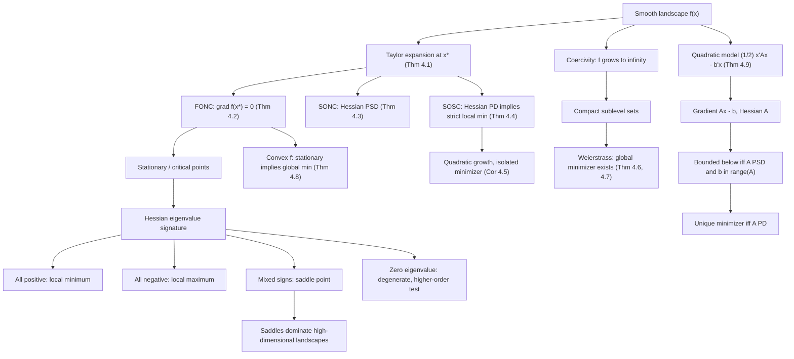

# Module 02 — Unconstrained Optimality Conditions

Given a smooth $f : \mathbb{R}^n \to \mathbb{R}$ and no constraints, two questions have to be answered before any algorithm is worth running: does a minimizer exist, and how would you recognize one if you had it? This module answers both from first principles. Recognition is handled by the classical optimality conditions — Fermat's first-order necessary condition $\nabla f(\mathbf{x}^{\ast}) = \mathbf{0}$, the second-order necessary condition $\nabla^2 f(\mathbf{x}^{\ast}) \succeq 0$, and the second-order sufficient condition $\nabla^2 f(\mathbf{x}^{\ast}) \succ 0$ — which together replace the uncountable test "$f(\mathbf{x}^{\ast}) \le f(\mathbf{x})$ for all nearby $\mathbf{x}$" by a finite algebraic test on the eigenvalue signature of one symmetric matrix.

Existence is a separate, topological question, settled by the Weierstrass extreme value theorem and its workhorse extension: a continuous function that is coercive attains a global minimum, because coercivity forces every sublevel set to be compact. "Bounded below" is not enough — $e^x$ is continuous and bounded below and has no minimizer at all.

The two threads meet in the quadratic model $f(\mathbf{x}) = \tfrac{1}{2}\mathbf{x}^\top A \mathbf{x} - \mathbf{b}^\top \mathbf{x}$, whose solution theory is completely settled here: the infimum is finite exactly when $A \succeq 0$ and $\mathbf{b} \in \operatorname{range}(A)$, and the minimizer is unique exactly when $A \succ 0$. That single theorem is the backbone of least squares, of Newton's method, and of every local convergence analysis downstream.

Beyond minima and maxima sits the third species of stationary point, the saddle. In high-dimensional non-convex landscapes — deep learning above all — saddles vastly outnumber local minima, and the Hessian signature explains both why gradient methods stall on the plateaus around them and why they almost never terminate at one.

> [!NOTE]
> Optimality conditions convert calculus into linear algebra: at a stationary point the entire local landscape is encoded in the spectrum of the Hessian. An all-positive spectrum certifies a strict, isolated local minimum with quadratic growth of modulus $\lambda_{\min}/4$; mixed signs mean a saddle; a zero eigenvalue means the second-order test is silent and higher-order terms decide.

## Prerequisites

| Module | What it supplies |
|---|---|
| [`calculus/09 — Taylor and Power Series`](../../calculus/09_taylor_and_power_series/) | The single-variable Taylor theorem with Lagrange and Peano remainders, which Proof 5.1 lifts to $\mathbb{R}^n$ along a segment. |
| [`optimization/01 — Problem Formulation and Convexity`](../01_problem_formulation_and_convexity/) | Convex sets and functions, and the standard form of an unconstrained problem, used by Theorem 4.8. |
| [`linear_algebra/06 — Eigenvalues, Eigenvectors, Spectral Theory`](../../linear_algebra/06_eigenvalues_eigenvectors_spectral_theory/) | The spectral theorem and the Rayleigh bound $\lambda_{\min}\lVert \mathbf{v}\rVert^2 \le \mathbf{v}^\top H \mathbf{v}$, used in every second-order proof. |

**Downstream — modules this one unlocks:**

| Module | What it takes from here |
|---|---|
| [`optimization/03 — Gradient Descent and Convergence`](../03_gradient_descent_and_convergence/) | The quadratic-growth estimate of Theorem 4.4, which is the local strong-convexity hypothesis behind every linear rate. |
| [`optimization/05 — Constrained Optimization and Lagrange`](../05_constrained_optimization_lagrange/) | The unconstrained conditions, recovered as the zero-constraint special case of the Lagrange conditions. |

## Learning outcomes

After working through this module you can:

- State FONC, SONC and SOSC with their exact hypotheses, and say what breaks when each hypothesis is dropped.
- Prove all three from Taylor's theorem, and prove Taylor's theorem itself by restricting $f$ to a segment.
- Classify any stationary point from the eigenvalue signature of its Hessian, and recognize the degenerate row where the second-order test is silent.
- Decide whether a minimizer exists at all, using Weierstrass on a compact set or coercivity on $\mathbb{R}^n$.
- Solve the quadratic model completely: existence, uniqueness, the minimizer set and the optimal value, in terms of $A$ and $\mathbf{b}$.
- Explain why convexity deletes the word "local" from every conclusion, and why it still gives no existence guarantee.
- Test definiteness the way a solver does — by an attempted Cholesky factorization rather than a spectrum.

## Concept map

## Notation

| Symbol | Meaning | Convention |
|---|---|---|
| $\nabla f(\mathbf{x})$ | gradient | a **column** vector in $\mathbb{R}^n$ |
| $\nabla^2 f(\mathbf{x})$ | Hessian | always written $\nabla^2 f$; $H$ only as a local abbreviation defined in the same cell |
| $A^\top$ | transpose | `\top`, never `^T` |
| $A \succeq 0$, $A \succ 0$ | positive semidefinite, positive definite | Löwner order |
| $\lambda_{\min}$, $\lambda_{\max}$ | extreme Hessian eigenvalues | named, never indexed |
| $\lVert \mathbf{x}\rVert$ | Euclidean norm | `\lVert ... \rVert` |
| $\mathbf{x}^{\ast}$, $f^{\ast}$ | a minimizer and the optimal value | asterisk superscript |
| $B(\mathbf{x}^{\ast}, \varepsilon)$ | open ball of radius $\varepsilon$ | used to state locality |
| $S_c$ | sublevel set $\lbrace \mathbf{x} : f(\mathbf{x}) \le c \rbrace$ | the object coercivity makes compact |
| $\operatorname{range}(A)$, $\ker(A)$, $A^{+}$ | column space, null space, Moore-Penrose pseudoinverse | orthogonal complements for symmetric $A$ |
| $\mu$ | local strong-convexity / quadratic-growth modulus | $\nabla^2 f \succeq \mu I$ on a ball |

## Core results

| Result | Statement | Proved in |
|---|---|---|
| **Theorem 4.1** — Taylor | For $f \in \mathcal{C}^2$ on a segment: mean-value, Lagrange, integral and Peano remainder forms | Proof 5.1 |
| **Theorem 4.2** — FONC | $\mathbf{x}^{\ast}$ a local minimizer, $f$ differentiable there $\implies \nabla f(\mathbf{x}^{\ast}) = \mathbf{0}$ | Proof 5.2 |
| **Theorem 4.3** — SONC | $\mathbf{x}^{\ast}$ a local minimizer, $f \in \mathcal{C}^2$ nearby $\implies \nabla^2 f(\mathbf{x}^{\ast}) \succeq 0$ | Proof 5.3 |
| **Theorem 4.4** — SOSC | $\nabla f(\mathbf{x}^{\ast}) = \mathbf{0}$ and $\nabla^2 f(\mathbf{x}^{\ast}) \succ 0 \implies$ strict local min with growth modulus $\lambda_{\min}/4$ | Proof 5.4 |
| **Corollary 4.5** | Under SOSC, $\mathbf{x}^{\ast}$ is the only stationary point in a ball, hence an *isolated* minimizer | Proof 5.4 |
| **Theorem 4.6** — Weierstrass | Continuous $f$ on a nonempty compact $K$ attains its min and max on $K$ | Proof 5.5 |
| **Theorem 4.7** — coercivity | Continuous and coercive on $\mathbb{R}^n \implies$ a global minimizer exists | Proof 5.6 |
| **Theorem 4.8** — convexity | $f$ convex differentiable: stationary $\iff$ global minimizer; minimizer set convex; unique if strictly convex | Proof 5.7 |
| **Theorem 4.9** — quadratic model | $\inf f \gt -\infty \iff A \succeq 0$ and $\mathbf{b} \in \operatorname{range}(A)$; unique $\iff A \succ 0$, with $\mathbf{x}^{\ast} = A^{-1}\mathbf{b}$, $f^{\ast} = -\tfrac{1}{2}\mathbf{b}^\top A^{-1}\mathbf{b}$ | Proof 5.8 |

## Common misconceptions

| Misconception | Mathematical reality | Correct mental model |
|---|---|---|
| *"If $\nabla f(\mathbf{x}^{\ast}) = \mathbf{0}$ then $\mathbf{x}^{\ast}$ is a minimum or a maximum."* | Stationarity is only necessary: $f(x) = x^3$ has $f'(0) = 0$ at an inflection, and $f(x,y) = x^2 - y^2$ has a saddle at the origin. | FONC is a filter, not a verdict — it shortlists candidates that the second-order test must then classify. |
| *"A positive semidefinite Hessian at a stationary point guarantees a local minimum."* | SONC is not sufficient: $f(x,y) = x^2 + y^3$ has $\nabla^2 f(\mathbf{0}) \succeq 0$ yet decreases along $-y$. | Semidefiniteness leaves flat directions in which cubic and higher terms decide; only $\nabla^2 f \succ 0$ certifies. |
| *"A function minimal along every line through a point has a local minimum there."* | Peano's $f(x,y) = (y - x^2)(y - 2x^2)$ is minimal at the origin along every line, yet $f \lt 0$ on the parabola $y = 1.5x^2$ arbitrarily close to it. | Line tests probe one-dimensional slices; minimality is a full-neighbourhood property that curves can violate. |
| *"Bounded below plus continuous implies a minimizer exists."* | $f(x) = e^x$ is continuous and bounded below by $0$ but never attains its infimum; attainment fails without compactness. | Coercivity restores compactness by trapping sublevel sets in a ball, and Weierstrass then delivers a minimizer. |
| *"A strict local minimizer is isolated."* | $f(x) = x^4\cos(1/x) + 2x^4$ has a strict global minimum at $0$ with further local minimizers accumulating there. | Strictness compares values at one point; isolation is a statement about the *set* of minimizers nearby. Only $\nabla^2 f \succ 0$ buys isolation. |
| *"$\tfrac{1}{2}\mathbf{x}^\top A\mathbf{x} - \mathbf{b}^\top\mathbf{x}$ is always minimized by solving $A\mathbf{x} = \mathbf{b}$."* | If $A$ has a negative eigenvalue the function is unbounded below; if $A \succeq 0$ is singular with $\mathbf{b} \notin \operatorname{range}(A)$, no minimizer exists. | Solve and check: stationary points solve $A\mathbf{x} = \mathbf{b}$, but only $A \succeq 0$ with a consistent right-hand side makes them minimizers. |
| *"The one-dimensional second-derivative test generalizes by checking the sign of $\det \nabla^2 f$."* | The determinant is only the product of eigenvalues: $\operatorname{diag}(-1,-1)$ has positive determinant at a maximum, and $\det = 0$ says nothing about the rest of the spectrum. | Classification needs the full signature (or the leading principal minors via Sylvester), never one scalar summary. |
| *"Gradient descent in deep learning gets trapped in bad local minima."* | Under a random-matrix model the probability that a stationary point is a minimum decays like $\exp(-\Theta(n^2))$, so stationary points at intermediate loss are overwhelmingly saddles. | The practical enemy is the plateau around a saddle, where $\lVert \nabla f\rVert$ is tiny; negative curvature eventually provides the escape route. |

## Exercise index

[`exercises.ipynb`](exercises.ipynb) contains 20 fully solved problems, each with a statement, an intuition, numbered solution steps, a boxed answer, a key takeaway, and — wherever the answer is numeric or algorithmic — a code cell that recomputes it.

| Tier | Count | Coverage |
|---|---:|---|
| `L0 — Concept Checks` | 4 | Fermat's condition and its failure modes; the SONC/SOSC gap; why the determinant is not the signature; bounded below versus attained. |
| `L1 — Foundations` | 6 | Full classification of $x^3 + y^3 - 3xy$; proofs of SONC and SOSC; Sylvester on a $3\times 3$ Hessian; coercivity of $x^4 + y^4 - 4xy$; the nondegenerate quadratic model. |
| `L2 — Applications (AI/ML and Physics)` | 6 | Least squares from FONC/SONC; non-existence for separable logistic regression; Rosenbrock's conditioning; the Landau double well and spontaneous symmetry breaking; normal modes, imaginary frequencies and saddles in deep networks; ridge regularization. |
| `L3 — Challenge Proofs` | 4 | Peano's every-line-minimal function; convexity upgrading local to global; resolving the degenerate case by higher-order terms; the singular quadratic and $\mathbf{b} \in \operatorname{range}(A)$. |

The two physics problems in `L2` are `L2.4` (Landau free energy and spontaneous symmetry breaking) and `L2.5` (normal modes of a coupled spring chain, and the imaginary frequency that an unstable equilibrium acquires), complemented by the equilibrium-and-stability discussion in [`first_principles.ipynb`](first_principles.ipynb) Section 8.

## References

1. **Nocedal, J., & Wright, S. J.** (2006). *Numerical Optimization* (2nd ed.). Springer.
   §2.1, Theorem 2.1 (Taylor), Theorem 2.2 (FONC), Theorem 2.3 (SONC), Theorem 2.4 (SOSC); §2.1 for the strict-but-not-isolated example $x^4\cos(1/x) + 2x^4$; Appendix A.2 for Q-linear, Q-superlinear and Q-quadratic rates.
2. **Boyd, S., & Vandenberghe, L.** (2004). *Convex Optimization*. Cambridge University Press.
   §4.2.3, eq. (4.21) (optimality criterion for differentiable convex objectives); §9.1 (unconstrained minimization); §A.5.4 (the quadratic $\tfrac{1}{2}x^\top A x - b^\top x$).
3. **Bertsekas, D. P.** (2016). *Nonlinear Programming* (3rd ed.). Athena Scientific.
   §1.1, Prop. 1.1.1-1.1.3 (necessary and sufficient conditions); Appendix A, Prop. A.8 (Weierstrass under lower semicontinuity and coercivity).
4. **Luenberger, D. G., & Ye, Y.** (2016). *Linear and Nonlinear Programming* (4th ed.). Springer.
   Chapter 7 (first- and second-order conditions; the quadratic case and its eigenvalue analysis).
5. **Nesterov, Y.** (2018). *Lectures on Convex Optimization* (2nd ed.). Springer.
   §1.2 (local methods and the intrinsic limits of second-order information).
6. **Bray, A. J., & Dean, D. S.** (2007). Statistics of critical points of Gaussian fields on large-dimensional spaces. *Physical Review Letters* **98**, 150201.
7. **Fyodorov, Y. V., & Williams, I.** (2007). Replica symmetry breaking condition exposed by random matrix calculation of landscape complexity. *Journal of Statistical Physics* **129**, 1081-1116.
8. **Dauphin, Y., Pascanu, R., Gulcehre, C., Cho, K., Ganguli, S., & Bengio, Y.** (2014). Identifying and attacking the saddle point problem in high-dimensional non-convex optimization. *NeurIPS 27*, §2-3.
