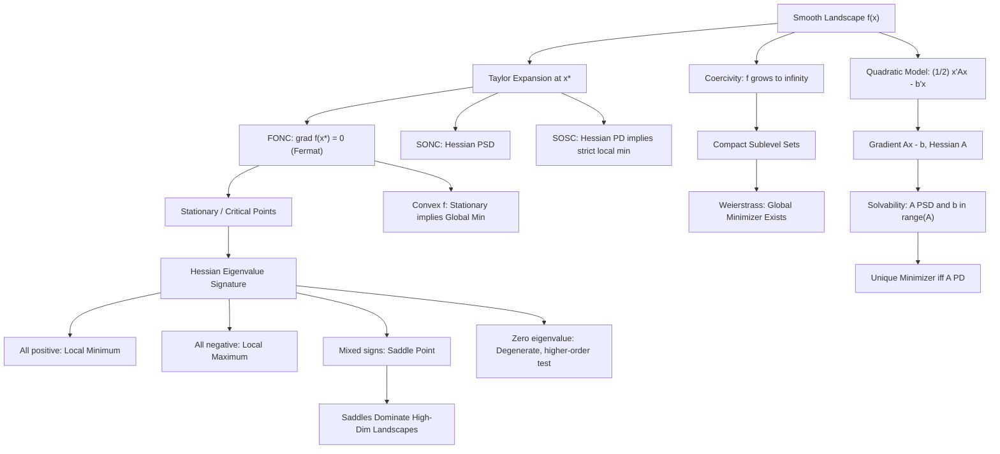

# Topic 02: Unconstrained Optimality Conditions

## 1. Master Overview

Given a smooth function $f: \mathbb{R}^n \to \mathbb{R}$ with no constraints, how do we recognize a minimizer when we see one — and how do we know one exists at all? This module answers both questions from first principles. The recognition tools are the classical optimality conditions: Fermat's first-order necessary condition $\nabla f(\mathbf{x}^*) = \mathbf{0}$, the second-order necessary condition $\nabla^2 f(\mathbf{x}^*) \succeq 0$, and the second-order sufficient condition $\nabla^2 f(\mathbf{x}^*) \succ 0$, which together turn the analytic question "is this point a local minimum" into the algebraic question "what is the eigenvalue signature of the Hessian".

The existence question is answered by the Weierstrass extreme value theorem and its workhorse extension: a continuous function that is coercive (it blows up to $+\infty$ in every direction) always attains a global minimizer, because its sublevel sets are compact. These two threads meet in the complete analysis of the quadratic objective $f(\mathbf{x}) = \frac{1}{2}\mathbf{x}^T A \mathbf{x} - \mathbf{b}^T \mathbf{x}$, the model problem whose solution theory (minimizer exists iff $A \succeq 0$ and $\mathbf{b} \in \operatorname{range}(A)$, unique iff $A \succ 0$) underlies least squares, Newton's method, and every local convergence analysis.

Beyond minima and maxima lies the third species of stationary point: the saddle. In high-dimensional non-convex landscapes — deep learning above all — saddle points vastly outnumber local minima, and understanding the Hessian signature at stationary points explains both why gradient methods slow down near saddles and why they almost never terminate at one.

> [!NOTE]
> Optimality conditions convert calculus into linear algebra: at a stationary point, everything about the local landscape is encoded in the spectrum of the Hessian. Positive spectrum means a strict minimum, mixed signs mean a saddle, and a zero eigenvalue means the second-order test is silent and higher-order terms decide.

## 2. First-Principles Framework

The framework below rebuilds the theory from the local behavior of a smooth function:

- **Phenomenon**: Near any point, a smooth function is described by its Taylor expansion — a linear term that dominates at first order and a quadratic form that takes over when the gradient vanishes.
- **Goal**: Derive checkable certificates that a candidate point $\mathbf{x}^*$ is a local (or global) minimizer, and guarantee in advance that a minimizer exists.
- **Governing equation(s)**: The expansion $f(\mathbf{x}^* + \mathbf{d}) = f(\mathbf{x}^*) + \nabla f(\mathbf{x}^*)^T \mathbf{d} + \frac{1}{2}\mathbf{d}^T \nabla^2 f(\mathbf{x}^*)\mathbf{d} + o(\lVert \mathbf{d}\rVert^2)$, specialized to the stationarity equation $\nabla f(\mathbf{x}^*) = \mathbf{0}$.
- **Formulation**: Necessary conditions (FONC, SONC) rule candidates out; the sufficient condition (SOSC, $\nabla^2 f \succ 0$) rules a strict local minimum in; coercivity plus continuity delivers existence via compact sublevel sets.
- **Consequence**: Stationary points are classified by the Hessian eigenvalue signature (minimum, maximum, saddle, degenerate); for convex $f$ the certificate is global — any stationary point is a global minimizer.

## 3. Mermaid Concept Map

The map runs from the Taylor expansion to the three optimality conditions, the classification table, the existence theorem, and the quadratic model problem:

## 4. Common Misconceptions

Each row contrasts a tempting but wrong belief with the precise mathematical fact and the mental picture that prevents the error:

| Misconception | Mathematical Reality | Correct Mental Model |
|---|---|---|
| *"If $\nabla f(\mathbf{x}^*) = \mathbf{0}$, then $\mathbf{x}^*$ is a minimum or maximum."* | Stationarity is only necessary: $f(x) = x^3$ has $f'(0) = 0$ with an inflection, and $f(x,y) = x^2 - y^2$ has a saddle at the origin. | FONC is a filter, not a verdict — it shortlists candidates that the second-order test must then classify. |
| *"A positive semidefinite Hessian at a stationary point guarantees a local minimum."* | SONC is not sufficient: $f(x,y) = x^2 + y^3$ has $\nabla^2 f(0) \succeq 0$ yet $f$ decreases along the $-y$ direction. | Semidefiniteness leaves flat directions in which cubic and higher terms can betray the point; only $\nabla^2 f \succ 0$ certifies. |
| *"A function that is a local minimum along every line through a point has a local minimum there."* | Peano's example $f(x,y) = (y - x^2)(y - 2x^2)$ is minimized at the origin along every line, yet $f \lt 0$ on the parabola $y = 1.5x^2$ arbitrarily close to the origin. | Line tests probe only one-dimensional slices; minimality is a full-neighborhood property that curves can violate. |
| *"Bounded below plus continuous implies a minimizer exists."* | $f(x) = e^x$ is continuous and bounded below by $0$ but never attains its infimum; attainment fails without compactness. | Coercivity restores compactness: it traps all sublevel sets in bounded regions, and Weierstrass then delivers a minimizer. |
| *"The quadratic $\frac{1}{2}\mathbf{x}^T A\mathbf{x} - \mathbf{b}^T\mathbf{x}$ is always minimized by solving $A\mathbf{x} = \mathbf{b}$."* | If $A$ has a negative eigenvalue the function is unbounded below; if $A \succeq 0$ is singular and $\mathbf{b} \notin \operatorname{range}(A)$, no minimizer exists at all. | Solve-and-check: stationary points solve $A\mathbf{x} = \mathbf{b}$, but only $A \succeq 0$ with consistent $\mathbf{b}$ makes them minimizers. |
| *"The one-dimensional second-derivative test generalizes by checking the sign of $\det \nabla^2 f$."* | The determinant is only the product of eigenvalues: $\operatorname{diag}(-1, -1)$ has positive determinant at a maximum, and $\det = 0$ says nothing about the remaining spectrum. | Classification needs the full eigenvalue signature (or leading principal minors via Sylvester's criterion), not a single scalar summary. |
| *"Gradient descent in deep learning gets trapped in bad local minima."* | In high dimensions, random-matrix heuristics predict stationary points with intermediate loss are overwhelmingly saddles (some negative eigenvalue), not minima. | The practical enemy is the plateau around saddles, where $\lVert \nabla f\rVert$ is tiny; negative curvature eventually provides an escape route. |

## 5. Directory Inventory

This module contains the following core files:

| File | Description |
|---|---|
| [`README.md`](README.md) | Module overview, first-principles framework, concept map, misconceptions, and canonical references. |
| [`first_principles.ipynb`](first_principles.ipynb) | Markdown-only theory notebook: intuition, rigorous statements of FONC/SONC/SOSC, Hessian classification table, coercivity and the Weierstrass existence theorem, six complete proofs (including the full quadratic-objective analysis and the convex stationarity theorem), computational insights, and physics/ML applications. |
| [`exercises.ipynb`](exercises.ipynb) | Markdown-only exercise notebook: 20 fully solved problems in four levels — Concept Check (4), Foundation (6), Applications in AI/ML & Physics (6, including Rosenbrock and double-well potentials), and Challenge (4, including Peano's every-line saddle). |

## 6. References

1. **Nocedal, J., & Wright, S. J.** (2006). *Numerical Optimization* (2nd ed.). Springer.
   - *Chapter 2*: Fundamentals of unconstrained optimization — Taylor's theorem, FONC, SONC, SOSC (Theorems 2.2–2.4).
2. **Boyd, S., & Vandenberghe, L.** (2004). *Convex Optimization*. Cambridge University Press.
   - *Section 4.2.3*: Optimality criterion for differentiable convex objectives; *Section 9.1*: unconstrained minimization.
3. **Bertsekas, D. P.** (2016). *Nonlinear Programming* (3rd ed.). Athena Scientific.
   - *Sections 1.1–1.2*: Optimality conditions and existence of optimal solutions (Weierstrass and coercivity).
4. **Nesterov, Y.** (2018). *Lectures on Convex Optimization* (2nd ed.). Springer.
   - *Sections 1.2 & 2.1*: Local methods and the role of second-order information in smooth minimization.
5. **Luenberger, D. G., & Ye, Y.** (2016). *Linear and Nonlinear Programming* (4th ed.). Springer.
   - *Chapter 7*: First- and second-order necessary conditions, convexity, and existence of minima.
6. **Rockafellar, R. T.** (1970). *Convex Analysis*. Princeton University Press.
   - *Part V*: Differential theory of convex functions supporting the global optimality of stationary points.
7. **Dauphin, Y., et al.** (2014). *Identifying and Attacking the Saddle Point Problem in High-Dimensional Non-Convex Optimization*. NeurIPS 27.
   - Empirical and random-matrix evidence that saddles, not local minima, dominate deep-learning landscapes.
