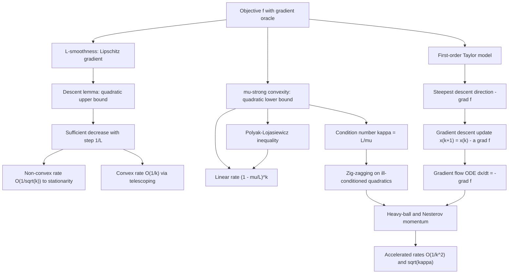

# Topic 03: Gradient Descent & Convergence Theory

## 1. Master Overview

Gradient descent is the fundamental first-order algorithm of continuous optimization: starting from an initial guess, it repeatedly steps in the direction of steepest local decrease, $-\nabla f(\mathbf{x}_k)$. Despite its simplicity, the method conceals a rich convergence theory in which two scalar constants govern everything: the smoothness constant $L$ (an upper bound on curvature) and the strong-convexity constant $\mu$ (a lower bound on curvature). Their ratio $\kappa = L/\mu$, the condition number, dictates whether the iterates glide directly to the minimizer or zig-zag painfully along a narrow valley.

This module builds the entire theory from first principles. The descent lemma, derived from the fundamental theorem of calculus, converts $L$-smoothness into a quadratic upper bound that guarantees progress at every step. From this single inequality we derive the complete rate hierarchy: $O(1/\sqrt{k})$ stationarity for non-convex functions, $O(1/k)$ for convex functions, and the linear (geometric) rate $(1 - \mu/L)^k$ under strong convexity or the weaker Polyak-Lojasiewicz (PL) inequality.

Finally, we study acceleration: Polyak's heavy-ball method adds physical momentum, while Nesterov's accelerated gradient achieves the optimal $O(1/k^2)$ rate for convex problems and the $(\sqrt{\kappa}-1)/(\sqrt{\kappa}+1)$ rate under strong convexity. The continuous-time gradient flow ODE $\dot{\mathbf{x}} = -\nabla f(\mathbf{x})$ unifies these views: gradient descent is forward Euler discretization, and momentum is a damped second-order oscillator.

> [!NOTE]
> Every convergence rate in this module is dimension-free: the bounds depend on $L$, $\mu$, and $\kappa = L/\mu$, never on the ambient dimension $n$. This is precisely why gradient methods scale to machine-learning models with billions of parameters, where any factor of $n$ would be fatal.

## 2. First-Principles Framework

The theory of gradient descent is rebuilt here from a single local observation model:

- **Phenomenon**: A differentiable landscape $f: \mathbb{R}^n \to \mathbb{R}$ can only be probed locally; at a point $\mathbf{x}$ we observe the value $f(\mathbf{x})$ and the gradient $\nabla f(\mathbf{x})$, nothing global.
- **Goal**: Construct an iterative process using only first-order (gradient) information that provably drives $f(\mathbf{x}_k)$ toward its minimum, and quantify how fast, in terms of measurable properties of $f$.
- **Governing equation(s)**: The update $\mathbf{x}_{k+1} = \mathbf{x}_k - \alpha_k \nabla f(\mathbf{x}_k)$, controlled by the descent lemma $f(\mathbf{y}) \le f(\mathbf{x}) + \nabla f(\mathbf{x})^T(\mathbf{y} - \mathbf{x}) + \frac{L}{2}\lVert \mathbf{y} - \mathbf{x}\rVert^2$.
- **Formulation**: Sandwich the objective between the quadratic lower bound of $\mu$-strong convexity and the quadratic upper bound of $L$-smoothness; each gradient step minimizes the upper model, and the gap between the two models yields the contraction factor.
- **Consequence**: A complete rate table — $\min_k \lVert \nabla f(\mathbf{x}_k)\rVert = O(1/\sqrt{k})$ (non-convex), $f(\mathbf{x}_k) - f^* = O(1/k)$ (convex), $(1-\mu/L)^k$ (strongly convex or PL) — with acceleration improving $\kappa$-dependence to $\sqrt{\kappa}$.
- **Continuous limit**: As $\alpha \to 0$ the iterates trace the gradient flow $\dot{\mathbf{x}}(t) = -\nabla f(\mathbf{x}(t))$, along which $\frac{d}{dt} f(\mathbf{x}(t)) = -\lVert \nabla f(\mathbf{x}(t))\rVert^2 \le 0$; discretization stability recovers the step-size threshold $\alpha \lt 2/L$.

## 3. Mermaid Concept Map

## 4. Common Misconceptions

Each row contrasts a tempting but wrong belief with the precise mathematical statement that replaces it:

| Misconception | Mathematical Reality | Correct Mental Model |
|---|---|---|
| *"Gradient descent always decreases the objective."* | Descent is guaranteed only when the step size respects the curvature: for $L$-smooth $f$, the descent lemma gives $f(\mathbf{x}_{k+1}) \le f(\mathbf{x}_k) - \alpha(1 - \alpha L/2)\lVert \nabla f(\mathbf{x}_k)\rVert^2$, which requires $\alpha \lt 2/L$. | Each step minimizes a quadratic upper model of $f$; if the step outruns the model's validity, the iterates overshoot and can diverge. |
| *"A smaller learning rate is always safer, so make it tiny."* | On a strongly convex quadratic the contraction factor is $\max(\lvert 1-\alpha\mu\rvert, \lvert 1-\alpha L\rvert)$; as $\alpha \to 0$ it approaches $1$ and progress stalls. The optimal fixed step is $\alpha^* = 2/(L+\mu)$. | Step size balances two failure modes: too large oscillates along the stiff direction, too small crawls along the flat one. |
| *"Convergence slows down in high dimensions."* | The rates $O(1/k)$, $(1-\mu/L)^k$ depend only on $L$, $\mu$, $\kappa$ — never on $n$. A billion-dimensional well-conditioned problem converges as fast as a 2D one. | Conditioning, not dimensionality, is the enemy of first-order methods. |
| *"Momentum is just a heuristic that smooths gradients."* | Heavy-ball momentum is a discretized damped oscillator $\ddot{\mathbf{x}} + c\dot{\mathbf{x}} = -\nabla f(\mathbf{x})$; with tuned parameters it provably attains the rate $(\sqrt{\kappa}-1)/(\sqrt{\kappa}+1)$ on quadratics, and Nesterov's variant achieves the optimal $O(1/k^2)$ convex rate. | Momentum is physics: inertia averages out oscillations across the valley while accumulating speed along it. |
| *"Linear convergence requires strong convexity."* | The Polyak-Lojasiewicz inequality $\frac{1}{2}\lVert \nabla f(\mathbf{x})\rVert^2 \ge \mu(f(\mathbf{x}) - f^*)$ suffices, and it holds for non-convex functions such as $f(x) = x^2 + 3\sin^2 x$ and over-parameterized least squares. | Linear convergence needs gradients to dominate suboptimality, not convexity of the landscape. |
| *"On non-convex problems gradient descent finds the global minimum."* | The theory guarantees only $\min_{i \lt k} \lVert \nabla f(\mathbf{x}_i)\rVert \to 0$: convergence to stationarity, which may be a saddle or a local minimum. | Non-convex guarantees are about flatness of the endpoint, not global optimality. |
| *"Nesterov acceleration always helps, so it should replace plain gradient descent everywhere."* | Acceleration attains the first-order lower bound $\Omega(1/k^2)$ for smooth convex problems, but it is not a descent method: $f(\mathbf{x}_k)$ can oscillate, and with stochastic gradients the accumulated momentum can amplify noise. | Acceleration trades monotone progress for a faster worst-case rate; it shines on deterministic, ill-conditioned, smooth problems. |

## 5. Directory Inventory

This module contains the following core files:

| File | Description |
|---|---|
| [`first_principles.ipynb`](first_principles.ipynb) | Full theory notebook: steepest-descent derivation, $L$-smoothness and $\mu$-strong convexity, descent lemma, the complete rate hierarchy with six step-by-step proofs (including the exact quadratic analysis and the PL inequality), momentum and Nesterov acceleration, and the gradient-flow ODE view. |
| [`exercises.ipynb`](exercises.ipynb) | 20 fully solved problems in four levels: concept checks, foundation drills (rates on quadratics, divergence thresholds), AI/ML and physics applications (least squares spectra, logistic smoothness, momentum as a damped oscillator, Rosenbrock), and challenge problems (contraction maps, Chebyshev acceleration, lower-bound intuition, PL for over-parameterized models). |

## 6. References

1. **Boyd, S., & Vandenberghe, L.** (2004). *Convex Optimization*. Cambridge University Press.
   - *Chapter 9*: Unconstrained minimization — descent methods, strong convexity, condition-number analysis.
2. **Nocedal, J., & Wright, S. J.** (2006). *Numerical Optimization* (2nd ed.). Springer.
   - *Chapters 2-3*: Fundamentals of unconstrained optimization; steepest descent and its rate on quadratics.
3. **Bertsekas, D. P.** (2016). *Nonlinear Programming* (3rd ed.). Athena Scientific.
   - *Chapter 1*: Gradient methods, convergence analysis, and rate-of-convergence theory.
4. **Nesterov, Y.** (2018). *Lectures on Convex Optimization* (2nd ed.). Springer.
   - *Chapter 2*: Smooth convex optimization, optimal methods, and the estimating-sequences construction.
5. **Polyak, B. T.** (1987). *Introduction to Optimization*. Optimization Software.
   - *Chapter 3*: Gradient and heavy-ball methods; the original momentum analysis and the PL inequality.
6. **Bubeck, S.** (2015). *Convex Optimization: Algorithms and Complexity*. Foundations and Trends in Machine Learning.
   - *Chapter 3*: The dimension-free convergence proofs used as the template in this module.
7. **Karimi, H., Nutini, J., & Schmidt, M.** (2016). *Linear Convergence of Gradient and Proximal-Gradient Methods Under the Polyak-Lojasiewicz Condition*. ECML-PKDD.
   - The modern treatment of the PL inequality and its relatives (error bounds, quadratic growth).
8. **Su, W., Boyd, S., & Candès, E.** (2016). *A Differential Equation for Modeling Nesterov's Accelerated Gradient Method*. JMLR 17.
   - The continuous-time ODE view of acceleration underlying our gradient-flow discussion.
9. **Goh, G.** (2017). *Why Momentum Really Works*. Distill.
   - Interactive eigenvalue-by-eigenvalue analysis of the heavy-ball method on quadratics.
