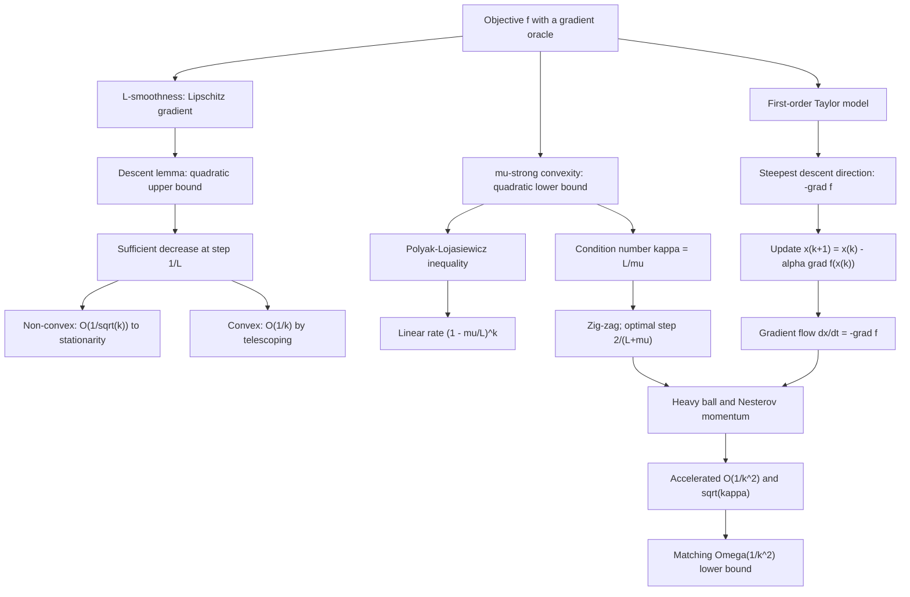

# Module 03 — Gradient Descent and Convergence

Gradient descent is the first-order algorithm of continuous optimization: from an initial guess it
repeatedly steps along $-\nabla f(\mathbf{x}_k)$, the direction of locally steepest decrease. One
gradient and $O(n)$ arithmetic per iteration, no matrix ever formed — which is why it is still the
method of choice when $n$ runs to billions.

Simple as it is, the method conceals a complete convergence theory governed by two scalars: the
smoothness constant $L$, an upper bound on curvature, and the strong-convexity constant $\mu$, a
lower bound. Their ratio $\kappa = L/\mu$, the condition number, decides whether the iterates glide
straight to the minimizer or zig-zag down a narrow valley. This module derives the whole rate
hierarchy from a single inequality, the descent lemma: $O(1/\sqrt{k})$ to stationarity with no
convexity at all, $O(1/k)$ under convexity, and the linear rate $(1-\mu/L)^k$ under strong convexity
or the strictly weaker Polyak-Lojasiewicz condition.

It then goes as far as first-order optimization goes. Polyak's heavy ball adds physical momentum
and, on quadratics, replaces $\kappa$ by $\sqrt{\kappa}$; Nesterov's accelerated gradient attains
$O(1/k^2)$ on every smooth convex problem — proved here in full by a potential-function argument —
and that rate cannot be improved by any method that only ever looks at gradients. The continuous-time
gradient flow $\dot{\mathbf{x}} = -\nabla f(\mathbf{x})$ ties the picture together: gradient descent
is its forward Euler discretization, and momentum discretizes a damped second-order oscillator.

> [!NOTE]
> Every rate in this module is dimension-free: the bounds depend on $L$, $\mu$ and $\kappa = L/\mu$,
> never on the ambient dimension $n$. Conditioning, not dimensionality, is the enemy of first-order
> methods — and the single most important consequence is the step-size law
> $0 \lt \alpha \lt 2/L$, with the optimum at $\alpha^{*} = 2/(L+\mu)$ giving the per-step error
> contraction $\frac{\kappa-1}{\kappa+1}$.

## Prerequisites

| Needed before this module | Why |
|---|---|
| [calculus/11 — Gradients and directional derivatives](../../calculus/11_gradients_directional_derivatives/) | The gradient as steepest-ascent direction and as the normal to a level set. |
| [optimization/02 — Unconstrained optimality conditions](../02_unconstrained_optimality_conditions/) | First- and second-order conditions, and what "stationary point" guarantees. |

## Downstream — what this module unlocks

| Next | What it adds |
|---|---|
| [optimization/04 — Line search, Newton, quasi-Newton](../04_line_search_newton_quasi_newton/) | Armijo and Wolfe conditions when $L$ is unknown; curvature-aware directions that neutralize $\kappa$. |
| [optimization/08 — Stochastic optimization for ML](../08_stochastic_optimization_for_ml/) | The same rates with noisy gradients: step-size schedules, momentum, AdaGrad, Adam. |
| [differential_equations/08 — ODEs in machine learning](../../differential_equations/08_odes_in_machine_learning/) | Gradient flow, Nesterov's ODE, ResNets and Neural ODEs as one continuous-time story. |

## Learning outcomes

- Derive the descent lemma from the fundamental theorem of calculus and read it as a quadratic upper
  model that the gradient step minimizes exactly.
- Prove the $O(1/\sqrt{k})$, $O(1/k)$ and $(1-\mu/L)^k$ rates, stating for each which hypothesis is
  doing the work and what breaks when it is dropped.
- Show that the Polyak-Lojasiewicz inequality alone buys a linear rate, and exhibit a PL function
  that is not convex.
- Compute $\alpha^{*} = 2/(L+\mu)$ and the contraction $\frac{\kappa-1}{\kappa+1}$ for a quadratic
  from its spectrum, and keep distance rates and value rates in separate currencies.
- Prove Nesterov's $O(1/k^2)$ bound by a potential function, and state the matching $\Omega(1/k^2)$
  lower bound together with the subspace argument behind it.
- Tune heavy-ball momentum to $\left(\frac{\sqrt{\kappa}-1}{\sqrt{\kappa}+1}\right)^2$ and explain
  why the optimum is underdamping rather than critical damping.

## Concept map

## Notation

Drawn from [`docs/notation.md`](../../docs/notation.md); within the `optimization` area the step
size is written $\alpha$, and extreme Hessian eigenvalues are named, never indexed.

| Symbol | Meaning | Convention |
|---|---|---|
| $\alpha$, $\alpha^{*}$ | step size (learning rate); its optimal fixed value | $\alpha^{*} = 2/(L+\mu)$ on quadratics |
| $L$ | smoothness constant | $\lVert \nabla f(\mathbf{x}) - \nabla f(\mathbf{y})\rVert_2 \le L\lVert \mathbf{x}-\mathbf{y}\rVert_2$ |
| $\mu$ | strong-convexity modulus, and the PL constant | $\nabla^2 f \succeq \mu I$; no constraint index, so never a multiplier here |
| $\kappa = L/\mu$ | condition number of the objective | $\kappa \ge 1$ |
| $\lambda_{\min}$, $\lambda_{\max}$ | extreme Hessian eigenvalues | named, not indexed: $\mu = \lambda_{\min}$, $L = \lambda_{\max}$ |
| $f^{*}$, $\mathbf{x}^{*}$ | optimal value and a minimizer | $f^{*} = \inf f$ |
| $\Delta_k = f(\mathbf{x}_k) - f^{*}$ | optimality gap | the quantity every rate bounds |
| $\mathbf{e}_k = \mathbf{x}_k - \mathbf{x}^{*}$ | error | on quadratics $\Delta_k = \tfrac12\mathbf{e}_k^T A\mathbf{e}_k$ |
| $\beta$, $\beta^{*}$ | momentum coefficient; its optimal value | $\beta^{*} = \left(\frac{\sqrt{\kappa}-1}{\sqrt{\kappa}+1}\right)^2$ |
| $\rho$ | per-step contraction factor | of the **error** unless stated otherwise |

## Core results

| Result | Hypotheses | Statement |
|---|---|---|
| Theorem 4.1 — steepest direction | $f$ differentiable, $\nabla f(\mathbf{x}) \neq \mathbf{0}$ | $\mathbf{d}^{*} = -\nabla f(\mathbf{x})/\lVert \nabla f(\mathbf{x})\rVert$ |
| Theorem 4.2 — descent lemma | $f$ is $L$-smooth | $f(\mathbf{y}) \le f(\mathbf{x}) + \nabla f(\mathbf{x})^T(\mathbf{y}-\mathbf{x}) + \frac{L}{2}\lVert \mathbf{y}-\mathbf{x}\rVert^2$ |
| Theorem 4.3 — non-convex rate | $L$-smooth, bounded below, $\alpha = 1/L$ | $\min_{i \lt k}\lVert \nabla f(\mathbf{x}_i)\rVert \le \sqrt{2L\Delta_0/k}$ |
| Theorem 4.4 — convex rate | convex, $L$-smooth, minimizer exists, $\alpha = 1/L$ | $\Delta_k \le L\lVert \mathbf{x}_0-\mathbf{x}^{*}\rVert^2/(2k)$ |
| Theorem 4.5 — linear rate | $L$-smooth, PL with constant $\mu$ (implied by $\mu$-strong convexity), $\alpha = 1/L$ | $\Delta_k \le (1-\mu/L)^k\Delta_0$ |
| Theorem 4.6 — exact quadratic rate | $\mu I \preceq A \preceq LI$, fixed $\alpha$ | converges iff $0 \lt \alpha \lt 2/L$; $\alpha^{*} = 2/(L+\mu)$ gives $\rho = \frac{\kappa-1}{\kappa+1}$ |
| Theorem 4.7 — acceleration | convex, $L$-smooth, minimizer exists | $\Delta_k \le 2L\lVert \mathbf{x}_0-\mathbf{x}^{*}\rVert^2/(k+1)^2$ |
| Theorem 4.8 — optimal heavy ball | quadratic, $\mu I \preceq A \preceq LI$ | $\rho_{\mathrm{HB}} = \sqrt{\beta^{*}} = \frac{\sqrt{\kappa}-1}{\sqrt{\kappa}+1}$ |
| Theorem 4.9 — lower bound (cited) | first-order methods, $n \ge 2k+1$ | $\Delta_k \ge 3L\lVert \mathbf{x}_0-\mathbf{x}^{*}\rVert^2/\left(32(k+1)^2\right)$ |

## Common misconceptions

| Misconception | Mathematical reality | Correct mental model |
|---|---|---|
| *"Gradient descent always decreases the objective."* | Descent needs the step to respect curvature: the descent lemma gives $f(\mathbf{x}_{k+1}) \le f(\mathbf{x}_k) - \alpha(1-\alpha L/2)\lVert \nabla f(\mathbf{x}_k)\rVert^2$, which is a decrease only for $\alpha \lt 2/L$. | Each step minimizes a quadratic upper model; outrun the model's validity and the iterates overshoot. |
| *"A smaller learning rate is always safer, so make it tiny."* | The contraction factor is $\max(\lvert 1-\alpha\mu\rvert, \lvert 1-\alpha L\rvert)$, which tends to $1$ as $\alpha \to 0$. The optimum is $\alpha^{*} = 2/(L+\mu)$. | Step size balances two failure modes: too large oscillates along the stiff direction, too small crawls along the flat one. |
| *"Convergence slows down in high dimensions."* | Every rate depends only on $L$, $\mu$, $\kappa$. A well-conditioned billion-dimensional problem converges as fast as a 2D one. | Conditioning, not dimensionality, is the enemy. |
| *"The distance rate and the value rate are the same number."* | On a quadratic the value gap is a quadratic form in the error, so it contracts by the **square** of the error rate: $\frac{\kappa-1}{\kappa+1}$ against $\left(\frac{\kappa-1}{\kappa+1}\right)^2$. | Always state which currency a rate is quoted in; never compare across the two. |
| *"Momentum is a heuristic that smooths gradients."* | Heavy ball is a discretized damped oscillator and, tuned, provably attains $\frac{\sqrt{\kappa}-1}{\sqrt{\kappa}+1}$ on quadratics. | Momentum is physics: inertia averages out oscillations across the valley while accumulating speed along it. |
| *"Optimal momentum is critical damping."* | The optimum puts **every** eigenmode strictly inside the complex-root regime, where $\lvert z\rvert = \sqrt{\beta}$ no longer depends on $\lambda$. | Optimal tuning under-damps deliberately, to make the decay rate spectrum-independent. |
| *"Linear convergence requires strong convexity."* | PL, $\frac12\lVert \nabla f(\mathbf{x})\rVert^2 \ge \mu(f(\mathbf{x})-f^{*})$, suffices, and holds for non-convex $f(x) = x^2 + 3\sin^2 x$ and for over-parameterized least squares. | Linear convergence needs gradients to dominate suboptimality, not convexity of the landscape. |
| *"Acceleration always helps, so it should replace gradient descent everywhere."* | Nesterov attains the $\Omega(1/k^2)$ lower bound but is not a descent method, and tuned heavy ball can fail to converge on non-quadratic smooth strongly convex objectives (Lessard, Recht and Packard, 2016). | Acceleration trades monotone progress for a better worst case; it shines on deterministic, ill-conditioned, smooth problems. |

## Files

| File | Contents |
|---|---|
| [`README.md`](README.md) | This page: overview, prerequisites, outcomes, concept map, notation, core results, misconceptions, exercise index, references. |
| [`first_principles.ipynb`](first_principles.ipynb) | Theory in ten sections: definitions, nine main results, nine proofs (including the full potential-function proof of acceleration and the invariant-subspace half of the lower bound), five worked examples, eleven code cells and three figures. |
| [`exercises.ipynb`](exercises.ipynb) | 20 fully solved problems, each recomputed by a code cell. |

## Exercise index

| Tier | Count | Problems |
|---|---|---|
| L0 — Concept Checks | 4 | negative gradient as steepest descent; does gradient descent always descend; reading the condition number; PL and stationary points |
| L1 — Foundations | 6 | rates from a spectrum; one step by hand on an ill-conditioned bowl; descent directions decrease $f$; exact one-dimensional solution; strong convexity implies PL; the Rosenbrock valley |
| L2 — Applications (AI/ML and Physics) | 6 | least-squares rate from the data spectrum; the learning-rate divergence threshold; smoothness constant of logistic regression; heavy ball as a damped oscillator (physics); gradient flow as overdamped relaxation (physics); the acceleration dividend at scale |
| L3 — Challenge Proofs | 4 | gradient descent as a contraction map; Krylov subspaces and the Chebyshev lower bound; the optimal heavy-ball rate; PL without strong convexity |

## References

1. Boyd, S., & Vandenberghe, L. (2004). *Convex Optimization*. Cambridge University Press —
   §9.2-9.3 (pp. 463-475): descent methods, condition-number geometry, exact and backtracking line
   search.
2. Nesterov, Y. (2018). *Lectures on Convex Optimization* (2nd ed.). Springer — §2.1
   (Thm 2.1.5, Thm 2.1.14) for the smooth and strongly convex rates; Thm 2.1.7 (pp. 68-71) for the
   $\Omega(1/k^2)$ lower bound and its tridiagonal witness; §2.2 for estimating sequences.
3. Nocedal, J., & Wright, S. J. (2006). *Numerical Optimization* (2nd ed.). Springer — §3.3
   (Thm 3.3, pp. 66-69): steepest descent on quadratics and the rate $\frac{\kappa-1}{\kappa+1}$.
4. Beck, A., & Teboulle, M. (2009). A fast iterative shrinkage-thresholding algorithm.
   *SIAM J. Imaging Sci.* 2(1) — Thm 4.4 (pp. 190-192): the potential-function proof of the
   accelerated $O(1/k^2)$ rate reproduced in Proof 5.7.
5. Polyak, B. T. (1987). *Introduction to Optimization*. Optimization Software — §3.2 for the
   heavy-ball method and its quadratic analysis; §1.4 for the PL inequality.
6. Karimi, H., Nutini, J., & Schmidt, M. (2016). Linear convergence of gradient and proximal-gradient
   methods under the Polyak-Lojasiewicz condition. *ECML-PKDD* — Thm 1 and §2.
7. Bubeck, S. (2015). *Convex Optimization: Algorithms and Complexity*. Foundations and Trends in
   Machine Learning 8(3-4) — §3.2-3.4: the dimension-free proof template.
8. Lessard, L., Recht, B., & Packard, A. (2016). Analysis and design of optimization algorithms via
   integral quadratic constraints. *SIAM J. Optim.* 26(1) — §4.6: heavy ball diverges on a smooth
   strongly convex non-quadratic.
9. Bertsekas, D. P. (2016). *Nonlinear Programming* (3rd ed.). Athena Scientific — §1.2
   (Prop. 1.2.3): gradient methods and step-size rules.
10. Su, W., Boyd, S., & Candes, E. (2016). A differential equation for modeling Nesterov's
    accelerated gradient method. *JMLR* 17(153); and Goh, G. (2017). Why momentum really works.
    *Distill* — the continuous-time and eigenvalue-by-eigenvalue views of momentum.
