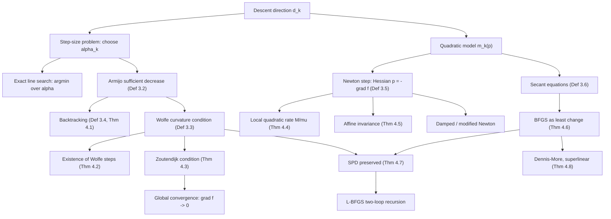

# Module 04 — Line Search, Newton and Quasi-Newton Methods

Gradient descent answers "which direction?" with the negative gradient, but a usable optimizer must
also answer "how far?" — and it must do so without being told the smoothness constant $L$. This
module builds the two pillars of classical smooth optimization: **line search theory** (Armijo
sufficient decrease, the Wolfe curvature condition, backtracking, and the Zoutendijk global-convergence
framework) and **second-order methods** (Newton's method from the local quadratic model, and the
quasi-Newton family — BFGS and L-BFGS — which reconstructs curvature from gradient differences alone).

The payoff for using curvature is large and precisely quantifiable. Gradient descent converges
linearly with a factor degraded by the condition number $\kappa = L/\mu$; Newton's method converges
*quadratically* near a nondegenerate minimizer, doubling the number of correct digits per iteration,
and is affine invariant, so it does not see ill-conditioning at all. Quasi-Newton methods sit between
the two: superlinear convergence at first-order cost per iteration, with no second derivative ever
evaluated.

The theory notebook proves all of this in full. In particular it derives the BFGS update rather than
quoting it: BFGS is the *unique* symmetric matrix satisfying the inverse secant equation that is
closest to the previous estimate in a weighted Frobenius norm, and the derivation is an orthogonal
projection in whitened coordinates. Two hypothesis-dropping experiments show what the theorems are
buying — an indefinite $H_{k+1}$ when the curvature condition fails, and cubic divergence of pure
Newton on a strictly convex $C^{\infty}$ function when the line search is removed.

These are the algorithms inside `scipy.optimize.minimize`, inside every generalized-linear-model
fitter (Newton on a GLM *is* iteratively reweighted least squares), and inside the L-BFGS solvers
that still dominate full-batch scientific machine learning.

> [!NOTE]
> The Wolfe pair does double duty. The Armijo inequality forces enough *decrease* to prevent
> overshooting; the curvature inequality forces enough *progress* to prevent vanishingly small steps.
> It is precisely the curvature inequality that guarantees $\mathbf{s}_k^T\mathbf{y}_k \gt 0$, which is
> exactly the hypothesis that keeps every BFGS approximation symmetric positive definite — so the line
> search and the quasi-Newton update are one mechanism, not two.

## Prerequisites

| Needed before this module | Why |
|---|---|
| [linear_algebra/03 — Linear Systems and Direct Factorizations](../../linear_algebra/03_linear_systems_and_direct_factorizations/) | Every Newton step is a symmetric solve; the Cholesky attempt is also the positive-definiteness test used by modified Newton. |
| [optimization/03 — Gradient Descent and Convergence](../03_gradient_descent_and_convergence/) | Supplies $L$-smoothness, strong convexity, the descent lemma, and the linear rate that this module improves on. |

**Downstream.** No later module lists this one as a prerequisite: in
[`docs/prerequisites.md`](../../docs/prerequisites.md) `optimization/04` is a leaf. Its results are
nevertheless used informally by
[optimization/08 — Stochastic Optimization for ML](../08_stochastic_optimization_for_ml/), where the
failure of the secant equation under minibatch noise explains why deep learning does not run BFGS.

## Learning outcomes

After working through this module you should be able to:

- State the Armijo and (strong) Wolfe conditions and say precisely which failure mode each one forbids.
- Prove that Armijo-acceptable steps always exist, that backtracking terminates, and give the explicit
  floor $\rho\,\alpha_{\text{safe}}$ on the accepted step.
- Prove Zoutendijk's theorem and use it to certify global convergence of any direction rule that keeps
  $\cos\theta_k$ bounded away from $0$.
- Prove Newton's local quadratic convergence with the correct constant $M/\mu$ and the correct region
  of attraction $\lVert \mathbf{x}_0 - \mathbf{x}^{\star}\rVert \le \mu/(2M)$.
- Show Newton's method is affine invariant, and explain why that forbids $\kappa$ from appearing in a
  sharp Newton rate.
- Derive the BFGS update as the solution of a least-change problem, and prove that it preserves
  positive definiteness under the Wolfe curvature condition.
- Implement the L-BFGS two-loop recursion and account for its $O(mn)$ memory and $\approx 8mn$ flops.
- Diagnose a failing solver: indefinite Hessian, lost curvature condition, or a start outside the
  basin of attraction.

## Concept map

## Notation

Drawn from [`docs/notation.md`](../../docs/notation.md), optimization section.

| Symbol | Meaning | Convention |
|---|---|---|
| $\mathbf{x}^{\star}$ | minimizer | star superscript, never a bare asterisk |
| $\nabla f$, $\nabla^2 f$ | gradient (a column vector), Hessian | $H_k$ appears only as an abbreviation defined in the same cell |
| $\eta$ | a *fixed* step size (learning rate) | repo-wide convention |
| $\alpha_k$, $\bar{\alpha}$ | the step length *chosen by a line search*, and its initial trial | reserved for the per-iteration search variable |
| $c_1$, $c_2$ | Armijo and curvature parameters | $0 \lt c_1 \lt c_2 \lt 1$ |
| $\rho$ | backtracking contraction factor | $\rho \in (0,1)$; $\rho_k = 1/(\mathbf{y}_k^T\mathbf{s}_k)$ only inside the BFGS formulas, where it is subscripted |
| $L$ | smoothness constant | $\lVert \nabla f(x) - \nabla f(y)\rVert_2 \le L\lVert x-y\rVert_2$ |
| $\mu$ | curvature floor / strong-convexity modulus | $\nabla^2 f \succeq \mu I$ |
| $M$ | Hessian Lipschitz constant | $\lVert \nabla^2 f(u) - \nabla^2 f(v)\rVert_{\mathrm{op}} \le M \lVert u-v\rVert_2$ |
| $\kappa = L/\mu$ | condition number of the objective | |
| $\mathbf{s}_k$, $\mathbf{y}_k$ | step and gradient difference | $\mathbf{s}_k = \mathbf{x}_{k+1}-\mathbf{x}_k$, $\mathbf{y}_k = \nabla f_{k+1} - \nabla f_k$ |
| $B_k$, $H_k$ | approximations of $\nabla^2 f$ and of its inverse | $H_k = B_k^{-1}$; every statement names which one it means |
| $m$ | L-BFGS memory length | integer, only in the limited-memory context |
| $A \succ 0$, $A \succeq 0$ | positive definite, positive semidefinite | Löwner order |
| $\lambda_{\min}$, $\lambda_{\max}$ | extreme eigenvalues | names, not indices |

## Core results

| Result | Statement | Hypotheses |
|---|---|---|
| Theorem 4.1 — Armijo steps exist | Armijo holds on an interval $(0,\bar{\alpha}_{\ast}]$, so backtracking terminates | $f \in C^1$, $\mathbf{d}_k$ descent, $c_1 \in (0,1)$ |
| Theorem 4.2 — Wolfe steps exist | the strong Wolfe set contains an open interval | additionally $\varphi$ bounded below on the ray, $0 \lt c_1 \lt c_2 \lt 1$ |
| Theorem 4.3 — Zoutendijk | $\sum_k \cos^2\theta_k \lVert \nabla f_k\rVert^2 \le L\left(f_0 - f_{\inf}\right)/\left(c_1(1-c_2)\right)$ | $f$ bounded below, $\nabla f$ $L$-Lipschitz on the initial sublevel set, every step Wolfe |
| Theorem 4.4 — Newton is locally quadratic | $\lVert \mathbf{e}_{k+1}\rVert \le (M/\mu)\lVert \mathbf{e}_k\rVert^2$, hence $(M/\mu)\lVert \mathbf{e}_k\rVert \le 2^{-2^k}$ | $\nabla f(\mathbf{x}^{\star}) = \mathbf{0}$, $\nabla^2 f(\mathbf{x}^{\star}) \succeq \mu I$, $\nabla^2 f$ $M$-Lipschitz on $\lVert \mathbf{e}\rVert \le \mu/(2M)$ |
| Theorem 4.5 — affine invariance | pure Newton on $f(T\mathbf{y}+\mathbf{b})$ traces the same points as on $f$ | $T$ invertible, $\nabla^2 f$ invertible at the iterate |
| Theorem 4.6 — BFGS is least change | BFGS is the unique symmetric $H$ with $H\mathbf{y}_k = \mathbf{s}_k$ minimizing $\lVert H - H_k\rVert_W$ | $H_k$ symmetric, $\mathbf{s}_k^T\mathbf{y}_k \gt 0$, $W \succ 0$ with $W\mathbf{s}_k = \mathbf{y}_k$ |
| Theorem 4.7 — SPD is preserved | $H_{k+1} \succ 0$, and the Wolfe curvature condition supplies $\mathbf{s}_k^T\mathbf{y}_k \gt 0$ for free | $H_k \succ 0$, $\mathbf{s}_k^T\mathbf{y}_k \gt 0$ |
| Theorem 4.8 — Dennis-Moré (cited) | superlinear convergence iff $\lVert (B_k - \nabla^2 f(\mathbf{x}^{\star}))\mathbf{p}_k\rVert / \lVert \mathbf{p}_k\rVert \to 0$ | $\mathbf{x}_k \to \mathbf{x}^{\star}$, $\nabla^2 f(\mathbf{x}^{\star}) \succ 0$, unit steps eventually accepted |

## Common misconceptions

| Misconception | Mathematical reality | Correct mental model |
|---|---|---|
| *"Exact line search is always best."* | Exact minimization of $\varphi(\alpha)$ costs many function evaluations and rarely improves the iteration count enough to pay for itself. | Inexact conditions (Armijo plus Wolfe) buy provable progress at a few evaluations per step. |
| *"Any step that decreases $f$ guarantees convergence."* | Steps with $f(\mathbf{x}_{k+1}) \lt f(\mathbf{x}_k)$ can stall: the decreases may be summable and the limit non-stationary. | The decrease must be proportional to the step *and* the slope — which is exactly Definition 3.2. |
| *"Newton always converges faster than gradient descent."* | Far from the solution the raw Newton step can overshoot, point uphill, or diverge cubically; the quadratic rate of Theorem 4.4 is local, on a ball of radius $\mu/(2M)$. | Globalize with a line search or a trust region; expect the quadratic regime only inside that ball. |
| *"The Newton direction is always a descent direction."* | If $\nabla^2 f(\mathbf{x}_k)$ is indefinite, $\nabla f^T\mathbf{p}_k = -\nabla f^T[\nabla^2 f]^{-1}\nabla f$ can be positive. | Descent needs a positive definite model Hessian; modify it, or switch to BFGS. |
| *"BFGS is a heuristic guess."* | BFGS is the *unique* solution of a least-change projection (Theorem 4.6), and the answer is independent of the admissible weight $W$. | Think of the secant equation as one linear constraint and BFGS as the orthogonal projection onto it. |
| *"BFGS needs the true Hessian somewhere."* | It never evaluates a second derivative; each pair $(\mathbf{s}_k,\mathbf{y}_k)$ measures curvature along one direction. | Curvature is *measured*, not differentiated — the multivariate secant method. |
| *"L-BFGS is BFGS with less accuracy."* | The two-loop recursion reproduces the dense product to machine precision for the pairs stored; what is lost is older curvature, not arithmetic accuracy. | L-BFGS trades an ageing curvature memory for $O(mn)$ scaling. |
| *"Quadratic convergence means twice as fast."* | Quadratic means $e_{k+1} \le Ce_k^2$: the correct-digit count *doubles* per step, a different kind of arithmetic from any linear rate. | Linear adds a fixed number of digits per step; quadratic multiplies it by two. |

## Exercise index

[`exercises.ipynb`](exercises.ipynb) holds 20 problems, every one fully solved and every numeric or
algorithmic answer recomputed in a code cell.

| Tier | Count | Contents |
|---|---:|---|
| L0 — Concept Checks | 4 | why plain decrease is not enough; what each Wolfe condition forbids; when the Newton direction is descent; the cost of linear vs superlinear vs quadratic |
| L1 — Foundations | 6 | backtracking by hand on an ill-conditioned quadratic; the quantitative termination floor; existence of Wolfe steps; one-step exactness and affine invariance; watching the digits double; the BFGS secant equation |
| L2 — Applications (AI/ML and Physics) | 6 | Newton on logistic regression is IRLS; a Newton step that increases Rosenbrock; L-BFGS memory arithmetic at scale; the two-loop recursion derived and executed; Gauss-Newton and Levenberg-Marquardt; the Newton decrement as an affine-invariant stopping rule |
| L3 — Challenge Proofs | 4 | local quadratic convergence of Newton; Zoutendijk's theorem and global convergence; BFGS preserves positive definiteness; a convex smooth function where Newton diverges |

## Directory inventory

| File | Description |
|---|---|
| [`first_principles.ipynb`](first_principles.ipynb) | Theory: ten sections, eight numbered theorems with seven full proofs, five worked examples computed by hand and recomputed in code, twelve code cells and three figures. |
| [`exercises.ipynb`](exercises.ipynb) | 20 fully solved problems in four tiers, each with statement, intuition, numbered solution steps, a boxed answer, a key takeaway and a verifying code cell. |
| [`README.md`](README.md) | This file. |

## References

1. **Nocedal, J., & Wright, S. J.** (2006). *Numerical Optimization* (2nd ed.). Springer.
   §3.1 (Armijo and Wolfe conditions, Lemma 3.1); §3.2 Theorem 3.2 (Zoutendijk); §3.3 Theorem 3.5
   (Newton's local rate) and Theorem 3.6 (Dennis-Moré); §6.1 (the least-change derivation of BFGS and
   DFP); §6.4 Theorem 6.6 (superlinear convergence of BFGS); Algorithm 7.4 (L-BFGS two-loop).
2. **Boyd, S., & Vandenberghe, L.** (2004). *Convex Optimization*. Cambridge University Press.
   §9.2 (backtracking); §9.5.1 (affine invariance and the Newton decrement); §9.5.3 (convergence
   analysis of damped Newton); §9.6 (self-concordance).
3. **Dennis, J. E., & Schnabel, R. B.** (1996). *Numerical Methods for Unconstrained Optimization and
   Nonlinear Equations*. SIAM Classics. Ch. 6 (globally convergent modifications); Ch. 9 Thm 9.2.1
   (positive definiteness of the BFGS update); Ch. 9 (Broyden class and secant methods).
4. **Bertsekas, D. P.** (2016). *Nonlinear Programming* (3rd ed.). Athena Scientific.
   §1.2 (line-search rules); §1.4 (Newton and quasi-Newton convergence rates).
5. **Nesterov, Y.** (2018). *Lectures on Convex Optimization* (2nd ed.). Springer.
   §1.2 (worst-case complexity of first-order schemes); §5.2 (self-concordant functions and the
   damped-Newton iteration bound).
6. **Liu, D. C., & Nocedal, J.** (1989). On the Limited Memory BFGS Method for Large Scale
   Optimization. *Mathematical Programming*, 45, 503-528. (The two-loop recursion and its scaling.)
7. **Armijo, L.** (1966). Minimization of Functions Having Lipschitz Continuous First Partial
   Derivatives. *Pacific Journal of Mathematics*, 16(1), 1-3. (The sufficient-decrease condition.)
8. **Wolfe, P.** (1969). Convergence Conditions for Ascent Methods. *SIAM Review*, 11(2), 226-235;
   and the 1971 correction, *SIAM Review*, 13(2), 185-188. (The curvature condition.)
9. **Zoutendijk, G.** (1970). Nonlinear Programming, Computational Methods. In J. Abadie (Ed.),
   *Integer and Nonlinear Programming*, North-Holland, 37-86. (The angle condition.)
