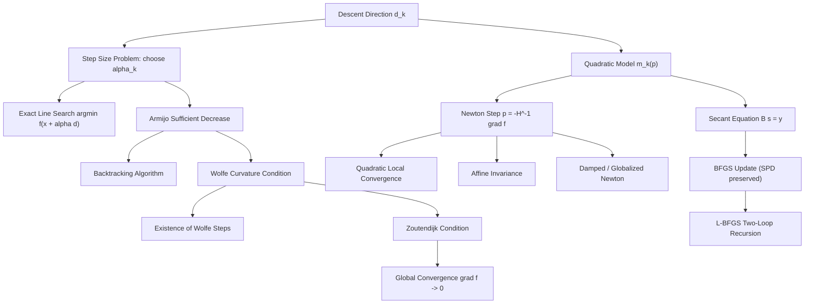

# Topic 04: Line Search, Newton & Quasi-Newton Methods

## 1. Master Overview

Gradient descent answers the question "which direction?" with the negative gradient, but a practical optimizer must also answer "how far?" and "can we do better than first-order information?". This module develops the two pillars of classical smooth optimization: **line search theory** (Armijo sufficient decrease, Wolfe curvature conditions, backtracking, and the Zoutendijk global-convergence framework) and **second-order methods** (Newton's method built from the local quadratic model, and the quasi-Newton family — BFGS and L-BFGS — that approximates curvature from gradient differences alone).

The payoff for using curvature is dramatic: while gradient descent converges linearly with a rate degraded by the condition number $\kappa = L/\mu$, Newton's method converges *quadratically* near the solution — the number of correct digits roughly doubles per iteration — and is affine invariant, so it is completely insensitive to ill-conditioning. Quasi-Newton methods occupy the sweet spot between the two: superlinear convergence at first-order cost per iteration.

These algorithms are the workhorses behind `scipy.optimize.minimize`, logistic-regression solvers (IRLS/Newton), and large-scale scientific computing (L-BFGS). Understanding when a line search guarantees global convergence, and why the secant equation transmits curvature information, is essential for diagnosing real optimizer behavior.

> [!NOTE]
> The Wolfe conditions do double duty: the Armijo inequality forces enough *decrease* to prevent overshooting, while the curvature inequality forces enough *progress* to prevent vanishingly small steps — and it is precisely the curvature condition that guarantees $\mathbf{s}_k^T \mathbf{y}_k \gt 0$, which keeps every BFGS Hessian approximation symmetric positive definite.

## 2. First-Principles Framework

- **Phenomenon**: A search direction alone does not make an algorithm — a fixed step size that is safe on one function diverges on another, and pure first-order methods crawl through ill-conditioned valleys (e.g., the Rosenbrock function).
- **Goal**: Choose step lengths with provable decrease guarantees, and exploit second-order (curvature) information to accelerate convergence from linear to superlinear or quadratic.
- **Governing equation(s)**: the Armijo condition $f(\mathbf{x}_k + \alpha \mathbf{d}_k) \le f(\mathbf{x}_k) + c_1 \alpha \nabla f(\mathbf{x}_k)^T \mathbf{d}_k$; the Newton system $\nabla^2 f(\mathbf{x}_k)\, \mathbf{p}_k = -\nabla f(\mathbf{x}_k)$; the secant equation $B_{k+1} \mathbf{s}_k = \mathbf{y}_k$.
- **Formulation**: Minimize the local quadratic model $m_k(\mathbf{p}) = f(\mathbf{x}_k) + \nabla f(\mathbf{x}_k)^T \mathbf{p} + \frac{1}{2} \mathbf{p}^T B_k \mathbf{p}$ where $B_k$ is the exact Hessian (Newton) or a curvature approximation built from $\{(\mathbf{s}_i, \mathbf{y}_i)\}$ pairs (BFGS, L-BFGS).
- **Consequence**: Zoutendijk's theorem converts any Wolfe line search plus any direction bounded away from orthogonality with $-\nabla f$ into a global convergence guarantee $\nabla f(\mathbf{x}_k) \to \mathbf{0}$; near a nondegenerate minimizer, Newton steps give quadratic error contraction.

## 3. Mermaid Concept Map

The map traces the two arcs of the module: step-size control (left) feeding global convergence, and curvature modeling (right) feeding fast local convergence:

## 4. Common Misconceptions

The table below records the confusions that most often derail practical use of line searches and second-order methods:

| Misconception | Mathematical Reality | Correct Mental Model |
|---|---|---|
| *"Exact line search is always best."* | Exact minimization of $\phi(\alpha) = f(\mathbf{x}_k + \alpha \mathbf{d}_k)$ costs many function evaluations and rarely improves the overall iteration count enough to pay for itself. | Inexact conditions (Armijo + Wolfe) buy provable progress at a few evaluations per step. |
| *"Any step making $f$ decrease guarantees convergence."* | Steps with $f(\mathbf{x}_{k+1}) \lt f(\mathbf{x}_k)$ can still stall: decreases may shrink geometrically toward a non-stationary point. | Sufficient decrease must be *proportional to the step and slope*, which is exactly the Armijo inequality. |
| *"Newton's method always converges faster than gradient descent."* | Far from the solution, the raw Newton step can overshoot, point uphill (indefinite Hessian), or cycle; quadratic convergence is only *local*. | Globalize Newton with a line search or trust region; expect quadratic behavior only near a minimizer with $\nabla^2 f(\mathbf{x}^{\ast}) \succ 0$. |
| *"The Newton direction is always a descent direction."* | If $\nabla^2 f(\mathbf{x}_k)$ is not positive definite, $\mathbf{p}_k = -[\nabla^2 f]^{-1} \nabla f$ may satisfy $\nabla f^T \mathbf{p}_k \gt 0$ (uphill). | Descent requires a positive definite model Hessian; use modified/damped Newton or switch to BFGS. |
| *"BFGS needs the true Hessian somewhere."* | BFGS never evaluates second derivatives; it accumulates curvature purely from gradient differences $\mathbf{y}_k = \nabla f(\mathbf{x}_{k+1}) - \nabla f(\mathbf{x}_k)$ via the secant equation. | Think of BFGS as a "learned" Hessian: each pair $(\mathbf{s}_k, \mathbf{y}_k)$ teaches the model the curvature along one direction. |
| *"L-BFGS is just BFGS with less accuracy."* | L-BFGS stores only $m$ recent pairs, at cost $O(mn)$ time and memory versus $O(n^2)$, and *reconstructs* the action of the inverse Hessian by a two-loop recursion. | L-BFGS trades an aging curvature memory for scalability to millions of variables — the dominant deterministic solver in ML. |
| *"Quadratic convergence means twice as fast as linear."* | Quadratic convergence means $\lVert \mathbf{e}_{k+1}\rVert \le C \lVert \mathbf{e}_k\rVert^2$: the *number of correct digits doubles* each step, qualitatively different from any linear rate. | Linear: fixed digits gained per step. Quadratic: accelerating gains — 2, 4, 8, 16 digits. |

## 5. Directory Inventory

This module contains the following core files:

| File | Description |
|---|---|
| [`first_principles.ipynb`](first_principles.ipynb) | Markdown-only theory notebook: line search conditions (Armijo, Wolfe), Zoutendijk global convergence, Newton quadratic convergence with full proof, affine invariance, BFGS/L-BFGS derivations and SPD preservation. |
| [`exercises.ipynb`](exercises.ipynb) | 20 fully solved problems in 4 levels: concept checks, backtracking and Wolfe computations, Newton on logistic regression (IRLS), Rosenbrock behavior, L-BFGS memory arithmetic, and challenge proofs (contraction maps, optimal momentum, Newton pathologies). |

## 6. References

Primary sources, ordered from core textbooks to the founding papers:

1. **Nocedal, J., & Wright, S. J.** (2006). *Numerical Optimization* (2nd ed.). Springer.
   - Chapter 3: line search methods and Zoutendijk's theorem; Chapter 6: quasi-Newton methods; Chapter 7: L-BFGS for large-scale problems.
2. **Boyd, S., & Vandenberghe, L.** (2004). *Convex Optimization*. Cambridge University Press.
   - Chapter 9: unconstrained minimization — backtracking, Newton's method, and self-concordance analysis.
3. **Bertsekas, D. P.** (2016). *Nonlinear Programming* (3rd ed.). Athena Scientific.
   - Chapter 1: gradient and Newton-type methods with line search rules and convergence theory.
4. **Nesterov, Y.** (2018). *Lectures on Convex Optimization* (2nd ed.). Springer.
   - Chapter 1: worst-case complexity of first- and second-order schemes.
5. **Dennis, J. E., & Schnabel, R. B.** (1996). *Numerical Methods for Unconstrained Optimization and Nonlinear Equations*. SIAM Classics.
   - Chapters 6-9: secant methods, Broyden-class updates, and local convergence theory.
6. **Polyak, B. T.** (1987). *Introduction to Optimization*. Optimization Software.
   - Chapter 3: Newton-type methods and rate-of-convergence analysis.
7. **Liu, D. C., & Nocedal, J.** (1989). On the Limited Memory BFGS Method for Large Scale Optimization. *Mathematical Programming*, 45, 503-528.
   - The L-BFGS algorithm and its two-loop recursion.
8. **Armijo, L.** (1966). Minimization of Functions Having Lipschitz Continuous First Partial Derivatives. *Pacific Journal of Mathematics*, 16(1), 1-3.
   - The sufficient-decrease condition.
9. **Wolfe, P.** (1969). Convergence Conditions for Ascent Methods. *SIAM Review*, 11(2), 226-235.
   - The curvature condition completing the Wolfe pair.
