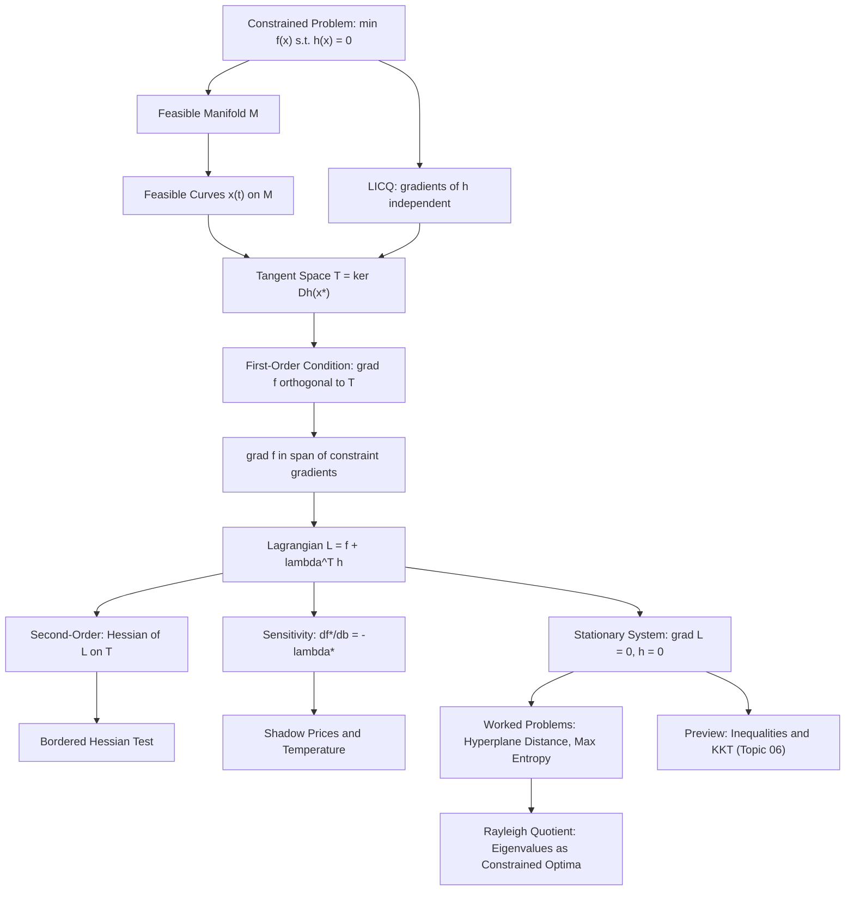

# Topic 05: Constrained Optimization & Lagrange Multipliers

## 1. Master Overview

Most real optimization problems do not allow us to search over all of $\mathbb{R}^n$: budgets must balance, probabilities must sum to one, energy must be conserved, and design variables must satisfy physical laws. Equality-constrained optimization asks for the minimizer of an objective $f(\mathbf{x})$ restricted to the solution set of $h_j(\mathbf{x}) = 0$, a curved feasible manifold on which the familiar condition $\nabla f = \mathbf{0}$ is almost never satisfied.

The method of Lagrange multipliers resolves this tension with a single geometric insight: at a constrained optimum, the gradient of the objective must be orthogonal to every feasible direction, and therefore must lie in the span of the constraint gradients. Introducing one multiplier $\lambda_j$ per constraint converts the constrained problem into the stationarity system of the Lagrangian $\mathcal{L}(\mathbf{x}, \boldsymbol{\lambda}) = f(\mathbf{x}) + \boldsymbol{\lambda}^T \mathbf{h}(\mathbf{x})$, trading a hard geometric restriction for extra algebraic unknowns.

Far from being a mere trick, the multipliers carry deep meaning: $\lambda_j^*$ is the sensitivity of the optimal value to the constraint level, the shadow price of economics, and the inverse temperature of statistical mechanics. This module builds the full theory — tangent spaces, LICQ regularity, first- and second-order conditions, the bordered Hessian, and the sensitivity theorem — and deploys it on canonical problems from geometry, information theory, and spectral analysis.

> [!NOTE]
> The multiplier is not a bookkeeping device. The sensitivity theorem $\frac{\partial f^*}{\partial b_j} = -\lambda_j^*$ says that $\lambda_j^*$ *is* the exchange rate between objective value and constraint level: it prices the constraint. This single identity underlies shadow prices in economics, temperature in statistical mechanics, and dual variables in machine learning.

## 2. First-Principles Framework

The entire theory of this module unfolds from one question: *what does it mean to be locally optimal when you are only allowed to move along a surface?* Every object below — tangent space, multiplier, bordered Hessian — is the minimal machinery needed to answer it.

- **Phenomenon**: An objective $f$ must be minimized while the state is pinned to a feasible manifold $\mathcal{M} = \{\mathbf{x} \in \mathbb{R}^n : h_j(\mathbf{x}) = 0,\ j = 1, \dots, p\}$; the unconstrained condition $\nabla f(\mathbf{x}^*) = \mathbf{0}$ generically fails on $\mathcal{M}$.
- **Goal**: Derive checkable first- and second-order optimality conditions that only involve derivatives of $f$ and $\mathbf{h}$ at the candidate point, and understand what the auxiliary variables mean.
- **Governing equation(s)**: $\nabla_{\mathbf{x}} \mathcal{L}(\mathbf{x}^*, \boldsymbol{\lambda}^*) = \nabla f(\mathbf{x}^*) + \sum_{j=1}^p \lambda_j^* \nabla h_j(\mathbf{x}^*) = \mathbf{0}$ together with feasibility $\mathbf{h}(\mathbf{x}^*) = \mathbf{0}$.
- **Formulation**: Under LICQ, feasible motion is captured by the tangent space $T(\mathbf{x}^*) = \{\mathbf{d} : \nabla h_j(\mathbf{x}^*)^T \mathbf{d} = 0\}$; optimality means $\nabla f \perp T(\mathbf{x}^*)$, and second-order behavior is governed by $\mathbf{d}^T \nabla^2_{\mathbf{xx}} \mathcal{L}\, \mathbf{d}$ restricted to $T(\mathbf{x}^*)$ (bordered Hessian test).
- **Consequence**: A constrained problem in $n$ variables with $p$ constraints becomes a square nonlinear system in $n + p$ unknowns $(\mathbf{x}, \boldsymbol{\lambda})$, and the solved multipliers quantify how the optimum responds to perturbing each constraint.

## 3. Mermaid Concept Map

The map traces the logical flow of the module: geometry of the feasible manifold, the tangent-space optimality argument, the Lagrangian machinery, and the interpretations and applications that follow from it.

## 4. Common Misconceptions

The tangent-space picture dissolves most standard confusions about multipliers. Each row states a common error, the precise mathematical fact, and the mental image that repairs it.

| Misconception | Mathematical Reality | Correct Mental Model |
|---|---|---|
| *"At a constrained minimum the gradient of the objective vanishes."* | On the manifold $h(\mathbf{x}) = 0$, only the projection of $\nabla f$ onto the tangent space vanishes; $\nabla f$ itself is generically nonzero and normal to the constraint surface. | The optimum is where level curves of $f$ become tangent to the constraint surface, so $\nabla f$ is parallel to the constraint normal. |
| *"The multiplier $\lambda$ is just an artificial bookkeeping variable."* | The sensitivity theorem gives $\frac{\partial f^*}{\partial b_j} = -\lambda_j^*$: multipliers measure the marginal value of relaxing each constraint. | Each $\lambda_j^*$ is a price per unit of constraint level $b_j$ — shadow price, marginal utility of income, or inverse temperature. |
| *"A stationary point of $\mathcal{L}$ is a minimum of $\mathcal{L}$ over $(\mathbf{x}, \boldsymbol{\lambda})$."* | $(\mathbf{x}^*, \boldsymbol{\lambda}^*)$ is a saddle point: $\mathcal{L}$ is (locally) minimized in $\mathbf{x}$ but is affine in $\boldsymbol{\lambda}$, so it is never a joint minimum. | Picture a mountain pass: descend in the primal directions, ascend in the multiplier directions. |
| *"Positive definiteness of $\nabla^2 f$ (or of $\nabla^2_{\mathbf{xx}} \mathcal{L}$) on all of $\mathbb{R}^n$ is required for a constrained minimum."* | Only $\mathbf{d}^T \nabla^2_{\mathbf{xx}} \mathcal{L}(\mathbf{x}^*, \boldsymbol{\lambda}^*) \mathbf{d} \gt 0$ for tangent directions $\mathbf{d} \in T(\mathbf{x}^*) \setminus \{\mathbf{0}\}$ is needed; curvature in infeasible directions is irrelevant. | Test curvature with the bordered Hessian, which automatically restricts attention to the tangent space. |
| *"Lagrange conditions always hold at a constrained optimizer."* | Without a constraint qualification the theorem can fail: for $h(x) = x^2$ the gradient $\nabla h(0) = 0$ is degenerate at the only feasible point, and no multiplier reproduces $\nabla f$. | LICQ (independent constraint gradients) is a hypothesis, not a formality; degenerate constraint parametrizations break the tangent-space argument. |
| *"More constraints always make the optimal value worse by a large amount."* | An inactive or redundant equality constraint (one already satisfied by the unconstrained optimizer) has $\lambda^* = 0$ and changes nothing; the loss is governed continuously by the multipliers. | Constraints are priced individually: a zero price means the constraint is free, a large $\lvert \lambda^* \rvert$ means it is expensive. |
| *"The sign of $\lambda$ can be chosen arbitrarily, so it carries no information."* | The sign convention is tied to how the Lagrangian is written: with $\mathcal{L} = f + \boldsymbol{\lambda}^T \mathbf{h}$ and constraint levels $h_j = b_j$, the identity $\frac{\partial f^*}{\partial b_j} = -\lambda_j^*$ fixes both sign and magnitude. | Choose a convention once, and the multiplier's sign then tells you whether tightening the constraint helps or hurts the objective. |

## 5. Directory Inventory

This module contains the following core files, designed to be read in order: theory first, then the graded solutions manual.

| File | Description |
|---|---|
| [`README.md`](README.md) | Master overview, first-principles framework, concept map, misconceptions, and canonical references for equality-constrained optimization. |
| [`first_principles.ipynb`](first_principles.ipynb) | Markdown-only theory notebook: geometric intuition, tangent spaces and LICQ, the Lagrangian, first/second-order conditions, six complete proofs (necessity, sensitivity, second-order sufficiency, hyperplane distance, maximum entropy, Rayleigh quotient), computational strategies, and physics/ML applications. |
| [`exercises.ipynb`](exercises.ipynb) | Markdown-only solutions manual with 20 fully solved problems in four levels: Concept Check (4), Foundation (6), Applications in AI/ML & Physics (6), and Challenge (4), each ending with a boxed result and a key takeaway. |

## 6. References

1. **Boyd, S., & Vandenberghe, L.** (2004). *Convex Optimization*. Cambridge University Press.
   - *Chapter 5 (Duality)*: Lagrangian, multiplier interpretation, and sensitivity analysis.
   - *Section 4.2*: equality-constrained convex problems and their optimality conditions.
2. **Nocedal, J., & Wright, S. J.** (2006). *Numerical Optimization* (2nd ed.). Springer.
   - *Chapter 12 (Theory of Constrained Optimization)*: tangent cones, LICQ, first- and second-order conditions.
   - *Chapter 17*: penalty methods and the augmented Lagrangian.
3. **Bertsekas, D. P.** (1999). *Nonlinear Programming* (2nd ed.). Athena Scientific.
   - *Chapter 3 (Lagrange Multiplier Theory)*: complete treatment of equality constraints, sensitivity, and second-order conditions.
   - *Chapter 4*: Lagrangian methods and computational multipliers.
4. **Nesterov, Y.** (2018). *Lectures on Convex Optimization* (2nd ed.). Springer.
   - *Chapters 1 and 3*: optimality conditions and the role of structure in constrained minimization.
5. **Rockafellar, R. T.** (1970). *Convex Analysis*. Princeton University Press.
   - *Sections 28–30*: multipliers, saddle values, and the variational geometry underlying constraint qualifications.
6. **Luenberger, D. G., & Ye, Y.** (2016). *Linear and Nonlinear Programming* (4th ed.). Springer.
   - *Chapter 11 (Constrained Minimization Conditions)*: tangent plane arguments, bordered Hessians, and sensitivity.
7. **Jaynes, E. T.** (1957). *Information Theory and Statistical Mechanics*. Physical Review, 106(4).
   - The maximum-entropy principle: Lagrange multipliers as the bridge between inference and thermodynamics.
