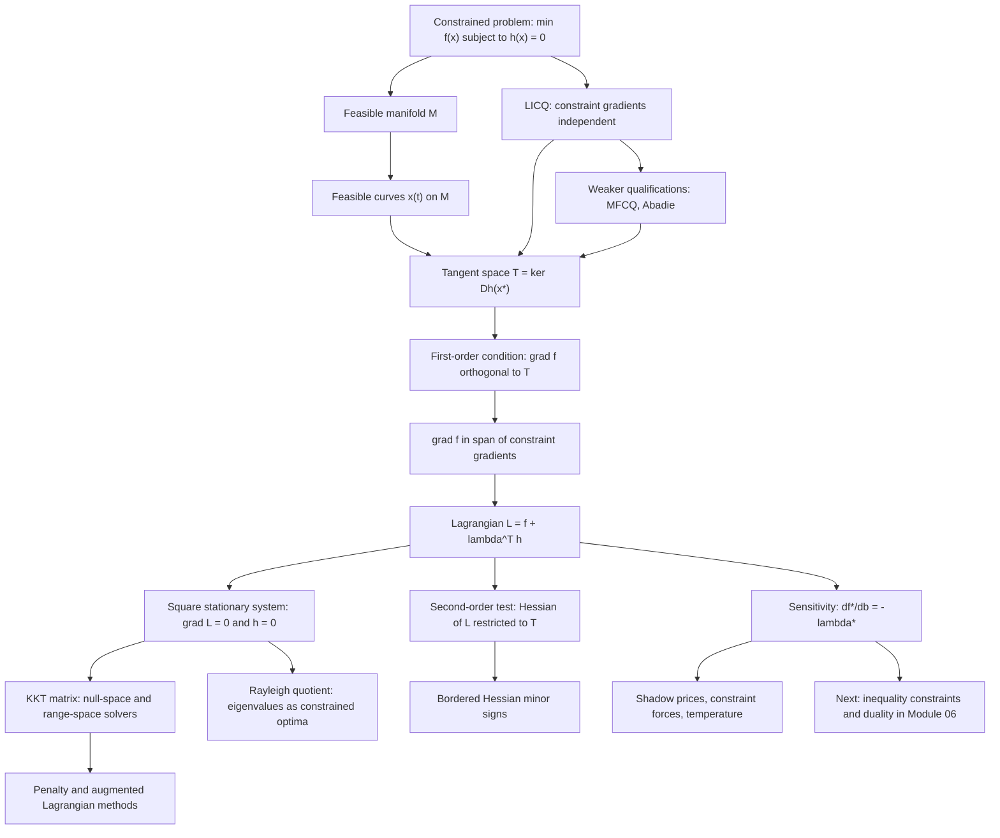

# Module 05 — Constrained Optimization and Lagrange Multipliers

Almost nothing that matters is optimized over all of $\mathbb{R}^n$. Budgets balance, probabilities sum to one, energy is conserved, a bead stays on its wire. The decision variable is pinned to a curved feasible set, and the rule inherited from [Module 02](../02_unconstrained_optimality_conditions/) — stop where $\nabla f = \mathbf{0}$ — is then almost always vacuous, because on a constraint surface the gradient of a generic objective never vanishes.

What replaces it is a single geometric fact: at a constrained optimum the objective gradient has no component along the feasible set, so it lies entirely in the span of the constraint normals. Introducing one multiplier $\lambda_j$ per constraint and forming the Lagrangian $\mathcal{L}(\mathbf{x}, \boldsymbol{\lambda}) = f(\mathbf{x}) + \boldsymbol{\lambda}^T \mathbf{h}(\mathbf{x})$ turns that geometry into a square algebraic system in $n + p$ unknowns — harder algebra in exchange for no geometry, which is what makes constrained problems computable.

The multipliers are not bookkeeping. Each $\lambda_j^*$ is the rate at which the optimal value moves when constraint $j$ is loosened, so it carries units of objective per unit of constraint: a shadow price, a string tension, an inverse temperature. This module proves the tangent-space theorem, the first- and second-order conditions and the sensitivity theorem, and checks each of them numerically.

> [!NOTE]
> The headline result is the sensitivity theorem $\dfrac{\partial f^*}{\partial b_j} = -\lambda_j^*$. It says the multiplier *is* the exchange rate between objective value and constraint level, which is why the same number appears as a shadow price in economics, a constraint force in mechanics and $\beta = 1/(k_BT)$ in statistical mechanics.

## Prerequisites

| Module | What it supplies here |
|---|---|
| [calculus/11 — Gradients and directional derivatives](../../calculus/11_gradients_directional_derivatives/) | The gradient as the normal to a level set, and directional derivatives along curves. |
| [linear_algebra/02 — Linear maps and matrix transformations](../../linear_algebra/02_linear_maps_and_matrix_transformations/) | Kernel, range, rank, and the identity $(\ker A)^{\perp} = \operatorname{range}(A^T)$. |
| [optimization/02 — Unconstrained optimality conditions](../02_unconstrained_optimality_conditions/) | First- and second-order conditions in the unconstrained case, which this module generalizes. |

**Downstream.** [optimization/06 — KKT conditions and duality](../06_kkt_conditions_and_duality/) repeats the whole story for inequality constraints, where multipliers acquire signs and a complementary-slackness switch.

## Learning outcomes

After this module you can:

- Decide whether LICQ holds at a feasible point, and state what fails when it does not.
- Distinguish the tangent space $\ker D\mathbf{h}$, the set of feasible-curve velocities, and the Bouligand tangent cone, and say when the three coincide.
- Solve an equality-constrained problem by the five-step template: Lagrangian, stationarity, feasibility, curvature, sensitivity.
- Apply the second-order conditions on the tangent space, by restricted quadratic form or by bordered-Hessian minor signs.
- Read a multiplier as a marginal price, and verify the reading against a finite-difference slope of the value function.
- Assemble and solve a KKT saddle-point system by the null-space and range-space methods, and say when it is nonsingular.
- Explain why a quadratic penalty needs $\rho \to \infty$ while an augmented Lagrangian does not.

## Concept map

## Notation

| Symbol | Meaning | Convention fixed here |
|---|---|---|
| $f$, $f^*$, $\mathbf{x}^*$ | objective, optimal value, minimizer | as in the area convention |
| $\mathbf{h} = (h_1, \dots, h_p)^T$ | equality constraints | $p \lt n$, each $h_j \in C^1$ |
| $\mathcal{M}$ | feasible set $\{\mathbf{x} : \mathbf{h}(\mathbf{x}) = \mathbf{0}\}$ | $\mathcal{L}$ is reserved for the Lagrangian |
| $D\mathbf{h}(\mathbf{x})$ | constraint Jacobian, $p \times n$ | rows are $\nabla h_j(\mathbf{x})^T$ |
| $T(\mathbf{x})$ | tangent space $\ker D\mathbf{h}(\mathbf{x})$ | dimension $n - p$ under LICQ |
| $\mathcal{T}_B(\mathbf{x})$ | Bouligand tangent cone | limits of secant directions, not of velocities |
| $\boldsymbol{\lambda}$, $\lambda_j$ | Lagrange multipliers | one per equality constraint |
| $\mathcal{L}(\mathbf{x}, \boldsymbol{\lambda})$ | Lagrangian $f + \boldsymbol{\lambda}^T\mathbf{h}$ | **plus** sign, on a **minimization** problem, always |
| $W = \nabla^2_{\mathbf{xx}}\mathcal{L}$ | Hessian of the Lagrangian in $\mathbf{x}$ | never $\nabla^2 f$ in a second-order test |
| $H_B$ | bordered Hessian | zero block first, as in Definition 3.5 |
| $b_j$ | constraint level in $h_j(\mathbf{x}) = b_j$ | the variable the sensitivity theorem differentiates in |
| $\lambda_{\min}$, $\lambda_{\max}$ | extreme eigenvalues of a symmetric matrix | names, not indices |
| $\lVert \mathbf{x} \rVert$ | Euclidean norm | `\lVert ... \rVert` |

## Core results

| Result | Statement | Hypotheses that cannot be dropped |
|---|---|---|
| Theorem 4.1 (tangent space) | $V(\mathbf{x}) = \mathcal{T}_B(\mathbf{x}) = \ker D\mathbf{h}(\mathbf{x})$, of dimension $n - p$ | $\mathbf{h} \in C^1$; LICQ |
| Theorem 4.2 (Lagrange) | a unique $\boldsymbol{\lambda}^*$ has $\nabla f(\mathbf{x}^*) + \sum_j \lambda_j^* \nabla h_j(\mathbf{x}^*) = \mathbf{0}$ | $f, \mathbf{h} \in C^1$; local minimality; LICQ |
| Theorem 4.3 (second order) | $\mathbf{d}^T W \mathbf{d} \ge 0$ on $T$ is necessary; $\gt 0$ on $T \setminus \{\mathbf{0}\}$ is sufficient | $f, \mathbf{h} \in C^2$; regularity; restriction to $T$ |
| Theorem 4.4 (sensitivity) | $\partial f^* / \partial b_j = -\lambda_j^*$ | LICQ and the strict second-order condition, which make the KKT matrix invertible |
| Theorem 4.5 (Rayleigh) | stationary points on the sphere are eigenvectors; $\max = \lambda_{\max}(A)$ | $A$ symmetric |
| Proposition 4.6 | $\operatorname{dist}(\mathbf{x}_0, H) = \lvert \mathbf{a}^T\mathbf{x}_0 - b \rvert / \lVert \mathbf{a} \rVert$ | $\mathbf{a} \neq \mathbf{0}$ |
| Proposition 4.7 | max-entropy laws are uniform, and Gibbs $e^{-\beta E_i}/Z$ under an energy constraint | $p_i \gt 0$; $\bar{E}$ strictly inside the energy range |
| Section 7.1 | the KKT matrix is nonsingular iff $A$ has full row rank and $Q \succ 0$ on $\ker A$ | the same two hypotheses as Theorems 4.2 and 4.3 |

## Common misconceptions

| Misconception | Mathematical reality | Correct mental model |
|---|---|---|
| *"At a constrained minimum the objective gradient vanishes."* | Only the projection of $\nabla f$ onto $T(\mathbf{x}^*)$ vanishes; $\nabla f$ itself is generically nonzero and normal to the feasible set. | The level set of $f$ becomes tangent to the constraint surface, so $\nabla f$ is parallel to the constraint normal. |
| *"The multiplier is an artificial bookkeeping variable."* | Theorem 4.4 gives $\partial f^*/\partial b_j = -\lambda_j^*$, a derivative of the optimal value. | Each $\lambda_j^*$ is a price per unit of constraint level: shadow price, string tension, inverse temperature. |
| *"A stationary point of $\mathcal{L}$ is a minimum of $\mathcal{L}$ in $(\mathbf{x}, \boldsymbol{\lambda})$."* | $\mathcal{L}$ is affine in $\boldsymbol{\lambda}$, so $(\mathbf{x}^*, \boldsymbol{\lambda}^*)$ is a saddle, never a joint minimum. | A mountain pass: descend in the primal directions, ascend in the multiplier directions. |
| *"A constrained minimum needs $\nabla^2 f \succ 0$."* | Only $\mathbf{d}^T W \mathbf{d} \gt 0$ for $\mathbf{d} \in T(\mathbf{x}^*) \setminus \{\mathbf{0}\}$ is needed, with $W = \nabla^2_{\mathbf{xx}}\mathcal{L}$; curvature off $T$ is unobservable. | The term $\sum_j \lambda_j \nabla^2 h_j$ pays for the acceleration required to stay feasible. |
| *"Lagrange conditions always hold at a constrained optimizer."* | For $\min x$ subject to $x^2 = 0$ the minimizer is $x^* = 0$ and no multiplier exists, because $\nabla h(0) = 0$. | LICQ is a hypothesis about the *description* of the feasible set, not about the set itself. |
| *"The tangent cone and the feasible-curve velocities are the same object."* | At the cusp $y^2 = x^3$ the velocities are $\{\mathbf{0}\}$ while $\mathcal{T}_B$ is a ray and $\ker Dh$ is the whole plane. | Three nested sets, collapsed into one only by a constraint qualification. |
| *"More constraints always cost a lot."* | A constraint the unconstrained optimizer already satisfies has $\lambda^* = 0$ and changes nothing. | Constraints are priced individually; a zero price means the constraint is free. |

## Exercise index

[`exercises.ipynb`](exercises.ipynb) holds 20 fully solved problems.

| Tier | Count | Coverage |
|---|---:|---|
| L0 — Concept Checks | 4 | why $\nabla f \ne \mathbf{0}$ at the optimum; the multiplier as a price; the saddle structure of $\mathcal{L}$; LICQ as a genuine hypothesis |
| L1 — Foundations | 6 | a complete two-variable computation; tangent space equals kernel; proof of the multiplier theorem; the bordered Hessian; proof of the sensitivity theorem; point-to-hyperplane distance |
| L2 — Applications (AI/ML and Physics) | 6 | Boltzmann distribution; Rayleigh quotient; equality-constrained least squares; minimum-variance portfolio; bead on a sphere and the constraint force; PCA with two multipliers |
| L3 — Challenge Proofs | 4 | second-order sufficiency with quadratic growth; why $\nabla^2 f$ alone is the wrong test; Fritz John conditions and abnormal multipliers; the max-entropy Gaussian, verified by Gibbs' inequality |

## References

1. **Nocedal, J., & Wright, S. J.** (2006). *Numerical Optimization* (2nd ed.). Springer.
   - Ch. 12, Lemma 12.2 and Thm 12.1 — tangent space and the first-order conditions.
   - Ch. 12, Thm 12.5 and Thm 12.6 — second-order necessary and sufficient conditions.
   - Ch. 12, §12.2 and §12.6 — tangent cone, MFCQ, Abadie constraint qualification.
   - Ch. 16, §16.2 — KKT matrix, null-space and range-space (Schur complement) methods.
   - Ch. 17, Thm 17.1 and §17.3 — quadratic-penalty rate and the augmented Lagrangian.
2. **Boyd, S., & Vandenberghe, L.** (2004). *Convex Optimization*. Cambridge University Press.
   - §5.6.2 — local sensitivity and the multiplier as a shadow price.
   - §4.2.3 — equality-constrained convex problems and their optimality conditions.
3. **Bertsekas, D. P.** (1999). *Nonlinear Programming* (2nd ed.). Athena Scientific.
   - §3.1, Prop. 3.1.1 — penalty-based proof of the Lagrange multiplier theorem.
   - §3.2, Prop. 3.2.2 — sensitivity and second-order conditions.
4. **Luenberger, D. G., & Ye, Y.** (2016). *Linear and Nonlinear Programming* (4th ed.). Springer.
   - Ch. 11, §11.5 — tangent-plane arguments and the bordered-Hessian minor rule.
5. **Horn, R. A., & Johnson, C. R.** (2013). *Matrix Analysis* (2nd ed.). Cambridge University Press.
   - §4.2, Thm 4.2.2 — the Rayleigh–Ritz variational characterization of eigenvalues.
6. **Cover, T. M., & Thomas, J. A.** (2006). *Elements of Information Theory* (2nd ed.). Wiley.
   - §12.1, Thm 12.1.1 — maximum-entropy distributions under moment constraints.
7. **Jaynes, E. T.** (1957). *Information Theory and Statistical Mechanics*. *Physical Review*, **106**(4), §§2–3.
   - Lagrange multipliers as the bridge between inference and thermodynamics.
