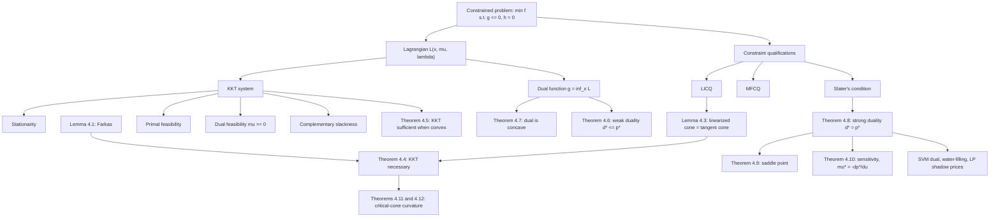

# Module 06 — KKT Conditions and Lagrangian Duality

Equality constraints pin a decision onto a surface; inequality constraints fence off a region. A fence matters only when you lean on it, and it can only push outward — never pull. The Karush-Kuhn-Tucker (KKT) conditions turn that asymmetry into algebra: a sign condition $\mu_i \ge 0$ says a fence pushes only, and a complementarity condition $\mu_i g_i(\mathbf{x}^{\ast}) = 0$ says a fence you are not touching charges nothing. Together with stationarity and feasibility they compress "no nearby feasible point is better" into finitely many equations.

The same structure arrives a second time from the opposite side. Replace each hard constraint by a price per unit of violation and minimize the resulting unconstrained bill: every price vector yields a certified lower bound on the optimum, and the best such bound is the **dual problem**. The dual function is concave for *every* problem, convex or not, so the search for the best bound is always tractable. When the two values meet, the optimal prices are exactly the KKT multipliers, and the pair $(\mathbf{x}^{\ast}, \boldsymbol{\mu}^{\ast})$ is a saddle point of the Lagrangian.

Making KKT *necessary* is what costs something. The module proves it under LICQ in two purchases: the implicit function theorem shows that linearized feasible directions are genuine directions of travel, and Farkas' lemma converts "every feasible direction is blocked" into a nonnegative recipe for $-\nabla f$. Drop LICQ and the multipliers can vanish entirely, as `min x` subject to `x^2 <= 0` shows. Sufficiency, by contrast, is free: on a convex problem any KKT point is already a global optimum with zero duality gap.

The payoff is everywhere downstream: the SVM dual and the kernel trick, water-filling power allocation, shadow prices in linear programming, contact forces in a physics engine, and the optimality certificate every convex solver prints when it stops.

> [!NOTE]
> Weak duality $d^{\ast} \le p^{\ast}$ holds for *any* optimization problem, with a two-line proof that uses only $\boldsymbol{\mu} \ge \mathbf{0}$. Strong duality $d^{\ast} = p^{\ast}$ is the special property of a convex problem with a strictly feasible point, and it is exactly what makes KKT necessary *and* sufficient there.

## Prerequisites

- [`optimization/01` — Problem Formulation and Convexity](../01_problem_formulation_and_convexity/) — standard form, convex sets and functions, and why convexity makes local optima global.
- [`optimization/05` — Constrained Optimization and Lagrange Multipliers](../05_constrained_optimization_lagrange/) — the equality-constrained multiplier rule and the reading of a multiplier as a shadow price.

## Downstream

- [`optimization/07` — Linear, Quadratic and Conic Programs](../07_linear_quadratic_conic_programs/) — builds LP, QP, SOCP and SDP directly on the dual pair established here.

## Learning outcomes

After working through this module you should be able to:

- Write the KKT system of a constrained problem and solve small instances by active-set enumeration.
- Decide whether a constraint qualification (LICQ, MFCQ, Slater) holds, and say which theorem it unlocks.
- Prove KKT necessity under LICQ from Farkas' lemma, and explain where each hypothesis is used.
- Build the Lagrange dual function of a problem, prove weak duality, and certify a bound with it.
- Say when strong duality holds, and produce a convex problem where it fails.
- Read a multiplier as a shadow price through the global sensitivity inequality.
- Use the critical cone and the second-order conditions to separate a KKT point that is a minimizer from one that is not.
- Derive the hard-margin SVM dual and explain why it admits kernels.

## Concept map

## Notation

| Symbol | Meaning | Convention |
|---|---|---|
| $f, g_i, h_j$ | objective, inequality constraints, equality constraints | constraints in standard form $g_i \le 0$, $h_j = 0$ |
| $\mu_i$ | multiplier of the inequality $g_i(\mathbf{x}) \le 0$ | always carries a constraint index; $\mu_i \ge 0$ |
| $\lambda_j$ | multiplier of the equality $h_j(\mathbf{x}) = 0$ | free in sign |
| $\mathcal{L}(\mathbf{x}, \boldsymbol{\mu}, \boldsymbol{\lambda})$ | Lagrangian | $f + \sum_i \mu_i g_i + \sum_j \lambda_j h_j$ |
| $g(\boldsymbol{\mu}, \boldsymbol{\lambda})$ | Lagrange dual function | $\inf_{\mathbf{x}} \mathcal{L}$; concave always |
| $p^{\ast}$, $d^{\ast}$ | primal and dual optimal values | $d^{\ast} \le p^{\ast}$ always |
| $\mathcal{A}(\mathbf{x})$ | active set at $\mathbf{x}$ | $\{i : g_i(\mathbf{x}) = 0\}$ |
| $\mathcal{F}(\mathbf{x})$, $T(\mathbf{x})$ | linearized feasible cone, tangent cone | $T \subseteq \mathcal{F}$, with equality under LICQ |
| $\mathcal{C}(\mathbf{x}^{\ast}, \boldsymbol{\mu}^{\ast})$ | critical cone | directions the first order cannot decide |
| $\nabla f$, $\nabla^2_{\mathbf{x}\mathbf{x}} \mathcal{L}$ | gradient, Hessian of the Lagrangian in $\mathbf{x}$ | gradients are column vectors |
| $\lVert \mathbf{x} \rVert$ | Euclidean norm | written `\lVert ... \rVert` |
| $\tau$ | central-path parameter | perturbs $\mu_i g_i = 0$ to $-\mu_i g_i = \tau$ |

Note the repository-wide ruling on $\mu$: with a constraint index, next to $g_i(\mathbf{x}) \le 0$, it is an inequality multiplier — as it is throughout this module. Without an index and next to $L$ or $\kappa$, it is the strong-convexity modulus of `optimization/03`.

## Core results

| Result | Statement | Hypotheses |
|---|---|---|
| Lemma 4.1 (Farkas) | either $\mathbf{c} \in \operatorname{cone}\{\mathbf{a}_i\}$, or some $\mathbf{d}$ has $\mathbf{a}_i^T\mathbf{d} \le 0$ and $\mathbf{c}^T\mathbf{d} \gt 0$ | finitely many generators |
| Corollary 4.2 (Gordan) | either $\mathbf{a}_i^T\mathbf{d} \lt 0$ for all $i$ is solvable, or $\sum_i y_i \mathbf{a}_i = \mathbf{0}$ with $\mathbf{y} \ge \mathbf{0}$, $\mathbf{y} \neq \mathbf{0}$ | finitely many generators |
| Lemma 4.3 | $T(\mathbf{x}^{\ast}) = \mathcal{F}(\mathbf{x}^{\ast})$ | LICQ, constraints $C^1$ |
| Theorem 4.4 | KKT multipliers exist and are unique | local minimizer, LICQ |
| Theorem 4.5 | a KKT point is a global minimizer with $p^{\ast} = d^{\ast}$ | $f, g_i$ convex, $h_j$ affine; no qualification needed |
| Theorem 4.6 | $g(\boldsymbol{\mu}, \boldsymbol{\lambda}) \le p^{\ast}$, hence $d^{\ast} \le p^{\ast}$ | $\boldsymbol{\mu} \ge \mathbf{0}$ only |
| Theorem 4.7 | the dual function is concave, its domain convex | none |
| Theorem 4.8 | $d^{\ast} = p^{\ast}$ with the dual optimum attained | convex, Slater, $p^{\ast}$ finite |
| Theorem 4.9 | saddle point $\iff$ both optimal with zero gap $\iff$ minimax equality | $\boldsymbol{\mu}^{\ast} \ge \mathbf{0}$ |
| Theorem 4.10 | $p^{\ast}(\mathbf{u}) \ge p^{\ast} - \boldsymbol{\mu}^{\ast T}\mathbf{u}$; $-\partial p^{\ast}/\partial u_i = \mu_i^{\ast}$ | strong duality with attainment; differentiability for the local form |
| Theorems 4.11 and 4.12 | curvature on $\mathcal{C}$ is necessary ($\ge 0$) and sufficient ($\gt 0$) | $C^2$ data; LICQ for the necessary direction only |

## Common misconceptions

| Misconception | Mathematical reality | Correct mental model |
|---|---|---|
| *"KKT holds at every constrained minimum."* | Without a constraint qualification the multipliers may fail to exist: for $\min x$ subject to $x^2 \le 0$ the only feasible point is $x = 0$, yet no $\mu \ge 0$ satisfies stationarity. | KKT is first-order optimality *plus* a regularity assumption about the constraint geometry. |
| *"Inequality multipliers can have any sign."* | Dual feasibility forces $\mu_i \ge 0$: a binding $g_i \le 0$ can only push the objective gradient outward, never pull it inward. | Equality multipliers are free; inequality multipliers are one-sided prices. |
| *"An inactive constraint still influences the optimum."* | Complementary slackness forces $\mu_i^{\ast} = 0$ whenever $g_i(\mathbf{x}^{\ast}) \lt 0$; locally the problem behaves as if that constraint were deleted. | Only the active set shapes the first-order conditions — this is why SVM solutions depend only on support vectors. |
| *"Duality is only defined for convex problems."* | The dual function and weak duality hold for arbitrary problems, and the dual is concave even when the primal is wildly nonconvex. | Convexity is needed only to *close* the gap, not to define the dual. |
| *"Strong duality always holds for convex problems."* | Convexity alone is insufficient: $\min e^{-x}$ subject to $x^2/y \le 0$ on $y \gt 0$ is convex with $p^{\ast} = 1$ and $d^{\ast} = 0$. | Convexity plus a strictly feasible point (Slater) gives strong duality. |
| *"A KKT point is a minimizer."* | On a nonconvex problem it need not be: $\min x_2 - x_1^2$ subject to $-x_2 \le 0$, $x_1^2 + x_2^2 \le 1$ has a KKT point at the origin that is beaten by every nearby feasible point. | KKT filters candidates; curvature on the critical cone decides among them. |
| *"Multipliers are algebraic bookkeeping."* | The multiplier is the sensitivity of the optimal value to constraint perturbation, and it bounds the value function globally from below. | Multipliers are shadow prices: the marginal worth of one more unit of the resource. |

## Exercise index

[`exercises.ipynb`](exercises.ipynb) contains 20 fully solved problems in four tiers, with a code cell recomputing every numeric or algorithmic answer.

| Tier | Count | Problems |
|---|---:|---|
| L0 — Concept Checks | 4 | complementary slackness; the sign of an inequality multiplier; weak duality and concavity in two lines; KKT failing without a constraint qualification |
| L1 — Foundations | 6 | active-set enumeration; a dual function from scratch; complementary slackness from a zero gap; box constraints and clipping; LP duality on a concrete example; KKT sufficiency for convex problems |
| L2 — Applications (AI/ML and Physics) | 6 | water-filling power allocation; projection onto the probability simplex; the hard-margin SVM dual and kernels; the soft-margin support-vector taxonomy; the ridge dual and the representer theorem; contact mechanics as a complementarity problem |
| L3 — Challenge Proofs | 4 | Slater implies strong duality; the dual of the dual of an LP; a convex problem with a strictly positive gap; saddle points and the minimax equality |

## References

1. **Boyd, S., & Vandenberghe, L.** (2004). *Convex Optimization*. Cambridge University Press. Sections 5.1-5.3 (dual function, weak and strong duality, Slater), 5.1.6 (conjugate form of the dual), 5.5.3 (KKT), 5.6.2 (global sensitivity), 5.8 (theorems of alternatives), and 2.5.2 (supporting hyperplane theorem).
2. **Nocedal, J., & Wright, S. J.** (2006). *Numerical Optimization* (2nd ed.). Springer. Chapter 12: Theorem 12.1 (KKT necessity), Lemma 12.2 (LICQ and the tangent cone), Theorems 12.5-12.6 (second-order conditions, pp. 332-333), Section 12.6 (MFCQ and boundedness of the multiplier set, p. 339).
3. **Rockafellar, R. T.** (1970). *Convex Analysis*. Princeton University Press. Theorem 19.1 (p. 171) for closedness of a finitely generated cone; Sections 28-37 for saddle functions and minimax.
4. **Bertsekas, D. P.** (2016). *Nonlinear Programming* (3rd ed.). Athena Scientific. Chapters 3-5: Lagrange multiplier theory, duality gaps in nonconvex problems, and saddle-point conditions.
5. **Bertsekas, D. P.** (2009). *Convex Optimization Theory*. Athena Scientific. Chapters 4-5: the geometric min-common / max-crossing duality framework.
6. **Luenberger, D. G., & Ye, Y.** (2016). *Linear and Nonlinear Programming* (4th ed.). Springer. Chapter 11 (constrained minimization conditions) and Chapter 14 (duality and dual methods).
7. **Nesterov, Y.** (2018). *Lectures on Convex Optimization* (2nd ed.). Springer. Chapter 3: nonsmooth convex optimization and Lagrangian relaxation.
8. **Karush, W.** (1939). *Minima of Functions of Several Variables with Inequalities as Side Constraints*. M.Sc. thesis, University of Chicago; **Kuhn, H. W., & Tucker, A. W.** (1951). Nonlinear Programming. *Proc. Second Berkeley Symposium*, pp. 481-492.
9. **Cortes, C., & Vapnik, V.** (1995). Support-Vector Networks. *Machine Learning*, 20, pp. 273-297. The SVM dual as the canonical machine-learning application of KKT theory.
10. **Cover, T. M., & Thomas, J. A.** (2006). *Elements of Information Theory* (2nd ed.). Wiley. Section 9.4: water-filling as a KKT solution.
