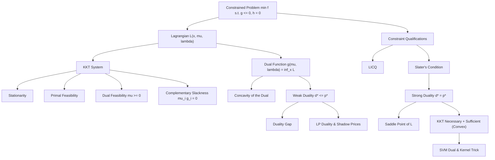

# Topic 06: KKT Conditions & Lagrangian Duality

## 1. Master Overview

The Karush-Kuhn-Tucker (KKT) conditions are the master first-order optimality system for constrained optimization: they unify Fermat's stationarity condition (unconstrained case) and the Lagrange multiplier rule (equality case) with inequality constraints through the mechanism of **complementary slackness** — a constraint either binds actively at the solution or its multiplier vanishes. Under constraint qualifications such as LICQ or Slater's condition, every local minimizer must satisfy the KKT system, and for convex problems the KKT system is also *sufficient* for global optimality.

Lagrangian **duality** reframes the same structure variationally: relaxing constraints into penalty prices produces the dual function $g(\boldsymbol{\mu}, \boldsymbol{\lambda}) = \inf_{\mathbf{x}} \mathcal{L}(\mathbf{x}, \boldsymbol{\mu}, \boldsymbol{\lambda})$, which is *always concave* and always bounds the primal optimum from below (weak duality). When the gap closes — guaranteed for convex problems satisfying Slater's condition — the primal-dual pair forms a saddle point of the Lagrangian, multipliers become shadow prices, and solving the dual solves the primal.

This machinery is not abstract bookkeeping: it produces the support-vector-machine dual (and thereby the kernel trick), water-filling power allocation, shadow prices in linear programming, and the optimality certificates emitted by every modern convex solver.

> [!NOTE]
> Weak duality $d^{\ast} \le p^{\ast}$ holds for *any* optimization problem, convex or not, with a two-line proof. Strong duality $d^{\ast} = p^{\ast}$ is the special property of convex problems with a strictly feasible point (Slater), and it is exactly what makes KKT necessary *and* sufficient there.

## 2. First-Principles Framework

- **Phenomenon**: At a constrained optimum on the boundary of the feasible region, the objective gradient need not vanish — it is balanced by an outward "pressure" from the active constraints only.
- **Goal**: Encode this force balance algebraically (stationarity + feasibility + sign conditions + complementary slackness), and quantify the price of each constraint via multipliers.
- **Governing equation(s)**: stationarity $\nabla f(\mathbf{x}^{\ast}) + \sum_i \mu_i^{\ast} \nabla g_i(\mathbf{x}^{\ast}) + \sum_j \lambda_j^{\ast} \nabla h_j(\mathbf{x}^{\ast}) = \mathbf{0}$ with $\mu_i^{\ast} \ge 0$ and $\mu_i^{\ast} g_i(\mathbf{x}^{\ast}) = 0$.
- **Formulation**: The dual function $g(\boldsymbol{\mu}, \boldsymbol{\lambda}) = \inf_{\mathbf{x}} \mathcal{L}(\mathbf{x}, \boldsymbol{\mu}, \boldsymbol{\lambda})$ yields the dual problem $\max_{\boldsymbol{\mu} \ge \mathbf{0}, \boldsymbol{\lambda}} g(\boldsymbol{\mu}, \boldsymbol{\lambda})$, a concave maximization regardless of primal convexity.
- **Consequence**: Weak duality gives certified lower bounds and the duality gap $p^{\ast} - d^{\ast} \ge 0$; Slater's condition collapses the gap; complementary slackness identifies which constraints matter (support vectors, active resource limits).

## 3. Mermaid Concept Map

The map runs from the constrained problem through the KKT system (left) and the dual construction (right) to their meeting point at strong duality:

## 4. Common Misconceptions

The table below records the confusions that most often undermine correct use of KKT theory and duality:

| Misconception | Mathematical Reality | Correct Mental Model |
|---|---|---|
| *"KKT conditions always hold at every constrained minimum."* | Without a constraint qualification the multipliers may fail to exist: for $\min x$ s.t. $x^2 \le 0$ the only feasible point is $x = 0$, but no $\mu \ge 0$ satisfies stationarity. | KKT = first-order optimality *plus* a regularity assumption (LICQ, Slater) about the constraint geometry. |
| *"Multipliers of inequality constraints can have any sign."* | Inequality multipliers must satisfy $\mu_i \ge 0$: the objective gradient can only be pushed *outward* by a binding $g_i \le 0$ constraint, never pulled inward. | Equality multipliers $\lambda_j$ are free; inequality multipliers are one-sided prices. |
| *"An inactive constraint can still influence the optimum."* | Complementary slackness forces $\mu_i^{\ast} = 0$ whenever $g_i(\mathbf{x}^{\ast}) \lt 0$; locally the problem behaves as if the constraint were deleted. | Only the *active set* shapes the first-order conditions — this is why SVM solutions depend only on support vectors. |
| *"Duality is only defined for convex problems."* | The dual function and weak duality $d^{\ast} \le p^{\ast}$ hold for arbitrary problems; the dual is concave even when the primal is wildly non-convex. | Convexity is needed only to *close the gap* (strong duality), not to define the dual. |
| *"Strong duality always holds for convex problems."* | Convexity alone is insufficient: there exist convex programs with a strictly positive duality gap when no strictly feasible point exists. | Convexity + Slater (a point with $g_i(\mathbf{x}_0) \lt 0$ for all $i$) $\Rightarrow$ strong duality. |
| *"The dual optimal value can exceed the primal optimum."* | Weak duality forbids $d^{\ast} \gt p^{\ast}$ in a minimization problem: every dual-feasible point gives a lower bound on $p^{\ast}$. | The dual climbs a floor below the primal; at best (zero gap) the floor touches the primal optimum. |
| *"Lagrange multipliers are just algebraic bookkeeping."* | The multiplier equals the sensitivity of the optimal value to constraint perturbation: $\mu_i^{\ast} = -\partial p^{\ast}/\partial u_i$ for the relaxed constraint $g_i(\mathbf{x}) \le u_i$. | Multipliers are *shadow prices*: what one marginal unit of the resource is worth at the optimum. |

## 5. Directory Inventory

This module contains the following core files:

| File | Description |
|---|---|
| [`first_principles.ipynb`](first_principles.ipynb) | Markdown-only theory notebook: active sets and KKT derivation, constraint qualifications, dual function concavity, weak duality proof, complementary slackness from a zero gap, Slater strong-duality separating-hyperplane sketch, saddle-point characterization, LP duality, and the full hard-margin SVM dual derivation. |
| [`exercises.ipynb`](exercises.ipynb) | 20 fully solved problems in 4 levels: concept checks, KKT systems worked by active-set enumeration, water-filling, simplex projection, soft-margin SVM, ridge dual, LP duality, and challenge proofs (dual of the dual, Slater failure, minimax equality). |

## 6. References

Primary sources, ordered from core textbooks to the founding papers:

1. **Boyd, S., & Vandenberghe, L.** (2004). *Convex Optimization*. Cambridge University Press.
   - Chapter 5: duality — the dual function, weak and strong duality, Slater's condition, KKT, and sensitivity analysis.
2. **Nocedal, J., & Wright, S. J.** (2006). *Numerical Optimization* (2nd ed.). Springer.
   - Chapter 12: theory of constrained optimization — KKT conditions and constraint qualifications.
3. **Bertsekas, D. P.** (2016). *Nonlinear Programming* (3rd ed.). Athena Scientific.
   - Chapters 3-5: Lagrange multiplier theory, duality, and saddle-point conditions.
4. **Bertsekas, D. P.** (2009). *Convex Optimization Theory*. Athena Scientific.
   - Chapters 4-5: the geometric min-common / max-crossing duality framework.
5. **Rockafellar, R. T.** (1970). *Convex Analysis*. Princeton University Press.
   - Parts VI-VII: constrained extremum problems, saddle functions, and minimax theory.
6. **Luenberger, D. G., & Ye, Y.** (2016). *Linear and Nonlinear Programming* (4th ed.). Springer.
   - Chapter 11: constrained minimization conditions; Chapter 14: duality and dual methods.
7. **Nesterov, Y.** (2018). *Lectures on Convex Optimization* (2nd ed.). Springer.
   - Chapter 3: nonsmooth convex optimization and Lagrangian relaxation.
8. **Karush, W.** (1939). *Minima of Functions of Several Variables with Inequalities as Side Constraints*. M.Sc. thesis, University of Chicago; **Kuhn, H. W., & Tucker, A. W.** (1951). Nonlinear Programming. *Proc. Second Berkeley Symposium*.
   - The original statements of the KKT conditions.
9. **Cortes, C., & Vapnik, V.** (1995). Support-Vector Networks. *Machine Learning*, 20, 273-297.
   - The SVM dual as the canonical machine-learning application of KKT theory.
