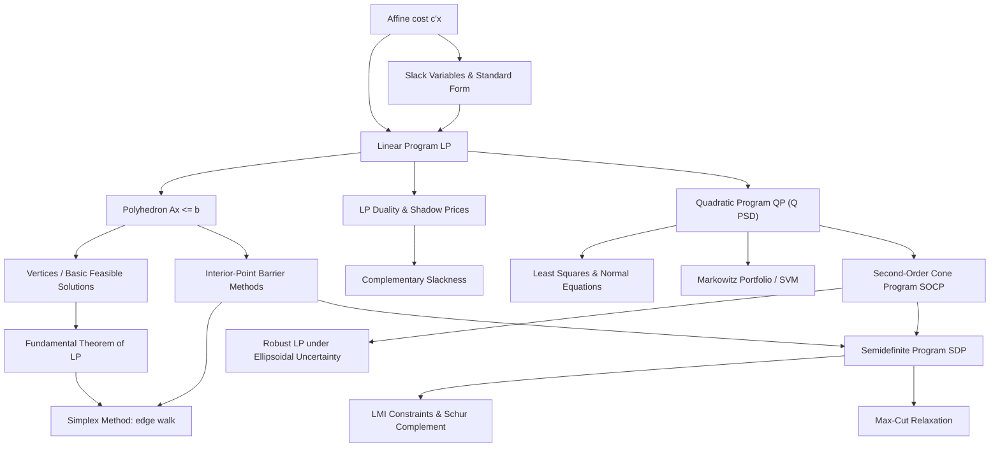

# Topic 07: Linear, Quadratic & Conic Programs

## 1. Master Overview

Structured convex optimization is the study of problem classes whose algebraic form is restrictive enough to admit fast, reliable, globally optimal solvers, yet expressive enough to model an enormous range of engineering, economic, and machine-learning tasks. This module builds the four canonical classes from first principles: **Linear Programs (LP)** with affine objectives over polyhedra, **Quadratic Programs (QP)** with convex quadratic objectives, **Second-Order Cone Programs (SOCP)** with norm-cone constraints, and **Semidefinite Programs (SDP)** with linear matrix inequality constraints.

The central organizing idea is the *convex hierarchy* $\text{LP} \subset \text{QP} \subset \text{SOCP} \subset \text{SDP}$: each class strictly contains the previous one through explicit embedding constructions (zero curvature, epigraph plus rotated cones, and arrow-shaped Schur-complement matrices). Recognizing where a model sits in this hierarchy tells you immediately which solver technology applies, what duality theory guarantees, and how expensive the solve will be.

Geometrically, the module connects algebra to polyhedral and conic geometry: vertices and basic feasible solutions explain why the simplex method walks along edges, the fundamental theorem of LP explains why optima live at extreme points, and interior-point barrier methods explain how all four classes are solved in polynomial time by a single Newton-based framework.

> [!NOTE]
> Every problem in this module is convex, so any local minimum is a global minimum, strong duality holds under mild conditions (Slater), and off-the-shelf solvers return certified optimal solutions. Least squares, ridge regression, SVMs, Markowitz portfolios, robust LPs, and the max-cut relaxation all live inside this hierarchy.

## 2. First-Principles Framework

The framework reads each program class as one phenomenon (a cost over a constrained set), one canonical algebraic form, and one geometric consequence:

- **Phenomenon**: Decision problems with linear or quadratic costs and resource constraints (production plans, portfolios, classifiers) share a common algebraic skeleton: affine or quadratic functions minimized over intersections of half-spaces and cones.
- **Goal**: Classify these skeletons into a hierarchy of tractable convex classes, understand the geometry of their feasible sets, and derive optimality and duality certificates for each class.
- **Governing equation(s)**: The LP standard form $\min\{c^T x : Ax = b,\ x \ge 0\}$; the QP objective $\tfrac{1}{2}x^T Q x + c^T x$ with $Q \succeq 0$; the second-order cone constraint $\lVert A_i x + b_i \rVert_2 \le c_i^T x + d_i$; the LMI constraint $F_0 + \sum_i x_i F_i \succeq 0$.
- **Formulation**: Conversions (slack variables, free-variable splitting, epigraph reformulation, Schur complements) map every instance into a single conic form $\min\{c^T x : Ax = b,\ x \in \mathcal{K}\}$ for a closed convex cone $\mathcal{K}$, which is the form solvers actually consume.
- **Consequence**: The fundamental theorem of LP places optima at vertices; LP duality yields shadow prices and complementary slackness; interior-point methods solve all four classes to accuracy $\epsilon$ in a polynomial number of Newton iterations.

## 3. Mermaid Concept Map

The map traces the hierarchy from affine costs through polyhedral geometry to the conic classes and their solver technologies:

## 4. Common Misconceptions

The table below records the errors that most often derail modeling work with structured convex programs:

| Misconception | Mathematical Reality | Correct Mental Model |
|---|---|---|
| *"An LP optimum can occur strictly inside the feasible region."* | A nonconstant affine function has a nonzero constant gradient, so it always decreases along some feasible direction until a boundary is hit; the fundamental theorem places an optimum at an extreme point whenever one exists. | Tilt a plane over a polyhedron: the lowest contact point is a vertex (or a whole face containing a vertex). |
| *"The simplex method is polynomial time because it is fast in practice."* | Klee-Minty cubes force simplex through $2^n$ vertices; its worst case is exponential, while interior-point methods carry polynomial guarantees. | Simplex is an empirically excellent edge walk; barrier methods are the theoretically safe central-path followers. |
| *"Any quadratic objective gives a convex QP."* | Convexity requires $Q \succeq 0$; an indefinite $Q$ makes the problem NP-hard in general. | Check eigenvalues first: the bowl must curve upward in every direction before QP machinery applies. |
| *"Slack variables change the optimal value of an LP."* | The map from $Ax \le b$ to $Ax + s = b$ with $s \ge 0$ is a bijection between feasible sets preserving the objective, so the optimal value is unchanged. | Slacks only *rename* the geometry: inequality distances become explicit nonnegative coordinates. |
| *"The dual multiplier of a constraint is just an abstract certificate."* | By LP sensitivity, $y_i^*$ equals the rate of change of the optimal value per unit of $b_i$ under nondegeneracy. | Dual variables are shadow prices: what you would pay for one more unit of a scarce resource. |
| *"SOCP and SDP are exotic classes unrelated to QP."* | Explicit embeddings exist: LP is QP with $Q = 0$; a QP is an SOCP via an epigraph and a rotated-cone identity; an SOCP constraint is the PSD condition on an arrow matrix via the Schur complement. | One nested family of cones (orthant, second-order cone, PSD cone) with increasing expressive power. |
| *"Strong duality always holds for conic programs the way it does for LP."* | LP enjoys strong duality whenever primal or dual is finite, but SOCPs and SDPs can exhibit duality gaps without a strict-interior (Slater) point. | For general cones, verify strict feasibility before trusting the dual bound as tight. |

## 5. Directory Inventory

This module contains the following core files:

| File | Description |
|---|---|
| [`first_principles.ipynb`](first_principles.ipynb) | Markdown-only theory notebook: LP standard forms and conversions, polyhedral geometry and basic feasible solutions, the fundamental theorem of LP, weak duality and complementary slackness, QP and the normal equations, equality-constrained QP KKT systems, the Schur complement lemma, and full embedding proofs of the hierarchy LP-QP-SOCP-SDP. |
| [`exercises.ipynb`](exercises.ipynb) | 20 fully solved problems in four levels: concept checks, foundation drills (duals, slacks, cones, ridge regression), applied modeling (production LP, diet duals, Markowitz, SVM, Chebyshev center, robust least squares), and challenge proofs (extreme points, Chebyshev approximation dual, max-cut SDP on a triangle). |

## 6. References

Primary sources, ordered from general theory to the founding applications:

1. **Boyd, S., & Vandenberghe, L.** (2004). *Convex Optimization*. Cambridge University Press.
   - Chapter 4: LP, QP, SOCP, SDP standard forms and transformations; Appendix A.5.5: Schur complements.
2. **Dantzig, G. B.** (1963). *Linear Programming and Extensions*. Princeton University Press.
   - Chapters 5-7: the simplex method, degeneracy resolution, and LP duality.
3. **Nocedal, J., & Wright, S. J.** (2006). *Numerical Optimization* (2nd ed.). Springer.
   - Chapters 13-14: simplex and interior-point methods for LP; Chapter 16: quadratic programming and KKT systems.
4. **Luenberger, D. G., & Ye, Y.** (2016). *Linear and Nonlinear Programming* (4th ed.). Springer.
   - Chapters 2-4: basic feasible solutions, simplex, duality; Chapter 5: interior-point methods.
5. **Ben-Tal, A., & Nemirovski, A.** (2001). *Lectures on Modern Convex Optimization*. SIAM.
   - Lectures 2-4: conic programming, conic duality, and the expressive power of SOCP and SDP.
6. **Vandenberghe, L., & Boyd, S.** (1996). Semidefinite Programming. *SIAM Review*, 38(1), 49-95.
   - LMIs, SDP duality, and applications including eigenvalue optimization and relaxations.
7. **Markowitz, H.** (1952). Portfolio Selection. *The Journal of Finance*, 7(1), 77-91.
   - Mean-variance optimization: the founding application of quadratic programming in finance.
