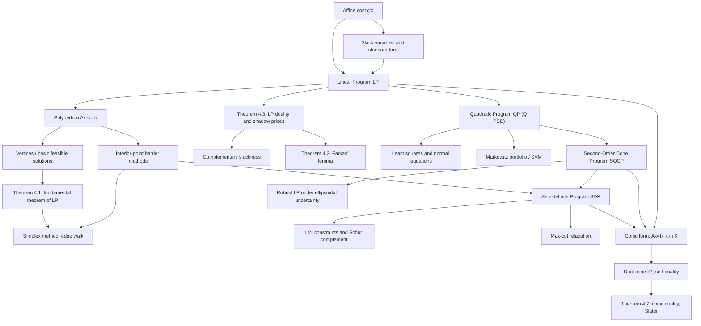

# Module 07 — Linear, Quadratic, and Conic Programs

Structured convex optimization is the study of problem classes whose algebraic form is restrictive enough to admit fast, reliable, globally optimal solvers, yet expressive enough to model an enormous range of engineering, economic, and machine-learning tasks. This module builds the four canonical classes from first principles: **linear programs (LP)** with affine objectives over polyhedra, **quadratic programs (QP)** with convex quadratic objectives, **second-order cone programs (SOCP)** with norm-cone constraints, and **semidefinite programs (SDP)** with linear matrix inequality constraints.

The organizing idea is the *convex hierarchy* $\text{LP} \subseteq \text{QP} \subseteq \text{SOCP} \subseteq \text{SDP}$, where each inclusion is witnessed by an explicit affine reformulation — zero curvature, an epigraph plus the rotated-cone identity, and an arrow-shaped matrix read through the Schur complement. Recognizing where a model sits tells you immediately which solver technology applies, what duality theory guarantees, and how expensive the solve will be.

Underneath all four sits one template. Writing the feasible set as $Ax = b$ with $x$ in a closed convex cone $\mathcal{K}$ gives the conic program, whose dual is governed by the dual cone $\mathcal{K}^\ast$. Because the nonnegative orthant, the second-order cone, and the PSD cone are each self-dual, primal and dual live in the same geometry, and one barrier-based interior-point engine solves the whole family.

Geometrically the module connects algebra to polyhedral and conic geometry: vertices and basic feasible solutions explain why the simplex method walks along edges, the fundamental theorem of LP explains why optima live at extreme points, and the central path explains how all four classes are solved in polynomial time by a single Newton-based framework.

> [!NOTE]
> Weak duality is free — for every feasible primal-dual pair, $c^\top x - b^\top y = s^\top x \ge 0$ with $s = c - A^\top y \in \mathcal{K}^\ast$ — so any dual-feasible point is a certified lower bound. Closing the gap is not free: LP closes it with no constraint qualification at all (Farkas' lemma), while a general conic program needs a Slater point, and SDPs without one can keep a strictly positive gap.

## Prerequisites and downstream modules

| Direction | Module | What it supplies or needs |
|---|---|---|
| Prerequisite | [linear_algebra/07 — Canonical Forms and SVD](../../linear_algebra/07_canonical_forms_and_svd/) | Symmetric eigendecomposition, the PSD square root $Q^{1/2}$, and pseudoinverses |
| Prerequisite | [optimization/06 — KKT Conditions and Duality](../06_kkt_conditions_and_duality/) | Lagrangians, KKT systems, weak and strong duality in general form |
| Also used | [optimization/01 — Problem Formulation and Convexity](../01_problem_formulation_and_convexity/) | Convex sets and cones, projection onto a closed convex set |
| Downstream | none inside this curriculum | This module is a terminal node of the optimization track |

## Learning outcomes

After working through this module you will be able to:

- Convert any LP between inequality and standard form with slacks and free-variable splitting, and say why the optimal value is unchanged.
- State and prove the fundamental theorem of linear programming, and explain why it makes vertex enumeration a correct (if exponential) algorithm.
- Write the dual of an LP, use complementary slackness to guess a dual solution from a primal one, and read the multipliers as shadow prices.
- State Farkas' lemma, prove it by projection onto a finitely generated cone, and use it to certify infeasibility.
- Recognize a convex QP, solve the equality-constrained case by one KKT linear solve, and identify least squares, ridge regression, SVMs, and mean-variance portfolios as instances.
- Form the dual cone of a given cone, prove self-duality of $\mathbb{R}^n_+$, $\mathcal{Q}^{k+1}$ and $\mathbb{S}^n_+$, and write the conic dual pair.
- Move a model up the hierarchy explicitly — QP to SOCP by epigraph plus rotated cone, SOCP to SDP by the arrow matrix and the Schur complement — and say which level is cheapest.
- Explain the central path, derive the exact duality gap $n/t$ for the log barrier, and measure the resulting convergence rate numerically.

## Concept map

## Notation

| Symbol | Meaning | Convention |
|---|---|---|
| $A^\top$ | transpose | `\top`, never `^T` |
| $\lVert x \rVert_2$ | Euclidean norm | `\lVert ... \rVert`, never `\Vert` |
| $A \succeq 0$, $A \succ 0$ | positive semidefinite, positive definite | Löwner order on $\mathbb{S}^n$ |
| $\mathcal{L}(x,\lambda)$ | Lagrangian | $\mathcal{L} = f + \lambda^\top h + \mu^\top g$, constraints enter with a plus |
| $\lambda$ | equality multipliers | free in sign; $\mu \succeq 0$ for inequalities |
| $y$ | LP dual variables | free in standard form; the shadow prices |
| $\mathcal{K}$, $\mathcal{K}^\ast$ | closed convex cone and its dual cone | $\mathcal{K}^\ast = \{s : s^\top x \ge 0 \ \forall x \in \mathcal{K}\}$ |
| $\mathcal{Q}^{k+1}$ | second-order (Lorentz) cone | $\{(u,t) : \lVert u \rVert_2 \le t\}$ |
| $\mathbb{S}^n$, $\mathbb{S}^n_+$ | symmetric matrices, PSD cone | inner product $\operatorname{tr}(SX)$ |
| $p^\star$, $d^\star$ | primal and dual optimal values | $d^\star \le p^\star$ always |
| $\binom{n}{m}$ | number of candidate bases | bound on the vertex count |

Sign convention follows [`docs/notation.md`](../../docs/notation.md): the Lagrangian carries constraints with a plus, so the sensitivity theorem reads $dp^\star/db = -\lambda^\star$. This differs from Boyd & Vandenberghe's letters ($\lambda$ for inequalities, $\nu$ for equalities); a reader holding Boyd open should swap them.

## Core results

| # | Result | Statement in brief | Where proved |
|---|---|---|---|
| Theorem 4.1 | Fundamental theorem of LP | If a standard-form LP attains its optimum, an extreme point attains it | Proof 5.1 |
| Theorem 4.2 | Farkas' lemma | Exactly one of $\{x \ge 0 : Ax = b\} \ne \varnothing$ and $\exists y$ with $A^\top y \le 0$, $b^\top y \gt 0$ | Proof 5.2 |
| Theorem 4.3 | LP duality | $b^\top y \le c^\top x$ always; equality iff every $x_j (c - A^\top y)_j$ vanishes | Proof 5.3, exercise L3.4 |
| Theorem 4.4 | QP optimality | $x^\star = -Q^{-1}c$ for $Q \succ 0$; equality-constrained QP is one KKT solve | Proof 5.4 |
| Theorem 4.5 | Schur complement lemma | For $A \succ 0$, $M \succeq 0 \iff C - B^\top A^{-1}B \succeq 0$ | Proof 5.5 |
| Theorem 4.6 | Self-dual cones | $(\mathbb{R}^n_+)^\ast = \mathbb{R}^n_+$, $(\mathcal{Q}^{k+1})^\ast = \mathcal{Q}^{k+1}$, $(\mathbb{S}^n_+)^\ast = \mathbb{S}^n_+$ | Proof 5.6 |
| Theorem 4.7 | Conic duality | Weak duality unconditional; strong duality under Slater (cited) | Proof 5.7 |
| Theorem 4.8 | The convex hierarchy | $\text{LP} \subseteq \text{QP} \subseteq \text{SOCP} \subseteq \text{SDP}$, each by an explicit affine embedding | Proof 5.8 |

## Common misconceptions

| Misconception | Mathematical reality | Correct mental model |
|---|---|---|
| *"An LP optimum can occur strictly inside the feasible region."* | A nonconstant affine function has a nonzero constant gradient, so it decreases along some feasible direction until a boundary is hit; Theorem 4.1 places an optimum at an extreme point whenever one exists. | Tilt a plane over a polyhedron: the lowest contact point is a vertex, or a face containing one. |
| *"The simplex method is polynomial because it is fast in practice."* | Klee-Minty cubes force simplex through $2^n$ vertices; its worst case is exponential, while interior-point methods carry polynomial guarantees. | Simplex is an excellent edge walk; barrier methods are the theoretically safe central-path followers. |
| *"Any quadratic objective gives a convex QP."* | Convexity requires $Q \succeq 0$; an indefinite $Q$ makes the problem NP-hard in general, and Section 7.6 shows the value running to $-\infty$. | Check eigenvalues first: the bowl must curve upward in every direction. |
| *"Slack variables change the optimal value of an LP."* | The map from $Ax \le b$ to $Ax + s = b$, $s \ge 0$ is a bijection between feasible sets that preserves the objective. | Slacks only *rename* the geometry: inequality distances become explicit nonnegative coordinates. |
| *"The dual multiplier is just an abstract certificate."* | By LP sensitivity, $y_i^\star$ equals the rate of change of the optimal value per unit of $b_i$ under nondegeneracy. | Dual variables are shadow prices: what you would pay for one more unit of a scarce resource. |
| *"The Schur complement lemma works for any PSD block."* | It needs $A \succ 0$. Section 7.6 exhibits $M$ with a nonnegative pseudo-inverse Schur complement and $\lambda_{\min}(M) \lt 0$. | Invertibility of the pivot block is what the congruence argument consumes. |
| *"SOCP and SDP are exotic classes unrelated to QP."* | Explicit embeddings exist: LP is QP with $Q = 0$; a QP is an SOCP via an epigraph and the rotated-cone identity; an SOCP constraint is the PSD condition on an arrow matrix. | One nested family of cones — orthant, second-order cone, PSD cone — with increasing expressive power. |
| *"Strong duality holds for conic programs the way it does for LP."* | LP enjoys strong duality whenever the primal value is finite, but SOCPs and SDPs can exhibit gaps without a strict-interior point. | For general cones, verify strict feasibility before trusting the dual bound as tight. |

## Exercise index

[`exercises.ipynb`](exercises.ipynb) holds 20 fully solved problems in four tiers.

| Tier | Count | Contents |
|---|---:|---|
| `L0 — Concept Checks` | 4 | Boundary optima; convexity is exactly $Q \succeq 0$; the hierarchy in one page; simplex fast in practice, exponential in theory |
| `L1 — Foundations` | 6 | Standard-form conversion; writing and checking an LP dual; vertices as basic feasible solutions; least squares and ridge as QPs; second-order and rotated cones; the Schur complement lemma |
| `L2 — Applications (AI/ML and Physics)` | 6 | Production planning and shadow prices; the diet problem and its dual; Markowitz portfolios; the SVM as a QP; the Chebyshev centre; robust least squares as an SOCP |
| `L3 — Challenge Proofs` | 4 | Extreme points equal basic feasible solutions; Chebyshev approximation and its dual; the max-cut SDP on a triangle; Farkas' lemma implies LP strong duality |

## Files

| File | Description |
|---|---|
| [`README.md`](README.md) | This file: overview, prerequisites, learning outcomes, concept map, notation, core results, misconceptions, exercise index, references. |
| [`first_principles.ipynb`](first_principles.ipynb) | Theory: ten sections, eight numbered theorems with full proofs (conic strong duality and strictness of $\text{SOCP} \subset \text{SDP}$ cited), three worked numerical examples, nine code cells, three figures. |
| [`exercises.ipynb`](exercises.ipynb) | 20 fully solved problems across the four tiers listed above. |

## References

1. **Boyd, S., & Vandenberghe, L.** (2004). *Convex Optimization*. Cambridge University Press. — Ch. 4 (LP, QP, SOCP, SDP forms and transformations); §5.9.1 (conic duality); App. A.5.5 (Schur complements).
2. **Bertsimas, D., & Tsitsiklis, J. N.** (1997). *Introduction to Linear Optimization*. Athena Scientific. — §4.6, Thm 4.6 (Farkas' lemma and LP duality by separation).
3. **Luenberger, D. G., & Ye, Y.** (2016). *Linear and Nonlinear Programming* (4th ed.). Springer. — §2.4, Thm 2.7 (fundamental theorem of LP); §4.2 (duality); Ch. 5 (interior-point methods).
4. **Dantzig, G. B.** (1963). *Linear Programming and Extensions*. Princeton University Press. — Ch. 5-7 (simplex, degeneracy resolution, duality).
5. **Nocedal, J., & Wright, S. J.** (2006). *Numerical Optimization* (2nd ed.). Springer. — Ch. 16, §16.1 (equality-constrained QP and KKT systems); Ch. 13-14 (simplex and interior-point methods).
6. **Ben-Tal, A., & Nemirovski, A.** (2001). *Lectures on Modern Convex Optimization*. SIAM. — Lect. 2, Thm 2.4.1 (conic duality theorem); Lect. 2-3 (expressive power of SOCP and SDP).
7. **Vandenberghe, L., & Boyd, S.** (1996). Semidefinite Programming. *SIAM Review*, 38(1), 49-95. — §4 (SDP duality, gaps, and unattained optima).
8. **Goemans, M. X., & Williamson, D. P.** (1995). Improved approximation algorithms for maximum cut and satisfiability problems using semidefinite programming. *Journal of the ACM*, 42(6), 1115-1145. — §3, Thm 3.3 (the $0.878$ rounding guarantee).
9. **Markowitz, H.** (1952). Portfolio Selection. *The Journal of Finance*, 7(1), 77-91. — Mean-variance optimization, the founding application of quadratic programming.
