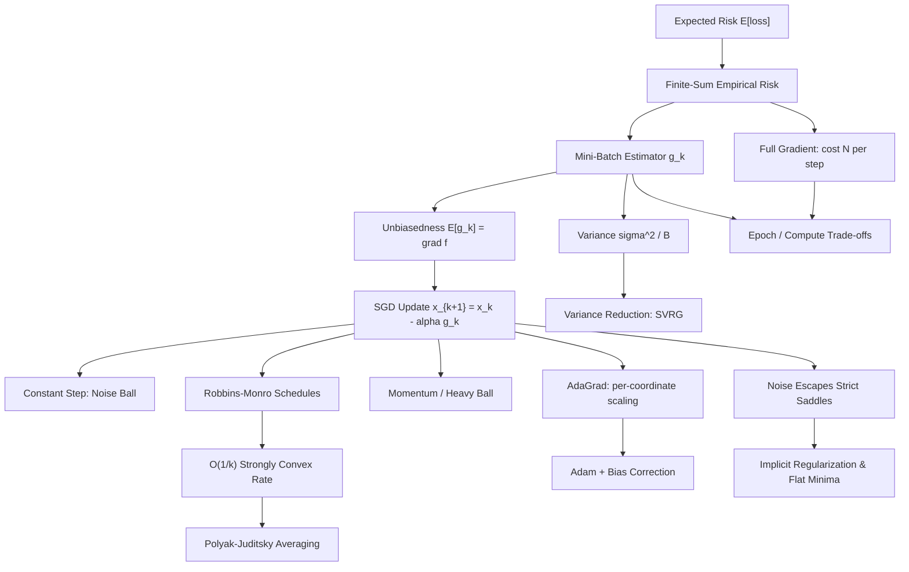

# Topic 08: Stochastic Optimization for Machine Learning

## 1. Master Overview

Modern machine learning trains models by minimizing an empirical risk that is a *finite sum* over millions of examples, $f(x) = \frac{1}{N}\sum_{i=1}^{N} f_i(x)$, standing in for an *expected risk* over an unknown data distribution. Computing one exact gradient costs a full pass over the dataset, which is wasteful when a small random subsample already points roughly downhill. Stochastic optimization replaces the exact gradient with a cheap, noisy, **unbiased** estimator and studies precisely how much noise the descent process can tolerate.

This module develops stochastic gradient descent (SGD) from first principles: the mini-batch estimator and its $1/B$ variance reduction, the one-step expected descent inequality on smooth objectives, the noise-ball behavior of constant step sizes, the Robbins-Monro step-size conditions and the resulting $O(1/k)$ rates on strongly convex problems, and the modern refinements that dominate practice: momentum, variance reduction (SVRG), and adaptive per-coordinate methods (AdaGrad, Adam) with their bias-correction derivation.

Beyond convergence rates, the module examines why stochasticity is a feature rather than a bug: gradient noise helps iterates escape strict saddle points in nonconvex landscapes, acts as an implicit regularizer that biases training toward flatter minima, and defines the epoch-versus-accuracy compute trade-offs that govern every large-scale training run.

> [!NOTE]
> The single most important identity in this module is $\mathbb{E}[g_k] = \nabla f(x_k)$: mini-batch gradients are unbiased. Everything else, the descent lemma, the noise ball, the step-size schedules, and Adam's bias correction, is an exercise in managing the *variance* around that unbiased mean.

## 2. First-Principles Framework

The framework treats training as noisy descent: a random estimator replaces the gradient, and analysis tracks how its mean drives progress while its variance taxes it:

- **Phenomenon**: Empirical risk gradients decompose as sample averages, so a random subsample of size $B$ yields a gradient estimate whose error is pure zero-mean noise with variance shrinking like $1/B$.
- **Goal**: Minimize a finite-sum or expected loss to a prescribed accuracy using the fewest per-example gradient evaluations, quantifying the bias-variance-compute trade-off of every update rule.
- **Governing equation(s)**: The SGD recursion $x_{k+1} = x_k - \alpha_k g_k$ with $\mathbb{E}[g_k \mid x_k] = \nabla f(x_k)$; the Robbins-Monro conditions $\sum_k \alpha_k = \infty$ and $\sum_k \alpha_k^2 \lt \infty$.
- **Formulation**: Under $L$-smoothness and bounded noise variance $\sigma^2$, the expected one-step descent $\mathbb{E}[f(x_{k+1})] \le f(x_k) - \alpha(1 - \tfrac{L\alpha}{2})\lVert \nabla f(x_k)\rVert^2 + \tfrac{L\alpha^2 \sigma^2}{2}$ splits progress into a deterministic descent term and a stochastic noise tax.
- **Consequence**: Constant steps converge linearly to a noise ball of radius proportional to $\alpha\sigma^2$; decreasing steps $\alpha_k = \Theta(1/k)$ achieve $O(1/k)$ error on strongly convex problems; control variates (SVRG) and adaptive scaling (Adam) reshape the noise to accelerate convergence.

## 3. Mermaid Concept Map

The map follows the flow from risk minimization through the stochastic estimator to the family of update rules and their convergence regimes:

## 4. Common Misconceptions

The table below records the errors that most often corrupt intuition about stochastic training:

| Misconception | Mathematical Reality | Correct Mental Model |
|---|---|---|
| *"SGD converges to the exact minimizer with any fixed step size."* | With constant $\alpha$, the expected squared distance converges linearly only to a noise ball of size $O(\alpha\sigma^2/\mu)$; the iterates then hover, never settling. | Constant-step SGD is a fast bus that stops one noise-ball radius away from the destination; shrinking steps walk the last stretch. |
| *"Bigger batches are always better because the gradient is more accurate."* | Variance falls like $1/B$ but cost per step grows like $B$, so variance-per-unit-compute is constant; beyond a critical batch size, extra samples buy almost no wall-clock progress. | Batch size trades gradient quality against number of updates; the optimum is a budget allocation, not a purity contest. |
| *"The Robbins-Monro conditions are technical bookkeeping."* | The condition $\sum_k \alpha_k = \infty$ ensures the iterates can travel arbitrarily far (no premature stall); $\sum_k \alpha_k^2 \lt \infty$ ensures the injected noise energy is finite (eventual quiet). | Infinite total fuel, finite total shaking: both are needed to arrive *and* to stop. |
| *"Adam's moment estimates are unbiased by construction."* | With zero initialization, $\mathbb{E}[v_k] = (1-\beta_2^k)\,\mathbb{E}[g^2]$ under stationarity, biased low by exactly the factor $1-\beta_2^k$; dividing by it is what removes the startup bias. | The exponential average starts from an artificial zero; bias correction rescales early estimates to full strength. |
| *"Gradient noise is purely harmful and should be eliminated."* | Isotropic noise gives the iterate a nonzero component along escape directions of strict saddles, and the resulting dynamics bias SGD toward flatter, better-generalizing minima. | Noise is a built-in exploration mechanism: it shakes the iterate off ridges and out of narrow sharp valleys. |
| *"SVRG's snapshot gradient makes its estimator biased."* | The control variate $\nabla f_i(x) - \nabla f_i(\tilde{x}) + \nabla f(\tilde{x})$ has expectation exactly $\nabla f(x)$, and its variance vanishes as both points approach the optimum. | Subtract a correlated, known-mean quantity: the mean is preserved while the fluctuation cancels. |
| *"The last iterate is always the best iterate to return."* | On strongly convex problems with decreasing steps, the Polyak-Juditsky average of the iterates attains the statistically optimal asymptotic rate, often beating the noisy last iterate. | Averaging filters the residual noise: the trajectory oscillates, but its center of mass converges smoothly. |

## 5. Directory Inventory

This module contains the following core files:

| File | Description |
|---|---|
| [`first_principles.ipynb`](first_principles.ipynb) | Markdown-only theory notebook: finite-sum and expected risk, mini-batch unbiasedness and the $1/B$ variance law, SGD and Robbins-Monro schedules, complete proofs of the descent inequality, constant-step noise-ball and $O(1/k)$ rates, SVRG control variates, momentum, AdaGrad and Adam with the bias-correction derivation, saddle escape, and compute trade-offs. |
| [`exercises.ipynb`](exercises.ipynb) | 20 fully solved problems in four levels: concept checks on unbiasedness and schedules, foundation drills (variance computations, noise-ball radii, AdaGrad and momentum steps), applied ML problems (epoch costs, batch-size trade-offs, warmup schedules, Adam vs SGD on ill-conditioned quadratics, label-noise floors), and challenge proofs (Polyak averaging, last-iterate gaps, mirror descent, saddle escape). |

## 6. References

Primary sources, ordered from the founding stochastic-approximation paper to modern practice:

1. **Robbins, H., & Monro, S.** (1951). A Stochastic Approximation Method. *Annals of Mathematical Statistics*, 22(3), 400-407.
   - The founding paper of stochastic approximation and the step-size conditions bearing their names.
2. **Bottou, L., Curtis, F. E., & Nocedal, J.** (2018). Optimization Methods for Large-Scale Machine Learning. *SIAM Review*, 60(2), 223-311.
   - Sections 4-5: SGD analysis, noise ball, batching, and variance-reduction methods.
3. **Kingma, D. P., & Ba, J.** (2015). Adam: A Method for Stochastic Optimization. *ICLR 2015*.
   - Sections 2-3: the update rule and the bias-correction derivation.
4. **Nesterov, Y.** (2004). *Introductory Lectures on Convex Optimization*. Kluwer.
   - Chapter 2: smoothness, strong convexity, and the accelerated rates stochastic methods target.
5. **Polyak, B. T., & Juditsky, A. B.** (1992). Acceleration of Stochastic Approximation by Averaging. *SIAM Journal on Control and Optimization*, 30(4), 838-855.
   - Iterate averaging and its asymptotically optimal covariance.
6. **Johnson, R., & Zhang, T.** (2013). Accelerating Stochastic Gradient Descent using Predictive Variance Reduction. *NeurIPS 2013*.
   - The SVRG estimator and its linear convergence on strongly convex finite sums.
7. **Goodfellow, I., Bengio, Y., & Courville, A.** (2016). *Deep Learning*. MIT Press.
   - Chapter 8: optimization for training deep models: SGD, momentum, adaptive methods, and batch effects.
