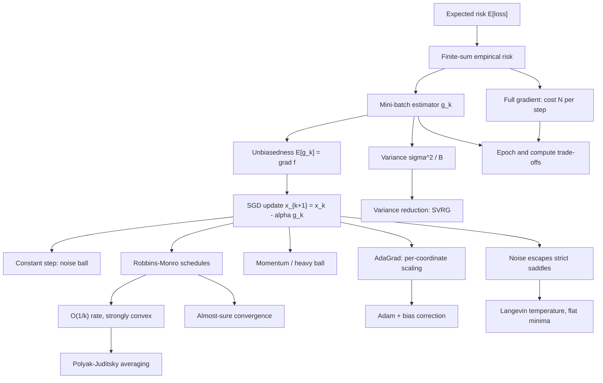

# Module 08 — Stochastic Optimization for Machine Learning

Machine learning minimizes an empirical risk that is a *finite sum* over millions of examples,
$f(\mathbf{x}) = \frac{1}{N}\sum_{i=1}^{N} f_i(\mathbf{x})$, standing in for an *expected risk* over an
unknown data distribution. One exact gradient costs a full pass over the dataset — absurd when a small
random subsample already points downhill with quantifiable accuracy. Stochastic optimization replaces the
exact gradient with a cheap, noisy, **unbiased** estimator and asks precisely how much noise a descent
process can tolerate.

This module develops stochastic gradient descent from first principles: the mini-batch estimator and its
$1/B$ variance law, the one-step expected descent inequality on smooth objectives, the noise ball that a
constant step size cannot escape, the Robbins-Monro conditions and both the $O(1/k)$ rate in expectation
and the almost-sure convergence they were invented to deliver, and the refinements that dominate practice:
momentum, variance reduction (SVRG), and per-coordinate preconditioning (AdaGrad, Adam) with its bias
correction derived rather than asserted.

Beyond rates, the module examines why stochasticity is a feature. Gradient noise turns SGD into an
overdamped Langevin diffusion at temperature $\alpha\sigma^2/B$, which escapes strict saddles, biases
training toward flatter minima, and makes every learning-rate schedule simultaneously an annealing
schedule.

> [!NOTE]
> The single most important identity in this module is $\mathbb{E}[\mathbf{g}_k] = \nabla f(\mathbf{x}_k)$:
> mini-batch gradients are unbiased, and their variance is exactly $\sigma^2/B$. Everything else — the
> descent inequality, the noise ball, the step-size schedules, Adam's bias correction — is an exercise in
> managing the *variance* around that unbiased mean.

## Prerequisites

| Direction | Module | Why |
|---|---|---|
| Requires | [`probability_statistics/08` — Law of Large Numbers and the CLT](../../probability_statistics/08_law_of_large_numbers_and_clt/) | Sample means, their $\sigma^2/n$ variance, and convergence in probability versus almost surely. |
| Requires | [`optimization/03` — Gradient Descent and Convergence](../03_gradient_descent_and_convergence/) | $L$-smoothness, strong convexity, the descent lemma, and the deterministic rates this module perturbs. |
| Downstream | [`information_theory/06` — Information Theory in Deep Learning](../../information_theory/06_information_theory_in_deep_learning/) | Training objectives whose optimization is the stochastic machinery developed here. |

## Learning outcomes

After this module you will be able to:

- Prove that a uniformly sampled mini-batch gradient is unbiased and has variance exactly $\sigma^2/B$,
  and state the finite-population correction for sampling without replacement.
- Derive the expected descent inequality for $L$-smooth objectives and read off why a constant step size
  cannot converge to the minimizer.
- Compute the noise-ball height $L\alpha\sigma_B^2/(2\mu)$ and choose among decaying $\alpha$, raising
  $B$, and variance reduction to lower it.
- Prove the $O(1/k)$ rate for $\alpha_k = 1/(\mu k)$ on strongly convex objectives, with the correct
  constant, and exhibit the counterexample that rules out a smaller one.
- Prove almost-sure convergence under the Robbins-Monro conditions using the Robbins-Siegmund lemma, and
  say which condition each hypothesis buys.
- Derive Adam's bias correction and momentum's effective step size and averaging window, and predict the
  failure modes of omitting either.
- Read a training curve as a noise ball, and size batch, learning rate and warmup from the linear scaling
  rule and the gradient noise scale.

## Concept map

## Notation

| Symbol | Meaning | Convention |
|---|---|---|
| $f = \frac1N\sum_i f_i$ | empirical risk over $N$ examples | $F$ denotes the expected risk |
| $\mathbf{g}_k$ | stochastic gradient at step $k$ | unbiased: $\mathbb{E}[\mathbf{g}_k \mid \mathcal{F}_k] = \nabla f(\mathbf{x}_k)$ |
| $\mathcal{F}_k$ | $\sigma$-algebra of everything up to step $k$ | conditioning is always on $\mathcal{F}_k$ |
| $B$, $\sigma^2$, $\sigma_B^2$ | batch size, per-example gradient variance, batch variance | $\sigma_B^2 = \sigma^2/B$ |
| $\alpha_k$ | step size (learning rate) at step $k$ | written $\alpha$ throughout the `optimization` area |
| $L$, $\mu$, $\kappa$ | smoothness constant, strong-convexity modulus, condition number | $\mu I \preceq \nabla^2 f \preceq L I$, $\kappa = L/\mu$ |
| $\mathbf{x}^{*}$, $f^{*}$ | minimizer and minimum value | $\nabla f(\mathbf{x}^{*}) = \mathbf{0}$ |
| $\beta_1$, $\beta_2$, $\varepsilon$ | Adam's moment decays and denominator offset | $\varepsilon$ sits **outside** the square root |
| $\lVert \cdot \rVert$ | Euclidean norm | $\lVert \mathbf{x} \rVert^2 = \mathbf{x}^\top\mathbf{x}$ |

## Core results

| Result | Statement | Where |
|---|---|---|
| Theorem 4.1 — unbiasedness and the $1/B$ law | $\mathbb{E}[\mathbf{g}_{\mathcal{B}}] = \nabla f$ and $\mathbb{E}\lVert \mathbf{g}_{\mathcal{B}}-\nabla f\rVert^2 = \sigma^2/B$; without replacement, times $\frac{N-B}{N-1}$ | [`first_principles.ipynb`](first_principles.ipynb) §4, Proof 5.1 |
| Theorem 4.2 — expected descent | $\mathbb{E}[f(\mathbf{x}_{k+1})] \le f(\mathbf{x}_k) - \alpha(1-\tfrac{L\alpha}{2})\lVert \nabla f\rVert^2 + \tfrac{L\alpha^2\sigma_B^2}{2}$ | §4, Proof 5.2 |
| Theorem 4.3 — noise ball | $\mathbb{E}[f(\mathbf{x}_k)]-f^{*} \le (1-\alpha\mu)^k(f(\mathbf{x}_0)-f^{*}) + \tfrac{L\alpha\sigma_B^2}{2\mu}$ | §4, Proof 5.3 |
| Theorem 4.4 — $O(1/k)$ rate | $\alpha_k = 1/(\mu k) \implies \mathbb{E}\lVert \mathbf{x}_k-\mathbf{x}^{*}\rVert^2 \le 2G^2/(\mu^2k)$, and the constant $2$ is sharp | §4, Proof 5.4 |
| Theorem 4.5 — Robbins-Monro | admissible $\{\alpha_k\}$, unique minimizer, bounded second moments $\implies \mathbf{x}_k \to \mathbf{x}^{*}$ almost surely | §4, Lemma 4.11, Proof 5.5 |
| Theorem 4.6 — nonconvex rate | $\tfrac1K\sum_k\mathbb{E}\lVert \nabla f(\mathbf{x}_k)\rVert^2 \le \tfrac{4L\Delta_0}{K} + 2\sigma_B\sqrt{\tfrac{2L\Delta_0}{K}}$ | §4, Proof 5.6 |
| Theorem 4.7 — SVRG | variance $\le 4L[(f(\mathbf{x})-f^{*})+(f(\tilde{\mathbf{x}})-f^{*})]$, hence a linear rate | §4, Proof 5.7 |
| Theorem 4.8 — momentum | $\alpha_{\mathrm{eff}} = \alpha/(1-\beta)$ and an effective window of $\frac{1+\beta}{1-\beta}$ samples | §4, Proof 5.8 |
| Theorem 4.9 — Adam bias correction | $\mathbb{E}[\mathbf{v}_k] = (1-\beta_2^k)\,\mathbb{E}[\mathbf{g}^{\odot2}]$ under stationarity | §4, Proof 5.9 |
| Theorem 4.10 — Polyak-Juditsky | $\sqrt{K}(\bar{\mathbf{x}}_K-\mathbf{x}^{*}) \xrightarrow{d} \mathcal{N}(\mathbf{0}, H^{-1}\Sigma H^{-1})$ (cited; 1-D case proved in L3.1) | §4 |

## Common misconceptions

| Misconception | Mathematical reality | Correct mental model |
|---|---|---|
| *"SGD converges to the exact minimizer with any fixed step size."* | With constant $\alpha$ the expected gap converges linearly only to a noise ball of size $O(\alpha\sigma_B^2/\mu)$; the iterates then hover, never settling. | Constant-step SGD is a fast bus that stops one noise-ball radius from the destination; shrinking steps walk the last stretch. |
| *"Bigger batches are always better because the gradient is more accurate."* | Variance falls like $1/B$ but cost per step grows like $B$, so accuracy per unit compute is constant; beyond the critical batch size extra samples buy almost no wall-clock progress. | Batch size trades gradient quality against number of updates; the optimum is a budget allocation, not a purity contest. |
| *"The Robbins-Monro conditions are technical bookkeeping."* | $\sum_k \alpha_k = \infty$ forbids a stalled trajectory (Proof 5.5, Step 3); $\sum_k \alpha_k^2 \lt \infty$ makes the injected noise summable (Step 2). Drop either and the theorem fails. | Infinite total fuel, finite total shaking: both are needed to arrive *and* to stop. |
| *"Adam's moment estimates are unbiased by construction."* | With zero initialization $\mathbb{E}[\mathbf{v}_k] = (1-\beta_2^k)\,\mathbb{E}[\mathbf{g}^{\odot2}]$ under stationarity, biased low by exactly that factor. | The exponential average starts from an artificial zero; the correction rescales early estimates to full strength. |
| *"Gradient noise is purely harmful and should be eliminated."* | Noise gives the iterate a nonzero component along escape directions of strict saddles, and the resulting Gibbs measure favours flat basins by $(\det H)^{-1/2}$. | Noise is a built-in exploration mechanism: it shakes the iterate off ridges and out of narrow valleys. |
| *"SVRG's snapshot gradient makes its estimator biased."* | The control variate $\nabla f_i(\mathbf{x}) - \nabla f_i(\tilde{\mathbf{x}}) + \nabla f(\tilde{\mathbf{x}})$ has expectation exactly $\nabla f(\mathbf{x})$, and its variance vanishes as both points approach the optimum. | Subtract a correlated quantity of known mean: the mean is preserved while the fluctuation cancels. |
| *"The last iterate is always the best iterate to return."* | On strongly convex problems the Polyak-Juditsky average attains the statistically optimal asymptotic covariance, while the last iterate keeps an $O(\alpha)$ noise floor. | Averaging filters residual noise: the trajectory oscillates, but its centre of mass converges smoothly. |

## Exercise index

[`exercises.ipynb`](exercises.ipynb) holds 20 fully solved problems, every numeric answer recomputed in a
code cell that ran.

| Tier | Count | Contents |
|---|---|---|
| L0 — Concept Checks | 4 | Unbiasedness of a mini-batch, whether constant-step SGD reaches the minimizer, which $k^{-p}$ schedules are admissible, why Adam needs bias correction. |
| L1 — Foundations | 6 | Gradient noise of a four-example finite sum, sizing the noise ball, partial sums of a schedule, three AdaGrad steps by hand, one Adam step with and without correction, momentum's effective step and averaging window. |
| L2 — Applications (AI/ML and Physics) | 7 | GD versus SGD versus SVRG budgets, the linear scaling rule and critical batch size, a warmup-plus-cosine schedule, SGD versus Adam on an ill-conditioned quadratic, the loss floor imposed by label noise, SGD as Langevin dynamics with Kramers escape times, and the escape-time calculation at a strict saddle. |
| L3 — Challenge Proofs | 3 | Polyak averaging beats the last iterate exactly, the $O(1/\sqrt{K})$ rate for convex SGD via the averaged iterate, stochastic mirror descent on the simplex as exponentiated gradient. |

## References

1. **Robbins, H., & Monro, S.** (1951). A Stochastic Approximation Method. *Annals of Mathematical
   Statistics*, 22(3), 400-407. The founding paper of stochastic approximation and the step-size
   conditions bearing their names.
2. **Robbins, H., & Siegmund, D.** (1971). A Convergence Theorem for Non Negative Almost Supermartingales
   and Some Applications. In *Optimizing Methods in Statistics*, 233-257. Theorem 1 (pp. 233-235) is
   Lemma 4.11 of the theory notebook.
3. **Bottou, L., Curtis, F. E., & Nocedal, J.** (2018). Optimization Methods for Large-Scale Machine
   Learning. *SIAM Review*, 60(2), 223-311. §4.2-4.4 (SGD analysis and the noise ball) and §5.1
   (variance reduction).
4. **Nemirovski, A., Juditsky, A., Lan, G., & Shapiro, A.** (2009). Robust Stochastic Approximation
   Approach to Stochastic Programming. *SIAM Journal on Optimization*, 19(4), 1574-1609, §2.2.
5. **Nesterov, Y.** (2004). *Introductory Lectures on Convex Optimization*. Kluwer. §2.1.1 (Thm 2.1.5)
   for smoothness and §2.1.3 for strong convexity.
6. **Polyak, B. T., & Juditsky, A. B.** (1992). Acceleration of Stochastic Approximation by Averaging.
   *SIAM Journal on Control and Optimization*, 30(4), 838-855, Thm 2 and Thm 4 (pp. 845-849).
7. **Johnson, R., & Zhang, T.** (2013). Accelerating Stochastic Gradient Descent using Predictive Variance
   Reduction. *NeurIPS 2013*, §2-3: the SVRG estimator and its linear rate.
8. **Duchi, J., Hazan, E., & Singer, Y.** (2011). Adaptive Subgradient Methods. *JMLR*, 12, 2121-2159,
   §1-3: AdaGrad.
9. **Kingma, D. P., & Ba, J.** (2015). Adam: A Method for Stochastic Optimization. *ICLR 2015*, §2-3:
   the update rule and the bias-correction derivation.
10. **Mandt, S., Hoffman, M. D., & Blei, D. M.** (2017). Stochastic Gradient Descent as Approximate
    Bayesian Inference. *JMLR*, 18(134), §2-4: the Langevin temperature $\alpha\sigma^2/B$.
11. **Goodfellow, I., Bengio, Y., & Courville, A.** (2016). *Deep Learning*. MIT Press, Ch. 8:
    optimization for training deep models.
