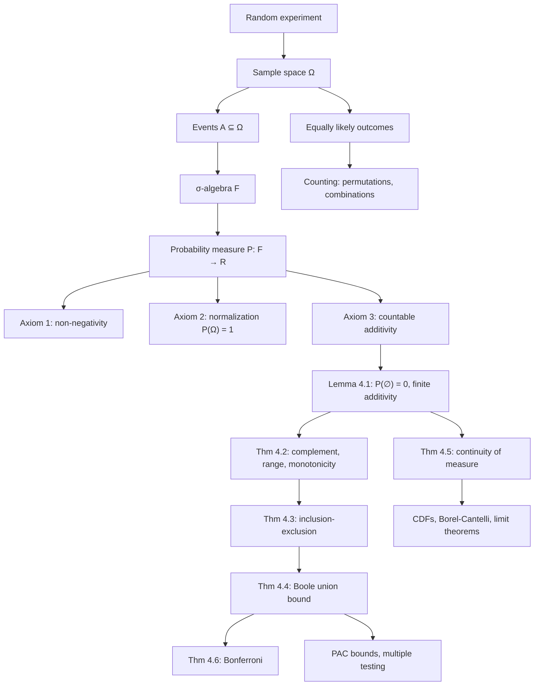

# Module 01 — Sample Spaces and Probability Axioms

Probability theory begins with a deceptively simple question: how do we assign consistent numerical degrees of uncertainty to the outcomes of an experiment? The answer, formalized by Kolmogorov in 1933, rests on three ingredients — a **sample space** $\Omega$ collecting every possible outcome, a **$\sigma$-algebra** $\mathcal{F}$ of measurable events, and a **probability measure** $\mathbb{P}$ obeying three axioms. Everything else in probability and statistics — conditional probability, random variables, limit theorems, Bayesian inference — is derived from this triple $(\Omega, \mathcal{F}, \mathbb{P})$.

The axiomatic approach exists because its two predecessors fail. The classical rule $\mathbb{P}(A) = \lvert A \rvert / \lvert \Omega \rvert$ presupposes that outcomes are "equally likely", which is itself a probabilistic notion, and says nothing on infinite or asymmetric spaces. The frequentist limit $\lim_n n_A/n$ names an empirical hypothesis, not a mathematical object. Kolmogorov's axioms invert the logic: they *define* a probability measure, and long-run frequency becomes a theorem.

From non-negativity, normalization, and countable additivity alone this module derives the complement rule, monotonicity, the general $n$-event inclusion–exclusion identity, Boole's union bound, Bonferroni's inequality, and continuity of measure along monotone sequences of events. Each is proved with its hypotheses stated, and each is checked numerically on a space small enough to verify by hand.

For AI and machine learning this is bedrock. A language model's next-token distribution is a probability measure on a finite vocabulary; a generative model defines a measure on image space; PAC-learning guarantees are Boole's inequality applied to failure events; the Bonferroni correction is the same inequality applied to multiple comparisons.

> [!NOTE]
> Kolmogorov's three axioms — non-negativity, $\mathbb{P}(\Omega) = 1$, and countable additivity over pairwise disjoint events — are the complete logical foundation of probability. Every familiar rule (complement, monotonicity, inclusion–exclusion, union bound, continuity) is a **theorem**, not an extra assumption. In particular $\mathbb{P}(A) \le 1$ is derived, not assumed.

## Prerequisites

- [`../../mathematical_reasoning/02_sets_relations_and_functions/`](../../mathematical_reasoning/02_sets_relations_and_functions/) — set algebra, De Morgan's laws, countability.
- [`../../mathematical_reasoning/05_combinatorics_and_counting/`](../../mathematical_reasoning/05_combinatorics_and_counting/) — the multiplication principle, permutations, binomial coefficients.

**Downstream.** [`../02_conditional_probability_and_bayes/`](../02_conditional_probability_and_bayes/) builds conditioning on top of this measure; [`../03_random_variables_and_distribution_functions/`](../03_random_variables_and_distribution_functions/) needs continuity of measure to define a CDF.

## Learning outcomes

- State the Kolmogorov axioms precisely, and explain why the classical and frequentist "definitions" fail as foundations.
- Prove $\mathbb{P}(\emptyset)=0$ *before* using finite additivity, and explain why the reverse order is circular.
- Derive the complement rule, monotonicity, $n$-event inclusion–exclusion, Boole's union bound, Bonferroni's inequality, and continuity of measure from the axioms alone.
- Identify where finiteness of $\mathbb{P}$, disjointness, or countable (rather than merely finite) additivity is doing real work in a proof.
- Exhibit a finitely additive set function that is not countably additive, and show which theorem it breaks.
- Apply the union bound and Bonferroni to reliability budgets, PAC generalization bounds, and multiple-comparison corrections.
- Estimate a probability by Monte Carlo and predict its error from $\sqrt{\mathbb{P}(1-\mathbb{P})/n}$.

## Concept map

## Notation

| Symbol | Meaning | Convention |
|---|---|---|
| $\Omega$ | sample space, the set of all outcomes | not the asymptotic $\Omega$ of `mathematical_reasoning` |
| $\omega$ | a single outcome, $\omega \in \Omega$ | |
| $\mathcal{F}$ | $\sigma$-algebra of events | events are exactly the members of $\mathcal{F}$ |
| $A, B, A_i$ | events, $A \in \mathcal{F}$ | |
| $A^c$ | complement of $A$ in $\Omega$ | |
| $\mathbb{P}$ | probability measure, $\mathbb{P} : \mathcal{F} \to \mathbb{R}$ | `\mathbb{P}`, never a bare $P$ |
| $(\Omega, \mathcal{F}, \mathbb{P})$ | probability space | |
| $A_n \uparrow A$, $B_n \downarrow B$ | monotone limits of events | union and intersection respectively |
| $\mathbf{1}_A$ | indicator function of $A$ | |
| $(n)_k$, $\binom{n}{k}$ | falling factorial, binomial coefficient | never $P(n,k)$ |

## Core results

| Result | Statement | Hypotheses |
|---|---|---|
| Lemma 4.1 | $\mathbb{P}(\emptyset) = 0$ and $\mathbb{P}\left(\bigcup_{i=1}^n A_i\right) = \sum_{i=1}^n \mathbb{P}(A_i)$ | $A_i$ pairwise disjoint; $\mathbb{P}(\emptyset)=0$ proved first |
| Theorem 4.2 | $\mathbb{P}(A^c) = 1 - \mathbb{P}(A)$; $0 \le \mathbb{P}(A) \le 1$; $\mathbb{P}(B \setminus A) = \mathbb{P}(B) - \mathbb{P}(A)$ | difference rule needs $A \subseteq B$ |
| Theorem 4.3 | $\mathbb{P}\left(\bigcup_{i=1}^n A_i\right) = \sum_{k=1}^n (-1)^{k+1} \sum_{\lvert S\rvert = k} \mathbb{P}(A_S)$ | $n$ finite; no disjointness, no independence |
| Theorem 4.4 | $\mathbb{P}\left(\bigcup_i A_i\right) \le \sum_i \mathbb{P}(A_i)$ | countable index set; arbitrary dependence |
| Theorem 4.5 | $A_n \uparrow A \Rightarrow \mathbb{P}(A_n) \uparrow \mathbb{P}(A)$; $B_n \downarrow B \Rightarrow \mathbb{P}(B_n) \downarrow \mathbb{P}(B)$ | monotone sequence; decreasing case uses $\mathbb{P}(B_1) \lt \infty$ |
| Theorem 4.6 | $\mathbb{P}\left(\bigcap_{i=1}^n A_i\right) \ge \sum_{i=1}^n \mathbb{P}(A_i) - (n-1)$ | arbitrary dependence; vacuous unless events are near-certain |

## Common misconceptions

| Misconception | Mathematical reality | Correct mental model |
|---|---|---|
| *"Probability zero means impossible."* | On $[0,1]$ every single point has probability 0, yet some point always occurs. | Impossible means $A = \emptyset$; probability zero is a statement about measure, not membership. |
| *"Every subset of $\Omega$ is an event."* | The Vitali construction gives a subset of $[0,1)$ that no translation-invariant countably additive measure can size. | Events are exactly the members of $\mathcal{F}$, chosen so the axioms are satisfiable. |
| *"$\mathbb{P}(A \cup B) = \mathbb{P}(A) + \mathbb{P}(B)$."* | Additivity requires disjointness; otherwise the sum overshoots by exactly $\mathbb{P}(A \cap B)$. | Use inclusion–exclusion, and use additivity only after checking $A \cap B = \emptyset$. |
| *"Finite additivity is enough; countable additivity is a technicality."* | Natural density on $\mathbb{N}$ is finitely additive with $d(\mathbb{N})=1$ and $d(\{k\})=0$ for every $k$ — continuity of measure fails outright. | Countable additivity is what lets probability commute with limits of events. |
| *"Finite additivity is an immediate special case of Axiom 3."* | The padding argument inserts infinitely many copies of $\emptyset$, so it needs $\mathbb{P}(\emptyset)=0$ first — deriving $\mathbb{P}(\emptyset)=0$ from it is circular. | Prove $\mathbb{P}(\emptyset)=0$ from the sequence $\emptyset,\emptyset,\ldots$, then pad. |
| *"Outcomes are always equally likely."* | $\mathbb{P}(A) = \lvert A\rvert/\lvert\Omega\rvert$ is a modeling choice justified by a symmetry argument. | Equal likelihood is an assumption to defend, not a law. |
| *"The union bound is nearly tight."* | At $p = 0.02$ and $n = 80$ the bound is $1.6$ against a true $0.801$. | It is a rare-event tool, informative only while $\sum_i \mathbb{P}(A_i) \ll 1$. |

## Exercise index

| Tier | Count | Topics |
|---|---:|---|
| L0 — Concept Checks | 3 | probability zero vs. impossible, the complement rule is forced, monotonicity and the conjunction fallacy |
| L1 — Foundations | 6 | inclusion–exclusion and a card deck, die events with De Morgan, the birthday problem, Boole and a reliability budget, counting committees and full houses, continuity and vanishing tails |
| L2 — Applications (AI/ML and Physics) | 6 | PAC union bound, Bonferroni for model comparisons, spin-system microstates and entropy *(physics)*, reliability exact vs. bound, nucleus sampling as conditioning, the Born rule as a Kolmogorov measure *(physics)* |
| L3 — Challenge Proofs | 5 | derangements and $1/e$, first Borel–Cantelli, finite additivity + continuity $\iff$ countable additivity, Bonferroni inequalities by indicators, the Vitali non-measurable set |

**Total: 20 problems**, every numeric answer recomputed by a code cell in [`exercises.ipynb`](exercises.ipynb).

## Files

| File | Contents |
|---|---|
| [`README.md`](README.md) | This page. |
| [`first_principles.ipynb`](first_principles.ipynb) | Theory: intuition and the disjointification figure, definitions, six main results with hypotheses, full proofs, five hand-worked examples, eight code cells and three figures, applications. |
| [`exercises.ipynb`](exercises.ipynb) | 20 fully solved problems in four tiers, each with statement, intuition, stepwise solution, boxed answer, takeaway, and a verifying code cell. |

## References

- **Kolmogorov, A. N.** *Foundations of the Theory of Probability* (1933), Ch. I §§1–2 and Ch. II §1 — the original axiomatization and the continuity axiom.
- **Blitzstein, J. K., & Hwang, J.** *Introduction to Probability*, 2nd ed., Ch. 1 §§1.2–1.6 (Thm 1.6.2, inclusion–exclusion).
- **Ross, S.** *A First Course in Probability*, 10th ed., Ch. 1; Ch. 2 §§2.2–2.5 (Prop. 4.4, Boole's inequality).
- **Casella, G., & Berger, R. L.** *Statistical Inference*, 2nd ed., §§1.1–1.2 (Thms 1.2.8–1.2.11; Bonferroni in §1.2.3).
- **Wasserman, L.** *All of Statistics*, Ch. 1 §§1.2–1.5 (Thm 1.8, continuity of probability).
- **Billingsley, P.** *Probability and Measure*, 3rd ed., §§1–3 (Thm 2.1 Carathéodory extension; Thm 3.1 non-measurable sets).
- **Bertsekas, D., & Tsitsiklis, J.** *Introduction to Probability*, 2nd ed., Ch. 1 §§1.1–1.2.
