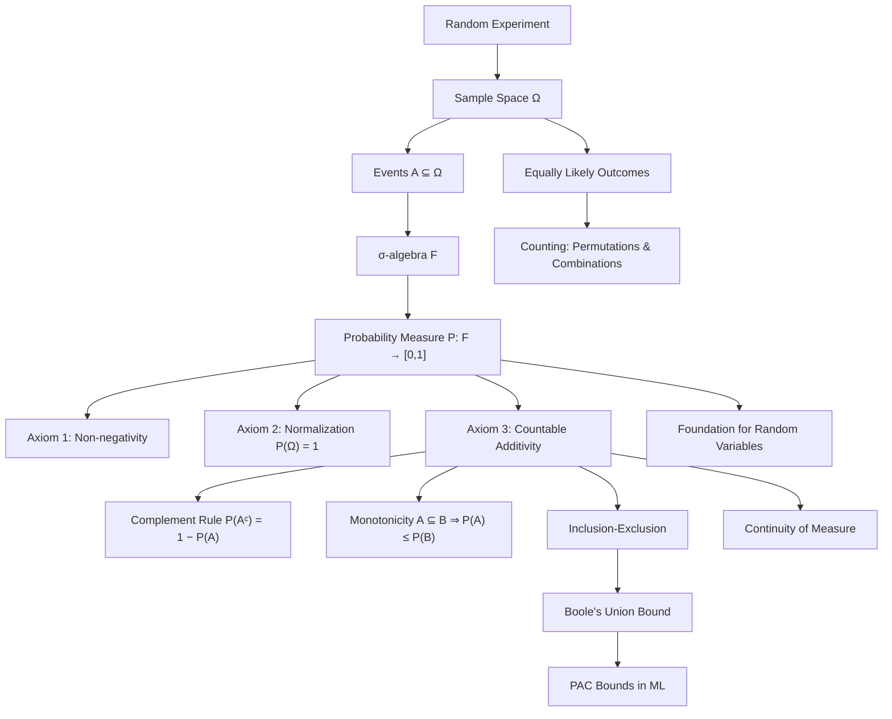

# Topic 01: Sample Spaces and Probability Axioms

## 1. Master Overview

Probability theory begins with a deceptively simple question: how do we assign consistent numerical degrees of belief to uncertain outcomes? The answer, formalized by Kolmogorov in 1933, rests on three ingredients — a **sample space** $\Omega$ collecting every possible outcome of an experiment, a **$\sigma$-algebra** $\mathcal{F}$ of measurable events, and a **probability measure** $P$ obeying three axioms. Everything else in probability and statistics — conditional probability, random variables, limit theorems, Bayesian inference — is derived from this triple $(\Omega, \mathcal{F}, P)$.

The axiomatic approach replaces vague intuitions about "chance" with a rigorous calculus. Non-negativity, normalization, and countable additivity are the only assumptions; from them we deduce the complement rule, monotonicity, inclusion-exclusion, Boole's union bound, and continuity of probability measures. These derived rules are the daily workhorses of applied modeling, from reliability engineering to the union bounds that underpin generalization guarantees in statistical learning theory.

For AI and machine learning, this topic is the bedrock of everything probabilistic: a language model's next-token distribution is a probability measure on a finite sample space of vocabulary items; a generative model defines a measure on image space; PAC learning bounds are Boole inequalities applied to failure events.

> [!NOTE]
> Kolmogorov's three axioms — non-negativity, $P(\Omega) = 1$, and countable additivity over disjoint events — are the complete logical foundation of probability. Every familiar rule (complement, inclusion-exclusion, union bound) is a theorem, not an extra assumption.

## 2. First-Principles Framework

- **Phenomenon**: Repeatable experiments (coin flips, sensor noise, user clicks) produce outcomes that are individually unpredictable yet statistically regular in aggregate.
- **Goal**: Build a consistent numerical calculus of uncertainty — a function assigning each event a number in $[0, 1]$ such that logically related events receive logically related probabilities.
- **Governing Equation**: For pairwise disjoint events $A_1, A_2, \ldots$ the measure must satisfy countable additivity, $P\left(\bigcup_{i=1}^{\infty} A_i\right) = \sum_{i=1}^{\infty} P(A_i)$.
- **Formulation**: A probability space is a triple $(\Omega, \mathcal{F}, P)$ where $\mathcal{F}$ is a $\sigma$-algebra (closed under complement and countable union) and $P: \mathcal{F} \to [0,1]$ satisfies the three Kolmogorov axioms.
- **Consequence**: All classical rules — $P(A^c) = 1 - P(A)$, monotonicity, inclusion-exclusion, the union bound — follow as short theorems, and counting formulas (permutations, combinations) implement the measure on finite equally-likely spaces.

## 3. Mermaid Concept Map

## 4. Common Misconceptions

| Misconception | Mathematical Reality | Correct Mental Model |
|---|---|---|
| *"Probability zero means impossible."* | On continuous spaces, $P(X = x) = 0$ for every single point yet some point always occurs. | Probability-zero events can occur; "impossible" means the event is empty, $A = \emptyset$. |
| *"Every subset of $\Omega$ is an event."* | On uncountable spaces (e.g. $[0,1]$ with Lebesgue measure) non-measurable sets exist; $\mathcal{F}$ must be restricted to a $\sigma$-algebra. | Events are exactly the members of $\mathcal{F}$, chosen so the axioms can hold consistently. |
| *"Additivity holds for any events: $P(A \cup B) = P(A) + P(B)$."* | Additivity requires disjointness; overlapping events double-count the intersection. | Use inclusion-exclusion: $P(A \cup B) = P(A) + P(B) - P(A \cap B)$. |
| *"Finite additivity is enough; countable additivity is a technicality."* | Without countable additivity, limits of events lose meaning and continuity of measure fails, breaking CDFs and limit theorems. | Countable additivity is what lets probability interact with limits — the engine behind $F_X$, LLN, and CLT. |
| *"Outcomes are always equally likely."* | The classical rule $P(A) = \lvert A \rvert / \lvert \Omega \rvert$ is a modeling choice valid only under symmetry. | Equal likelihood is an assumption to justify (dice symmetry), not a law; general measures assign unequal weights. |
| *"$P(A) + P(A^c)$ may exceed 1 if events are 'strongly likely'."* | $A$ and $A^c$ partition $\Omega$, so additivity plus normalization force $P(A) + P(A^c) = 1$ exactly. | Complementary probabilities always balance to 1 — a hard constraint, not a tendency. |

## 5. Directory Inventory

| File | Description |
|---|---|
| [`README.md`](README.md) | Master overview, first-principles framework, concept map, misconceptions, references. |
| [`first_principles.ipynb`](first_principles.ipynb) | Markdown-only theory notebook: intuition, rigorous definitions ($\sigma$-algebras, Kolmogorov axioms), full proofs of the derived rules, computational insights, and AI/physics applications. |
| [`exercises.ipynb`](exercises.ipynb) | 20 fully solved problems in 4 levels: Concept Check (4), Foundation (6), Applications in AI/ML & Physics (6), Challenge (4). |

## 6. References

- **Kolmogorov, A. N.** *Foundations of the Theory of Probability* (1933) — the original axiomatization.
- **Blitzstein, J. K., & Hwang, J.** *Introduction to Probability*, 2nd ed. (Chapter 1: Probability and Counting).
- **Ross, S.** *A First Course in Probability*, 10th ed. (Chapters 1–2: Combinatorial Analysis, Axioms of Probability).
- **Casella, G., & Berger, R. L.** *Statistical Inference*, 2nd ed. (Chapter 1: Probability Theory).
- **Wasserman, L.** *All of Statistics* (Chapter 1: Probability).
- **Billingsley, P.** *Probability and Measure*, 3rd ed. (Sections 1–4: measure-theoretic foundations).
- **Bertsekas, D., & Tsitsiklis, J.** *Introduction to Probability*, 2nd ed. (Chapter 1: Sample Space and Probability).
