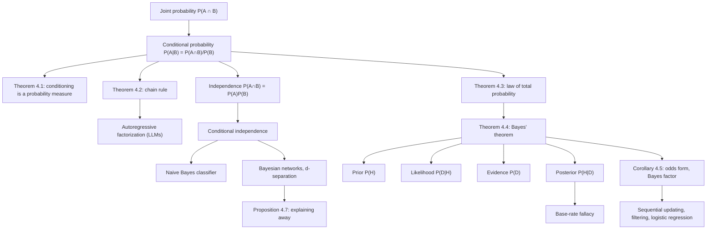

# Module 02 — Conditional Probability and Bayes' Theorem

Conditional probability answers the central question of learning from evidence: how should the probability of an event change once we know that another event has occurred? The definition $P(A \mid B) = P(A \cap B)/P(B)$ formalizes a simple geometric idea — conditioning restricts the sample space to $B$ and renormalizes. From this single definition flow the chain rule, the law of total probability, statistical independence, and Bayes' theorem, the engine of all rational belief updating.

Bayes' theorem inverts conditional probabilities: it converts the *likelihood* $P(\text{data} \mid \text{hypothesis})$, which forward models naturally provide, into the *posterior* $P(\text{hypothesis} \mid \text{data})$, which decision-makers actually need. The inversion is subtle. Confusing the two directions is the prosecutor's fallacy, and neglecting the prior is the base-rate fallacy that makes a test with sensitivity $0.95$ and specificity $0.90$ yield a posterior below $9\%$ for a disease of prevalence $1\%$.

In machine learning, conditional probability is not one topic among many; it is the organizing principle. Classifiers model $P(y \mid \mathbf{x})$, language models factor sequence probability by the chain rule, naive Bayes and Bayesian networks are engineered conditional-independence structures, and every Bayesian method from spam filtering to variational inference is Bayes' theorem operationalized at scale.

> [!NOTE]
> **Bayes' theorem.** For a finite or countable partition $\{B_i\}$ with $P(B_i) \gt 0$ and any
> event $A$ with $P(A) \gt 0$, the posterior is
> $P(B_j \mid A) = P(A \mid B_j)\,P(B_j) \big/ \sum_i P(A \mid B_i)\,P(B_i)$.
> It follows from the definition of conditioning and countable additivity alone — no extra
> postulate — and its three ingredients (prior, likelihood, evidence) are exactly the components
> of modern probabilistic machine learning.

## Prerequisites

- [`probability_statistics/01 — Sample Spaces and Probability Axioms`](../01_sample_spaces_and_probability_axioms/) — Kolmogorov axioms, events, $\sigma$-algebras, countable additivity, inclusion–exclusion.
- [`mathematical_reasoning/05 — Combinatorics and Counting`](../../mathematical_reasoning/05_combinatorics_and_counting/) — the counting arguments used for the deck and coin examples.

**Downstream.** [`probability_statistics/03 — Random Variables`](../03_random_variables_and_distribution_functions/) inherits the chain rule for joint laws; [`probability_statistics/09 — Maximum Likelihood and MAP`](../09_maximum_likelihood_and_map_estimation/) and [`probability_statistics/10 — Bayesian Inference`](../10_bayesian_inference/) extend Bayes' theorem from a finite hypothesis set to parametric models; [`information_theory/05 — Mutual Information`](../../information_theory/05_mutual_information/) measures the dependence that conditioning creates or destroys.

## Learning outcomes

After this module you can:

- Compute $P(A \mid B)$ from a joint description and explain it as restrict-and-renormalize.
- Prove that $A \mapsto P(A \mid B)$ is a probability measure, and use it to transport any unconditional identity to a conditioned one.
- Factor a joint probability with the chain rule in any prescribed order, and recognize the factorization as the autoregressive model of a sequence.
- Apply the law of total probability over a finite or countable partition, and state exactly which hypothesis fails when the family is not a partition.
- Derive Bayes' theorem from the definition of conditioning, and its odds form from two applications of it.
- Quantify the base-rate fallacy: given prevalence, sensitivity and specificity, compute the posterior after one or several positive tests.
- Distinguish independence from conditional independence in both directions, and explain explaining-away (collider bias) on a three-node graph.
- Estimate a conditional probability by rejection sampling, and predict its $n^{-1/2}$ error rate.

## Concept map

## Notation

| Symbol | Meaning | Notes |
|---|---|---|
| $P(A)$ | probability of the event $A$ | written $\mathbb{P}(A)$ in `docs/notation.md`; this area uses the lighter $P$ |
| $P(A \mid B)$ | probability of $A$ given $B$, defined for $P(B) \gt 0$ | `\mid`, never a raw pipe |
| $A^c$, $A \cap B$, $A \cup B$ | complement, intersection, union | events in $\mathcal{F}$ |
| $\{B_i\}_{i \in I}$ | partition of $\Omega$: disjoint, exhaustive, each of positive probability | $I$ finite or countable |
| $A \perp\!\!\!\perp B$ | $A$ and $B$ independent | product rule $P(A \cap B) = P(A)P(B)$ |
| $A \perp\!\!\!\perp B \mid C$ | conditionally independent given $C$ | product rule under $P(\cdot \mid C)$ |
| $O(H) = P(H)/P(H^c)$ | odds of $H$ | finite and nonzero for $0 \lt P(H) \lt 1$ |
| $\operatorname{BF}(D) = P(D \mid H)/P(D \mid H^c)$ | Bayes factor of the evidence $D$ | the likelihood ratio |
| $\operatorname{logit}(p) = \log\frac{p}{1-p}$ | log-odds; inverse $\sigma(z) = 1/(1+e^{-z})$ | evidence adds in this scale |
| $p(\theta \mid x)$ | posterior density | limit of conditioning on shrinking strips |

## Core results

| # | Result | Statement | Hypotheses |
|---|---|---|---|
| Theorem 4.1 | conditioning is a measure | $A \mapsto P(A \mid B)$ is a probability measure with $P(B \mid B) = 1$ | $P(B) \gt 0$ |
| Theorem 4.2 | chain rule | $P(A_1 \cap \cdots \cap A_n) = \prod_k P(A_k \mid A_1 \cap \cdots \cap A_{k-1})$ | $P(A_1 \cap \cdots \cap A_{n-1}) \gt 0$ |
| Theorem 4.3 | law of total probability | $P(A) = \sum_{i \in I} P(A \mid B_i) P(B_i)$ | $\{B_i\}$ a finite or countable partition |
| Theorem 4.4 | Bayes' theorem | $P(B_j \mid A) = P(A \mid B_j) P(B_j) / \sum_i P(A \mid B_i) P(B_i)$ | partition, and $P(A) \gt 0$ |
| Corollary 4.5 | odds form | posterior odds $=$ Bayes factor $\times$ prior odds | $0 \lt P(H) \lt 1$, $P(D \mid H^c) \gt 0$ |
| Proposition 4.6 | Bayes for densities | $p(\theta \mid x) \propto p(x \mid \theta) p(\theta)$, as a limit over shrinking strips | joint density continuous in $x$, $f_X(x) \gt 0$ |
| Proposition 4.7 | explaining away | $P(A \mid S \cap E) = p \lt \frac{1}{2-p} = P(A \mid S)$ for $S = A \cup E$ | $A \perp\!\!\!\perp E$, $P(A) = P(E) = p \in (0,1)$ |

## Common misconceptions

| Misconception | Mathematical reality | Correct mental model |
|---|---|---|
| *"$P(A \mid B)$ and $P(B \mid A)$ are the same thing."* | They differ by the ratio of marginals: $P(A \mid B) = P(B \mid A)\,P(A)/P(B)$. | Transposing the conditional (prosecutor's fallacy) can be off by orders of magnitude when base rates are asymmetric. |
| *"A 95%-accurate test means a positive result is 95% likely to be true."* | With sensitivity $=$ specificity $= 0.95$ and prevalence $0.01$, $P(D \mid +) = \frac{0.95 \times 0.01}{0.95 \times 0.01 + 0.05 \times 0.99} \approx 0.161$; drop the specificity to $0.90$ and it falls to $19/217 \approx 0.088$. | Rare conditions generate more false positives from the healthy majority than true positives from the sick minority; specificity, not accuracy, is the lever. |
| *"Disjoint (mutually exclusive) events are independent."* | If $A \cap B = \emptyset$ with $P(A), P(B) \gt 0$, then $P(A \cap B) = 0 \ne P(A)P(B)$. | Disjointness is extreme *dependence*: knowing $A$ occurred tells you $B$ certainly did not. |
| *"Pairwise independence implies mutual independence."* | Two fair coins with $C =$ "the results agree" are pairwise independent yet $P(A \cap B \cap C) = 1/4 \ne 1/8$. | Mutual independence requires the product rule for *every* sub-collection, not just pairs. |
| *"Independence is preserved under conditioning."* | Proposition 4.7: independent causes become dependent given their common effect. | Conditioning on a collider opens a dependence path — and selection into a sample is a collider. |
| *"Conditional independence implies independence."* | Two flips of a coin of unknown bias satisfy $X \perp\!\!\!\perp Y \mid \Theta$, yet $P(X{=}1, Y{=}1) = 0.34 \ne 0.25$. | Naive Bayes assumes the conditional statement, which says nothing about the marginal one. |
| *"The Monty Hall doors are 50–50 after a door opens."* | The host's constrained choice is informative: $P(C_2 \mid H_3) = 2/3$. | Condition on the mechanism that generated the observation, not on the surface fact revealed. |

## Exercise index

[`exercises.ipynb`](exercises.ipynb) contains 20 fully solved problems.

| Tier | Count | Contents |
|---|---|---|
| L0 — Concept Checks | 4 | renormalization on a die; disjoint vs independent; transposed conditionals; the complement rule under conditioning |
| L1 — Foundations | 6 | cards without replacement; two factories; Monty Hall from the mechanism; pairwise vs mutual independence; odds-form sequential update; gambler's ruin by first-step analysis |
| L2 — Applications (AI/ML and Physics) | 6 | naive Bayes spam filter; precision, recall and prevalence; chain rule and perplexity; explaining away in a Bayesian network; the canonical ensemble by conditioning; two-detector sensor fusion |
| L3 — Challenge Proofs | 4 | the two-child paradox and observation mechanisms; Simpson's paradox constructed and resolved; Borel's paradox and null-event conditioning; the Dutch-book proof that Bayes' rule is the unique coherent update |

The two physics problems in L2 are the canonical ensemble (L2.5) and sensor fusion (L2.6).

## References

- Blitzstein, J. K., & Hwang, J. *Introduction to Probability*, 2nd ed. — Ch. 2 (§2.2 definition, §2.3 Bayes' rule, §2.7 Monty Hall).
- Ross, S. *A First Course in Probability*, 10th ed. — Ch. 3, §3.2–3.4 (conditional probability, Bayes' formula, independence).
- Casella, G., & Berger, R. L. *Statistical Inference*, 2nd ed. — §1.3 (Thm 1.3.5, Bayes' rule), §1.3.4 (independence).
- Wasserman, L. *All of Statistics* — §1.6–1.7 (Thm 1.17 and the Bayes corollary).
- Bishop, C. M. *Pattern Recognition and Machine Learning* — §1.2 (sum and product rules), §8.2 (d-separation).
- Murphy, K. P. *Probabilistic Machine Learning: An Introduction* — Ch. 2, §2.1–2.3 (base rates, naive Bayes), §4.2.
- Pearl, J. *Probabilistic Reasoning in Intelligent Systems* — §1.2, §3.3 (d-separation, explaining away).
- Kolmogorov, A. N. *Foundations of the Theory of Probability* — Ch. V (conditional probabilities on null events).
- Jaynes, E. T. *Probability Theory: The Logic of Science* — Ch. 1–2 (Cox's theorem), Ch. 15 (paradoxes of conditioning).
