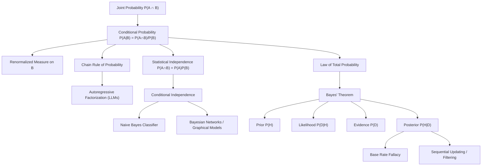

# Topic 02: Conditional Probability and Bayes' Theorem

## 1. Master Overview

Conditional probability answers the central question of learning from evidence: how should the probability of an event change once we know that another event has occurred? The definition $P(A \mid B) = P(A \cap B)/P(B)$ formalizes a simple geometric idea — conditioning restricts the sample space to $B$ and renormalizes. From this single definition flow the chain rule, the law of total probability, the notion of statistical independence, and Bayes' theorem, the engine of all rational belief updating.

Bayes' theorem inverts conditional probabilities: it converts the *likelihood* $P(\text{data} \mid \text{hypothesis})$, which forward models naturally provide, into the *posterior* $P(\text{hypothesis} \mid \text{data})$, which decision-makers actually need. This inversion is subtle — confusing the two directions is the prosecutor's fallacy, and neglecting the prior is the base rate fallacy that makes a 95%-sensitive medical test yield only a 9% posterior for a rare disease.

In machine learning, conditional probability is not one topic among many; it is the organizing principle. Classifiers model $P(y \mid \mathbf{x})$, language models factor sequence probability by the chain rule, naive Bayes and Bayesian networks are engineered conditional independence structures, and every Bayesian method from spam filtering to variational autoencoders is Bayes' theorem operationalized at scale.

> [!NOTE]
> Bayes' theorem, $P(H \mid D) = P(D \mid H)\,P(H)/P(D)$, is the unique consistent rule for updating beliefs under new evidence. Its three ingredients — prior, likelihood, and evidence — map exactly onto the components of modern probabilistic machine learning.

## 2. First-Principles Framework

- **Phenomenon**: Partial information changes uncertainty — knowing a card is red changes the probability it is a heart from $1/4$ to $1/2$.
- **Goal**: Define a consistent rule for revising probabilities given known events, and use it to invert cause-effect reasoning (from observed effects back to hidden causes).
- **Governing Equation**: $P(A \mid B) = \dfrac{P(A \cap B)}{P(B)}$ for $P(B) > 0$, which yields Bayes' theorem $P(B_j \mid A) = \dfrac{P(A \mid B_j)\,P(B_j)}{\sum_i P(A \mid B_i)\,P(B_i)}$.
- **Formulation**: Conditioning restricts $\Omega$ to $B$ and rescales by $1/P(B)$ so the axioms hold on the reduced space; $P(\cdot \mid B)$ is itself a full probability measure.
- **Decomposition**: The chain rule $P(A_1 \cap \cdots \cap A_n) = \prod_k P(A_k \mid A_1, \ldots, A_{k-1})$ factors any joint model into sequential conditionals — the mathematical skeleton of autoregressive models.

## 3. Mermaid Concept Map

## 4. Common Misconceptions

| Misconception | Mathematical Reality | Correct Mental Model |
|---|---|---|
| *"$P(A \mid B)$ and $P(B \mid A)$ are the same thing."* | They differ by the ratio of marginals: $P(A \mid B) = P(B \mid A)\,P(A)/P(B)$. | Transposing the conditional (prosecutor's fallacy) can be off by orders of magnitude when base rates are asymmetric. |
| *"A 95%-accurate test means a positive result is 95% likely to be true."* | The posterior depends on prevalence: with $P(D) = 0.01$, $P(D \mid +) \approx 0.088$. | Rare conditions generate more false positives from the healthy majority than true positives from the sick minority. |
| *"Disjoint (mutually exclusive) events are independent."* | If $A \cap B = \emptyset$ with $P(A), P(B) > 0$, then $P(A \cap B) = 0 \ne P(A)P(B)$. | Disjointness is extreme *dependence*: knowing $A$ occurred tells you $B$ certainly did not. |
| *"Pairwise independence implies mutual independence."* | Bernstein's example: three pairwise-independent events whose triple intersection breaks the product rule. | Mutual independence requires the product rule for *every* sub-collection, not just pairs. |
| *"Independence is preserved under conditioning."* | Two independent causes typically become dependent given a common effect (explaining away / collider bias). | Conditioning on a collider opens a dependence path — central to causal graphical models. |
| *"The Monty Hall doors are 50–50 after a door opens."* | The host's constrained choice is informative: switching wins with probability $2/3$. | Condition on the full mechanism generating the observation, not just on the surface fact revealed. |

## 5. Directory Inventory

| File | Description |
|---|---|
| [`README.md`](README.md) | Master overview, first-principles framework, concept map, misconceptions, references. |
| [`first_principles.ipynb`](first_principles.ipynb) | Markdown-only theory notebook: conditioning as renormalization, chain rule, total probability, Bayes' theorem with full proofs, independence structures, and AI/physics applications. |
| [`exercises.ipynb`](exercises.ipynb) | 20 fully solved problems in 4 levels: Concept Check (4), Foundation (6), Applications in AI/ML & Physics (6), Challenge (4). |

## 6. References

- **Blitzstein, J. K., & Hwang, J.** *Introduction to Probability*, 2nd ed. (Chapter 2: Conditional Probability — the "soul of statistics").
- **Ross, S.** *A First Course in Probability*, 10th ed. (Chapter 3: Conditional Probability and Independence).
- **Casella, G., & Berger, R. L.** *Statistical Inference*, 2nd ed. (Sections 1.3–1.4: Conditional Probability and Independence).
- **Wasserman, L.** *All of Statistics* (Chapter 1: Probability, Sections on independence and Bayes).
- **Bishop, C. M.** *Pattern Recognition and Machine Learning* (Sections 1.2, 8.2: Probability rules, conditional independence, d-separation).
- **Murphy, K. P.** *Probabilistic Machine Learning: An Introduction* (Chapter 2: Probability — univariate models).
- **Pearl, J.** *Probabilistic Reasoning in Intelligent Systems* (Chapters 1–3: Bayesian networks and conditional independence).
- **Jaynes, E. T.** *Probability Theory: The Logic of Science* (Chapters 1–4: probability as extended logic).
