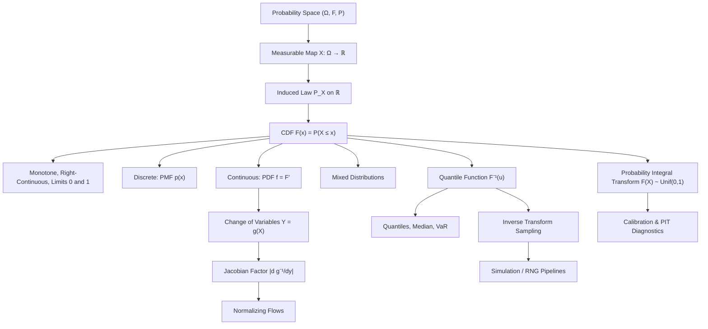

# Topic 03: Random Variables and Distribution Functions

## 1. Master Overview

A random variable is the bridge between abstract probability spaces and numerical analysis: a measurable function $X: \Omega \to \mathbb{R}$ that ships probability mass from outcomes to the real line. Once outcomes become numbers, the entire machinery of calculus applies — we can integrate, differentiate, transform, and simulate. The central object is the **cumulative distribution function** $F_X(x) = P(X \le x)$, which encodes the complete probabilistic identity of $X$ in a single monotone right-continuous function.

Discrete variables are described by probability mass functions, continuous ones by densities $f_X = F_X'$; both are shadows of the same CDF. The quantile function $F_X^{-1}$ inverts this description and delivers the two most useful practical tools of the topic: the **inverse transform sampling** method (feed uniform noise through $F^{-1}$ to simulate any distribution) and the **change-of-variables formula** (track how densities warp under transformations $Y = g(X)$).

These are not merely theoretical constructs. Every random number your GPU generates flows through an inverse-CDF or transformation algorithm; normalizing flows in deep generative modeling are the multivariate change-of-variables formula turned into an architecture; and quantile functions underpin value-at-risk in finance and calibrated uncertainty in ML.

> [!NOTE]
> The CDF $F_X$ characterizes a distribution completely — discrete, continuous, or mixed. The density $f_X$ exists only in the continuous case and is *not* a probability: it can exceed 1, and only its integrals over sets are probabilities.

## 2. First-Principles Framework

- **Phenomenon**: Raw outcomes (card identities, particle configurations, user sessions) are not numbers; analysis, averaging, and computation require numerical summaries whose randomness is inherited from the experiment.
- **Goal**: Transport the probability measure from $(\Omega, \mathcal{F}, P)$ to the real line, obtaining distributions we can integrate, transform, and sample.
- **Governing Equation**: $F_X(x) = P(X \le x)$, with $f_X(x) = \dfrac{dF_X}{dx}$ in the continuous case and $P(a \lt X \le b) = F_X(b) - F_X(a)$ always.
- **Formulation**: $X$ must be measurable — $\{X \le x\} \in \mathcal{F}$ for every $x$ — so that the induced law $P_X(B) = P(X \in B)$ is a probability measure on $(\mathbb{R}, \mathcal{B})$.
- **Transformation**: For $Y = g(X)$ with $g$ monotone and differentiable, the density warps by the Jacobian factor: $f_Y(y) = f_X(g^{-1}(y)) \left\lvert \dfrac{d}{dy} g^{-1}(y) \right\rvert$.

## 3. Mermaid Concept Map

## 4. Common Misconceptions

| Misconception | Mathematical Reality | Correct Mental Model |
|---|---|---|
| *"A random variable is random."* | $X$ is a deterministic function $\Omega \to \mathbb{R}$; the randomness lives in which $\omega$ occurs. | "Random variable" = fixed numerical query applied to a random outcome. |
| *"The density $f_X(x)$ is the probability that $X = x$."* | For continuous $X$, $P(X = x) = 0$ for every $x$, and densities can exceed 1 (e.g. $\text{Unif}(0, 0.1)$ has $f = 10$). | $f_X(x)\,dx$ approximates $P(x \lt X \le x + dx)$; only integrals are probabilities. |
| *"Every distribution is either discrete or continuous."* | Mixed laws exist, e.g. rainfall: an atom at 0 plus a continuous part; their CDFs jump and slope. | The CDF is the universal object; PMF/PDF are special-case derivatives of it. |
| *"CDFs are continuous."* | $F_X$ is only guaranteed right-continuous; jumps of size $P(X = x)$ occur at atoms. | Jump heights are point masses: $P(X = x) = F(x) - F(x^-)$. |
| *"To transform a density, just substitute: $f_Y(y) = f_X(g^{-1}(y))$."* | Omitting the Jacobian $\lvert d g^{-1}/dy \rvert$ breaks normalization whenever $g$ stretches or compresses space. | Densities are mass per unit length; stretching the axis dilutes them — the Jacobian is the bookkeeping. |
| *"$F(X)$ has a complicated distribution depending on $F$."* | For continuous $F$, the probability integral transform gives $F(X) \sim \text{Unif}(0,1)$ exactly. | Every continuous distribution is uniform noise viewed through its own quantile lens. |

## 5. Directory Inventory

| File | Description |
|---|---|
| [`README.md`](README.md) | Master overview, first-principles framework, concept map, misconceptions, references. |
| [`first_principles.ipynb`](first_principles.ipynb) | Markdown-only theory notebook: measurability, CDF properties with full proofs, PMF/PDF, quantile functions, probability integral transform, change of variables, and applications. |
| [`exercises.ipynb`](exercises.ipynb) | 20 fully solved problems in 4 levels: Concept Check (4), Foundation (6), Applications in AI/ML & Physics (6), Challenge (4). |

## 6. References

- **Blitzstein, J. K., & Hwang, J.** *Introduction to Probability*, 2nd ed. (Chapters 3, 5: Random Variables; Continuous Random Variables).
- **Ross, S.** *A First Course in Probability*, 10th ed. (Chapters 4–5: Random Variables; Continuous Random Variables).
- **Casella, G., & Berger, R. L.** *Statistical Inference*, 2nd ed. (Chapters 1.5–1.6, 2.1: Distribution Functions, Transformations).
- **Wasserman, L.** *All of Statistics* (Chapter 2: Random Variables).
- **Billingsley, P.** *Probability and Measure*, 3rd ed. (Sections 12–14: measurable maps, distribution functions).
- **Devroye, L.** *Non-Uniform Random Variate Generation* (Chapter 2: inversion method).
- **Papamakarios, G., et al.** *Normalizing Flows for Probabilistic Modeling and Inference*, JMLR 2021 (change of variables in deep generative models).
