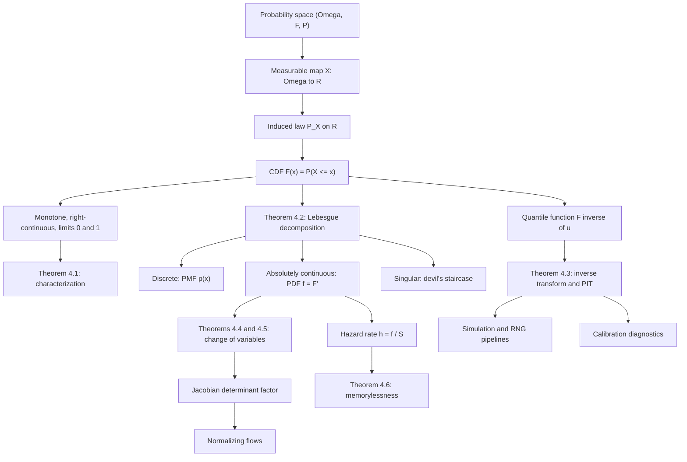

# Module 03 — Random Variables and Distribution Functions

A random variable is the bridge between an abstract probability space and numerical analysis: a
measurable function $X: \Omega \to \mathbb{R}$ that ships probability mass from outcomes to the real
line. Once outcomes become numbers, the whole machinery of calculus applies — we can integrate,
differentiate, transform and simulate. The central object is the **cumulative distribution
function** $F_X(x) = P(X \le x)$, which encodes the complete probabilistic identity of $X$ in one
monotone, right-continuous function.

Discrete variables are described by probability mass functions and absolutely continuous ones by
densities $f_X = F_X'$; both are shadows of the same CDF. A third possibility exists — a CDF that is
continuous yet has zero derivative almost everywhere — and the Lebesgue decomposition organizes all
three into one statement. The quantile function $F_X^{-1}$ inverts the description and delivers the
module's two workhorses: **inverse transform sampling** (feed uniform noise through $F^{-1}$ to
simulate any law) and the **change-of-variables formula** (track how densities warp under
$Y = g(X)$).

These are not merely theoretical constructs. Every random number a GPU generates flows through an
inverse-CDF or transformation algorithm; normalizing flows in deep generative modelling are the
multivariate change-of-variables formula turned into an architecture; and quantile functions
underpin value-at-risk in finance and calibrated uncertainty in machine learning.

> [!NOTE]
> A function is the CDF of *some* random variable exactly when it is non-decreasing,
> right-continuous, and runs from $0$ to $1$ — and the witness is explicit: $X = F^{-1}(U)$ with
> $U \sim \text{Unif}(0,1)$ on the unit interval. That single construction is both the existence
> half of the characterization theorem and the universal sampling algorithm.

## Prerequisites

| Needed before this module | Why |
|---|---|
| [`calculus/05_indefinite_and_definite_integrals`](../../calculus/05_indefinite_and_definite_integrals/) | Densities are defined by an integral, and the change-of-variables formula is substitution. |
| [`probability_statistics/02_conditional_probability_and_bayes`](../02_conditional_probability_and_bayes/) | Conditional probability is used for hazard rates and memorylessness. |
| [`probability_statistics/01_sample_spaces_and_probability_axioms`](../01_sample_spaces_and_probability_axioms/) | Continuity of measure along monotone sequences drives every CDF property. |

**Downstream** — modules this one unlocks:

| Module | What it takes from here |
|---|---|
| [`probability_statistics/04_discrete_distributions`](../04_discrete_distributions/) | PMF/CDF correspondence and the generalized quantile for discrete samplers. |
| [`probability_statistics/05_continuous_distributions`](../05_continuous_distributions/) | Densities, transformations, and one family derived from another. |
| [`probability_statistics/06_expectation_variance_and_moments`](../06_expectation_variance_and_moments/) | Integration against a law rather than against an abstract measure. |
| [`probability_statistics/07_joint_distributions_and_multivariate_normal`](../07_joint_distributions_and_multivariate_normal/) | The $d$-dimensional Jacobian formula, applied to joint laws. |

## Learning outcomes

After this module you can:

- Decide whether a given function is a CDF, and, when it is, name the random variable that realizes it.
- Read atoms, densities and gaps off the shape of a CDF, and compute $P(X = x)$, $P(a \lt X \le b)$ and $P(X \lt x)$ without confusing endpoints.
- Write down the generalized inverse $F^{-1}$ for a law with flat stretches or jumps, and use it to sample.
- Apply the probability integral transform in both directions: simulate from any law, and diagnose a mis-calibrated forecaster from a PIT histogram.
- Transform a density through a monotone map, a piecewise-monotone map, and a $d$-dimensional diffeomorphism, keeping the Jacobian correct.
- State the Lebesgue decomposition and exhibit a law in each of its three corners, including a singular one.
- Recognize constant hazard as the defining property of the exponential law.

## Concept map

## Notation

| Symbol | Meaning | First used |
|---|---|---|
| $(\Omega, \mathcal{F}, P)$ | Probability space: outcomes, events, measure | Definition 3.1 |
| $X, Y, Z$ | Random variables; $Z$ reserved for standard normal noise | Definition 3.1 |
| $P_X$ | Induced law (pushforward of $P$ through $X$) on $(\mathbb{R}, \mathcal{B})$ | Definition 3.2 |
| $F_X$, $F$ | Cumulative distribution function $P(X \le x)$ | Definition 3.3 |
| $F(x^-)$ | Left limit $\lim_{y \uparrow x} F(y)$, equal to $P(X \lt x)$ | Definition 3.3 |
| $p_X$ | Probability mass function $P(X = x)$ | Definition 3.4 |
| $f_X$, $f$ | Probability density function, $F_X'$ | Definition 3.5 |
| $F^{-1}$ | Generalized inverse (quantile function) $\inf\{x : F(x) \ge u\}$ | Definition 3.7 |
| $S$ | Survival function $1 - F$ | Definition 3.8 |
| $h$ | Hazard rate $f / S$ | Definition 3.8 |
| $\varphi$, $\Phi$ | Standard normal density and CDF | Proof 5.5 |
| $J_g$ | Jacobian matrix of $g$; $\det J_g$ its determinant | Theorem 4.5 |
| $U$ | A $\text{Unif}(0,1)$ random variable | Theorem 4.3 |

## Core results

| Result | Statement | Where |
|---|---|---|
| Theorem 4.1 | $F$ is a CDF $\iff$ non-decreasing, right-continuous, limits $0$ and $1$; and $P(X=x) = F(x) - F(x^-)$ | [`first_principles.ipynb`](first_principles.ipynb) §4, proved §5 |
| Theorem 4.2 | $F = aF_{\text{disc}} + bF_{\text{ac}} + cF_{\text{sing}}$, $a+b+c=1$, uniquely | §4; atomic split proved in Proof 5.2 |
| Theorem 4.3 | $F^{-1}(U) \sim F$ for any $F$; $F(X) \sim \text{Unif}(0,1)$ when $F$ is continuous | §4, proved in Proofs 5.3 and 5.4 |
| Theorem 4.4 | $f_Y(y) = f_X(g^{-1}(y))\lvert (g^{-1})'(y)\rvert$; sum over branches if $g$ is piecewise monotone | §4, proved in Proof 5.5 |
| Theorem 4.5 | $f_Y(y) = f_X(g^{-1}(y))\lvert \det J_{g^{-1}}(y)\rvert$ for a diffeomorphism $g$ on $\mathbb{R}^d$ | §4, proved in Proof 5.6 |
| Theorem 4.6 | Among positive laws, memorylessness $\iff$ exponential $\iff$ constant hazard | §4, proved in Proof 5.7 |

## Common misconceptions

| Misconception | Mathematical reality | Correct mental model |
|---|---|---|
| *"A random variable is random."* | $X$ is a deterministic function $\Omega \to \mathbb{R}$; the randomness lives in which $\omega$ occurs. | A fixed numerical query applied to a random outcome. |
| *"The density $f_X(x)$ is the probability that $X = x$."* | For continuous $X$, $P(X = x) = 0$ for every $x$, and densities may exceed $1$ — $\text{Unif}(0, 0.1)$ has $f = 10$. | $f_X(x)\,dx$ approximates $P(x \lt X \le x + dx)$; only integrals are probabilities. |
| *"Every distribution is either discrete or continuous."* | Mixed laws exist (rainfall: an atom at $0$ plus a continuous part), and so do singular ones. | The Lebesgue decomposition has three corners, not two. |
| *"A continuous CDF means there is a density."* | The Cantor CDF is continuous with derivative $0$ almost everywhere and no density at all. | Continuity kills atoms; absolute continuity is what produces a density. |
| *"CDFs are continuous."* | $F_X$ is only guaranteed right-continuous; jumps of size $P(X = x)$ occur at atoms. | Jump heights are point masses: $P(X = x) = F(x) - F(x^-)$. |
| *"To transform a density, just substitute $f_Y(y) = f_X(g^{-1}(y))$."* | Omitting the Jacobian breaks normalization whenever $g$ stretches or compresses space. | Densities are mass per unit length; stretching dilutes them, and the Jacobian is that bookkeeping. |
| *"$F(X)$ has a complicated distribution depending on $F$."* | For continuous $F$ the probability integral transform gives $F(X) \sim \text{Unif}(0,1)$ exactly. | Every continuous law is uniform noise viewed through its own quantile lens. |

## Exercise index

[`exercises.ipynb`](exercises.ipynb) holds 20 fully solved problems:

| Tier | Count | Contents |
|---|---:|---|
| L0 — Concept Checks | 4 | Densities above $1$; which functions are CDFs; $P(X = x)$ for continuous laws; determinism of $X$. |
| L1 — Foundations | 6 | PDF to CDF to quantiles; staircase CDF read backwards; standardizing a Gaussian; exponential inverse transform; square of a uniform; a mixed rainfall law. |
| L2 — Applications (AI/ML and Physics) | 6 | Reparameterization trick; normalizing-flow log-density; PIT calibration; photon free-path lengths; value-at-risk and QR-DQN quantiles; softmax temperature as a pushforward. |
| L3 — Challenge Proofs | 4 | Cauchy from a uniform angle; Box-Muller by bivariate change of variables; Skorokhod representation on $[0,1]$; the Cantor devil's staircase. |

## References

- Billingsley, P. *Probability and Measure*, 3rd ed., §13–14 (Thm 14.1) and §31 (Thm 31.8, p. 415) — CDF characterization and Lebesgue decomposition.
- Casella, G., & Berger, R. L. *Statistical Inference*, 2nd ed., §1.5–1.6 (Thm 1.5.3) and §2.1 (Thm 2.1.5) — CDF axioms and transformation theorems.
- Blitzstein, J. K., & Hwang, J. *Introduction to Probability*, 2nd ed., Ch. 3 and §5.3 — CDF-first exposition, universality of the uniform.
- Ross, S. *A First Course in Probability*, 10th ed., Ch. 4–5 (§5.7) — distribution of a function of a random variable.
- Wasserman, L. *All of Statistics*, §2.3–2.4 — compact survey with quantile functions.
- Durrett, R. *Probability: Theory and Examples*, 5th ed., §1.2 (Thm 1.2.2) — existence via the Skorokhod construction.
- Folland, G. B. *Real Analysis*, 2nd ed., §3.2 (Thm 3.8) and §2.6 (Thm 2.47) — Radon–Nikodym and the $d$-dimensional change of variables.
- Devroye, L. *Non-Uniform Random Variate Generation*, Ch. 2 (§2.1) — the inversion method.
- Papamakarios, G., et al. *Normalizing Flows for Probabilistic Modeling and Inference*, JMLR 22(57), 2021, §2–3 — change of variables in deep generative models.
