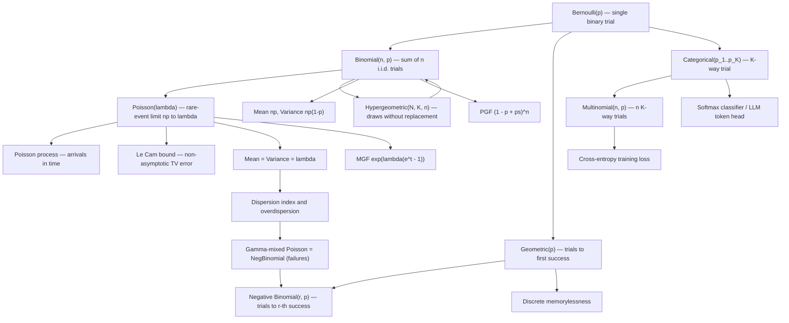

# Module 04 — Discrete Distributions

Discrete distributions are the standard models for counted phenomena: successes among trials, arrivals in a time window, attempts until a first success, categories of a classified item. Each canonical family — Bernoulli, Binomial, Hypergeometric, Geometric, Negative Binomial, Poisson, Categorical/Multinomial — is not an arbitrary formula but the *forced* answer to a precisely stated generative question. A Binomial counts successes in $n$ independent identical binary trials; a Hypergeometric counts them when the trials are draws without replacement; a Poisson is the law of rare events, the limit of Binomials with $np$ held fixed; a Geometric is the only discrete memoryless waiting time.

Mastering these families means knowing three things about each: the generative *story* that produces it, its *PMF with moments* ($E[X]$, $\mathrm{Var}(X)$, PGF/MGF), and the *bridges* between families — Binomial-to-Poisson convergence with its non-asymptotic error bound, Hypergeometric-to-Binomial, sums of Bernoullis, Gamma-mixed Poissons, Multinomial marginals. The stories are what make modeling honest: choosing a Poisson is a claim about independence and rarity, and diagnosing overdispersion (variance exceeding the mean) is how that claim gets falsified in practice.

For machine learning the Categorical is arguably the single most used object in the field — every softmax classifier head and every language-model token prediction is a Categorical law trained by maximizing its log-likelihood. Poisson and Negative Binomial regression drive count modeling from web traffic to single-cell genomics, and Bernoulli noise is what dropout injects.

> [!NOTE]
> Every canonical discrete family answers a specific generative question, and the **dispersion index** $\mathrm{Var}(X)/E[X]$ names the answer: below $1$ for a fixed budget of trials (Binomial, Hypergeometric), exactly $1$ for Poisson, above $1$ when the rate itself is random (Negative Binomial). Match the story to the data before matching the formula.

## Prerequisites

- [`../01_sample_spaces_and_probability_axioms/`](../01_sample_spaces_and_probability_axioms/) — probability measures, independence, conditioning.
- [`../03_random_variables_and_distribution_functions/`](../03_random_variables_and_distribution_functions/) — random variables, PMFs, CDFs.

**Downstream** — modules this one unlocks:

- [`../05_continuous_distributions/`](../05_continuous_distributions/) — the Poisson process's inter-arrival times are Exponential; the Gamma appears here as the mixing law.
- [`../06_expectation_variance_and_moments/`](../06_expectation_variance_and_moments/) — the law of total variance, used here for the Gamma–Poisson mixture.
- [`../10_bayesian_inference/`](../10_bayesian_inference/) — Beta–Bernoulli and Dirichlet–Multinomial conjugacy.

## Learning outcomes

After this module you can:

- Name the family a counting problem forces, by auditing the clauses of its generative story (fixed trials, independence, constant $p$, rarity, replacement).
- Derive means and variances two ways — indicator decomposition and generating functions — and say exactly which step consumes independence.
- Prove the Poisson limit theorem and upgrade it to Le Cam's non-asymptotic total-variation bound by maximal coupling.
- Distinguish the two Negative Binomial conventions and state which one a mixture produces.
- Compute the finite-population correction and explain why sampling without replacement removes variance.
- Diagnose overdispersion from the dispersion index and choose between Poisson and Negative Binomial models.
- Implement discrete PMFs in log space and explain why naive factorials fail past $n \approx 170$.

## Concept map

## Notation

| Symbol | Meaning |
|---|---|
| $p_X(k)$, $P(X=k)$ | Probability mass function |
| $G_X(s)$, $M_X(t)$ | Probability generating function, moment generating function |
| $\text{Bin}(n,p)$, $\text{Poisson}(\lambda)$ | Binomial and Poisson laws |
| $\text{Hypergeometric}(N,K,n)$ | $n$ draws without replacement from $N$ items containing $K$ successes |
| $\text{NegBinomial}(r,p)$, Def. 3.4 | *Trials* convention: support $\{r, r+1, \ldots\}$, integer $r$ |
| $\text{NegBinomial}(r,p)$, Def. 3.5 | *Failures* convention: support $\{0, 1, \ldots\}$, real $r \gt 0$; related by $X = T_r - r$ |
| $\Delta^{K-1}$ | Probability simplex in $\mathbb{R}^K$, dimension $K-1$ |
| $d_{\mathrm{TV}}(\mu,\nu)$ | Total variation distance, $= \tfrac12 \lVert \mu - \nu \rVert_1$ |
| $D(X)$ | Dispersion index $\mathrm{Var}(X)/E[X]$ |

This module uses **two** Negative Binomial conventions (trials-to-$r$-successes and failures-before-$r$-successes); Definitions 3.4 and 3.5 state both, and every later result names the one it uses. The mixture of Theorem 4.7 always means the failures convention.

## Core results

| # | Result | Statement | Hypotheses that matter |
|---|---|---|---|
| Thm 4.1 | Generating-function toolkit | $p_X(k)=G_X^{(k)}(0)/k!$; $E[X]=G_X'(1)$; $G_{X+Y}=G_XG_Y$ | Non-negative integer support; finite second moment; independence for the product |
| Thm 4.2 | Binomial moments and closure | $E=np$, $\mathrm{Var}=np(1-p)$; $X+Y$ Binomial $\iff p=p'$ | Mean needs only linearity; variance needs independence |
| Thm 4.3 | Poisson MGF and additivity | $M_X(t)=e^{\lambda(e^t-1)}$, $E=\mathrm{Var}=\lambda$ | Independence for additivity |
| Thm 4.4 | Poisson limit (rare events) | $\text{Bin}(n,p_n)\to\text{Poisson}(\lambda)$ pointwise when $np_n\to\lambda$ | $np_n\to\lambda\in(0,\infty)$ forces $p_n\to0$; $k$ fixed |
| Thm 4.5 | Le Cam's bound | $d_{\mathrm{TV}}(S,\text{Poisson}(\lambda))\le\sum_i p_i^2$ | Independent, not necessarily identical, Bernoullis |
| Thm 4.6 | Memorylessness characterization | Memoryless on $\{1,2,\ldots\}$ $\iff$ Geometric | $P(T \lt \infty)=1$ rules out $T\equiv\infty$ |
| Thm 4.7 | Thinning and Gamma-mixing | Thinned Poisson is Poisson; Gamma-mixed Poisson is NegBinomial with $\mathrm{Var}=E[X]+\mathrm{Var}(\Lambda)$ | Retention independent of $N$; $\Lambda$ non-degenerate |
| Thm 4.8 | Hypergeometric moments and limit | $E=nK/N$, $\mathrm{Var}=nf(1-f)\frac{N-n}{N-1}$; $\to$ Binomial | $n$ fixed as $N\to\infty$ |

## Common misconceptions

| Misconception | Mathematical reality | Correct mental model |
|---|---|---|
| *"After 5 tails, heads is 'due'."* | Independent flips: $P(H)=p$ regardless of history, and the Geometric law is memoryless (Theorem 4.6). | The coin has no memory; streaks change nothing about the next trial. |
| *"Any count data is Poisson."* | Poisson forces $\mathrm{Var}(X)=E[X]$; it requires independence and a constant rate. | Real counts are often overdispersed; test $D(X)$ and switch to Negative Binomial when it exceeds $1$. |
| *"Binomial applies whenever there are $n$ trials."* | It needs *independent* trials with the *same* $p$; drawing without replacement gives the Hypergeometric, whose variance carries the factor $(N-n)/(N-1)$. | Check independence and homogeneity before using the Binomial. |
| *"$E[X]=np$ needs the full PMF."* | Linearity on $X=\sum_i \mathbf{1}_i$ gives it in one line, with no independence at all. | Decompose counts into indicators; expectation passes through sums unconditionally. |
| *"Poisson approximation just needs $n$ huge."* | The regime is $n$ large, $p$ small, $np$ moderate; for fixed $p$ the limit is Gaussian, not Poisson. | Rarity, not sample size, drives Poisson accuracy: $\sum_i p_i^2 \le \lambda\max_i p_i$. |
| *"Le Cam's bound is $2\sum_i p_i^2$ on total variation."* | $2\sum_i p_i^2$ bounds the $\ell_1$ distance; the total-variation bound is $\sum_i p_i^2$, since $d_{\mathrm{TV}}=\tfrac12\lVert\cdot\rVert_1$. | Always name the metric before quoting the constant. |
| *"A Categorical over $K$ classes has $K$ free parameters."* | Normalization removes one: $\dim\Delta^{K-1}=K-1$. | Softmax logits are identifiable only up to an additive constant — the shift-invariance behind log-sum-exp. |

## Exercise index

[`exercises.ipynb`](exercises.ipynb) holds **20** fully solved problems across four tiers.

| Tier | Title | Count | Focus |
|---|---|---:|---|
| L0 | Concept Checks | 4 | Story matching, gambler's fallacy, dispersion index, simplex dimension |
| L1 | Foundations | 6 | Binomial arithmetic, Geometric PGF, Poisson scaling, sums of Geometrics, closure, Poisson cumulants |
| L2 | Applications (AI/ML and Physics) | 6 | Cross-entropy MLE, photon-detector thinning, dropout, alias sampling, count regression, canonical-ensemble occupancy |
| L3 | Challenge Proofs | 4 | Chernoff bound, coupon collector, Poisson process from axioms, Le Cam by coupling |

## References

- Blitzstein, J. K., & Hwang, J. *Introduction to Probability*, 2nd ed., Chs. 3–4 (Thm 4.8, Poisson paradigm §4.8).
- Ross, S. *A First Course in Probability*, 10th ed., §4.6–4.8 (Binomial, Poisson, Geometric, Negative Binomial).
- Casella, G., & Berger, R. L. *Statistical Inference*, 2nd ed., §3.2 (Thm 3.2.1 ff., common discrete families and their MGFs).
- Wasserman, L. *All of Statistics*, §2.4 (catalogue of the important discrete laws).
- Feller, W. *An Introduction to Probability Theory and Its Applications*, Vol. 1, 3rd ed., Chs. VI and XI (Bernoulli trials, occupancy, the Poisson approximation).
- Bishop, C. M. *Pattern Recognition and Machine Learning*, §2.1–2.2 (Bernoulli/Multinomial with Beta and Dirichlet priors).
- Murphy, K. P. *Probabilistic Machine Learning: An Introduction*, Ch. 2, §2.4–2.5 (discrete laws, softmax/Categorical).
- Le Cam, L. (1960). "An approximation theorem for the Poisson binomial distribution", *Pacific J. Math.* 10, 1181–1197 (Thm 1).
- Durrett, R. *Probability: Theory and Examples*, 5th ed., §3.6.1 (Thm 3.6.1, Poisson convergence and thinning).
