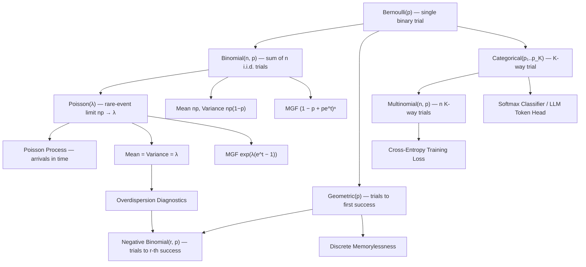

# Topic 04: Discrete Distributions

## 1. Master Overview

Discrete distributions are the standard models for counted phenomena: successes among trials, arrivals in a time window, attempts until a first success, categories of a classified item. Each canonical family — Bernoulli, Binomial, Geometric, Negative Binomial, Poisson, Categorical/Multinomial — is not an arbitrary formula but the *unique* answer to a precisely stated modeling question. A Binomial counts successes in $n$ independent identical binary trials; a Poisson emerges as the law of rare events, the limit of Binomials with $np$ held fixed; a Geometric is the only discrete memoryless waiting time.

Mastering these families means knowing three things about each: the generative *story* that produces it, its *PMF with moments* ($E[X]$, $\mathrm{Var}(X)$, MGF), and the *bridges* between families — Binomial-to-Poisson convergence, Bernoulli sums, Multinomial marginals. The stories are what make modeling honest: choosing a Poisson is a claim about independence and rarity of underlying events, and diagnosing overdispersion (variance exceeding the mean) is how that claim is falsified in practice.

For AI, the Categorical distribution is arguably the single most used object in the field — every softmax classifier head and every language-model token prediction is a Categorical law, trained by maximizing its log-likelihood. Poisson and Negative Binomial regression drive count modeling from web traffic to single-cell genomics.

> [!NOTE]
> Every canonical discrete family answers a specific generative question: Bernoulli (one binary trial), Binomial (count of successes in $n$ trials), Geometric (trials until first success), Poisson (rare-event counts at constant rate), Categorical/Multinomial ($K$-way outcomes). Match the story to the data before matching the formula.

## 2. First-Principles Framework

- **Phenomenon**: Many measurements are inherently counts — clicks, photons, mutations, tokens — generated by repeated or accumulated binary micro-events.
- **Goal**: Derive, from explicit independence and symmetry assumptions, the exact probability laws of such counts, together with their moments and interrelations.
- **Governing Equation**: The Binomial PMF $P(X = k) = \binom{n}{k} p^k (1-p)^{n-k}$ and its rare-event limit, the Poisson PMF $P(X = k) = \dfrac{\lambda^k e^{-\lambda}}{k!}$ with $\lambda = np$.
- **Formulation**: All families are built from Bernoulli atoms: sums give Binomial, waiting times give Geometric/Negative Binomial, rare-event limits give Poisson, and $K$-way generalization gives Categorical/Multinomial.
- **Verification**: Moments follow from MGFs $M_X(t) = E[e^{tX}]$; family bridges follow from limits of PMFs or products of MGFs.

## 3. Mermaid Concept Map

## 4. Common Misconceptions

| Misconception | Mathematical Reality | Correct Mental Model |
|---|---|---|
| *"After 5 tails, heads is 'due' — its probability rises."* | Independent flips: $P(H) = p$ regardless of history; the Geometric law is memoryless. | The coin has no memory (gambler's fallacy); streaks change nothing about the next trial. |
| *"Poisson is just a formula for counts; any count data is Poisson."* | Poisson requires independence and a constant rate; it forces $\mathrm{Var}(X) = E[X]$. | Real counts are often overdispersed (clustered events); test the variance-mean ratio, switch to Negative Binomial if it exceeds 1. |
| *"Binomial applies whenever there are $n$ trials."* | It requires *independent* trials with the *same* $p$; sampling without replacement gives the Hypergeometric instead. | Check both the independence and homogeneity clauses of the Binomial story before using it. |
| *"$E[X] = np$ needs the full PMF to derive."* | Linearity of expectation on the indicator decomposition $X = \sum_i \mathbf{1}_i$ gives it in one line, no independence needed. | Decompose counts into indicators; expectation passes through sums unconditionally. |
| *"Poisson approximation to Binomial needs $n$ huge and nothing else."* | The regime is $n$ large, $p$ small, $np$ moderate; Le Cam's bound gives total variation error $\le np^2$. | Rarity ($p \to 0$) is essential — for $p$ fixed and $n \to \infty$ the correct limit is Gaussian, not Poisson. |
| *"A Categorical over $K$ classes has $K$ free parameters."* | Normalization removes one degree of freedom: the simplex $\Delta^{K-1}$ has dimension $K-1$. | Softmax logits are identifiable only up to an additive constant — the shift-invariance used in the log-sum-exp trick. |

## 5. Directory Inventory

| File | Description |
|---|---|
| [`README.md`](README.md) | Master overview, first-principles framework, concept map, misconceptions, references. |
| [`first_principles.ipynb`](first_principles.ipynb) | Markdown-only theory notebook: generative stories, PMFs, moments and MGFs with full derivations, Poisson limit theorem proof, memorylessness, and AI/physics applications. |
| [`exercises.ipynb`](exercises.ipynb) | 20 fully solved problems in 4 levels: Concept Check (4), Foundation (6), Applications in AI/ML & Physics (6), Challenge (4). |

## 6. References

- **Blitzstein, J. K., & Hwang, J.** *Introduction to Probability*, 2nd ed. (Chapters 3–4: Discrete distributions and expectation stories).
- **Ross, S.** *A First Course in Probability*, 10th ed. (Chapter 4: Random Variables — Binomial, Poisson, Geometric).
- **Casella, G., & Berger, R. L.** *Statistical Inference*, 2nd ed. (Chapter 3: Common Families of Distributions).
- **Wasserman, L.** *All of Statistics* (Chapter 2: Random Variables — important discrete laws).
- **Feller, W.** *An Introduction to Probability Theory and Its Applications*, Vol. 1 (Chapters VI, XI: Bernoulli trials, the Poisson approximation).
- **Bishop, C. M.** *Pattern Recognition and Machine Learning* (Section 2.1–2.2: Bernoulli, Multinomial, and their conjugate priors).
- **Murphy, K. P.** *Probabilistic Machine Learning: An Introduction* (Chapter 2: Discrete distributions and the softmax/Categorical connection).
- **Le Cam, L.** *An Approximation Theorem for the Poisson Binomial Distribution*, Pacific J. Math. (1960).
