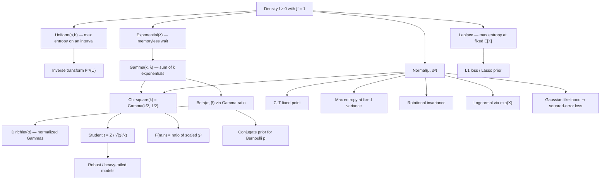

# Module 05 — Continuous Distributions

Continuous distributions describe quantities measured on a scale rather than counted: waiting
times, positions, velocities, gene-expression levels, neural-network activations. Where discrete
families are generated by counting arguments, continuous families are generated by **structural
principles** — memorylessness produces the Exponential, additivity of independent waits produces
the Gamma, maximum entropy at a fixed variance produces the Normal, and rotational symmetry of
independent coordinates produces the Normal again. Each family is the unique answer to a sharply
posed question, and knowing the question is what makes a modelling choice defensible.

The Normal occupies a special place, not because nature prefers bell curves but because of three
independent mathematical facts: it is the fixed point of the Central Limit Theorem, it is the
maximum-entropy law for a given mean and variance, and it is the only law whose independent
components are rotation-invariant. Around it sits a family tree built by transformation: squaring
standard normals gives the Chi-square, ratios give Student's $t$ and Fisher's $F$, exponentiating
gives the Lognormal, and sums of exponentials give the Gamma, of which the Chi-square and the
Exponential are special cases.

The unifying diagnostic is the hazard rate $h = f/S$. Because $S(x) = \exp\left(-\int_0^x h\right)$,
the hazard determines the law completely, so its shape — flat, rising, falling, humped — classifies
the family before any parameter is fitted. Every characterization proved in this module can be read
off that one curve.

For machine learning these families are the working vocabulary. Gaussian likelihoods make
squared-error loss a maximum-likelihood procedure; Laplace likelihoods make absolute-error loss one;
Beta and Dirichlet laws are the conjugate priors for probabilities and simplices; Gamma and
Inverse-Gamma laws are the conjugate priors for precisions; and heavy-tailed Student's $t$ laws are
the standard tool for robust regression.

> [!NOTE]
> A density is not a probability. $f_X(x)$ can exceed 1, is not dimensionless (it carries units of
> $1/[\,x\,]$), and changes under reparameterization by a Jacobian factor. Only integrals
> $\int_A f_X$ are probabilities, and only those are invariant under a change of variables.

## Prerequisites

| Direction | Module | Why |
|---|---|---|
| Requires | [`calculus/07 — Improper Integrals and Special Functions`](../../calculus/07_improper_integrals_special_functions/) | The $\Gamma$ and $B$ integrals, and convergence tests for the tail integrals that decide which moments exist. |
| Requires | [`probability_statistics/03 — Random Variables and Distribution Functions`](../03_random_variables_and_distribution_functions/) | CDF, density and quantile function, and the change-of-variables formula. |

**Downstream.** This module unlocks
[`probability_statistics/06 — Expectation, Variance and Moments`](../06_expectation_variance_and_moments/)
and [`probability_statistics/10 — Bayesian Inference`](../10_bayesian_inference/).

## Learning outcomes

After working through this module you will be able to:

- State and prove that memorylessness characterizes the Exponential law, and identify the
  non-degeneracy hypothesis that forces $\lambda \gt 0$.
- Compute a hazard rate, recover the survival function from it, and use its shape to reject a
  proposed family without fitting parameters.
- Prove Gamma additivity by moment generating functions, and exhibit the failure when the rates
  differ.
- Prove that the Normal maximizes differential entropy at a fixed variance, and read the entropy
  shortfall of a competitor as a KL divergence.
- Derive the Beta law and the Beta integral from a Gamma ratio, and explain why the ratio is
  independent of the total.
- Derive the Student $t$ as a Gaussian scale mixture, and deduce exactly which of its moments exist.
- Build $\chi^2$, $t$ and $F$ from standard normals, including the $F$ density and its mean.
- Sample all of these laws from uniforms, and compute Gaussian tail probabilities without
  catastrophic cancellation.

## Concept map

## Notation

| Symbol | Meaning | Convention fixed here |
|---|---|---|
| $F_X$, $f_X$ | CDF and density of $X$ | $P(a \le X \le b) = \int_a^b f_X$; only integrals are probabilities |
| $S(x)$ | survival function $1 - F_X(x)$ | always written with its argument, to distinguish it from the sample covariance $S$ of [`docs/notation.md`](../../docs/notation.md) |
| $h(x)$ | hazard rate $f_X(x)/S(x)$ | $h$ is reserved for the hazard in this module |
| $H(f)$ | differential entropy $-\int f\ln f$ | takes a **density** argument, freeing $h$ for the hazard |
| $M_X(t)$ | moment generating function $E\left[e^{tX}\right]$ | stated only with the interval on which it is finite |
| $\Gamma(\alpha)$, $B(\alpha,\beta)$ | Gamma and Beta integrals | $B(\alpha,\beta) = \Gamma(\alpha)\Gamma(\beta)/\Gamma(\alpha+\beta)$ is derived, not assumed |
| $\mathcal{N}(\mu,\sigma^2)$, $\Phi$ | Gaussian and its standard CDF | second argument is the **variance** (covariance in the vector case) |
| $\text{Gamma}(\alpha,\lambda)$ | Gamma with shape $\alpha$, **rate** $\lambda$ | rate, never scale; scale is $1/\lambda$ |
| $\chi^2_k$, $t_\nu$, $F_{m,n}$ | derived sampling laws | $\chi^2_k = \text{Gamma}(k/2,\ 1/2)$ |
| $D_{\mathrm{KL}}(p \parallel q)$ | Kullback-Leibler divergence | `\parallel`, never a raw pipe |
| $X \perp Y$ | independence | factorization of the joint density |

## Core results

| Result | Statement | Hypotheses |
|---|---|---|
| Theorem 4.1 — memorylessness | $P(X \gt s+t \mid X \gt s) = P(X \gt t)$ for all $s,t \iff X \sim \text{Exponential}(\lambda)$ | $S$ right-continuous, $S(0)=1$, $S(t_1) \lt 1$ for some $t_1$ |
| Theorem 4.2 — Gamma additivity | $\text{Gamma}(\alpha_1,\lambda) + \text{Gamma}(\alpha_2,\lambda) = \text{Gamma}(\alpha_1+\alpha_2,\lambda)$ | independent, **common rate** |
| Theorem 4.3 — Gaussian moments | $\int e^{-x^2/2}dx = \sqrt{2\pi}$, $M_Z(t) = e^{t^2/2}$, $E\left[Z^{2m}\right] = (2m-1)!!$ | none beyond the definition |
| Theorem 4.4 — maximum entropy | $H(f) \le \frac12\ln\left(2\pi e\sigma^2\right)$, with equality only for the Normal | fixed mean, finite variance $\sigma^2$ |
| Theorem 4.5 — Gamma to Beta | $\frac{U}{U+V} \sim \text{Beta}(\alpha,\beta)$ and $\frac{U}{U+V} \perp U+V \sim \text{Gamma}(\alpha+\beta,\lambda)$ | independent, common rate |
| Theorem 4.6 — Student as a scale mixture | $X \mid \tau \sim \mathcal{N}(0,1/\tau)$, $\tau \sim \text{Gamma}\left(\frac\nu2,\frac\nu2\right) \implies X \sim t_\nu$; $E\lvert X\rvert^{p} \lt \infty \iff p \lt \nu$ | $\tau$ independent of the conditional Gaussian |
| Theorem 4.7 — derived sampling laws | $\sum_i Z_i^2 \sim \chi^2_k$; $\frac{Z}{\sqrt{\chi^2_k/k}} \sim t_k$; $\frac{\chi^2_m/m}{\chi^2_n/n} \sim F_{m,n}$ with mean $\frac{n}{n-2}$ | i.i.d. standard normal, numerator independent of denominator, $n \gt 2$ for the mean |

## Common misconceptions

| Misconception | Mathematical reality | Correct mental model |
|---|---|---|
| *"The density value $f(x)$ is the probability of $x$."* | $P(X = x) = 0$ for every $x$; densities can exceed 1 and carry units of $1/[\,x\,]$. | $f(x)\,dx$ is an infinitesimal probability; only integrals are probabilities. |
| *"The Normal is everywhere because nature likes bell curves."* | It is the CLT fixed point, the max-entropy law at fixed variance, and the only rotation-invariant product law — three structural theorems. | Gaussianity follows from aggregation or from constraints, so ask which mechanism applies before assuming it. |
| *"Heavy tails just mean a bit more spread."* | Student's $t$ with $\nu \le 2$ has infinite variance; Cauchy ($\nu = 1$) has no mean, so sample averages never stabilize. | Tail index, not variance, controls extremes; moments can fail to exist entirely. |
| *"An old machine is more likely to fail soon, so use an Exponential."* | The Exponential is memoryless, so it models *no* aging at all. | Aging requires an increasing hazard $h = f/S$ — use Weibull or Gamma. |
| *"Every distribution has an MGF."* | The Lognormal and Student's $t$ have no MGF on any interval around 0; the Cauchy has no mean. | Use characteristic functions $\varphi_X(t) = E\left[e^{itX}\right]$, which always exist. |
| *"Uniform is the natural no-information prior."* | Uniformity is not reparameterization-invariant: flat on $\sigma$ is not flat on $\sigma^2$, and Jeffreys' prior $\propto \sqrt{\det I(\theta)}$ generally is not uniform. | "Non-informative" is relative to a parameterization; densities transform with a Jacobian. |
| *"The Beta distribution is just a bounded bell curve."* | With $\alpha,\beta \lt 1$ it is U-shaped and unbounded at the endpoints; with $\alpha = \beta = 1$ it is uniform. | Beta is a flexible two-parameter family on $[0,1]$ whose shape switches qualitatively at $\alpha = 1$ and $\beta = 1$. |
| *"Summing Gammas always gives a Gamma."* | Only at a common rate; mixed rates give a hypoexponential law that no Gamma fits. | Check the rate before adding shapes — the notebook exhibits the rejection numerically. |

## Exercise index

[`exercises.ipynb`](exercises.ipynb) holds 20 fully solved problems in four tiers.

| Tier | Count | Problems |
|---|---|---|
| L0 — Concept Checks | 4 | memorylessness of a bus wait; how large a density can be; which $t_\nu$ moments exist; whether a flat prior is uninformative |
| L1 — Foundations | 6 | Rayleigh normalization and median; Weibull vs Exponential hazard; Erlang latency; Gaussian standardization and tail cancellation; Beta conjugacy; Lognormal mean vs median |
| L2 — Applications (AI/ML and Physics) | 6 | squared error as a Gaussian log-likelihood; the VAE Gaussian KL term; Maxwell-Boltzmann speeds; ideal-gas energy fluctuations and the thin shell; Lasso as a Laplace prior; He initialization |
| L3 — Challenge Proofs | 4 | Maxwell's theorem from a Cauchy functional equation; independence of $\bar X$ and $S^2$; the maximum-entropy exponential family; a lognormal not determined by its moments |

## Directory inventory

| File | Description |
|---|---|
| [`README.md`](README.md) | This page: overview, prerequisites, notation, core results, misconceptions, exercise index. |
| [`first_principles.ipynb`](first_principles.ipynb) | Theory: densities and hazards, the canonical families, seven main theorems with full proofs, five worked numerical examples, and executed computational checks. |
| [`exercises.ipynb`](exercises.ipynb) | 20 fully solved problems across the four tiers, each with a code cell that recomputes the answer. |

## References

- Blitzstein & Hwang, *Introduction to Probability*, 2nd ed., Ch. 5 (continuous laws), Ch. 8 (transformations).
- Casella & Berger, *Statistical Inference*, 2nd ed., §3.3 (continuous families), §5.3 (Thm 5.3.1: independence of $\bar X$ and $S^2$; derived $t$ and $F$ laws).
- Wasserman, *All of Statistics*, §2.4 (catalogue of continuous laws).
- Ross, *A First Course in Probability*, 10th ed., Ch. 5 (Exponential, Gamma, Normal).
- Bishop, *Pattern Recognition and Machine Learning*, §2.3 (the Gaussian), §2.4 (the exponential family).
- Murphy, *Probabilistic Machine Learning: An Introduction*, §2.6–2.7 (continuous and heavy-tailed laws).
- Cover & Thomas, *Elements of Information Theory*, 2nd ed., Ch. 8 (differential entropy), Ch. 12 (Thm 12.1.1: maximum entropy).
- Durrett, *Probability: Theory and Examples*, 5th ed., §1.2, §3.4 (densities; the normal law).
- Feller, *An Introduction to Probability Theory and Its Applications*, Vol. 2, Ch. I–II, Ch. VI (exponential, gamma, stable laws).
- Devroye, *Non-Uniform Random Variate Generation*, Ch. 4, Ch. 9 (Box-Muller, Marsaglia-Tsang, Beta and Dirichlet sampling).
