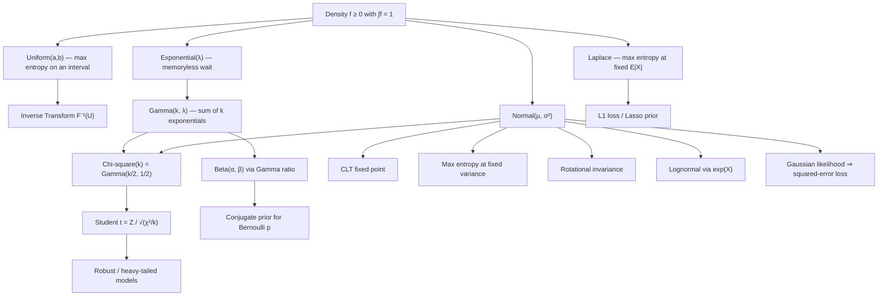

# Topic 05: Continuous Distributions

## 1. Master Overview

Continuous distributions describe quantities measured on a scale rather than counted: waiting times, positions, velocities, gene expression levels, neural network activations. Where discrete families are generated by counting arguments, continuous families are generated by **structural principles** — memorylessness produces the Exponential, additivity of independent waits produces the Gamma, maximum entropy under a variance constraint produces the Normal, and rotational symmetry of independent coordinates produces the Normal again. Each family is the unique answer to a sharply posed question, and knowing the question is what makes a modeling choice defensible.

The Normal distribution occupies a special place, not because nature prefers bell curves but because of three independent mathematical facts: it is the fixed point of the Central Limit Theorem, it is the maximum-entropy law for a given mean and variance, and it is the only law whose independent components are rotation-invariant. Around it sits a family tree built by transformation: squaring standard normals gives the Chi-square, ratios give Student's $t$ and the $F$, exponentiating gives the Lognormal, and sums of exponentials give the Gamma, of which the Chi-square and Exponential are special cases.

For machine learning these are the working vocabulary. Gaussian likelihoods make squared-error loss a maximum-likelihood procedure; Laplace likelihoods make absolute-error loss one; Beta and Dirichlet laws are the conjugate priors for probabilities and simplices; Gamma and Inverse-Gamma laws are the conjugate priors for precisions; and heavy-tailed Student's $t$ laws are the standard tool for robust regression and for the attention-weight statistics that Gaussian assumptions mispredict.

> [!NOTE]
> A density is not a probability. $f_X(x)$ can exceed 1, is not dimensionless (it carries units of $1/[\,x\,]$), and changes under reparameterization by a Jacobian factor. Only integrals $\int_A f_X$ are probabilities, and only those are invariant under a change of variables.

## 2. First-Principles Framework

- **Phenomenon**: Physical and statistical quantities take values on a continuum, so probability spreads as a *density* over the real line instead of concentrating on atoms.
- **Goal**: Derive the canonical continuous families from structural characterizations — memorylessness, additivity, symmetry, maximum entropy — and map the transformations that connect them.
- **Governing Equation**: $F_X(x) = \int_{-\infty}^{x} f_X(t)\,dt$ with $f_X \ge 0$ and $\int_{\mathbb{R}} f_X = 1$; probabilities come only from integrals, $P(a \le X \le b) = \int_a^b f_X$.
- **Formulation**: Each family is fixed by a characterization — Exponential by $P(X \gt s+t) = P(X \gt s)P(X \gt t)$; Gamma by $\sum_{i=1}^{k} \text{Exp}(\lambda) = \text{Gamma}(k, \lambda)$; Normal by the CLT, by maximum entropy at fixed variance, and by rotational invariance.
- **Verification**: Moments come from the MGF $M_X(t) = E[e^{tX}]$ where it exists, and family relations are checked by the change-of-variables formula $f_Y(y) = f_X(g^{-1}(y))\left\lvert \frac{d}{dy}g^{-1}(y) \right\rvert$.

## 3. Mermaid Concept Map

## 4. Common Misconceptions

| Misconception | Mathematical Reality | Correct Mental Model |
|---|---|---|
| *"The density value $f(x)$ is the probability of $x$."* | $P(X = x) = 0$ for every $x$; densities can exceed 1 and carry units of $1/[\,x\,]$. | $f(x)\,dx$ is an infinitesimal probability; only integrals are probabilities. |
| *"The Normal is everywhere because nature likes bell curves."* | It is the CLT fixed point, the max-entropy law at fixed variance, and the only rotation-invariant product law — three structural theorems, not an empirical preference. | Gaussianity is a consequence of aggregation and of constraints, so ask which mechanism applies before assuming it. |
| *"Heavy tails just mean 'a bit more spread'."* | Student's $t$ with $\nu \le 2$ has infinite variance; Cauchy ($\nu = 1$) has no mean, so sample averages never stabilize. | Tail index, not variance, controls extremes; moments can fail to exist entirely. |
| *"An old machine is more likely to fail soon, so use an Exponential."* | The Exponential is memoryless: $P(X \gt s + t \mid X \gt s) = P(X \gt t)$, so it models *no* aging at all. | Aging requires an increasing hazard $h(t) = f(t)/S(t)$ — use Weibull or Gamma. |
| *"Every distribution has an MGF."* | The Lognormal and Student's $t$ have no MGF on any interval around 0; the Cauchy has no mean. | Use characteristic functions $\varphi_X(t) = E[e^{itX}]$, which always exist. |
| *"Uniform is the natural 'no information' prior."* | Uniformity is not reparameterization-invariant: a flat prior on $\sigma$ is not flat on $\sigma^2$, and Jeffreys' prior $\propto \sqrt{\det I(\theta)}$ generally is not uniform. | "Non-informative" is relative to a parameterization; densities transform with a Jacobian. |
| *"The Beta distribution is just a bounded bell curve."* | With $\alpha, \beta \lt 1$ it is U-shaped and unbounded at the endpoints; with $\alpha = \beta = 1$ it is uniform. | Beta is a flexible two-parameter family on $[0,1]$ whose shape switches qualitatively at $\alpha = 1$ and $\beta = 1$. |

## 5. Directory Inventory

| File | Description |
|---|---|
| [`README.md`](README.md) | Master overview, first-principles framework, concept map, misconceptions, references. |
| [`first_principles.ipynb`](first_principles.ipynb) | Markdown-only theory notebook: densities and hazards, the canonical families, characterization proofs (memorylessness, Gamma additivity, Gaussian max-entropy, Gamma-to-Beta), computational craft, and AI/physics applications. |
| [`exercises.ipynb`](exercises.ipynb) | 20 fully solved problems in 4 levels: Concept Check (4), Foundation (6), Applications in AI/ML & Physics (6), Challenge (4). |

## 6. References

- **Blitzstein, J. K., & Hwang, J.** *Introduction to Probability*, 2nd ed. (Chapter 5: Continuous Random Variables; Chapter 8: Transformations).
- **Casella, G., & Berger, R. L.** *Statistical Inference*, 2nd ed. (Chapter 3.3: Continuous families; Chapter 5.3: Derived distributions).
- **Wasserman, L.** *All of Statistics* (Chapter 2.4: Important continuous distributions).
- **Ross, S.** *A First Course in Probability*, 10th ed. (Chapter 5: Continuous Random Variables).
- **Bishop, C. M.** *Pattern Recognition and Machine Learning* (Section 2.3: The Gaussian; Section 2.4: The exponential family).
- **Murphy, K. P.** *Probabilistic Machine Learning: An Introduction* (Chapter 2.6–2.7: Continuous and heavy-tailed distributions).
- **Cover, T. M., & Thomas, J. A.** *Elements of Information Theory*, 2nd ed. (Chapter 12: Maximum entropy characterizations).
- **Durrett, R.** *Probability: Theory and Examples*, 5th ed. (Sections 1.2, 3.4: densities, weak convergence, the normal law).
- **Feller, W.** *An Introduction to Probability Theory and Its Applications*, Vol. 2 (Chapters I–II: exponential, gamma, stable laws).
