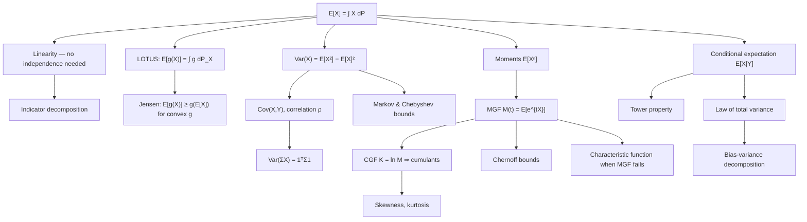

# Module 06 — Expectation, Variance and Moments

A distribution is an infinite-dimensional object; a moment is a single number extracted from it. Expectation $E[X]$ is the first and most important such number — the Lebesgue integral $\int_\Omega X\,dP$ — and it comes with a property no other summary shares: **linearity holds unconditionally**, with no independence, no identical distributions, and no continuity required. This single fact is the reason indicator decompositions solve counting problems in one line, the reason the bias-variance decomposition exists, and the reason stochastic gradient descent works at all.

Variance measures the second-order spread, $\mathrm{Var}(X) = E\left[(X - \mu)^2\right]$, and unlike expectation it is *not* linear: it acquires covariance cross-terms, and only uncorrelatedness makes it additive. Beyond the second moment, the moment generating function $M_X(t) = E[e^{tX}]$ and its logarithm the cumulant generating function package all moments into a single analytic object, converting convolution into multiplication and differentiation into moment extraction. Where the MGF fails to exist — Cauchy, Student's $t$, Lognormal — the characteristic function $\varphi_X(t) = E[e^{itX}]$ always survives and carries the same information.

The conditional versions are what make the theory useful in practice. The tower property $E\left[E[X \mid Y]\right] = E[X]$ and the law of total variance $\mathrm{Var}(X) = E\left[\mathrm{Var}(X \mid Y)\right] + \mathrm{Var}\left(E[X \mid Y]\right)$ decompose uncertainty into "noise given what we know" plus "variability of what we know" — literally the aleatoric/epistemic split in modern uncertainty quantification, and the source of the bias-variance decomposition, Rao-Blackwellization, and control-variate variance reduction.

Moments also convert into probability statements. Markov, Chebyshev and Chernoff each trade one more assumption for one better decay rate, and the module measures exactly what that trade is worth: at $k = 2$ a two-sided Chernoff bound is *worse* than Chebyshev, and only past $k \approx 2.08$ does the exponential shape pay for its constant.

> [!NOTE]
> Expectation is linear *always*: $E[aX + bY] = aE[X] + bE[Y]$ regardless of dependence. Variance is additive only when covariances vanish, and $E[g(X)] \ne g(E[X])$ for any non-affine $g$ — the gap is governed by Jensen's inequality and is a systematic bias, not noise.

## Prerequisites

- [`../04_discrete_distributions/`](../04_discrete_distributions/) and [`../05_continuous_distributions/`](../05_continuous_distributions/) — PMFs, densities and CDFs, the objects that moments summarize.
- [`../02_conditional_probability_and_bayes/`](../02_conditional_probability_and_bayes/) — conditioning, which Section 3 upgrades to conditional expectation.

**Downstream**

- [`../08_law_of_large_numbers_and_clt/`](../08_law_of_large_numbers_and_clt/) — the LLN and CLT are statements about the first two moments and about the cumulants that wash out.
- [`../09_maximum_likelihood_and_map_estimation/`](../09_maximum_likelihood_and_map_estimation/) — bias, variance and risk of estimators.

## Learning outcomes

After this module you can:

- Compute $E[X]$ as an integral against a law, and use linearity on dependent summands to evaluate expectations whose distributions are intractable.
- Apply LOTUS to compute $E[g(X)]$ without deriving the law of $g(X)$, and justify the step by the change-of-variables theorem for pushforward measures.
- Assemble $\mathrm{Var}\left(w^\top X\right) = w^\top \Sigma w$ from a covariance matrix, and say precisely which hypothesis (uncorrelatedness, not independence) makes variance additive.
- Extract moments and cumulants from an MGF or CGF, and state when the MGF determines the law and when it does not exist at all.
- Choose between Markov, Chebyshev and Chernoff by their hypotheses, and quantify what each extra assumption buys.
- Decompose variance with Eve's law, identify $E[X \mid Y]$ as the minimum-MSE predictor, and read off the irreducible error of any predictive model.
- Estimate moments numerically without catastrophic cancellation, and reduce Monte Carlo variance with control variates.

## Concept map

## Notation

| Symbol | Meaning |
|---|---|
| $E[X]$ | expectation, $\int_\Omega X\,dP$ |
| $P_X$ | pushforward law of $X$ on $\mathbb{R}$ |
| $m_n = E[X^n]$ | $n$-th raw moment |
| $\mu_n = E\left[(X-\mu)^n\right]$ | $n$-th central moment |
| $\sigma^2 = \mathrm{Var}(X)$ | variance, $\mu_2$ |
| $\Sigma$ | covariance matrix, $\Sigma_{ij} = \mathrm{Cov}(X_i,X_j)$ |
| $\rho(X,Y)$ | correlation, defined when both variances are positive |
| $\kappa_n$ | $n$-th cumulant, $K_X^{(n)}(0)$ |
| $\gamma_1 = \kappa_3/\kappa_2^{3/2}$ | skewness |
| $\beta_2 = \mu_4/\sigma^4$ | kurtosis; excess kurtosis is $\beta_2 - 3$ |
| $M_X(t) = E\left[e^{tX}\right]$ | moment generating function |
| $K_X(t) = \ln M_X(t)$ | cumulant generating function |
| $\varphi_X(t) = E\left[e^{itX}\right]$ | characteristic function |
| $E[X \mid Y]$ | conditional expectation, the $L^2$ projection onto $\sigma(Y)$ |

## Core results

| Result | Statement | Hypotheses |
|---|---|---|
| Theorem 4.1 — linearity, monotonicity, tail formula | $E\left[\sum_i X_i\right] = \sum_i E[X_i]$; $E[X] = \int_0^\infty P(X \gt t)\,dt$ | $X_i$ integrable on a common space; $X \ge 0$ for the tail formula |
| Theorem 4.2 — LOTUS | $E[g(X)] = \int_{\mathbb{R}} g\,dP_X$ | $g$ Borel, $E\lvert g(X)\rvert \lt \infty$ |
| Theorem 4.3 — algebra of variance | $\mathrm{Var}\left(w^\top X\right) = w^\top\Sigma w$; additive iff cross terms vanish | square-integrable; additivity needs only pairwise uncorrelatedness |
| Theorem 4.4 — generating functions | $E[X^n] = M_X^{(n)}(0)$; $M_X$ determines $F_X$; $\kappa_n$ additive | $M_X \lt \infty$ on an open interval around 0; independence for additivity |
| Theorem 4.5 — inequalities | Markov, Chebyshev, Chernoff, Jensen, Cauchy-Schwarz | $X \ge 0$ / $\sigma^2 \lt \infty$ / $M_X(t) \lt \infty$ some $t \gt 0$ / convexity / $L^2$ |
| Theorem 4.6 — conditioning | $\mathrm{Var}(X) = E\left[\mathrm{Var}(X \mid Y)\right] + \mathrm{Var}\left(E[X \mid Y]\right)$; $E[X\mid Y]$ minimizes MSE | $E\lvert X\rvert \lt \infty$; $E[X^2] \lt \infty$ for the variance split |
| Corollary 4.7 — bias-variance | $\mathrm{MSE}(\hat\theta) = \text{bias}^2 + \mathrm{Var}(\hat\theta)$ | $\theta$ non-random, $E[\hat\theta^{\,2}] \lt \infty$ |

## Common misconceptions

| Misconception | Mathematical Reality | Correct Mental Model |
|---|---|---|
| *"Linearity of expectation needs independence."* | $E[X + Y] = E[X] + E[Y]$ holds for any integrable $X, Y$, however dependent. | Expectation is an integral, and integrals are linear — dependence lives in the joint law, which linearity never touches. |
| *"$E[g(X)] = g(E[X])$, at least approximately."* | Jensen's inequality makes the gap systematic and one-signed for convex or concave $g$; e.g. $E[1/X] \gt 1/E[X]$ for positive non-degenerate $X$. | Nonlinear summaries must be computed under the distribution, not applied to the mean. |
| *"Uncorrelated means independent."* | $\mathrm{Cov} = 0$ only kills linear dependence: for $X \sim \mathcal{N}(0,1)$ and $Y = X^2$, $\mathrm{Cov}(X,Y) = 0$ yet $Y$ is a function of $X$. | Correlation is a linear-projection statistic; independence is a statement about the whole joint law. |
| *"Every distribution has a mean and variance."* | Cauchy has no mean; $t_2$ has no variance; the expectation may fail to exist even as $\pm\infty$. | Check integrability before averaging — the LLN and CLT silently assume it. |
| *"The MGF always exists and always determines the law."* | Lognormal and $t_\nu$ have no MGF near 0, and the Lognormal is not even determined by its moments. | Use characteristic functions, which always exist and always determine the law. |
| *"Variance is additive."* | $\mathrm{Var}(X+Y) = \mathrm{Var}(X) + \mathrm{Var}(Y) + 2\mathrm{Cov}(X,Y)$; correlated errors can make the sum far larger or smaller. | Variance is a quadratic form in the covariance matrix, so cross-terms are the rule, not the exception. |
| *"A sharper-looking bound is always sharper."* | Two-sided Chernoff $2e^{-k^2/2}$ is *looser* than Chebyshev $1/k^2$ for $k \lt 2.08$. | A better decay rate is not a better bound until $k$ is large enough to pay for the constant. |
| *"Zero bias is what a good estimator needs."* | Mean squared error is $\text{bias}^2 + \text{variance}$; biased estimators (ridge, shrinkage, James-Stein) often dominate unbiased ones. | Optimize the total risk, and treat bias as a resource to trade against variance. |

## Exercise index

[`exercises.ipynb`](exercises.ipynb) holds 20 fully solved problems.

| Tier | Count | Problems |
|---|---:|---|
| L0 — Concept Checks | 4 | linearity under maximal dependence; uncorrelated but dependent; averaging rates and Jensen; when the mean fails to exist |
| L1 — Foundations | 6 | indicator decomposition; LOTUS both directions; variance of a correlated sum; moments from an MGF; Chebyshev vs Chernoff vs the truth; conditional expectation as a predictor |
| L2 — Applications (AI/ML and Physics) | 6 | bias-variance of prediction error; minibatch gradient noise; REINFORCE baselines as control variates; fluctuation-dissipation from the partition function; importance sampling and infinite variance; error propagation by the delta method |
| L3 — Challenge Proofs | 4 | conditional expectation as an $L^2$ projection and Rao-Blackwell; Hoeffding's lemma and the Chernoff-Hoeffding bound; Stein's lemma and score matching; moment determinacy and the Lognormal counterexample |

The two genuine physics problems in L2 are the canonical-ensemble fluctuation-dissipation relation (L2.4) and the delta-method uncertainty budget for a resistance measurement (L2.6).

## References

- **Blitzstein, J. K., & Hwang, J.** *Introduction to Probability*, 2nd ed. — §4.2 (linearity), §6.4 (MGFs), §9.1–9.5 (conditional expectation), §10.1–10.4 (inequalities).
- **Wasserman, L.** *All of Statistics* — §3.1–3.5; §4.1–4.2 (Thm 4.1 Markov, Thm 4.2 Chebyshev, Thm 4.8 Hoeffding).
- **Casella, G., & Berger, R. L.** *Statistical Inference*, 2nd ed. — §2.2–2.3 (Thm 2.3.11, MGF uniqueness), §4.4 (Thm 4.4.7 Adam's law, Thm 4.4.15 Eve's law).
- **Ross, S.** *A First Course in Probability*, 10th ed. — §7.2, §7.4, §7.5.
- **Durrett, R.** *Probability: Theory and Examples*, 5th ed. — §1.6 (Thm 1.6.9, change of variables), §4.1 (Thm 4.1.4, existence of conditional expectation).
- **Billingsley, P.** *Probability and Measure*, 3rd ed. — §21 (Thm 21.1), §34 (Thm 34.1, Radon-Nikodym construction of $E[X \mid \mathcal{G}]$).
- **Lukacs, E.** *Characteristic Functions*, 2nd ed. — Thm 7.3.5 (Marcinkiewicz: a CGF is never a polynomial of degree $\gt 2$).
- **Bishop, C. M.** *Pattern Recognition and Machine Learning* — §1.5.5, §3.2 (bias-variance).
- **Murphy, K. P.** *Probabilistic Machine Learning: An Introduction* — §2.2, §4.7.6.
- **Boucheron, S., Lugosi, G., & Massart, P.** *Concentration Inequalities* — Ch. 2, §2.1–2.3 (Lemma 2.2, Hoeffding's lemma).
- **Owen, A. B.** *Monte Carlo Theory, Methods and Examples* — §8.9 (control variates), §9.1 (importance sampling).
