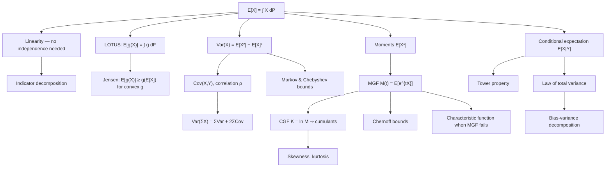

# Topic 06: Expectation, Variance and Moments

## 1. Master Overview

A distribution is an infinite-dimensional object; a moment is a single number extracted from it. Expectation $E[X]$ is the first and most important such number — the Lebesgue integral $\int_\Omega X\,dP$ — and it comes with a property no other summary shares: **linearity holds unconditionally**, with no independence, no identical distributions, and no continuity required. This single fact is the reason indicator decompositions solve counting problems in one line, the reason the bias-variance decomposition exists, and the reason stochastic gradient descent works at all.

Variance measures the second-order spread, $\mathrm{Var}(X) = E\left[(X - \mu)^2\right]$, and unlike expectation it is *not* linear: it acquires covariance cross-terms, and only independence (in fact only uncorrelatedness) makes it additive. Beyond the second moment, the moment generating function $M_X(t) = E[e^{tX}]$ and its logarithm the cumulant generating function package all moments into a single analytic object, converting convolution into multiplication and differentiation into moment extraction. Where the MGF fails to exist — Cauchy, Student's $t$, Lognormal — the characteristic function $\varphi_X(t) = E[e^{itX}]$ always survives and carries the same information.

The conditional versions are what make the theory useful in practice. The tower property $E\left[E[X \mid Y]\right] = E[X]$ and the law of total variance $\mathrm{Var}(X) = E\left[\mathrm{Var}(X \mid Y)\right] + \mathrm{Var}\left(E[X \mid Y]\right)$ decompose uncertainty into "noise given what we know" plus "variability of what we know" — literally the aleatoric/epistemic split in modern uncertainty quantification, and the source of the bias-variance decomposition, Rao-Blackwellization, and control-variate variance reduction.

> [!NOTE]
> Expectation is linear *always*: $E[aX + bY] = aE[X] + bE[Y]$ regardless of dependence. Variance is additive only when covariances vanish, and $E[g(X)] \ne g(E[X])$ for any non-affine $g$ — the gap is governed by Jensen's inequality and is a systematic bias, not noise.

## 2. First-Principles Framework

- **Phenomenon**: Full distributions are unwieldy; decisions, estimators, and loss functions need a small set of numerical summaries that behave predictably under the operations we actually perform (sums, transformations, conditioning).
- **Goal**: Define expectation as an integral, establish its algebraic laws, and build the hierarchy of moments, central moments, cumulants, and generating functions that summarizes a law to any desired order.
- **Governing Equation**: $E[X] = \int_\Omega X\,dP = \int_{\mathbb{R}} x\,dF_X(x)$, with LOTUS $E[g(X)] = \int g(x)\,dF_X(x)$ requiring no knowledge of the law of $g(X)$.
- **Formulation**: $\mathrm{Var}(X) = E[X^2] - E[X]^2$; $\mathrm{Cov}(X,Y) = E[XY] - E[X]E[Y]$; $M_X(t) = E[e^{tX}]$ with $E[X^n] = M_X^{(n)}(0)$; cumulants $\kappa_n = K_X^{(n)}(0)$ where $K_X = \ln M_X$.
- **Verification**: Tail bounds (Markov, Chebyshev, Chernoff) turn moments into probability statements, and the tower property plus the law of total variance decompose any expectation or variance along a conditioning variable.

## 3. Mermaid Concept Map

## 4. Common Misconceptions

| Misconception | Mathematical Reality | Correct Mental Model |
|---|---|---|
| *"Linearity of expectation needs independence."* | $E[X + Y] = E[X] + E[Y]$ holds for any integrable $X, Y$, however dependent. | Expectation is an integral, and integrals are linear — dependence lives in the joint law, which linearity never touches. |
| *"$E[g(X)] = g(E[X])$, at least approximately."* | Jensen's inequality makes the gap systematic and one-signed for convex or concave $g$; e.g. $E[1/X] \gt 1/E[X]$ for positive $X$. | Nonlinear summaries must be computed under the distribution, not applied to the mean. |
| *"Uncorrelated means independent."* | $\mathrm{Cov} = 0$ only kills linear dependence: for $X \sim \mathcal{N}(0,1)$ and $Y = X^2$, $\mathrm{Cov}(X,Y) = 0$ yet $Y$ is a function of $X$. | Correlation is a linear-projection statistic; independence is a statement about the whole joint law. |
| *"Every distribution has a mean and variance."* | Cauchy has no mean; $t_2$ has no variance; the expectation may fail to exist even as $\pm\infty$. | Check integrability before averaging — the LLN and CLT silently assume it. |
| *"The MGF always exists and always determines the law."* | Lognormal and $t_\nu$ have no MGF near 0, and the Lognormal is not even determined by its moments. | Use characteristic functions, which always exist and always determine the law. |
| *"Variance is additive."* | $\mathrm{Var}(X+Y) = \mathrm{Var}(X) + \mathrm{Var}(Y) + 2\mathrm{Cov}(X,Y)$; correlated errors can make the sum far larger or smaller. | Variance is a quadratic form in the covariance matrix, so cross-terms are the rule, not the exception. |
| *"Zero bias is what a good estimator needs."* | Mean squared error is $\text{bias}^2 + \text{variance}$; biased estimators (ridge, shrinkage, James-Stein) often dominate unbiased ones. | Optimize the total risk, and treat bias as a resource to trade against variance. |

## 5. Directory Inventory

| File | Description |
|---|---|
| [`README.md`](README.md) | Master overview, first-principles framework, concept map, misconceptions, references. |
| [`first_principles.ipynb`](first_principles.ipynb) | Markdown-only theory notebook: expectation as an integral, LOTUS, variance and covariance, MGFs and cumulants, Jensen, Markov/Chebyshev/Chernoff, tower property and total variance, with full proofs and AI/physics applications. |
| [`exercises.ipynb`](exercises.ipynb) | 20 fully solved problems in 4 levels: Concept Check (4), Foundation (6), Applications in AI/ML & Physics (6), Challenge (4). |

## 6. References

- **Blitzstein, J. K., & Hwang, J.** *Introduction to Probability*, 2nd ed. (Chapters 4, 6, 9–10: Expectation, Moments, Conditional Expectation, Inequalities).
- **Wasserman, L.** *All of Statistics* (Chapters 3–4: Expectation and Inequalities).
- **Casella, G., & Berger, R. L.** *Statistical Inference*, 2nd ed. (Sections 2.2–2.3, 4.4: Moments, MGFs, conditional expectation and variance).
- **Ross, S.** *A First Course in Probability*, 10th ed. (Chapter 7: Properties of Expectation).
- **Durrett, R.** *Probability: Theory and Examples*, 5th ed. (Sections 1.6, 4.1: Integration, conditional expectation as a projection).
- **Billingsley, P.** *Probability and Measure*, 3rd ed. (Sections 21, 34: Expected values, conditional expectation).
- **Bishop, C. M.** *Pattern Recognition and Machine Learning* (Sections 1.5, 3.2: Decision theory, the bias-variance decomposition).
- **Murphy, K. P.** *Probabilistic Machine Learning: An Introduction* (Chapters 2.2, 4.7: Moments, bias-variance, and estimator risk).
- **Boucheron, S., Lugosi, G., & Massart, P.** *Concentration Inequalities* (Chapters 2–3: Markov, Chernoff, sub-Gaussian methods).
