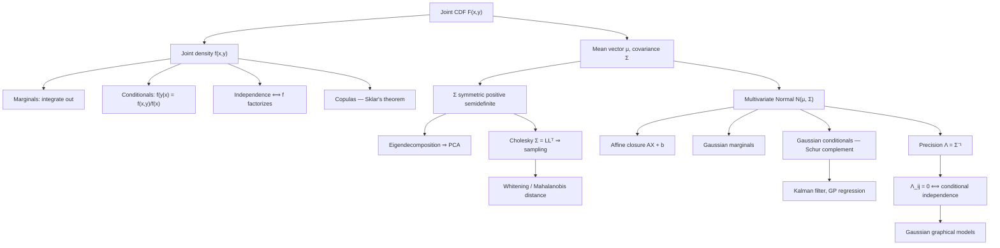

# Topic 07: Joint Distributions and the Multivariate Normal

## 1. Master Overview

Single random variables are a warm-up; almost every real problem is multivariate. A joint distribution $F_{X,Y}(x,y) = P(X \le x, Y \le y)$ carries strictly more information than the pair of marginals, and the extra content is exactly the **dependence structure** — the part that decides whether a portfolio diversifies, whether two features are redundant, and whether a graphical model factorizes. Marginals are projections and are always recoverable from the joint; the joint is never recoverable from the marginals, which is why Sklar's theorem separates a joint law into marginals plus a copula.

The multivariate normal $\mathcal{N}(\boldsymbol{\mu}, \Sigma)$ is the one multivariate family where every operation stays closed-form. Affine maps of Gaussians are Gaussian, marginals of Gaussians are Gaussian, conditionals of Gaussians are Gaussian with a linear mean and a *constant* covariance, and — uniquely for this family — zero correlation implies independence. Its entire behaviour is encoded in the covariance matrix $\Sigma$, whose eigendecomposition is principal component analysis, whose inverse $\Lambda = \Sigma^{-1}$ (the precision matrix) has zeros exactly at conditionally independent pairs, and whose Cholesky factor is both the sampler and the whitening transform.

That algebra is why Gaussians are everywhere in machine learning. Linear regression with Gaussian noise, Kalman filtering, Gaussian processes, linear discriminant analysis, VAE latent spaces, and the forward and reverse kernels of diffusion models are all applications of two formulas: the affine-transformation rule and the Gaussian conditioning rule. The Schur complement that appears in the conditional covariance is the same object that appears in block matrix inversion, in the Kalman gain, and in the GP posterior — one identity wearing several hats.

> [!NOTE]
> Marginals do not determine the joint. Two joint laws can have identical $\mathcal{N}(0,1)$ marginals and completely different dependence. And zero correlation implies independence **only** for jointly Gaussian vectors — marginally normal is not the same as jointly normal.

## 2. First-Principles Framework

- **Phenomenon**: Real systems produce vectors of correlated measurements — pixels, gene expressions, asset returns, sensor readings — whose interesting structure lives entirely in how the components co-vary.
- **Goal**: Represent the joint law, extract marginals and conditionals, characterize independence, and identify the family in which all of these operations remain tractable.
- **Governing Equation**: $F_{X,Y}(x,y) = P(X \le x, Y \le y)$ with $f_{X,Y} = \dfrac{\partial^2 F}{\partial x\,\partial y}$; independence is the factorization $f_{X,Y}(x,y) = f_X(x)f_Y(y)$ for all $(x,y)$.
- **Formulation**: For a random vector, $\boldsymbol{\mu} = E[\mathbf{X}]$ and $\Sigma = E\left[(\mathbf{X}-\boldsymbol{\mu})(\mathbf{X}-\boldsymbol{\mu})^{\top}\right] \succeq 0$; the multivariate normal density is $f(\mathbf{x}) \propto \exp\left(-\tfrac{1}{2}(\mathbf{x}-\boldsymbol{\mu})^{\top}\Sigma^{-1}(\mathbf{x}-\boldsymbol{\mu})\right)$.
- **Verification**: Affine closure $A\mathbf{X}+\mathbf{b} \sim \mathcal{N}\left(A\boldsymbol{\mu}+\mathbf{b},\, A\Sigma A^{\top}\right)$, and the conditioning rule $\mathbf{X}_1 \mid \mathbf{X}_2 \sim \mathcal{N}\left(\boldsymbol{\mu}_1 + \Sigma_{12}\Sigma_{22}^{-1}(\mathbf{x}_2-\boldsymbol{\mu}_2),\ \Sigma_{11}-\Sigma_{12}\Sigma_{22}^{-1}\Sigma_{21}\right)$.

## 3. Mermaid Concept Map

## 4. Common Misconceptions

| Misconception | Mathematical Reality | Correct Mental Model |
|---|---|---|
| *"Knowing both marginals determines the joint."* | Infinitely many joints share given marginals; Sklar's theorem writes $F(x,y) = C\left(F_X(x), F_Y(y)\right)$ with the copula $C$ free. | Marginals fix the axes, the copula fixes the coupling — dependence is an extra, independent modeling choice. |
| *"Uncorrelated implies independent."* | True only for jointly Gaussian vectors; in general $\mathrm{Cov} = 0$ kills only linear dependence. | Check joint normality before converting a zero in $\Sigma$ into an independence claim. |
| *"If $X$ and $Y$ are each normal, $(X,Y)$ is jointly normal."* | Counterexample: $X \sim \mathcal{N}(0,1)$, $Y = SX$ with $S = \pm1$ independent; both marginals are standard normal, the pair is not jointly normal, and $\mathrm{Cov}(X,Y) = 0$ without independence. | Joint normality means every linear combination $\mathbf{a}^\top\mathbf{X}$ is normal — a much stronger requirement. |
| *"Zeros in the covariance matrix reveal the graph structure."* | Zeros in $\Sigma$ mean *marginal* uncorrelatedness; zeros in the precision $\Lambda = \Sigma^{-1}$ mean *conditional* independence given all other variables. | Graphical structure lives in $\Sigma^{-1}$, which is why Gaussian graphical models estimate the precision, not the covariance. |
| *"Conditioning on more data reduces the conditional variance by an amount that depends on the observed values."* | For a Gaussian, $\Sigma_{11} - \Sigma_{12}\Sigma_{22}^{-1}\Sigma_{21}$ does not depend on $\mathbf{x}_2$ at all. | Gaussian conditioning moves the mean linearly and shrinks the covariance by a fixed amount — the design decides the variance, not the measurement. |
| *"A sample covariance matrix is always usable."* | With $n \lt d$ the sample covariance is singular, and even for $n \gtrsim d$ its eigenvalues are badly biased (Marchenko-Pastur spreading). | Regularize: shrinkage (Ledoit-Wolf), factor models, or sparse precision estimation (graphical lasso). |
| *"Correlation captures dependence strength."* | Correlation is scale-invariant but shape-blind: $\rho$ can be near 0 for a strong nonlinear relation, and tail dependence is invisible to it. | Use mutual information, rank correlations, or copula tail-dependence coefficients when the relationship is not linear. |

## 5. Directory Inventory

| File | Description |
|---|---|
| [`README.md`](README.md) | Master overview, first-principles framework, concept map, misconceptions, references. |
| [`first_principles.ipynb`](first_principles.ipynb) | Markdown-only theory notebook: joint/marginal/conditional laws, covariance matrices, the multivariate normal with full derivations of affine closure, marginalization, conditioning via the Schur complement, the precision-matrix independence theorem, plus computation and AI/physics applications. |
| [`exercises.ipynb`](exercises.ipynb) | 20 fully solved problems in 4 levels: Concept Check (4), Foundation (6), Applications in AI/ML & Physics (6), Challenge (4). |

## 6. References

- **Blitzstein, J. K., & Hwang, J.** *Introduction to Probability*, 2nd ed. (Chapter 7: Joint Distributions; Chapter 8: Transformations).
- **Casella, G., & Berger, R. L.** *Statistical Inference*, 2nd ed. (Chapter 4: Multiple Random Variables; Section 4.5: Bivariate normal).
- **Wasserman, L.** *All of Statistics* (Chapters 2.8–2.9, 3.3: Multivariate distributions and covariance).
- **Bishop, C. M.** *Pattern Recognition and Machine Learning* (Section 2.3: The Gaussian — marginals, conditionals, Bayes' theorem for Gaussians).
- **Murphy, K. P.** *Probabilistic Machine Learning: An Introduction* (Chapters 3, 4.2: Multivariate models and Gaussian inference).
- **Rasmussen, C. E., & Williams, C. K. I.** *Gaussian Processes for Machine Learning* (Chapter 2, Appendix A: Gaussian identities).
- **Anderson, T. W.** *An Introduction to Multivariate Statistical Analysis*, 3rd ed. (Chapters 2–3: The multivariate normal and its estimation).
- **Durrett, R.** *Probability: Theory and Examples*, 5th ed. (Section 3.9: Multivariate normal and the multidimensional CLT).
- **Nelsen, R. B.** *An Introduction to Copulas*, 2nd ed. (Chapters 1–2: Sklar's theorem and dependence measures).
- **Horn, R. A., & Johnson, C. R.** *Matrix Analysis*, 2nd ed. (Sections 0.8, 7.1: Schur complements, positive definiteness).
