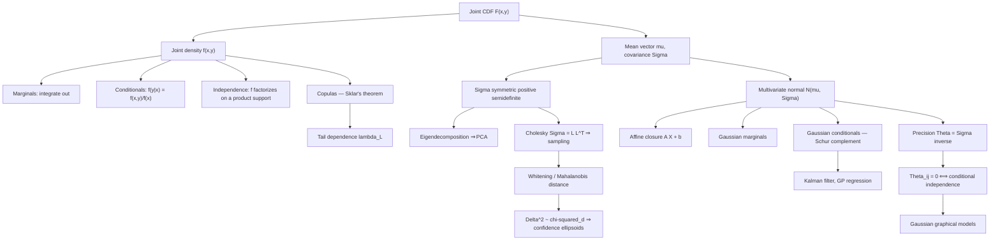

# Module 07 — Joint Distributions and the Multivariate Normal

Single random variables are a warm-up; almost every real problem is multivariate. A joint distribution $F_{X,Y}(x,y) = P(X \le x, Y \le y)$ carries strictly more information than the pair of marginals, and the extra content is exactly the **dependence structure** — the part that decides whether a portfolio diversifies, whether two features are redundant, and whether a graphical model factorizes. Marginals are projections and are always recoverable from the joint; the joint is never recoverable from the marginals, which is why Sklar's theorem separates a joint law into marginals plus a copula.

The multivariate normal $\mathcal{N}(\boldsymbol{\mu}, \Sigma)$ is the one multivariate family where every operation stays closed-form. Affine maps of Gaussians are Gaussian, marginals of Gaussians are Gaussian, conditionals of Gaussians are Gaussian with a linear mean and a *constant* covariance, and — uniquely for this family — zero correlation implies independence. Its entire behaviour is encoded in the covariance matrix $\Sigma$, whose eigendecomposition is principal component analysis, whose inverse $\Theta = \Sigma^{-1}$ (the precision matrix) has zeros exactly at conditionally independent pairs, and whose Cholesky factor is both the sampler and the whitening transform.

That algebra is why Gaussians are everywhere in machine learning. Linear regression with Gaussian noise, Kalman filtering, Gaussian processes, linear discriminant analysis, VAE latent spaces, and the forward and reverse kernels of diffusion models are all applications of two formulas: the affine-transformation rule and the Gaussian conditioning rule. The Schur complement in the conditional covariance is the same object that appears in block matrix inversion, in the Kalman gain, and in the GP posterior — one identity wearing several hats.

> [!NOTE]
> Marginals never determine the joint: two laws can have identical $\mathcal{N}(0,1)$ marginals, identical correlation, and completely different tail behaviour. And zero correlation implies independence **only** for jointly Gaussian vectors — marginally normal is not the same as jointly normal.

## Prerequisites

| Needed before starting | Why |
|---|---|
| [calculus/13 — Multiple Integrals and Coordinate Transforms](../../calculus/13_multiple_integrals_coordinate_transforms/) | Marginalization is an iterated integral; the density transformation rule is a Jacobian change of variables. |
| [linear_algebra/06 — Eigenvalues, Eigenvectors, Spectral Theory](../../linear_algebra/06_eigenvalues_eigenvectors_spectral_theory/) | $\Sigma$ is symmetric positive semidefinite; whitening, PCA and confidence ellipsoids are its spectral decomposition. |
| [probability_statistics/06 — Expectation, Variance and Moments](../06_expectation_variance_and_moments/) | The mean vector and covariance matrix are the vector-valued versions of the first two moments. |

### Downstream — what this unlocks

| Leads to | How it is used there |
|---|---|
| [probability_statistics/09 — Maximum Likelihood and MAP Estimation](../09_maximum_likelihood_and_map_estimation/) | The Gaussian log-likelihood, its MLEs, and the Fisher information of $(\boldsymbol\mu, \Sigma)$. |
| [probability_statistics/10 — Bayesian Inference](../10_bayesian_inference/) | Gaussian conjugate updating is the conditioning rule of Theorem 4.2.3. |
| [information_theory/02 — Joint and Conditional Entropy](../../information_theory/02_joint_and_conditional_entropy/) | Joint and conditional laws are the objects whose entropies are decomposed; the Gaussian entropy is $\tfrac12\ln\det(2\pi e\Sigma)$. |

## Learning outcomes

- Recover marginals and conditionals from a joint density, and decide independence with the factorization criterion *including* its product-support hypothesis.
- Build a covariance matrix from variances and correlations, verify positive semidefiniteness, and compute $\operatorname{Var}(\mathbf{a}^{\top}\mathbf{X}) = \mathbf{a}^{\top}\Sigma\mathbf{a}$.
- Apply the four Gaussian identities — affine closure, marginalization, conditioning, independence from zero correlation — and state the hypothesis each one needs.
- Derive the Gaussian conditional law by the decorrelation trick and recognize it as least squares, the Kalman gain, and the GP posterior.
- Read conditional independence off the precision matrix $\Theta = \Sigma^{-1}$ and explain why the covariance stays dense when the precision is sparse.
- Use one Cholesky factorization to sample, whiten, evaluate a log-density, and compute $\ln\det\Sigma$, without ever forming $\Sigma^{-1}$.
- Calibrate confidence ellipsoids with $\Delta^2 \sim \chi^2_d$, and explain why a Gaussian copula and a $t$ copula with the same correlation carry different tail risk.

## Concept map

## Notation

| Symbol | Meaning | Convention fixed here |
|---|---|---|
| $\mathcal{N}(\boldsymbol\mu, \Sigma)$ | multivariate normal | second argument is always the **covariance**, never the precision |
| $\Sigma$ | covariance matrix | $\Sigma = E\left[(\mathbf{X}-\boldsymbol\mu)(\mathbf{X}-\boldsymbol\mu)^{\top}\right] \succeq 0$ |
| $\Theta = \Sigma^{-1}$ | precision matrix | the repo reserves $\Lambda$ for eigenvalues, so precision is $\Theta$ |
| $\Lambda = \operatorname{diag}(\lambda_1,\ldots,\lambda_d)$ | eigenvalue matrix of $\Sigma$ | appears only inside $\Sigma = Q\Lambda Q^{\top}$ |
| $Q$ | orthogonal eigenvector matrix | columns are the principal axes |
| $L$ | Cholesky factor | lower triangular with $\Sigma = LL^{\top}$ |
| $\Sigma_{11},\Sigma_{12},\Sigma_{22}$ | blocks of a partitioned $\Sigma$ | index 1 is the block being predicted |
| $\Sigma_{1\mid2}$ | conditional covariance | the Schur complement $\Sigma_{11}-\Sigma_{12}\Sigma_{22}^{-1}\Sigma_{21}$ |
| $\Delta^2$ | squared Mahalanobis distance | $(\mathbf{x}-\boldsymbol\mu)^{\top}\Sigma^{-1}(\mathbf{x}-\boldsymbol\mu)$ |
| $\rho_{ij\mid\text{rest}}$ | partial correlation | $-\Theta_{ij}/\sqrt{\Theta_{ii}\Theta_{jj}}$ |
| $C$, $\lambda_L$ | copula, lower tail dependence | $\lambda_L=\lim_{q\downarrow0}P\left(Y\le F_Y^{-1}(q)\mid X\le F_X^{-1}(q)\right)$ |
| $\widehat\Sigma$ | sample covariance | hat marks the estimator; $\Sigma$ stays the population object |

## Core results

| Result | Statement | Hypotheses |
|---|---|---|
| Theorem 4.1 — covariance properties | $\Sigma = \Sigma^{\top} \succeq 0$ and $\operatorname{Cov}(A\mathbf{X}+\mathbf{b}) = A\Sigma A^{\top}$ | finite second moments |
| Theorem 4.2.1 — affine closure | $A\mathbf{X}+\mathbf{b} \sim \mathcal{N}\left(A\boldsymbol\mu+\mathbf{b},\ A\Sigma A^{\top}\right)$ | $\mathbf{X}$ jointly Gaussian; $A$ arbitrary, no invertibility |
| Theorem 4.2.2 — marginalization | $\mathbf{X}_1 \sim \mathcal{N}\left(\boldsymbol\mu_1,\Sigma_{11}\right)$ | $\mathbf{X}$ jointly Gaussian |
| Theorem 4.2.3 — conditioning | $\mathbf{X}_1 \mid \mathbf{X}_2=\mathbf{x}_2 \sim \mathcal{N}\left(\boldsymbol\mu_1+\Sigma_{12}\Sigma_{22}^{-1}(\mathbf{x}_2-\boldsymbol\mu_2),\ \Sigma_{11}-\Sigma_{12}\Sigma_{22}^{-1}\Sigma_{21}\right)$ | jointly Gaussian **and** $\Sigma_{22}\succ0$ (else use $\Sigma_{22}^{+}$) |
| Theorem 4.2.4 — zero correlation | $\Sigma_{12}=0 \iff \mathbf{X}_1\perp\mathbf{X}_2$ | **joint** normality; marginal normality is not enough |
| Theorem 4.3 — precision zeros | $\Theta_{ij}=0 \iff X_i\perp X_j \mid \mathbf{X}_{\setminus\{i,j\}}$ | jointly Gaussian, $\Sigma\succ0$ |
| Theorem 4.4 — change of variables | $f_{\mathbf{Y}}(\mathbf{y}) = f_{\mathbf{X}}\left(g^{-1}(\mathbf{y})\right)\lvert\det J_{g^{-1}}(\mathbf{y})\rvert$ | $g$ a bijection, $C^1$, $\det J_g \ne 0$ |
| Theorem 4.5 — Sklar | $F(\mathbf{x}) = C\left(F_1(x_1),\ldots,F_d(x_d)\right)$ with $C$ unique | marginals continuous (proved in Proof 5.7) |
| Theorem 4.6 — Mahalanobis law | $\Delta^2 \sim \chi^2_d$ | $\mathbf{X}\sim\mathcal{N}(\boldsymbol\mu,\Sigma)$, $\Sigma\succ0$ |

## Common misconceptions

| Misconception | Mathematical Reality | Correct Mental Model |
|---|---|---|
| *"Knowing both marginals determines the joint."* | Infinitely many joints share given marginals; Sklar's theorem writes $F(x,y) = C\left(F_X(x), F_Y(y)\right)$ with the copula $C$ free. | Marginals fix the axes, the copula fixes the coupling — dependence is an extra, independent modeling choice. |
| *"Uncorrelated implies independent."* | True only for jointly Gaussian vectors; in general $\operatorname{Cov} = 0$ kills only linear dependence. | Check joint normality before converting a zero in $\Sigma$ into an independence claim. |
| *"If $X$ and $Y$ are each normal, $(X,Y)$ is jointly normal."* | Counterexample: $X \sim \mathcal{N}(0,1)$, $Y = SX$ with $S = \pm1$ independent; both marginals are standard normal, the pair is not jointly normal, and $\operatorname{Cov}(X,Y) = 0$ without independence. | Joint normality means every linear combination $\mathbf{a}^\top\mathbf{X}$ is normal — a much stronger requirement. |
| *"Zeros in the covariance matrix reveal the graph structure."* | Zeros in $\Sigma$ mean *marginal* uncorrelatedness; zeros in the precision $\Theta = \Sigma^{-1}$ mean *conditional* independence given all other variables. | Graphical structure lives in $\Sigma^{-1}$, which is why Gaussian graphical models estimate the precision, not the covariance. |
| *"Conditioning on more data reduces the conditional variance by an amount that depends on the observed values."* | For a Gaussian, $\Sigma_{11} - \Sigma_{12}\Sigma_{22}^{-1}\Sigma_{21}$ does not depend on $\mathbf{x}_2$ at all. | Gaussian conditioning moves the mean linearly and shrinks the covariance by a fixed amount — the design decides the variance, not the measurement. |
| *"A sample covariance matrix is always usable."* | With $n \le d$ the sample covariance is singular, and even at $d/n = 1/5$ its eigenvalues spread by more than $5\times$ around the truth. | Regularize: shrinkage (Ledoit-Wolf), factor models, or sparse precision estimation (graphical lasso). |
| *"Correlation captures dependence strength."* | Correlation is scale-invariant but shape-blind: $\rho$ can be near 0 for a strong nonlinear relation, and tail dependence is invisible to it. | Use mutual information, rank correlations, or copula tail-dependence coefficients when the relationship is not linear. |

## Exercise index

[`exercises.ipynb`](exercises.ipynb) holds 20 fully solved problems.

| Tier | Count | Problems |
|---|---:|---|
| L0 — Concept Checks | 4 | marginals do not determine the joint; factorization needs a product support; marginally normal but not jointly normal; graph structure lives in $\Sigma^{-1}$ |
| L1 — Foundations | 6 | marginals and conditionals from a density; validating a covariance matrix; bivariate conditioning; affine transformation; Cholesky sampling and whitening; portfolio variance |
| L2 — Applications (AI/ML and Physics) | 6 | GP regression as conditioning; the Kalman update; PCA from $\Sigma$; a Gaussian graphical model; the diffusion forward process; equilibrium fluctuations and the energy Hessian |
| L3 — Challenge Proofs | 4 | the density from the affine definition; block inversion, Schur complements and Woodbury; copulas and tail risk; the multivariate normal MLE |

## References

- **Blitzstein, J. K., & Hwang, J.** *Introduction to Probability*, 2nd ed., Ch. 7-8 (joint distributions; transformations).
- **Casella, G., & Berger, R. L.** *Statistical Inference*, 2nd ed., §4.5 (Thm 4.5.11, the bivariate normal).
- **Wasserman, L.** *All of Statistics*, §2.8-2.9, §3.3 (multivariate distributions and covariance).
- **Bishop, C. M.** *Pattern Recognition and Machine Learning*, §2.3, eqs. 2.81-2.98 (partitioned Gaussian marginals and conditionals).
- **Murphy, K. P.** *Probabilistic Machine Learning: An Introduction*, Ch. 3 and §4.2 (multivariate models, Gaussian inference).
- **Rasmussen, C. E., & Williams, C. K. I.** *Gaussian Processes for Machine Learning*, Ch. 2 and App. A.2 (Gaussian identities).
- **Anderson, T. W.** *An Introduction to Multivariate Statistical Analysis*, 3rd ed., Ch. 2 (Thm 2.5.1) and Ch. 3.
- **Durrett, R.** *Probability: Theory and Examples*, 5th ed., §3.9 (multivariate normal, multidimensional CLT).
- **Nelsen, R. B.** *An Introduction to Copulas*, 2nd ed., §2.3 (Thm 2.3.3, Sklar) and §5.4 (tail dependence).
- **Horn, R. A., & Johnson, C. R.** *Matrix Analysis*, 2nd ed., §0.8.5 and §7.1 (Schur complements, positive definiteness).
