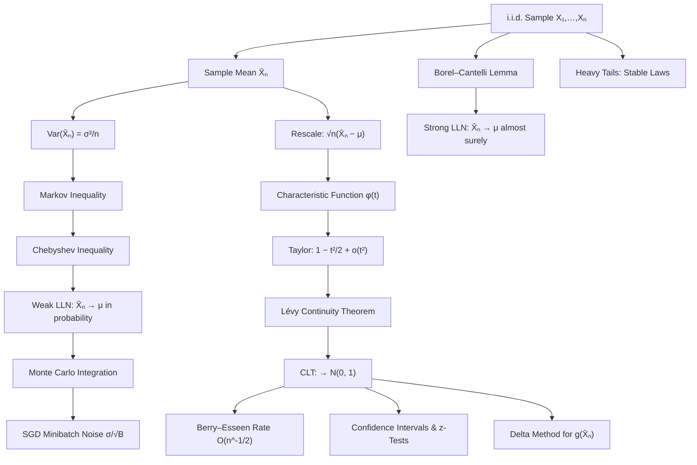

# Module 08 — Law of Large Numbers and the Central Limit Theorem

Averaging is the most reused operation in quantitative science, and the two limit theorems of this module explain exactly why it works. The **law of large numbers** (LLN) says that the sample mean $\bar{X}_n = \frac{1}{n}\sum_{i=1}^n X_i$ of i.i.d. observations converges to the population mean $\mu$: randomness averages out, and empirical frequencies become probabilities. The **central limit theorem** (CLT) is the sharper second-order statement: the residual fluctuation $\bar{X}_n - \mu$, magnified by $\sqrt{n}$, converges in distribution to a Gaussian with variance $\sigma^2$, *whatever the shape of the underlying law*. The first theorem licenses estimation; the second quantifies its error.

The two theorems live on different notions of convergence, and keeping them apart is essential. The weak LLN asserts convergence *in probability* — for each fixed tolerance, the chance of a bad average vanishes. The strong LLN asserts *almost sure* convergence — with probability one the whole trajectory $n \mapsto \bar{X}_n$ eventually stays inside any tolerance forever. The CLT asserts *convergence in distribution* — only the shape of the rescaled law converges, not the random variables themselves. The hierarchy runs almost sure $\Rightarrow$ in probability $\Rightarrow$ in distribution, with no implication running backwards in general.

Downstream, these results are the license behind Monte Carlo integration (dimension-free $O(n^{-1/2})$ error), behind stochastic gradient descent (a minibatch gradient is an unbiased estimator whose noise scales as $\sigma/\sqrt{B}$), behind confidence intervals and $z$-tests, and behind the ubiquity of Gaussian noise models in physics, where thermal noise, diffusion and measurement error are all sums of many small independent contributions.

The module also draws the boundary. Each hypothesis fails somewhere real: Cauchy summands defeat averaging outright, infinite-variance summands converge to $\alpha$-stable laws instead of Gaussians, and non-identically-distributed summands need a Lindeberg condition. A $\sigma/\sqrt{n}$ error bar computed outside the theorems' range is not conservative, it is wrong.

> [!NOTE]
> The CLT is a statement about the *rescaled* deviation $\sqrt{n}(\bar{X}_n - \mu)$, not about $\bar{X}_n$ itself. The sample mean collapses to a point mass at $\mu$; only after magnifying its fluctuation by $\sqrt{n}$ does a nondegenerate Gaussian appear — which is why the working form of the theorem is $\bar{X}_n \approx \mathcal{N}(\mu, \sigma^2/n)$.

## Prerequisites

- [`../../calculus/09_taylor_and_power_series/`](../../calculus/09_taylor_and_power_series/) — second-order Taylor expansion with an explicit remainder, the engine of the characteristic-function proof.
- [`../06_expectation_variance_and_moments/`](../06_expectation_variance_and_moments/) — expectation, variance, and the Markov and Chebyshev inequalities.

Also assumed in passing: the Gaussian density from [`../05_continuous_distributions/`](../05_continuous_distributions/), which is the CLT's limit law.

**Downstream.** This module unlocks:

- [`../09_maximum_likelihood_and_map_estimation/`](../09_maximum_likelihood_and_map_estimation/) — asymptotic normality of the MLE is the CLT plus the delta method.
- [`../../optimization/08_stochastic_optimization_for_ml/`](../../optimization/08_stochastic_optimization_for_ml/) — minibatch noise, step-size schedules, and variance reduction.

## Learning outcomes

After working through this module you can:

- Distinguish convergence in probability, almost sure convergence and convergence in distribution, and state which theorem uses which.
- Derive Markov and Chebyshev from a pointwise indicator bound, and use Chebyshev to turn a variance into an explicit sample size.
- Prove the weak law of large numbers under finite variance, and the strong law under a fourth moment via Borel–Cantelli.
- Prove the Lindeberg–Lévy CLT by characteristic functions, naming the exact place each hypothesis is used.
- Convert the CLT into a finite-sample guarantee with Berry–Esseen, and explain why no universal threshold such as $n \ge 30$ can exist.
- Apply Slutsky, the continuous mapping theorem and the delta method to studentize an estimator or transform it.
- Budget a Monte Carlo, A/B test or minibatch size from a target standard error.
- Identify where the theorems fail: infinite variance, an undefined mean, and dominant summands in a triangular array.

## Concept map

## Notation

Drawn from [`../../docs/notation.md`](../../docs/notation.md).

| Symbol | Meaning | Convention fixed here |
|---|---|---|
| $X_1, X_2, \ldots$ | i.i.d. sequence | uppercase; realizations lowercase |
| $S_n$, $\bar{X}_n$ | sum $\sum_{i=1}^n X_i$ and sample mean $S_n/n$ | the bar always means division by $n$ |
| $\mu$, $\sigma^2$ | $E[X_1]$ and $\operatorname{Var}(X_1)$ | population quantities, never sample ones |
| $S_n^2$ | sample variance, divisor $n-1$ | distinct from the sum $S_n$ by the square |
| $\rho$ | third absolute central moment $E\vert X_1-\mu\vert^3$ | Berry–Esseen numerator |
| $\varphi_X(t)$ | characteristic function $E[e^{itX}]$ | `\varphi`; the normal density is named separately |
| $\Phi$ | standard normal CDF | $z_{1-\alpha/2}$ is its upper quantile |
| $\mathcal{N}(\mu, \sigma^2)$ | Gaussian law | second argument is the **variance** (covariance in the vector case) |
| $\xrightarrow{P}$, $\xrightarrow{d}$, $\xrightarrow{\text{a.s.}}$ | convergence modes | always label the arrow |
| $O_P(1)$, $o_P(1)$ | stochastically bounded, vanishing in probability | Definition 3.5 |

## Core results

| Result | Statement | Hypotheses that cannot be dropped |
|---|---|---|
| Theorem 4.1 (Markov) | $P(Y \ge a) \le E[Y]/a$ | $Y \ge 0$ and $a \gt 0$ |
| Theorem 4.2 (Chebyshev) | $P(\vert X-\mu\vert \ge \varepsilon) \le \sigma^2/\varepsilon^2$ | $\sigma^2 \lt \infty$, else the bound is vacuous |
| Theorem 4.3 (weak LLN) | $\bar{X}_n \xrightarrow{P} \mu$ | i.i.d. and $E\vert X_1\vert \lt \infty$ |
| Theorem 4.4 (strong LLN) | $P(\lim_n \bar{X}_n = \mu) = 1$ | $E\vert X_1\vert \lt \infty$; the threshold is sharp |
| Theorem 4.7 (CLT) | $\sqrt{n}(\bar{X}_n-\mu)/\sigma \xrightarrow{d} \mathcal{N}(0,1)$ | i.i.d. with $\sigma^2 \in (0,\infty)$ |
| Theorem 4.8 (Lindeberg–Feller) | row sums of a triangular array are asymptotically $\mathcal{N}(0,1)$ | Lindeberg condition: no summand owns a fixed share of the variance |
| Theorem 4.10 (Berry–Esseen) | $\sup_x \vert P(Z_n \le x)-\Phi(x)\vert \le C\rho/(\sigma^3\sqrt{n})$, $C \lt 0.4748$ | finite third absolute moment $\rho$ |
| Theorem 4.11 (Slutsky) | $X_n \xrightarrow{d} X$, $Y_n \xrightarrow{P} c$ give $X_nY_n \xrightarrow{d} cX$ | the limit $c$ must be a **constant** |
| Theorem 4.13 (delta method) | $\sqrt{n}(g(T_n)-g(\theta)) \xrightarrow{d} \mathcal{N}(0,\sigma^2[g'(\theta)]^2)$ | $g$ differentiable at $\theta$ with $g'(\theta) \ne 0$ |

## Common misconceptions

| Misconception | Mathematical Reality | Correct Mental Model |
|---|---|---|
| *"The law of averages means a coin owes me heads after a run of tails."* | Independence means the conditional law of $X_{n+1}$ given the past has no memory; deviations are *diluted* by new data, never *compensated*. | The absolute surplus $S_n - n\mu$ typically grows like $\sqrt{n}$; only the ratio to $n$ shrinks. |
| *"The CLT says $\bar{X}_n$ becomes normal."* | $\bar{X}_n \to \mu$ degenerately; only $\sqrt{n}(\bar{X}_n - \mu)$ has a nondegenerate normal limit. | The CLT is a statement about the magnified error, used in practice as $\bar{X}_n \approx \mathcal{N}(\mu, \sigma^2/n)$. |
| *"The CLT needs $n \ge 30$."* | No universal threshold exists; the Berry–Esseen bound scales with $\rho/(\sigma^3\sqrt{n})$, so skewed or heavy-tailed laws may need thousands of samples. | Required $n$ depends on the third-moment ratio, not on folklore constants. |
| *"The CLT applies to any distribution."* | Finite variance is required. Cauchy averages have exactly the Cauchy law for all $n$; $\alpha$-stable limits replace the Gaussian when $\alpha \lt 2$. | Universality holds inside the finite-variance basin of attraction only. |
| *"Weak and strong LLN are the same because both say $\bar{X}_n \to \mu$."* | Convergence in probability permits infinitely many rare excursions; almost sure convergence forbids them beyond a random index. | Weak = each snapshot is good; strong = the whole trajectory settles. |
| *"More Monte Carlo samples give linearly better accuracy."* | The standard error is $\sigma/\sqrt{n}$, so error halves only when $n$ quadruples. | Buy accuracy with variance reduction — control variates, antithetics, QMC — not brute-force $n$. |
| *"The sample variance can be plugged into the CLT for free."* | Replacing $\sigma$ by $S_n$ requires Slutsky's theorem; for small $n$ under normality the exact law is Student-$t$, not standard normal. | Studentization is justified asymptotically; small samples need the $t$ correction. |

## Exercise index

[`exercises.ipynb`](exercises.ipynb) contains **20 fully solved problems** in four tiers.

| Tier | Count | Problems |
|---|---|---|
| **L0 — Concept Checks** | 4 | Weak versus strong; what the CLT does and does not say; a Chebyshev bound for coin flips; which distributions are excluded. |
| **L1 — Foundations** | 6 | Sample size from Chebyshev, Hoeffding and the CLT; variance of the sample mean under correlation; binomial normal approximation with continuity correction; exponential sums versus the exact Gamma law; the delta method in action; convergence in probability implies convergence in distribution. |
| **L2 — Applications (AI/ML and Physics)** | 6 | Photon counting, shot noise and the exposure budget; minibatch gradient noise and the linear scaling rule; A/B test sizing for a model deployment; random walk to diffusion and the heat kernel; why He initialization keeps deep networks alive; control variates and antithetic variates. |
| **L3 — Challenge Proofs** | 4 | Berry–Esseen and the rare-event sample size; the Cauchy distribution defeats averaging; from Chernoff to Hoeffding; when does a weighted average obey a CLT (Lindeberg–Feller). |

Physics content in L2: photon shot noise and the detector exposure budget (L2.1), and the random-walk-to-diffusion derivation of the heat kernel (L2.4).

## References

| Source | Chapters / sections | Coverage |
|---|---|---|
| Blitzstein & Hwang, *Introduction to Probability*, 2nd ed. | Ch. 10 | Inequalities, LLN and CLT with intuition-first exposition. |
| Wasserman, *All of Statistics* | Ch. 5 (Thms 5.5–5.13) | Convergence modes, Slutsky, delta method, compact proofs. |
| Casella & Berger, *Statistical Inference*, 2nd ed. | §5.5, §10.1 | Convergence concepts and asymptotic evaluation of estimators. |
| Billingsley, *Probability and Measure*, 3rd ed. | §6, §26 (Thm 26.3), §27 (Thm 27.2) | Borel–Cantelli, Lévy continuity, Lindeberg CLT. |
| Durrett, *Probability: Theory and Examples*, 5th ed. | §2.4 (Thm 2.4.1), §3.4 | Kolmogorov's SLLN, triangular arrays, stable laws. |
| Feller, *An Introduction to Probability Theory*, Vol. 2, 2nd ed. | §XVI.5, Ch. XVII | Berry–Esseen, Edgeworth expansions, domains of attraction. |
| Boucheron, Lugosi & Massart, *Concentration Inequalities* | Ch. 2–6 | Hoeffding, Bernstein, bounded-difference finite-sample bounds. |
| Bishop, *Pattern Recognition and Machine Learning* | §2.3 | The Gaussian as the limit of sums, in an ML setting. |
| Murphy, *Probabilistic Machine Learning: An Introduction* | Ch. 2, Ch. 8 | Monte Carlo approximation and SGD noise. |
