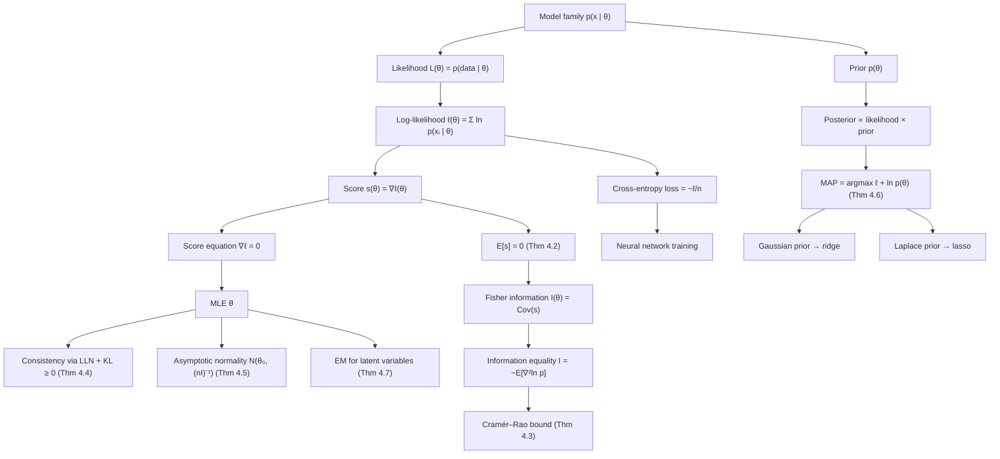

# Module 09 — Maximum Likelihood and MAP Estimation

Estimation reverses the direction of probability. A probability model says how data $x$ arise given a parameter $\theta$; estimation asks which $\theta$ best explains data already in hand. **Maximum likelihood** answers by reading the sampling density backwards — as the likelihood $L(\theta) = p(x \mid \theta)$, a function of $\theta$ with $x$ frozen — and taking its maximizer. Because logarithms turn products into sums, the working object is the log-likelihood $\ell(\theta) = \sum_{i=1}^{n} \ln p(x_i \mid \theta)$, whose gradient is the **score** and whose negative Hessian is the **observed information**. Those two objects run both the optimization and the error bars.

**Maximum a posteriori** estimation adds a prior. Bayes' rule gives $p(\theta \mid x) \propto p(x \mid \theta)\,p(\theta)$, so the MAP estimator maximizes $\ell(\theta) + \ln p(\theta)$. The extra term is exactly a regularizer: a Gaussian prior produces a ridge penalty, a Laplace prior a lasso penalty, a Dirichlet prior additive smoothing of counts. Every weight-decay coefficient is a prior variance in disguise. Because $\ell$ grows like $n$ while $\ln p(\theta)$ stays $O(1)$, MAP and MLE agree in the limit — the data eventually outvote the prior.

The theory here is unusually complete. The score has mean zero, its covariance is the **Fisher information** $I(\theta)$, and the information equality $I(\theta) = -\mathbb{E}[\nabla^2 \ln p]$ identifies variance with curvature. The **Cramér–Rao bound** then says no unbiased estimator can beat $[nI(\theta)]^{-1}$, and under regularity the MLE attains that bound asymptotically. Consistency comes from the law of large numbers applied to $\ell$ together with the non-negativity of KL divergence: maximizing likelihood *is* minimizing divergence from the empirical law to the model. That identity is the bridge to machine learning — cross-entropy loss is negative log-likelihood, and fitting a classifier is maximum likelihood.

> [!NOTE]
> **Curvature is information.** Under regularity conditions (R1)–(R5), $I(\theta) = \operatorname{Cov}\left(s(\theta; X)\right) = -\mathbb{E}\left[\nabla_\theta^2 \ln p(X \mid \theta)\right]$, so a sharply peaked log-likelihood and a low-variance score are the same fact. Everything downstream — the Cramér–Rao bound $\operatorname{Var}(T) \ge [g'(\theta)]^2 / (nI(\theta))$ and the limit $\sqrt{n}(\hat\theta_n - \theta_0) \xrightarrow{d} \mathcal{N}\left(0, I(\theta_0)^{-1}\right)$ — is a consequence of that one identity.

## Prerequisites

| Needed first | Why |
|---|---|
| [calculus/12 — Hessian, Jacobian, Curvature](../../calculus/12_hessian_jacobian_curvature/) | The score equation is a stationarity condition; observed information is a Hessian, and invariance arguments need Jacobians. |
| [probability_statistics/07 — Joint Distributions and the Multivariate Normal](../../probability_statistics/07_joint_distributions_and_multivariate_normal/) | Multiparameter likelihoods, covariance MLEs, and the Gaussian limit law all live in $\mathbb{R}^d$. |
| [probability_statistics/08 — Law of Large Numbers and CLT](../../probability_statistics/08_law_of_large_numbers_and_clt/) | Consistency is an LLN statement about $\ell_n/n$; asymptotic normality is a CLT applied to the score. |

**Downstream — what this unlocks**

| Next | What it uses from here |
|---|---|
| [probability_statistics/10 — Bayesian Inference](../10_bayesian_inference/) | The posterior, its mode, and the large-sample normal approximation centred at $\hat\theta$. |
| [information_theory/03 — Cross-Entropy and Loss Functions](../../information_theory/03_cross_entropy_and_loss_functions/) | Cross-entropy loss derived as normalized negative log-likelihood. |

## Learning outcomes

- Write the likelihood and log-likelihood of an i.i.d. model, and solve the score equation in closed form for the Bernoulli, Poisson, Gaussian, and exponential families.
- Compute $I(\theta)$ two ways — as $\operatorname{Cov}(s)$ and as $-\mathbb{E}[\nabla^2 \ln p]$ — and state the hypotheses that make the two agree.
- State the Cramér–Rao bound with its full hypotheses, use it to certify an estimator efficient, and explain why $\operatorname{Unif}(0,\theta)$ beats it without contradiction.
- Prove consistency of the MLE from identifiability plus $D_{\mathrm{KL}} \ge 0$, and asymptotic normality from a Taylor expansion of the score.
- Convert a prior into a penalty and back: Gaussian $\leftrightarrow$ ridge with $\lambda = \sigma^2/\tau^2$, Laplace $\leftrightarrow$ lasso with $\lambda = 2\sigma^2/b$, Beta $\leftrightarrow$ additive smoothing.
- Run one EM iteration by hand on a two-component mixture and say why the likelihood cannot decrease.
- Report an asymptotic confidence interval from the observed information, and recognize when misspecification forces the sandwich covariance instead.

## Concept map

## Notation

| Symbol | Meaning | Convention |
|---|---|---|
| $L(\theta)$, $\ell(\theta)$ | likelihood, log-likelihood | $\ell = \ln L$; the data are fixed, $\theta$ varies |
| $\hat{\theta}$, $\theta_0$ | estimator, true parameter | $\hat\theta_n$ when the sample size matters |
| $s(\theta; x)$ | score $\nabla_\theta \ln p(x \mid \theta)$ | one observation; $s_n$ for the sample sum |
| $I(\theta)$ | Fisher information | per observation; the sample carries $nI(\theta)$. Not mutual information $I(X; Y)$ |
| $J_n(\theta)$ | observed information $-\nabla^2 \ell_n$ | random; $\mathbb{E}[J_n] = nI(\theta)$ |
| $p(\theta \mid x)$ | posterior density | `\mid`, never a raw pipe |
| $\mathcal{N}(\mu, \Sigma)$ | Gaussian | second argument is the **covariance** |
| $D_{\mathrm{KL}}(p \parallel q)$ | Kullback–Leibler divergence | `\parallel` |
| $\xrightarrow{P}$, $\xrightarrow{d}$ | convergence in probability, in distribution | always label the arrow |
| $\lVert w \rVert_2$, $\lVert w \rVert_1$ | Euclidean and $\ell_1$ norms | `\lVert … \rVert` |

## Core results

| # | Result | Statement | Hypotheses |
|---|---|---|---|
| Theorem 4.1 | Invariance of the MLE | $\widehat{g(\theta)} = g(\hat\theta)$ for any $g$ | none — it is a statement about suprema |
| Theorem 4.2 | Score identities | $\mathbb{E}[s] = 0$ and $I(\theta) = \operatorname{Cov}(s) = -\mathbb{E}[\nabla^2 \ln p]$ | (R1)–(R3): fixed support, $C^2$ density, differentiation under the integral |
| Theorem 4.3 | Cramér–Rao bound | $\operatorname{Var}_\theta(T) \ge [g'(\theta)]^2 / (nI(\theta))$ | (R1)–(R3), (R5); $T$ unbiased for $g(\theta)$ at every $\theta$; finite variance |
| Theorem 4.4 | Consistency | $\hat\theta_n \xrightarrow{P} \theta_0$ | identifiability, compact $\Theta$, continuity in $\theta$, integrable envelope |
| Theorem 4.5 | Asymptotic normality | $\sqrt{n}(\hat\theta_n - \theta_0) \xrightarrow{d} \mathcal{N}(0, I(\theta_0)^{-1})$ | (R1)–(R5), interior $\theta_0$, dominated third derivatives |
| Theorem 4.6 | MAP is penalized likelihood | Gaussian prior gives $\lambda = \sigma^2/\tau^2$; Laplace gives $\lambda = 2\sigma^2/b$; Beta gives $\hat p = (k+\alpha-1)/(n+\alpha+\beta-2)$ | Gaussian noise, known $\sigma^2$, unscaled objective; $\alpha, \beta \gt 1$ |
| Theorem 4.7 | EM monotonicity | $\ell(\theta^{(t+1)}) \ge \ell(\theta^{(t)})$ | exact E-step, M-step attains its maximum |
| Theorems 4.9–4.10 | Rao–Blackwell, Lehmann–Scheffé | conditioning on a sufficient $T$ cannot raise variance; completeness makes the result the unique UMVUE | sufficiency, finite second moment; completeness for uniqueness |

## Common misconceptions

| Misconception | Mathematical reality | Correct mental model |
|---|---|---|
| *"The MLE is the most probable parameter value."* | $L(\theta) = p(x \mid \theta)$ is a density in $x$, not in $\theta$; with no prior there is no probability statement about $\theta$ at all. | MLE maximizes how well $\theta$ predicts the data; only MAP maximizes $p(\theta \mid x)$. |
| *"MLE is unbiased."* | The Gaussian variance MLE is $\frac{1}{n}\sum (x_i - \bar{x})^2$, low by the factor $(n-1)/n$; invariance under reparameterization forces bias in general. | MLE is consistent and asymptotically unbiased; exact unbiasedness is neither claimed nor typical. |
| *"Higher likelihood means a better model."* | Likelihood rises monotonically with model flexibility, and mixture likelihoods are unbounded as $\sigma \to 0$ at a data point. | Compare with penalized criteria, held-out likelihood, or the Bayesian evidence. |
| *"MAP is Bayesian inference."* | MAP returns one point, throws away the posterior's spread, and moves under nonlinear reparameterization while the posterior does not (Problem L3.3). | MAP is regularized optimization in Bayesian clothing. |
| *"Regularization is a heuristic bolted onto the loss."* | With data term $\lVert y - Xw \rVert_2^2$, the penalty $\lambda \lVert w \rVert_2^2$ is exactly $-2\sigma^2 \ln p(w)$ for $w \sim \mathcal{N}(0, \tau^2 I)$ with $\lambda = \sigma^2/\tau^2$. | Every penalty is a log-prior; tuning $\lambda$ is choosing prior confidence. |
| *"The Cramér–Rao bound applies to any estimator."* | It bounds estimators unbiased at every $\theta$ in a **regular** model; $\operatorname{Unif}(0,\theta)$ violates (R1) and its MLE converges at rate $n^{-1}$. | The bound constrains a class, not accuracy in general — bias buys variance. |
| *"MLE always has a closed form."* | Only models with simple sufficient statistics do; logistic regression, mixtures, and neural nets need Newton, IRLS, EM, or SGD. | The score equation is a nonlinear system to be solved numerically. |

## Exercise index

[`exercises.ipynb`](exercises.ipynb) holds 20 fully solved problems.

| Tier | Count | Contents |
|---|---|---|
| L0 — Concept Checks | 4 | Likelihood is not a density in $\theta$; three heads out of three; bias of the variance MLE; MLE vs MAP vs posterior mean. |
| L1 — Foundations | 6 | Exponential rate with a Fisher-information interval; the non-regular $\operatorname{Unif}(0,\theta)$; Poisson efficiency; invariance in practice; multivariate Gaussian mean and covariance; Beta-prior MAP converging to the MLE. |
| L2 — Applications (AI/ML and Physics) | 6 | Logistic-regression score and Hessian and why separation diverges; OLS as MLE and ridge as MAP; softmax cross-entropy with label smoothing as a Dirichlet prior; lasso from a Laplace prior and soft thresholding; a decay constant from timestamped events; EM separating a spectral line from background. |
| L3 — Challenge Proofs | 4 | Efficiency and the bound for a nonlinear function; misspecification and the sandwich covariance; failure of MAP reparameterization invariance; Wilks' theorem. |

The two physics problems the tier name promises are L2.5 (radioactive decay constant from event timestamps) and L2.6 (EM applied to a spectral line over background).

## References

- Casella, G., & Berger, R. L. *Statistical Inference*, 2nd ed. — §6.2 (Thm 6.2.6, factorization), §7.3 (Thm 7.3.9, Cramér–Rao), Ch. 10 (asymptotic evaluations).
- Lehmann, E. L., & Casella, G. *Theory of Point Estimation*, 2nd ed. — §1.6 (Thm 6.5), §2.1 (Rao–Blackwell; Thm 1.11, Lehmann–Scheffé).
- Wasserman, L. *All of Statistics* — Ch. 9 (Thm 9.18, asymptotic normality of the MLE), Ch. 11 (Bayesian inference).
- van der Vaart, A. W. *Asymptotic Statistics* — Ch. 5 (Thm 5.39, M-estimators), Ch. 8, Ch. 16 (Thm 16.7, Wilks).
- Bishop, C. M. *Pattern Recognition and Machine Learning* — §1.2, §3.1–3.4, §9.3–9.4 (EM and its variational bound).
- Murphy, K. P. *Probabilistic Machine Learning: An Introduction* — Ch. 4, Ch. 11 (MLE/MAP, ridge and lasso).
- Gelman, A., et al. *Bayesian Data Analysis*, 3rd ed. — Ch. 2, Ch. 4 (normal approximation to the posterior).
- Goodfellow, I., Bengio, Y., & Courville, A. *Deep Learning* — Ch. 5 (§5.5, §5.6, maximum likelihood as the origin of ML losses).
