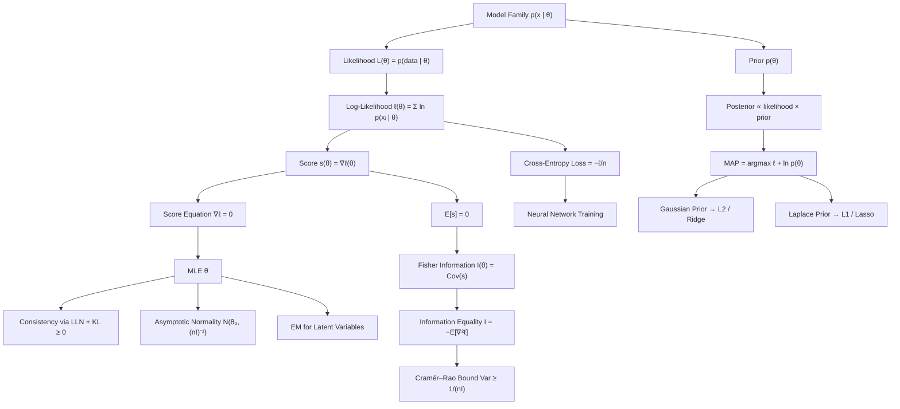

# Topic 09: Maximum Likelihood and MAP Estimation

## 1. Master Overview

Estimation reverses the direction of probability. A probability model tells us how data $x$ arise given parameters $\theta$; estimation asks which $\theta$ best explains observed data. **Maximum likelihood estimation** (MLE) answers by treating the sampling density as a function of $\theta$ with $x$ held fixed — the *likelihood* $L(\theta) = p(x \mid \theta)$ — and selecting the maximizer. Because the log turns products into sums and matches the curvature machinery of calculus, the practical object is the log-likelihood $\ell(\theta) = \sum_{i=1}^n \ln p(x_i \mid \theta)$, whose gradient (the **score**) and negative Hessian (the **observed information**) drive both the optimization and the uncertainty quantification.

**Maximum a posteriori** (MAP) estimation adds a prior. By Bayes' rule the posterior satisfies $p(\theta \mid x) \propto p(x \mid \theta)\,p(\theta)$, and the MAP estimator maximizes $\ell(\theta) + \ln p(\theta)$. The extra term is exactly a regularizer: a Gaussian prior yields ridge ($L^2$) penalties, a Laplace prior yields lasso ($L^1$) penalties, a Dirichlet prior yields additive smoothing of categorical counts. Every weight-decay coefficient in a deep network is a prior variance in disguise. As $n$ grows the log-likelihood scales like $n$ while $\ln p(\theta)$ stays $O(1)$, so MAP and MLE converge — the data eventually overwhelm the prior.

The theory of MLE is unusually complete. The score has mean zero, its covariance is the **Fisher information** $I(\theta)$, and the information equality $I(\theta) = -E[\nabla^2 \ell]$ links variance to curvature. The **Cramér–Rao bound** says no unbiased estimator can beat $I(\theta)^{-1}/n$, and under regularity the MLE attains it asymptotically: $\sqrt{n}(\hat\theta_n - \theta_0) \xrightarrow{d} \mathcal{N}(0, I(\theta_0)^{-1})$. Consistency follows from the law of large numbers applied to the log-likelihood together with the non-negativity of KL divergence — maximizing likelihood is minimizing KL divergence from the empirical distribution to the model. That last identity is the bridge to machine learning: cross-entropy loss *is* negative log-likelihood, and training a classifier *is* maximum likelihood.

> [!NOTE]
> MLE is not "the most probable parameter". The likelihood is a function of $\theta$ but not a density in $\theta$ — it need not integrate to anything finite. Only after multiplying by a prior and normalizing does one obtain a probability statement about $\theta$; that object is the posterior, and its mode is the MAP estimate.

## 2. First-Principles Framework

- **Phenomenon**: Data are generated by a mechanism with unknown parameters — a coin's bias, a sensor's noise level, a network's weights — and only finitely many noisy observations are available.
- **Goal**: Choose the parameter value best supported by the data, quantify how sharply the data pin it down, and incorporate prior knowledge when data are scarce.
- **Governing Equation (MLE)**: $\hat\theta_{\text{MLE}} = \arg\max_\theta \ell(\theta)$ with $\ell(\theta) = \sum_{i=1}^n \ln p(x_i \mid \theta)$, characterized at interior maxima by the score equation $\nabla_\theta \ell(\hat\theta) = 0$.
- **Governing Equation (MAP)**: $\hat\theta_{\text{MAP}} = \arg\max_\theta \left[\ell(\theta) + \ln p(\theta)\right]$ — likelihood plus log-prior, i.e. loss plus regularizer.
- **Uncertainty Law**: $I(\theta) = E\left[\nabla\ell_1 \nabla\ell_1^{\top}\right] = -E\left[\nabla^2 \ell_1\right]$, giving $\operatorname{Var}(\hat\theta) \approx \left[nI(\theta)\right]^{-1}$ — sharp curvature means precise estimates.
- **Information Identity**: $\arg\max_\theta \ell(\theta) = \arg\min_\theta D_{\text{KL}}\left(\hat{p}_n \,\Vert\, p_\theta\right)$, so likelihood maximization is divergence minimization against the empirical law.

## 3. Mermaid Concept Map

## 4. Common Misconceptions

| Misconception | Mathematical Reality | Correct Mental Model |
|---|---|---|
| *"The MLE is the most probable parameter value."* | $L(\theta) = p(x \mid \theta)$ is a density in $x$, not in $\theta$; without a prior no probability statement about $\theta$ exists. | MLE maximizes how well $\theta$ predicts the data; MAP maximizes the posterior $p(\theta \mid x)$. |
| *"MLE is always unbiased."* | The Gaussian variance MLE is $\hat\sigma^2 = \frac{1}{n}\sum (x_i - \bar{x})^2$, biased low by the factor $\frac{n-1}{n}$; invariance under reparameterization forces bias in general. | MLE is *consistent* and *asymptotically* unbiased; exact unbiasedness is neither claimed nor typical. |
| *"Higher likelihood always means a better model."* | Likelihood increases monotonically with model flexibility; unpenalized maximization overfits, and mixture likelihoods can be unbounded ($\sigma \to 0$ at a data point). | Compare models with penalized criteria (AIC, BIC), held-out likelihood, or full Bayesian evidence. |
| *"MAP is a Bayesian method."* | MAP returns a single point, discards the posterior's spread, and is not invariant under reparameterization (the mode moves under nonlinear maps, the posterior does not). | MAP is regularized optimization wearing Bayesian clothing; genuine Bayesian inference reports the whole posterior. |
| *"Regularization is a heuristic bolted onto the loss."* | $\lambda \Vert w\Vert_2^2$ is precisely $-\ln p(w)$ for $w \sim \mathcal{N}(0, \sigma_p^2 I)$ with $\lambda = 1/(2\sigma_p^2)$. | Every penalty is a log-prior; tuning $\lambda$ is choosing prior confidence. |
| *"The Cramér–Rao bound applies to any estimator."* | It bounds *unbiased* estimators under regularity; biased estimators (ridge, James–Stein) routinely achieve lower mean squared error. | The bound constrains a trade-off, not absolute accuracy — bias buys variance. |
| *"MLE always has a closed form."* | Only exponential families with simple sufficient statistics do; logistic regression, mixtures, and neural nets require iterative solvers (Newton, IRLS, EM, SGD). | The score equation is a system to be solved numerically in general. |

## 5. Directory Inventory

| File | Description |
|---|---|
| [`README.md`](README.md) | Master overview, first-principles framework, concept map, misconceptions, references. |
| [`first_principles.ipynb`](first_principles.ipynb) | Markdown-only theory notebook: likelihood and score, Fisher information, Cramér–Rao bound, consistency and asymptotic normality of the MLE, MAP as regularization, EM, and ML applications. |
| [`exercises.ipynb`](exercises.ipynb) | 20 fully solved problems in 4 levels: Concept Check (4), Foundation (6), Applications in AI/ML & Physics (6), Challenge (4). |

## 6. References

- **Casella, G., & Berger, R. L.** *Statistical Inference*, 2nd ed. (Chapters 7, 10: Point Estimation, Asymptotic Evaluations).
- **Wasserman, L.** *All of Statistics* (Chapters 9, 11: Parametric Inference, Bayesian Inference).
- **Bishop, C. M.** *Pattern Recognition and Machine Learning* (Sections 1.2, 3.1–3.4, 9.3–9.4: likelihood, regularization, EM).
- **Murphy, K. P.** *Probabilistic Machine Learning: An Introduction* (Chapters 4, 11: statistics, linear regression, MAP).
- **Lehmann, E. L., & Casella, G.** *Theory of Point Estimation*, 2nd ed. (Chapters 2, 6: sufficiency, asymptotic efficiency).
- **Gelman, A., et al.** *Bayesian Data Analysis*, 3rd ed. (Chapters 2, 4: single-parameter models, large-sample normal approximation).
- **van der Vaart, A. W.** *Asymptotic Statistics* (Chapters 5, 8: M-estimators, efficiency, LAN theory).
- **Blitzstein, J. K., & Hwang, J.** *Introduction to Probability*, 2nd ed. (Chapter 8: conditional expectation and estimation intuition).
- **Goodfellow, I., Bengio, Y., & Courville, A.** *Deep Learning* (Chapter 5: maximum likelihood, MAP, and regularization in learning).
