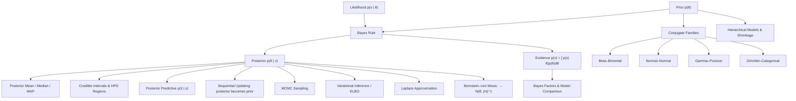

# Topic 10: Bayesian Inference

## 1. Master Overview

Bayesian inference treats unknown parameters as random variables and describes knowledge about them with probability distributions. Before data arrive, beliefs live in the **prior** $p(\theta)$; the model supplies the **likelihood** $p(x \mid \theta)$; and Bayes' theorem combines them into the **posterior** $p(\theta \mid x) = p(x \mid \theta)p(\theta)/p(x)$. The denominator, the **marginal likelihood** or **evidence** $p(x) = \int p(x \mid \theta)p(\theta)\,d\theta$, normalizes the result and simultaneously scores the model as a whole. Everything a Bayesian reports — point estimates, intervals, predictions, model comparisons — is a functional of the posterior.

The structural advantages are three. First, uncertainty is *propagated* rather than discarded: instead of plugging a point estimate into a downstream prediction, one integrates over the posterior, giving the **posterior predictive** $p(\tilde{x} \mid x) = \int p(\tilde{x} \mid \theta)p(\theta \mid x)\,d\theta$. Second, inference is *sequential*: yesterday's posterior is today's prior, and the same update rule handles a stream of observations, which is exactly what recursive filters and online learners need. Third, small-data regimes degrade gracefully, because the prior supplies structure where the data are silent — three heads out of three no longer imply that tails is impossible.

The costs are equally clear. The evidence integral is intractable outside special cases, so practical Bayesian computation is the art of avoiding it: **conjugate priors** give closed-form posteriors within an exponential family; **Markov chain Monte Carlo** samples the posterior without normalizing it; **variational inference** replaces integration with optimization of a lower bound; and the **Laplace approximation** fits a Gaussian at the mode. Asymptotically the prior washes out entirely — the Bernstein–von Mises theorem shows the posterior converges to $\mathcal{N}(\hat\theta_{\text{MLE}}, (nI)^{-1})$, so Bayesian and frequentist answers agree in the large-data limit and differ exactly where it matters: when data are scarce, models are hierarchical, or decisions must account for uncertainty.

> [!NOTE]
> A Bayesian credible interval and a frequentist confidence interval answer different questions. A $95\%$ credible interval $C$ satisfies $P(\theta \in C \mid x) = 0.95$ — a probability statement about $\theta$ given the observed data. A confidence interval satisfies $P(\theta \in C(X)) = 0.95$ over hypothetical repetitions with $\theta$ fixed. The two coincide asymptotically but can differ sharply in small samples.

## 2. First-Principles Framework

- **Phenomenon**: Decisions must be made from limited, noisy data while prior structural knowledge (physics, past experiments, plausible ranges) is available and should not be thrown away.
- **Goal**: Represent all uncertainty about unknowns as a probability distribution, update it coherently as evidence arrives, and propagate it into predictions and decisions.
- **Governing Equation**: $p(\theta \mid x) = \dfrac{p(x \mid \theta)\,p(\theta)}{p(x)}$, i.e. posterior $\propto$ likelihood $\times$ prior, with $p(x) = \int p(x \mid \theta)p(\theta)\,d\theta$.
- **Prediction Law**: $p(\tilde{x} \mid x) = \int p(\tilde{x} \mid \theta)\,p(\theta \mid x)\,d\theta$ — average predictions over the posterior instead of plugging in a point estimate.
- **Sequential Structure**: $p(\theta \mid x_{1:n}) \propto p(x_n \mid \theta)\,p(\theta \mid x_{1:n-1})$, so batch and online updating agree exactly.
- **Decision Rule**: choose $a$ minimizing posterior expected loss $\int L(\theta, a)\,p(\theta \mid x)\,d\theta$; squared loss gives the posterior mean, absolute loss the median, $0$–$1$ loss the mode.

## 3. Mermaid Concept Map

## 4. Common Misconceptions

| Misconception | Mathematical Reality | Correct Mental Model |
|---|---|---|
| *"The prior is arbitrary, so Bayesian inference is subjective."* | The likelihood is equally a modeling choice, and the prior's influence is $O(1/n)$; sensitivity analysis makes the dependence explicit and testable. | Priors are assumptions written down and checkable, not smuggled in through model structure. |
| *"A $95\%$ confidence interval contains $\theta$ with probability $0.95$."* | That is the *credible* interval statement, $P(\theta \in C \mid x) = 0.95$; a confidence interval's probability is over repeated sampling with $\theta$ fixed. | Confidence is a property of the procedure; credibility is a property of the posterior. |
| *"Flat priors are uninformative."* | Flatness is not invariant: uniform on $\theta$ is not uniform on $\ln\theta$ or on $\theta^2$, and improper flat priors can yield improper posteriors. | "Uninformative" must be defined relative to a parameterization; Jeffreys' prior $\propto \sqrt{\det I(\theta)}$ is the invariant construction. |
| *"MAP is Bayesian inference."* | MAP returns the posterior mode, discards spread, and is not invariant under reparameterization. | MAP is regularized optimization; Bayesian inference reports the whole posterior. |
| *"Plugging $\hat\theta$ into the model gives the predictive distribution."* | $p(\tilde{x} \mid \hat\theta)$ omits parameter uncertainty and is systematically overconfident, especially for small $n$. | The posterior predictive integrates over $p(\theta \mid x)$ and is strictly wider. |
| *"More data makes the prior matter more because it keeps multiplying in."* | The prior enters exactly once; the log-likelihood grows like $n$ while $\ln p(\theta)$ stays $O(1)$. | Bernstein–von Mises: the posterior forgets the prior at rate $O(1/n)$. |
| *"Bayes factors are just likelihood ratios."* | A Bayes factor compares *marginal* likelihoods, which integrate over parameters and therefore penalize model flexibility automatically (Occam's razor). | $\text{BF} = p(x \mid M_1)/p(x \mid M_2)$ with each term an integral, not a maximum. |

## 5. Directory Inventory

| File | Description |
|---|---|
| [`README.md`](README.md) | Master overview, first-principles framework, concept map, misconceptions, references. |
| [`first_principles.ipynb`](first_principles.ipynb) | Markdown-only theory notebook: Bayes' theorem for densities, conjugate families with full derivations, posterior predictive, decision theory, Bernstein–von Mises, MCMC and variational inference, hierarchical models. |
| [`exercises.ipynb`](exercises.ipynb) | 20 fully solved problems in 4 levels: Concept Check (4), Foundation (6), Applications in AI/ML & Physics (6), Challenge (4). |

## 6. References

- **Gelman, A., Carlin, J., Stern, H., Dunson, D., Vehtari, A., & Rubin, D.** *Bayesian Data Analysis*, 3rd ed. (Chapters 1–5: single-parameter models, conjugacy, hierarchical models).
- **Wasserman, L.** *All of Statistics* (Chapter 11: Bayesian Inference).
- **Casella, G., & Berger, R. L.** *Statistical Inference*, 2nd ed. (Sections 7.2.3, 7.3.4: Bayes estimators, decision theory).
- **Bishop, C. M.** *Pattern Recognition and Machine Learning* (Chapters 2–3, 10: conjugate priors, Bayesian linear regression, variational inference).
- **Murphy, K. P.** *Probabilistic Machine Learning: Advanced Topics* (Chapters 3–4, 7, 12: Bayesian statistics, MCMC, variational inference).
- **MacKay, D. J. C.** *Information Theory, Inference, and Learning Algorithms* (Chapters 2–3, 28–29: Bayesian inference, Occam's razor, Monte Carlo).
- **Robert, C. P.** *The Bayesian Choice*, 2nd ed. (Chapters 2–4: decision theory, noninformative priors, admissibility).
- **Blitzstein, J. K., & Hwang, J.** *Introduction to Probability*, 2nd ed. (Chapters 2, 8: Bayes' rule, conjugate updates).
- **van der Vaart, A. W.** *Asymptotic Statistics* (Chapter 10: Bernstein–von Mises theorem).
