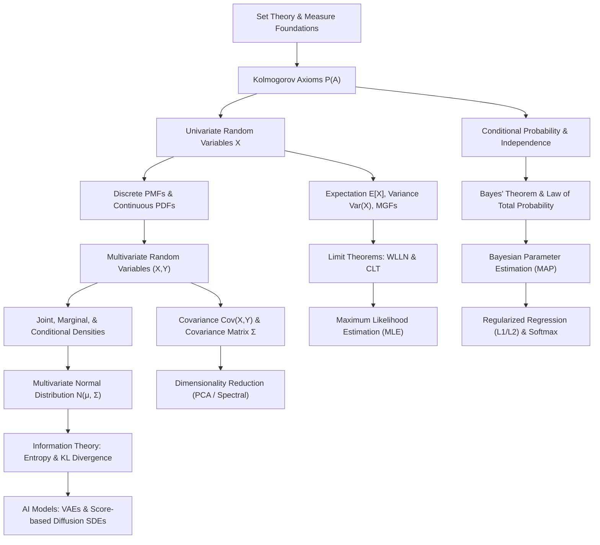

# Topic 13: Probability & Mathematical Statistics — Curriculum Module & 4-Level Exercise Package

**System:** Flexible Learning Unit System  
**Track:** Applied Mathematics + Mathematical Modeling + AI Learning Repository  
**Topic 13:** Probability & Mathematical Statistics  

---

## Part I: Curriculum Module Overview & Learning Framework

### 1. First-Principles Thinking Framework

The probabilistic modeling workflow maps physical, empirical, or machine learning uncertainty into rigorous mathematical formulations:

```text
Phenomenon (Uncertainty / Random Noise / Incomplete Data)
→ Assumptions (Independence, Stationarity, Distributional Family)
→ Variables & Parameters (Random Variables X, Mean μ, Covariance Matrix Σ, Prior θ)
→ Governing Principles (Kolmogorov Axioms, Bayes' Rule, Law of Large Numbers, CLT)
→ Mathematical Formulation (PMF / PDF / Joint Densities / Posterior Likelihood)
→ Derivation & Integration (Marginalization, MGFs, Conjugate Updates, Conditioning)
→ Computation & Estimation (MLE, MAP Optimization, Spectral Decomposition)
→ Verification & Interpretation (Bias-Variance Tradeoff, Confidence Intervals, Sensitivity)
→ AI / Machine Learning Connection (Loss Functions, KL Divergence, VAEs, Diffusion SDEs)
```

---

### 2. Concept Map & Dependency Architecture



---

### 3. Core Theoretical Pillars

| Pillar | Core Concepts | Key Governing Formula | Primary AI / Modeling Application |
|---|---|---|---|
| **1. Measure & Axioms** | Sample Space $\Omega$, Event Space $\mathcal{F}$, Kolmogorov Axioms | $P(\bigcup A_i) = \sum P(A_i)$ (Disjoint) | Foundations of probability measure |
| **2. Conditional & Bayes** | Conditioning, Partition, Bayes' Rule, Prior & Posterior | $P(\theta \mid D) = \frac{P(D \mid \theta) P(\theta)}{P(D)}$ | Bayesian Inference, Naive Bayes, Prompting |
| **3. Random Variables** | PMF/PDF, Joint/Marginal/Conditional, Transformations | $f_{Y \mid X}(y \mid x) = \frac{f_{X,Y}(x,y)}{f_X(x)}$ | Probabilistic Graphical Models, Sampling |
| **4. Moments & Limits** | Expectation, Variance, MGFs, WLLN, CLT | $\bar{X}_n \xrightarrow{d} \mathcal{N}\left(\mu, \frac{\sigma^2}{n}\right)$ | Monte Carlo Simulation, Noise Analysis |
| **5. Covariance Matrix** | Covariance $\text{Cov}(X,Y)$, Covariance Matrix $\mathbf{\Sigma}$, Geometry | $\mathbf{\Sigma} = E[(\mathbf{X}-\boldsymbol{\mu})(\mathbf{X}-\boldsymbol{\mu})^T]$ | PCA, Mahalanobis Distance, Kalman Filter |
| **6. Information & AI** | Entropy $H(P)$, Cross-Entropy Loss, KL Divergence $D_{\text{KL}}$ | $D_{\text{KL}}(P \parallel Q) = \int p \ln\left(\frac{p}{q}\right)$ | Cross-Entropy Loss, VAEs, Diffusion Models |

---

### 4. Common Misconceptions & Pitfalls

| # | Common Misconception | Mathematical Reality | Correct First-Principles Understanding |
|---|---|---|---|
| 1 | $\text{Cov}(X,Y) = 0 \implies X \perp\!\!\!\perp Y$ | False in general. Zero covariance only means no *linear* dependence. | $X \perp\!\!\!\perp Y \implies \text{Cov}(X,Y) = 0$, but the converse requires joint normality. Non-linear relationships (e.g., $Y = X^2$ for symmetric $X$) have $\text{Cov}(X,Y) = 0$ despite strong dependence. |
| 2 | For continuous $X$, $f_X(x) = P(X = x)$ | False. $P(X = x) = 0$ for any continuous point. | $f_X(x)$ is a probability *density*, not a probability. $f_X(x)$ can exceed 1 (e.g., $\text{Unif}(0, 0.5)$ has density $f(x)=2$). Probabilities exist only over non-zero length intervals: $P(x \le X \le x+dx) \approx f_X(x) dx$. |
| 3 | $P(A \mid B) + P(A \mid B^c) = 1$ | False. | The correct identity partitions the event, not the condition: $P(A \mid B) + P(A^c \mid B) = 1$. The sum $P(A \mid B) + P(A \mid B^c)$ has no fixed bound. |
| 4 | Sample variance uses $\frac{1}{n}$ to average | $S^2 = \frac{1}{n-1} \sum (X_i - \bar{X})^2$ is unbiased. | Dividing by $n$ underestimates population variance because $\bar{X}$ is closer to the sample points than $\mu$ is. Bessel's correction ($n-1$) compensates for the loss of 1 degree of freedom. |
| 5 | KL Divergence $D_{\text{KL}}(P \parallel Q)$ is a distance metric | False. $D_{\text{KL}}(P \parallel Q) \ne D_{\text{KL}}(Q \parallel P)$ and no triangle inequality. | KL divergence is asymmetric (relative entropy). Minimizing $D_{\text{KL}}(P \parallel Q)$ (mode-seeking) yields completely different fitted distributions than minimizing $D_{\text{KL}}(Q \parallel P)$ (mean-covering). |

---

## Part II: 4-Level Exercise Package

---

### Level 0 — Concept Check (Intuition & Conceptual Integrity)

#### Problem L0.1 (Why Countable Additivity?)
**Source:** Billingsley, *Probability and Measure* / Kolmogorov (1933).

Why do Kolmogorov's Axioms specify **countable additivity** ($P(\bigcup_{i=1}^\infty A_i) = \sum_{i=1}^\infty P(A_i)$ for pairwise disjoint events) instead of merely **finite additivity** ($P(A_1 \cup A_2) = P(A_1) + P(A_2)$)? What fundamental analytical limit property breaks if we only accept finite additivity?

#### Solution & First-Principles Intuition
- **First-Principles Intuition:** Probability theory must operate on continuous sample spaces $\mathbb{R}^d$ and infinite sequences of random experiments (such as flipping a coin infinitely many times or tracking a continuous particle trajectory). Continuous sets are built via limit processes of countable collections of sets. If our probability measure cannot handle infinite sums, we cannot compute the probability of events defined by limit operations, such as "a random variable eventually converges" or "the lifetime of a system exceeds $T$."
- **Formal Analysis:** Countable additivity is mathematically equivalent to the **continuity of probability measures**:
  - For a decreasing sequence of events $E_1 \supseteq E_2 \supseteq E_3 \supseteq \cdots$ with $\bigcap_{n=1}^\infty E_n = \emptyset$, countable additivity guarantees $\lim_{n \to \infty} P(E_n) = 0$.
  - Without countable additivity, standard limit theorems (such as the Law of Large Numbers, Central Limit Theorem, and dominated convergence for expectations) fail. Finite additivity allows non-measurable paradoxes where uniform distributions on integers $\mathbb{Z}^+$ cannot exist. Thus, countable additivity is the exact minimal measure-theoretic axiom required to integrate continuous densities and evaluate limits.

**Takeaway:** Countable additivity is the bridging axiom between discrete combinatorics and continuous analysis, enabling limit theorems and measure theory.

---

#### Problem L0.2 (The Geometry of Conditioning)
**Source:** Blitzstein & Hwang, *Introduction to Probability*, Ch. 2.

Intuitively explain how conditioning on an event $B$ ($P(B) > 0$) transforms the sample space $\Omega$ and probability measure $P(\cdot)$. Why does the term $P(B)$ appear in the denominator of $P(A \mid B) = \frac{P(A \cap B)}{P(B)}$?

#### Solution & First-Principles Intuition
- **First-Principles Intuition:** Think of the sample space $\Omega$ as a 2D region with total area equal to 1. An event $A$ is a sub-region. When we learn that event $B$ has occurred, any outcome outside of $B$ becomes impossible—they now have effective probability zero. Therefore, $B$ becomes our **new effective sample space**.
- **Formal Analysis:**
  1. **Restriction of Domain:** The universe of possible outcomes shrinks from $\Omega$ to $B$. Any part of $A$ outside of $B$ ($A \cap B^c$) is rendered impossible. Only the overlapping slice $A \cap B$ can occur.
  2. **Renormalization:** In the original measure, the total probability mass of the new universe $B$ was $P(B) \le 1$. To ensure that the new conditional measure $P(\cdot \mid B)$ satisfies Kolmogorov's Normalization Axiom ($P(B \mid B) = 1$), we must scale all probability masses within $B$ by the factor $\frac{1}{P(B)}$.
  3. Thus, $P(A \mid B) = \frac{P(A \cap B)}{P(B)}$ represents the **relative proportion of event $B$'s probability mass that is shared with event $A$**.

$$\boxed{P(A \mid B) = \frac{P(A \cap B)}{P(B)}}$$

**Takeaway:** Conditioning is domain restriction followed by measure normalization.

---

#### Problem L0.3 (Base Rate Fallacy in Rare Event Detection)
**Source:** Ross, *A First Course in Probability*, Ch. 3 / Kahneman & Tversky (1973).

A high-precision AI spam filter exhibits a $99\%$ True Positive Rate ($P(\text{Flag} \mid \text{Spam}) = 0.99$) and a $99\%$ True Negative Rate ($P(\text{Clean} \mid \text{Legit}) = 0.99$). In a corporate inbox, spam accounts for only $0.1\%$ of incoming emails ($P(\text{Spam}) = 0.001$).
If an email is flagged as spam by the AI filter, what is the intuitive reason why the probability that it is *actually* spam is surprisingly low? Calculate the exact posterior probability.

#### Solution & First-Principles Intuition
- **First-Principles Intuition:** Although the AI model is $99\%$ accurate on both classes, non-spam emails are vastly more common ($99.9\%$ of emails) than spam emails ($0.1\%$). Out of 10,000 emails, there are only 10 actual spam emails, but 9,990 legitimate emails. The small $1\%$ error rate applied to the enormous volume of legitimate emails produces about 100 false alarms! Thus, the true spam emails are completely diluted by false positives.
- **Formal Solution:**
  Apply Bayes' Rule:
  $$P(\text{Spam} \mid \text{Flag}) = \frac{P(\text{Flag} \mid \text{Spam}) P(\text{Spam})}{P(\text{Flag} \mid \text{Spam}) P(\text{Spam}) + P(\text{Flag} \mid \text{Legit}) P(\text{Legit})}$$
  Given:
  - $P(\text{Spam}) = 0.001 \implies P(\text{Legit}) = 0.999$
  - $P(\text{Flag} \mid \text{Spam}) = 0.99$
  - $P(\text{Flag} \mid \text{Legit}) = 1 - 0.99 = 0.01$

  Substitute values:
  $$P(\text{Spam} \mid \text{Flag}) = \frac{0.99 \times 0.001}{(0.99 \times 0.001) + (0.01 \times 0.999)} = \frac{0.00099}{0.00099 + 0.00999} = \frac{0.00099}{0.01098} \approx 0.09016 \; (9.02\%)$$

$$\boxed{P(\text{Spam} \mid \text{Flag}) \approx 9.02\%}$$

**Takeaway:** Never evaluate test accuracy without considering prior base rates.

---

#### Problem L0.4 (Density vs. Probability in Continuous Random Variables)
**Source:** Wasserman, *All of Statistics*, Ch. 2.

For a continuous random variable $X$ with PDF $f_X(x)$, explain why:
1. $P(X = 3) = 0$, yet the event $X = 3$ is not impossible.
2. $f_X(3)$ can be strictly greater than 1 (e.g., $f_X(3) = 50$).

#### Solution & First-Principles Intuition
- **First-Principles Intuition:** Imagine a dart landing on a continuous target line $[0, 1]$. There are infinitely many uncountably fine points on the line. The probability of hitting *exactly* one single predefined point (down to infinite decimal places) is 0. However, the dart must land somewhere! Probability density $f_X(x)$ represents mass per unit length (concentration), not mass itself.
- **Formal Analysis:**
  1. **Single Point Probability:** For a continuous random variable:
     $$P(X = c) = \int_{c}^{c} f_X(x)\,dx = 0$$
     Probability is defined as the area under the PDF over an interval $[a, b]$. An isolated point has measure zero (zero width), so its area is zero. Zero probability does not mean impossible; it means the event has measure zero under the continuous probability space.
  2. **PDF Values $> 1$:** The probability of falling in a tiny interval $[x, x+\Delta x]$ is $P(x \le X \le x+\Delta x) \approx f_X(x) \Delta x$. Since this product must be $\le 1$, if $\Delta x = 0.001$, then $f_X(x)$ can easily be $50$, giving a probability of $50 \times 0.001 = 0.05 \le 1$. Density is constrained only by $\int_{-\infty}^\infty f_X(x) dx = 1$, not by $f_X(x) \le 1$.

**Takeaway:** Probability density is mass concentration, not probability. Points have zero probability mass in continuous spaces.

---

#### Problem L0.5 (Uncorrelated vs. Independent)
**Source:** Demidovich, *Problems in Probability Theory* / Ross, Ch. 4.

Provide a clear concrete counterexample showing that two random variables $X$ and $Y$ can have **zero covariance** ($\text{Cov}(X,Y) = 0$) while being **strictly dependent**.

#### Solution & First-Principles Intuition
- **First-Principles Intuition:** Covariance measures *linear* relationships. If $Y$ depends on $X$ in a perfectly symmetric non-linear shape (such as a parabola $Y = X^2$), as $X$ increases in the positive direction, $Y$ increases; but as $X$ decreases in the negative direction, $Y$ also increases! The positive linear trend on the right perfectly cancels the negative linear trend on the left, yielding zero net covariance despite $Y$ being completely determined by $X$.
- **Formal Proof:**
  Let $X \sim \text{Uniform}(-1, 1)$ and define $Y = X^2$.
  1. **Check Dependence:** $P(Y \le 0.25 \mid X = 0.9) = 0$, but $P(Y \le 0.25) > 0$. Thus, $X$ and $Y$ are strongly dependent.
  2. **Compute Expectations:**
     - $E[X] = \int_{-1}^1 \frac{1}{2} x \, dx = 0$.
     - $E[XY] = E[X \cdot X^2] = E[X^3] = \int_{-1}^1 \frac{1}{2} x^3 \, dx = 0$ (integral of an odd function over a symmetric interval).
  3. **Compute Covariance:**
     $$\text{Cov}(X,Y) = E[XY] - E[X]E[Y] = 0 - 0 \cdot E[Y] = 0$$

$$\boxed{\text{Cov}(X,Y) = 0 \text{ does NOT imply } X \perp\!\!\!\perp Y}$$

**Takeaway:** Uncorrelatedness rules out linear association; independence rules out all associations.

---

#### Problem L0.6 (Geometric Meaning of Covariance Matrix $\mathbf{\Sigma}$)
**Source:** Bishop, *Pattern Recognition and Machine Learning*, Ch. 2.

Let $\mathbf{X} \sim \mathcal{N}(\boldsymbol{\mu}, \mathbf{\Sigma})$ be a 2D Gaussian vector in $\mathbb{R}^2$.
1. What do the diagonal elements $\Sigma_{11}, \Sigma_{22}$ and off-diagonal elements $\Sigma_{12}, \Sigma_{21}$ represent geometrically?
2. What physical / geometric shape do the level sets of equal probability density $f_{\mathbf{X}}(\mathbf{x}) = c$ form in $\mathbb{R}^2$?

#### Solution & First-Principles Intuition
- **First-Principles Intuition:** Imagine a cloud of data points in 2D space. $\Sigma_{11}$ and $\Sigma_{22}$ dictate how wide the cloud is along the horizontal and vertical coordinate axes. The off-diagonal term $\Sigma_{12}$ controls how much the cloud tilts diagonally.
- **Formal Geometric Analysis:**
  1. **Matrix Terms:**
     - $\Sigma_{11} = \text{Var}(X_1)$: Spread/variance along the $x_1$-axis.
     - $\Sigma_{22} = \text{Var}(X_2)$: Spread/variance along the $x_2$-axis.
     - $\Sigma_{12} = \Sigma_{21} = \text{Cov}(X_1, X_2)$: Linear cross-correlation between $X_1$ and $X_2$.
  2. **Level Sets (Contour Geometry):**
     Setting $f_{\mathbf{X}}(\mathbf{x}) = c$ yields:
     $$\frac{1}{2\pi |\mathbf{\Sigma}|^{1/2}} \exp\left(-\frac{1}{2} (\mathbf{x}-\boldsymbol{\mu})^T \mathbf{\Sigma}^{-1} (\mathbf{x}-\boldsymbol{\mu})\right) = c$$
     Taking the logarithm gives:
     $$(\mathbf{x}-\boldsymbol{\mu})^T \mathbf{\Sigma}^{-1} (\mathbf{x}-\boldsymbol{\mu}) = k \quad (\text{a constant } k > 0)$$
     Because $\mathbf{\Sigma}$ is Symmetric Positive Definite (SPD), its inverse $\mathbf{\Sigma}^{-1}$ is also SPD. The quadratic equation $(\mathbf{x}-\boldsymbol{\mu})^T \mathbf{\Sigma}^{-1} (\mathbf{x}-\boldsymbol{\mu}) = k$ defines an **ellipse** centered at $\boldsymbol{\mu}$.
     - The **principal axes** of the ellipse are aligned with the **eigenvectors** of $\mathbf{\Sigma}$.
     - The **semi-axis lengths** are proportional to the **square roots of the eigenvalues** $\sqrt{\lambda_1}, \sqrt{\lambda_2}$.

**Takeaway:** The covariance matrix determines the orientation and semi-axis lengths of Gaussian probability contours.

---

#### Problem L0.7 (Intuition Behind the Central Limit Theorem)
**Source:** Feller, *An Introduction to Probability Theory and Its Applications*, Vol 1.

Why does the average of $n$ independent random variables $\bar{X}_n = \frac{1}{n}\sum_{i=1}^n X_i$ approach a Normal distribution as $n \to \infty$, even if the individual $X_i$ follow an asymmetrical uniform, exponential, or discrete distribution?

#### Solution & First-Principles Intuition
- **First-Principles Intuition:** When we add many independent random effects together, positive deviations in some factors tend to cancel out negative deviations in others. Extreme values require *all* independent components to simultaneously produce extreme values in the same direction, which is exponentially rare. This symmetric decay around the central mean generates the bell curve shape.
- **Mathematical Mechanism (Convolutions & MGFs):**
  - The PDF of the sum of two independent random variables is the **convolution** of their individual PDFs: $f_{X+Y}(z) = (f_X * f_Y)(z)$.
  - Convolving any smooth density repeatedly with itself acts as a low-pass smoothing filter in the frequency domain (Fourier/Fourier-Laplace domain). High-frequency irregularities, sharp corners, and asymmetries are washed out, leaving only the fundamental quadratic parabolic decay in log-space, which corresponds exactly to a Gaussian density.

**Takeaway:** Summation acts as a low-pass filter in the frequency domain, smoothing away idiosyncratic distributional shapes into a Gaussian curve.

---

### Level 1 — Foundation (Core Computations, Proofs & Distributions)

#### Problem L1.1 (Derivation of Boole's Inequality and Inclusion-Exclusion)
**Source:** Ross, *A First Course in Probability*, Ch. 2.

Using only Kolmogorov's three axioms:
1. Prove the **Inclusion-Exclusion Principle** for two events: $P(A \cup B) = P(A) + P(B) - P(A \cap B)$.
2. Prove **Boole's Inequality (Union Bound)** for $n$ events: $P\left(\bigcup_{i=1}^n A_i\right) \le \sum_{i=1}^n P(A_i)$.

#### Solution & First-Principles Derivation
- **Part 1: Inclusion-Exclusion:**
  Decompose $A \cup B$ into mutually disjoint sets:
  $$A \cup B = A \cup (B \setminus (A \cap B))$$
  Since $A$ and $B \setminus (A \cap B)$ are disjoint, by Axiom 3 (Additivity):
  $$P(A \cup B) = P(A) + P(B \setminus (A \cap B)) \quad \text{--- (Eq. 1)}$$
  Similarly, decompose event $B$ into disjoint components:
  $$B = (A \cap B) \cup (B \setminus (A \cap B))$$
  By Axiom 3:
  $$P(B) = P(A \cap B) + P(B \setminus (A \cap B)) \implies P(B \setminus (A \cap B)) = P(B) - P(A \cap B) \quad \text{--- (Eq. 2)}$$
  Substitute (Eq. 2) into (Eq. 1):
  $$\boxed{P(A \cup B) = P(A) + P(B) - P(A \cap B)}$$

- **Part 2: Boole's Inequality (By Induction):**
  - *Base Case ($n=2$):* From Part 1, $P(A_1 \cup A_2) = P(A_1) + P(A_2) - P(A_1 \cap A_2)$. Since $P(A_1 \cap A_2) \ge 0$ (Axiom 1), $P(A_1 \cup A_2) \le P(A_1) + P(A_2)$.
  - *Inductive Step:* Assume $P\left(\bigcup_{i=1}^k A_i\right) \le \sum_{i=1}^k P(A_i)$. Let $E = \bigcup_{i=1}^k A_i$. Then:
    $$P\left(\bigcup_{i=1}^{k+1} A_i\right) = P(E \cup A_{k+1}) \le P(E) + P(A_{k+1}) \le \sum_{i=1}^k P(A_i) + P(A_{k+1}) = \sum_{i=1}^{k+1} P(A_i)$$

$$\boxed{P\left(\bigcup_{i=1}^n A_i\right) \le \sum_{i=1}^n P(A_i)}$$

**Takeaway:** Union bounds provide universal upper bounds without needing to compute complex joint intersections.

---

#### Problem L1.2 (Three-Door Monty Hall Problem from First Principles)
**Source:** Selvin (1975) / Blitzstein & Hwang, Ch. 2.

In a game show, there are 3 closed doors. Behind one is a car; behind the other two are goats.
1. You choose Door 1.
2. Host Monty Hall (who knows where the car is) opens Door 3, revealing a goat.
3. Monty offers you the choice to switch to Door 2.

Using Bayes' Theorem and the Law of Total Probability, formally calculate $P(\text{Car at Door 2} \mid \text{Monty opens Door 3})$ and prove whether switching increases your probability of winning.

#### Solution & First-Principles Derivation
- **Setup Events & Hypotheses:**
  Let $C_i$ be the event that the car is behind Door $i$ ($i \in \{1, 2, 3\}$).
  Prior probabilities before choosing: $P(C_1) = P(C_2) = P(C_3) = \frac{1}{3}$.
  Let $M_3$ be the event that Monty opens Door 3.

- **Likelihoods $P(M_3 \mid C_i)$:**
  - If $C_1$ (Car is at Door 1, your choice): Monty can open Door 2 or Door 3 with equal probability: $P(M_3 \mid C_1) = \frac{1}{2}$.
  - If $C_2$ (Car is at Door 2): Monty cannot open Door 1 (your pick) or Door 2 (has car). He is *forced* to open Door 3: $P(M_3 \mid C_2) = 1$.
  - If $C_3$ (Car is at Door 3): Monty cannot open Door 3 because it contains the car: $P(M_3 \mid C_3) = 0$.

- **Marginal Evidence $P(M_3)$ via Law of Total Probability:**
  $$P(M_3) = \sum_{i=1}^3 P(M_3 \mid C_i) P(C_i) = \left(\frac{1}{2} \cdot \frac{1}{3}\right) + \left(1 \cdot \frac{1}{3}\right) + \left(0 \cdot \frac{1}{3}\right) = \frac{1}{6} + \frac{1}{3} + 0 = \frac{1}{2}$$

- **Posterior Probabilities via Bayes' Rule:**
  - Staying with Door 1:
    $$P(C_1 \mid M_3) = \frac{P(M_3 \mid C_1) P(C_1)}{P(M_3)} = \frac{\frac{1}{2} \cdot \frac{1}{3}}{\frac{1}{2}} = \frac{1}{3}$$
  - Switching to Door 2:
    $$P(C_2 \mid M_3) = \frac{P(M_3 \mid C_2) P(C_2)}{P(M_3)} = \frac{1 \cdot \frac{1}{3}}{\frac{1}{2}} = \frac{2}{3}$$

$$\boxed{P(\text{Win by Switching}) = \frac{2}{3}, \quad P(\text{Win by Staying}) = \frac{1}{3}}$$

**Takeaway:** Host actions encode asymmetric information, concentrating probability mass onto the unchosen door.

---

#### Problem L1.3 (Joint Continuous Density Integration & Marginals)
**Source:** Demidovich / Wasserman, Ch. 2.

Two continuous random variables $X$ and $Y$ have joint PDF:
$$f_{X,Y}(x,y) = \begin{cases} C (x + y), & 0 \le x \le 1, \; 0 \le y \le 1 \\ 0, & \text{otherwise} \end{cases}$$

1. Find the normalization constant $C$.
2. Compute the marginal density $f_X(x)$.
3. Compute the conditional density $f_{Y \mid X}(y \mid x)$ and evaluate $E[Y \mid X = 0.5]$.

#### Solution & Step-by-Step Derivation

- **Part 1: Normalization Constant $C$:**
  The total integral over the domain must equal 1:
  $$\int_0^1 \int_0^1 C (x + y) \, dy \, dx = 1$$
  Evaluate inner integral with respect to $y$:
  $$\int_0^1 (x+y) \, dy = \left[ xy + \frac{y^2}{2} \right]_0^1 = x + \frac{1}{2}$$
  Evaluate outer integral with respect to $x$:
  $$C \int_0^1 \left(x + \frac{1}{2}\right) \, dx = C \left[ \frac{x^2}{2} + \frac{x}{2} \right]_0^1 = C \left( \frac{1}{2} + \frac{1}{2} \right) = C = 1$$
  $$\boxed{C = 1}$$

- **Part 2: Marginal Density $f_X(x)$:**
  Integrating out $y$:
  $$f_X(x) = \int_0^1 (x + y) \, dy = \boxed{x + \frac{1}{2}, \quad \text{for } 0 \le x \le 1}$$

- **Part 3: Conditional Density & Expectation:**
  $$f_{Y \mid X}(y \mid x) = \frac{f_{X,Y}(x,y)}{f_X(x)} = \frac{x + y}{x + 1/2}$$
  For $X = 0.5$:
  $$f_{Y \mid X}(y \mid 0.5) = \frac{0.5 + y}{0.5 + 0.5} = y + 0.5 \quad (0 \le y \le 1)$$
  Compute conditional expectation $E[Y \mid X = 0.5]$:
  $$E[Y \mid X = 0.5] = \int_0^1 y \cdot (y + 0.5) \, dy = \int_0^1 \left( y^2 + 0.5 y \right) \, dy = \left[ \frac{y^3}{3} + \frac{y^2}{4} \right]_0^1 = \frac{1}{3} + \frac{1}{4} = \frac{7}{12}$$

$$\boxed{E[Y \mid X = 0.5] = \frac{7}{12} \approx 0.5833}$$

**Takeaway:** Joint continuous probability integration allows precise slice-by-slice conditioning and marginalization.

---

#### Problem L1.4 (Linear Transformations of Random Variables)
**Source:** Casella & Berger, *Statistical Inference*, Ch. 4.

Let $X$ and $Y$ be random variables with $E[X] = 2$, $E[Y] = -1$, $\text{Var}(X) = 4$, $\text{Var}(Y) = 9$, and correlation coefficient $\rho_{X,Y} = 0.5$.
Define $Z = 3X - 2Y + 4$.
Calculate:
1. Expectation $E[Z]$.
2. Covariance $\text{Cov}(X, Y)$.
3. Variance $\text{Var}(Z)$.

#### Solution & Calculation
- **1. Expectation $E[Z]$:**
  By linearity of expectation:
  $$E[Z] = E[3X - 2Y + 4] = 3E[X] - 2E[Y] + 4 = 3(2) - 2(-1) + 4 = 6 + 2 + 4 = 12$$
  $$\boxed{E[Z] = 12}$$

- **2. Covariance $\text{Cov}(X, Y)$:**
  Standard deviations: $\sigma_X = \sqrt{4} = 2$, $\sigma_Y = \sqrt{9} = 3$.
  Using $\rho_{X,Y} = \frac{\text{Cov}(X,Y)}{\sigma_X \sigma_Y}$:
  $$\text{Cov}(X,Y) = \rho_{X,Y} \cdot \sigma_X \cdot \sigma_Y = 0.5 \times 2 \times 3 = 3$$
  $$\boxed{\text{Cov}(X,Y) = 3}$$

- **3. Variance $\text{Var}(Z)$:**
  Using variance formula for linear combinations $\text{Var}(aX + bY + c) = a^2\text{Var}(X) + b^2\text{Var}(Y) + 2ab\text{Cov}(X,Y)$:
  $$\text{Var}(3X - 2Y + 4) = 3^2 \text{Var}(X) + (-2)^2 \text{Var}(Y) + 2(3)(-2) \text{Cov}(X,Y)$$
  $$\text{Var}(Z) = 9(4) + 4(9) - 12(3) = 36 + 36 - 36 = 36$$

$$\boxed{\text{Var}(Z) = 36}$$

**Takeaway:** Linear expectation applies universally; linear variance requires cross-covariance terms.

---

#### Problem L1.5 (MGF Derivation for Poisson Distribution)
**Source:** Blitzstein & Hwang, Ch. 4.

1. Derive the Moment Generating Function (MGF) $M_X(t) = E[e^{tX}]$ for a Poisson random variable $X \sim \text{Poisson}(\lambda)$.
2. Use $M_X(t)$ to extract the first two raw moments $E[X]$ and $E[X^2]$, and verify that $\text{Var}(X) = \lambda$.

#### Solution & Step-by-Step Proof
- **Part 1: MGF Derivation:**
  By definition of expectation for discrete RVs:
  $$M_X(t) = E[e^{tX}] = \sum_{k=0}^{\infty} e^{tk} P(X = k) = \sum_{k=0}^{\infty} e^{tk} \frac{\lambda^k e^{-\lambda}}{k!}$$
  Factor out $e^{-\lambda}$ and combine terms:
  $$M_X(t) = e^{-\lambda} \sum_{k=0}^{\infty} \frac{(\lambda e^t)^k}{k!}$$
  Using Taylor series expansion $e^u = \sum_{k=0}^\infty \frac{u^k}{k!}$ where $u = \lambda e^t$:
  $$M_X(t) = e^{-\lambda} \cdot e^{\lambda e^t} = e^{\lambda(e^t - 1)}$$
  $$\boxed{M_X(t) = e^{\lambda(e^t - 1)}}$$

- **Part 2: Moment Extraction:**
  - *First Derivative (Expectation $E[X]$):*
    $$\frac{d M_X(t)}{dt} = \frac{d}{dt} \left( e^{\lambda(e^t - 1)} \right) = \lambda e^t e^{\lambda(e^t - 1)}$$
    Evaluate at $t = 0$:
    $$E[X] = M_X'(0) = \lambda e^0 e^{\lambda(e^0 - 1)} = \lambda e^0 = \lambda$$
    $$\boxed{E[X] = \lambda}$$

  - *Second Derivative ($E[X^2]$):*
    Product rule on $\frac{d}{dt}\left[\lambda e^t \cdot e^{\lambda(e^t-1)}\right]$:
    $$\frac{d^2 M_X(t)}{dt^2} = \lambda e^t e^{\lambda(e^t - 1)} + \lambda e^t \cdot \left( \lambda e^t e^{\lambda(e^t - 1)} \right) = \lambda e^t e^{\lambda(e^t - 1)} [1 + \lambda e^t]$$
    Evaluate at $t = 0$:
    $$E[X^2] = M_X''(0) = \lambda(1) e^0 [1 + \lambda(1)] = \lambda(\lambda + 1) = \lambda^2 + \lambda$$

  - *Variance Computation:*
    $$\text{Var}(X) = E[X^2] - (E[X])^2 = (\lambda^2 + \lambda) - \lambda^2 = \lambda$$

$$\boxed{\text{Var}(X) = \lambda}$$

**Takeaway:** The Poisson MGF compactly yields all raw moments via simple differentiation.

---

#### Problem L1.6 (Memoryless Property of Exponential Distribution)
**Source:** Ross, *A First Course in Probability*, Ch. 5.

Let $T \sim \text{Exponential}(\lambda)$ represent the continuous lifetime of a server component with PDF $f_T(t) = \lambda e^{-\lambda t}$ ($t \ge 0$).
1. Derive the Survival Function $S(t) = P(T > t)$.
2. Prove the **Memoryless Property**: $P(T > s + t \mid T > s) = P(T > t)$ for all $s, t \ge 0$.

#### Solution & Analytical Proof
- **Part 1: Survival Function:**
  $$S(t) = P(T > t) = \int_t^{\infty} \lambda e^{-\lambda x} \, dx = \left[ -e^{-\lambda x} \right]_t^{\infty} = 0 - (-e^{-\lambda t}) = e^{-\lambda t}$$
  $$\boxed{P(T > t) = e^{-\lambda t}}$$

- **Part 2: Proof of Memoryless Property:**
  Using conditional probability definition:
  $$P(T > s + t \mid T > s) = \frac{P(\{T > s + t\} \cap \{T > s\})}{P(T > s)}$$
  Since $s, t \ge 0$, the set $\{T > s + t\}$ is a subset of $\{T > s\}$, so their intersection is simply $\{T > s + t\}$:
  $$P(T > s + t \mid T > s) = \frac{P(T > s + t)}{P(T > s)} = \frac{e^{-\lambda(s+t)}}{e^{-\lambda s}} = \frac{e^{-\lambda s} \cdot e^{-\lambda t}}{e^{-\lambda s}} = e^{-\lambda t}$$
  Since $P(T > t) = e^{-\lambda t}$, we have:

$$\boxed{P(T > s + t \mid T > s) = P(T > t)}$$

**Takeaway:** The exponential distribution is the unique continuous distribution whose conditional remaining lifespan is independent of elapsed age.

---

#### Problem L1.7 (Sum of Independent Gaussians via MGFs)
**Source:** Casella & Berger, Ch. 4.

Let $X_1 \sim \mathcal{N}(\mu_1, \sigma_1^2)$ and $X_2 \sim \mathcal{N}(\mu_2, \sigma_2^2)$ be independent Normal random variables.
Using Moment Generating Functions, prove that $S = X_1 + X_2$ is also Normally distributed, and identify its parameters $\mathcal{N}(\mu_S, \sigma_S^2)$.

#### Solution & Proof
- **Standard Gaussian MGF:**
  The MGF of a normal variable $X_i \sim \mathcal{N}(\mu_i, \sigma_i^2)$ is:
  $$M_{X_i}(t) = \exp\left( \mu_i t + \frac{1}{2} \sigma_i^2 t^2 \right)$$

- **MGF of Independent Sum:**
  Since $X_1 \perp\!\!\!\perp X_2$, the MGF of their sum is the product of their individual MGFs:
  $$M_S(t) = E[e^{t(X_1 + X_2)}] = E[e^{t X_1}] E[e^{t X_2}] = M_{X_1}(t) \cdot M_{X_2}(t)$$
  Substitute the Gaussian MGF expressions:
  $$M_S(t) = \exp\left( \mu_1 t + \frac{1}{2} \sigma_1^2 t^2 \right) \cdot \exp\left( \mu_2 t + \frac{1}{2} \sigma_2^2 t^2 \right)$$
  Combine exponents:
  $$M_S(t) = \exp\left( (\mu_1 + \mu_2) t + \frac{1}{2} (\sigma_1^2 + \sigma_2^2) t^2 \right)$$

- **Uniqueness of MGFs:**
  This resulting expression matches the exact functional form of a Normal distribution MGF with mean $\mu_S = \mu_1 + \mu_2$ and variance $\sigma_S^2 = \sigma_1^2 + \sigma_2^2$. By the uniqueness theorem of MGFs:

$$\boxed{X_1 + X_2 \sim \mathcal{N}(\mu_1 + \mu_2, \; \sigma_1^2 + \sigma_2^2)}$$

**Takeaway:** Independent Gaussian random variables form a closed family under linear addition.

---

#### Problem L1.8 (Covariance Matrix Under Linear Transformation)
**Source:** Bishop, *Pattern Recognition and Machine Learning*, Ch. 2.

Let $\mathbf{X} \in \mathbb{R}^d$ be a random vector with mean vector $\boldsymbol{\mu}_X \in \mathbb{R}^d$ and Covariance Matrix $\mathbf{\Sigma}_X \in \mathbb{R}^{d \times d}$.
Define the linear vector transformation $\mathbf{Y} = \mathbf{A} \mathbf{X} + \mathbf{b}$, where $\mathbf{A} \in \mathbb{R}^{m \times d}$ and $\mathbf{b} \in \mathbb{R}^m$ are deterministic matrix and vector constants.
Derive from first principles:
1. Mean vector $\boldsymbol{\mu}_Y$.
2. Covariance Matrix $\mathbf{\Sigma}_Y \in \mathbb{R}^{m \times m}$.

#### Solution & First-Principles Matrix Derivation
- **1. Mean Vector $\boldsymbol{\mu}_Y$:**
  By matrix linearity of expectation:
  $$\boldsymbol{\mu}_Y = E[\mathbf{Y}] = E[\mathbf{A} \mathbf{X} + \mathbf{b}] = \mathbf{A} E[\mathbf{X}] + \mathbf{b} = \mathbf{A} \boldsymbol{\mu}_X + \mathbf{b}$$
  $$\boxed{\boldsymbol{\mu}_Y = \mathbf{A} \boldsymbol{\mu}_X + \mathbf{b}}$$

- **2. Covariance Matrix $\mathbf{\Sigma}_Y$:**
  By definition of the covariance matrix:
  $$\mathbf{\Sigma}_Y = E\left[ (\mathbf{Y} - \boldsymbol{\mu}_Y)(\mathbf{Y} - \boldsymbol{\mu}_Y)^T \right]$$
  Substitute $\mathbf{Y} - \boldsymbol{\mu}_Y = (\mathbf{A}\mathbf{X} + \mathbf{b}) - (\mathbf{A}\boldsymbol{\mu}_X + \mathbf{b}) = \mathbf{A}(\mathbf{X} - \boldsymbol{\mu}_X)$:
  $$\mathbf{\Sigma}_Y = E\left[ \left( \mathbf{A}(\mathbf{X} - \boldsymbol{\mu}_X) \right) \left( \mathbf{A}(\mathbf{X} - \boldsymbol{\mu}_X) \right)^T \right]$$
  Using matrix transpose property $(\mathbf{M N})^T = \mathbf{N}^T \mathbf{M}^T$:
  $$\mathbf{\Sigma}_Y = E\left[ \mathbf{A}(\mathbf{X} - \boldsymbol{\mu}_X) (\mathbf{X} - \boldsymbol{\mu}_X)^T \mathbf{A}^T \right]$$
  Since $\mathbf{A}$ and $\mathbf{A}^T$ are constant matrices, pull them out of the expectation operator:
  $$\mathbf{\Sigma}_Y = \mathbf{A} \, E\left[ (\mathbf{X} - \boldsymbol{\mu}_X)(\mathbf{X} - \boldsymbol{\mu}_X)^T \right] \mathbf{A}^T$$
  Recognizing $E[(\mathbf{X} - \boldsymbol{\mu}_X)(\mathbf{X} - \boldsymbol{\mu}_X)^T] = \mathbf{\Sigma}_X$:

$$\boxed{\mathbf{\Sigma}_Y = \mathbf{A} \mathbf{\Sigma}_X \mathbf{A}^T}$$

**Takeaway:** Linear transformations scale covariance quadratic-sandwich style ($\mathbf{A} \mathbf{\Sigma} \mathbf{A}^T$).

---

### Level 2 — Applications in Bayesian Modeling, Covariance Matrices & AI

#### Problem L2.1 (Beta-Binomial Conjugate Bayesian Inference)
**Source:** Gelman et al., *Bayesian Data Analysis* / Blitzstein & Hwang, Ch. 8.

In a modern AI click-through rate (CTR) modeling pipeline, we model the unknown probability of a user clicking an ad as $\theta \in [0, 1]$.
1. Assume a prior belief represented by a Beta distribution: $p(\theta) = \text{Beta}(\alpha, \beta) \propto \theta^{\alpha-1} (1-\theta)^{\beta-1}$.
2. We observe $n$ user impressions resulting in $k$ clicks, modeled by a Binomial likelihood: $P(k \mid n, \theta) = \binom{n}{k} \theta^k (1-\theta)^{n-k}$.

Compute:
1. The exact posterior distribution $p(\theta \mid k)$.
2. The Maximum A Posteriori (MAP) estimator $\hat{\theta}_{\text{MAP}}$.

#### Solution & Step-by-Step Derivation
- **Part 1: Posterior Distribution:**
  By Bayes' Rule:
  $$p(\theta \mid k) \propto P(k \mid n, \theta) p(\theta)$$
  Substitute the proportional formulas (dropping constants independent of $\theta$):
  $$p(\theta \mid k) \propto \left[ \theta^k (1-\theta)^{n-k} \right] \cdot \left[ \theta^{\alpha-1} (1-\theta)^{\beta-1} \right]$$
  Combine exponents of $\theta$ and $(1-\theta)$:
  $$p(\theta \mid k) \propto \theta^{(k + \alpha) - 1} (1-\theta)^{(n - k + \beta) - 1}$$
  This is unnormalized PDF of a Beta distribution with updated parameters $\alpha' = \alpha + k$ and $\beta' = \beta + n - k$.
  $$\boxed{p(\theta \mid k) = \text{Beta}(\alpha + k, \; \beta + n - k)}$$

- **Part 2: MAP Estimator $\hat{\theta}_{\text{MAP}}$:**
  Maximize the log-posterior:
  $$\ln p(\theta \mid k) = (\alpha + k - 1) \ln \theta + (\beta + n - k - 1) \ln(1-\theta) + \text{const}$$
  Set derivative with respect to $\theta$ equal to 0:
  $$\frac{d}{d\theta} \ln p(\theta \mid k) = \frac{\alpha + k - 1}{\theta} - \frac{\beta + n - k - 1}{1-\theta} = 0$$
  Solve for $\theta$:
  $$(\alpha + k - 1)(1-\theta) = (\beta + n - k - 1)\theta$$
  $$\alpha + k - 1 - \theta(\alpha + k - 1) = \theta(\beta + n - k - 1)$$
  $$\alpha + k - 1 = \theta [ \alpha + k - 1 + \beta + n - k - 1 ] = \theta (\alpha + \beta + n - 2)$$

$$\boxed{\hat{\theta}_{\text{MAP}} = \frac{k + \alpha - 1}{n + \alpha + \beta - 2}}$$

**Takeaway:** Conjugate priors allow analytical closed-form posterior updates where hyper-parameters act as pseudo-observations.

---

#### Problem L2.2 (Gaussian MAP Derivation of Ridge Regression Loss)
**Source:** Bishop, *PRML*, Ch. 3 / Goodfellow et al., *Deep Learning*, Ch. 7.

Consider a linear machine learning model $y_i = \mathbf{w}^T \mathbf{x}_i + \epsilon_i$, where observations are corrupted by i.i.d. Gaussian noise $\epsilon_i \sim \mathcal{N}(0, \sigma^2)$.
1. Assume a Gaussian prior over weight parameters $\mathbf{w} \sim \mathcal{N}(\mathbf{0}, \sigma_0^2 \mathbf{I})$.
2. Show that finding the Maximum A Posteriori (MAP) estimate $\hat{\mathbf{w}}_{\text{MAP}}$ is mathematically identical to minimizing the **Ridge Regression (L2 Regularized) Loss Function**:
$$\mathcal{L}_{\text{Ridge}}(\mathbf{w}) = \frac{1}{2} \sum_{i=1}^n (y_i - \mathbf{w}^T \mathbf{x}_i)^2 + \frac{\lambda}{2} \|\mathbf{w}\|_2^2$$
Express the regularization parameter $\lambda$ explicitly in terms of variances $\sigma^2$ and $\sigma_0^2$.

#### Solution & Rigorous Proof
- **Likelihood Function:**
  Given $y_i \mid \mathbf{x}_i, \mathbf{w} \sim \mathcal{N}(\mathbf{w}^T \mathbf{x}_i, \sigma^2)$:
  $$p(\mathcal{D} \mid \mathbf{w}) = \prod_{i=1}^n \frac{1}{\sqrt{2\pi \sigma^2}} \exp\left( -\frac{(y_i - \mathbf{w}^T \mathbf{x}_i)^2}{2\sigma^2} \right)$$

- **Prior Distribution:**
  For $\mathbf{w} \in \mathbb{R}^d \sim \mathcal{N}(\mathbf{0}, \sigma_0^2 \mathbf{I})$:
  $$p(\mathbf{w}) = \frac{1}{(2\pi \sigma_0^2)^{d/2}} \exp\left( -\frac{\|\mathbf{w}\|_2^2}{2\sigma_0^2} \right)$$

- **Log-Posterior Maximization:**
  $$\hat{\mathbf{w}}_{\text{MAP}} = \arg\max_{\mathbf{w}} \left[ \ln p(\mathcal{D} \mid \mathbf{w}) + \ln p(\mathbf{w}) \right]$$
  Substitute log likelihood and log prior:
  $$\ln p(\mathcal{D} \mid \mathbf{w}) + \ln p(\mathbf{w}) = -\sum_{i=1}^n \frac{(y_i - \mathbf{w}^T \mathbf{x}_i)^2}{2\sigma^2} - \frac{\|\mathbf{w}\|_2^2}{2\sigma_0^2} + \text{const}$$

- **Convert to Loss Minimization:**
  Maximizing log posterior is equivalent to minimizing its negative value. Multiply by $\sigma^2$:
  $$\arg\min_{\mathbf{w}} \left[ \frac{1}{2} \sum_{i=1}^n (y_i - \mathbf{w}^T \mathbf{x}_i)^2 + \frac{\sigma^2}{2\sigma_0^2} \|\mathbf{w}\|_2^2 \right]$$
  This matches Ridge Regression loss $\frac{1}{2} \sum_{i=1}^n (y_i - \mathbf{w}^T \mathbf{x}_i)^2 + \frac{\lambda}{2} \|\mathbf{w}\|_2^2$ with:

$$\boxed{\lambda = \frac{\sigma^2}{\sigma_0^2}}$$

**Takeaway:** Regularization in machine learning is equivalent to imposing zero-mean prior beliefs on model weights.

---

#### Problem L2.3 (Spectral Decomposition of Covariance Matrix & Principal Component Analysis)
**Source:** Wasserman, *All of Statistics*, Ch. 15 / Jolliffe, *PCA*.

Let $\mathbf{X} \in \mathbb{R}^d$ be a zero-mean random vector with Covariance Matrix $\mathbf{\Sigma} = E[\mathbf{X} \mathbf{X}^T]$.
We want to project $\mathbf{X}$ onto a unit vector $\mathbf{v} \in \mathbb{R}^d$ ($\|\mathbf{v}\|_2 = 1$) to get scalar $z = \mathbf{v}^T \mathbf{X}$.
1. Formulate the variance maximization problem for $\text{Var}(z)$.
2. Using Lagrange multipliers, prove that the optimal projection direction $\mathbf{v}^*$ must be an **eigenvector** of $\mathbf{\Sigma}$, and that the maximum variance equals the corresponding largest **eigenvalue** $\lambda_{\max}$.

#### Solution & First-Principles PCA Proof
- **Variance Formulation:**
  Since $E[\mathbf{X}] = \mathbf{0} \implies E[z] = \mathbf{v}^T E[\mathbf{X}] = 0$:
  $$\text{Var}(z) = E[z^2] = E[(\mathbf{v}^T \mathbf{X})(\mathbf{X}^T \mathbf{v})] = \mathbf{v}^T E[\mathbf{X} \mathbf{X}^T] \mathbf{v} = \mathbf{v}^T \mathbf{\Sigma} \mathbf{v}$$

- **Constrained Optimization via Lagrange Multipliers:**
  Maximize $\mathbf{v}^T \mathbf{\Sigma} \mathbf{v}$ subject to constraint $\mathbf{v}^T \mathbf{v} = 1$.
  Define Lagrangian:
  $$\mathcal{L}(\mathbf{v}, \lambda) = \mathbf{v}^T \mathbf{\Sigma} \mathbf{v} - \lambda (\mathbf{v}^T \mathbf{v} - 1)$$
  Take vector derivative with respect to $\mathbf{v}$ (using $\frac{\partial}{\partial \mathbf{v}}(\mathbf{v}^T \mathbf{\Sigma} \mathbf{v}) = 2\mathbf{\Sigma}\mathbf{v}$ since $\mathbf{\Sigma}$ is symmetric):
  $$\frac{\partial \mathcal{L}}{\partial \mathbf{v}} = 2\mathbf{\Sigma} \mathbf{v} - 2\lambda \mathbf{v} = \mathbf{0}$$
  Divide by 2:
  $$\mathbf{\Sigma} \mathbf{v} = \lambda \mathbf{v}$$
  This is the fundamental **characteristic eigenvalue equation**! Thus, $\mathbf{v}$ must be an eigenvector of $\mathbf{\Sigma}$.

- **Maximum Variance Value:**
  Multiply both sides of $\mathbf{\Sigma} \mathbf{v} = \lambda \mathbf{v}$ on the left by $\mathbf{v}^T$:
  $$\text{Var}(z) = \mathbf{v}^T \mathbf{\Sigma} \mathbf{v} = \mathbf{v}^T (\lambda \mathbf{v}) = \lambda (\mathbf{v}^T \mathbf{v}) = \lambda$$
  To maximize variance, we choose the eigenvector corresponding to the **largest eigenvalue** $\lambda_{\max}$.

$$\boxed{\mathbf{\Sigma} \mathbf{v}^* = \lambda_{\max} \mathbf{v}^*, \quad \max_{\|\mathbf{v}\|=1} \text{Var}(\mathbf{v}^T \mathbf{X}) = \lambda_{\max}(\mathbf{\Sigma})}$$

**Takeaway:** Principal components are the orthogonal eigenvectors of the sample covariance matrix that maximize retained variance.

---

#### Problem L2.4 (Bivariate Normal Conditional Expectation & Regression)
**Source:** Casella & Berger, Ch. 4 / Ross, Ch. 6.

Let $(X, Y)^T$ follow a Bivariate Normal distribution with parameters $\mu_X, \mu_Y, \sigma_X^2, \sigma_Y^2$, and correlation $\rho$.
The joint PDF is proportional to $\exp\left(-\frac{1}{2(1-\rho^2)} \left[ \left(\frac{x-\mu_X}{\sigma_X}\right)^2 - 2\rho \left(\frac{x-\mu_X}{\sigma_X}\right)\left(\frac{y-\mu_Y}{\sigma_Y}\right) + \left(\frac{y-\mu_Y}{\sigma_Y}\right)^2 \right]\right)$.

Derive the analytical form of the conditional density $f_{Y \mid X}(y \mid x)$ and prove that the conditional expectation is linear:
$$E[Y \mid X = x] = \mu_Y + \rho \frac{\sigma_Y}{\sigma_X} (x - \mu_X)$$

#### Solution & Complete Algebraic Derivation
- **Complete the Square in Joint Exponent:**
  Define standardized variables $\tilde{x} = \frac{x - \mu_X}{\sigma_X}$ and $\tilde{y} = \frac{y - \mu_Y}{\sigma_Y}$.
  The quadratic exponent term inside $f_{X,Y}(x,y)$ is:
  $$Q(\tilde{x}, \tilde{y}) = \tilde{x}^2 - 2\rho \tilde{x} \tilde{y} + \tilde{y}^2 = (\tilde{y} - \rho \tilde{x})^2 + (1 - \rho^2) \tilde{x}^2$$
  Divide by $1 - \rho^2$:
  $$\frac{Q(\tilde{x}, \tilde{y})}{1 - \rho^2} = \frac{(\tilde{y} - \rho \tilde{x})^2}{1 - \rho^2} + \tilde{x}^2 = \frac{\left( \frac{y - \mu_Y}{\sigma_Y} - \rho \frac{x - \mu_X}{\sigma_X} \right)^2}{1 - \rho^2} + \frac{(x - \mu_X)^2}{\sigma_X^2}$$

- **Factorizing Joint PDF:**
  Substitute back into the exponential term $\exp\left(-\frac{1}{2} \frac{Q}{1-\rho^2}\right)$:
  $$f_{X,Y}(x,y) = \left[ \frac{1}{\sqrt{2\pi}\sigma_X} e^{-\frac{(x-\mu_X)^2}{2\sigma_X^2}} \right] \cdot \left[ \frac{1}{\sqrt{2\pi}\sigma_Y \sqrt{1-\rho^2}} e^{-\frac{\left( y - \left[\mu_Y + \rho \frac{\sigma_Y}{\sigma_X}(x-\mu_X)\right] \right)^2}{2 \sigma_Y^2 (1-\rho^2)}} \right]$$
  Notice that the first bracket is exactly $f_X(x)$, the marginal density of $X$!
  Dividing $f_{X,Y}(x,y)$ by $f_X(x)$ isolates $f_{Y \mid X}(y \mid x)$:
  $$f_{Y \mid X}(y \mid x) = \frac{1}{\sqrt{2\pi \sigma_{Y\mid X}^2}} \exp\left( -\frac{(y - \mu_{Y\mid X})^2}{2\sigma_{Y\mid X}^2} \right)$$

$$\boxed{E[Y \mid X = x] = \mu_Y + \rho \frac{\sigma_Y}{\sigma_X}(x - \mu_X)}$$
$$\boxed{\text{Var}(Y \mid X = x) = \sigma_Y^2 (1 - \rho^2)}$$

**Takeaway:** The conditional expectation of a bivariate Normal variable is strictly linear in $x$, with reduced conditional variance $\sigma_Y^2(1-\rho^2)$.

---

#### Problem L2.5 (Mahalanobis Distance and Gaussian Likelihood)
**Source:** Duda, Hart, Stork, *Pattern Classification*, Ch. 2.

Let $\mathbf{x} = \begin{pmatrix} 3 \\ 4 \end{pmatrix} \in \mathbb{R}^2$ be a data point. Suppose a 2D Gaussian component has mean $\boldsymbol{\mu} = \begin{pmatrix} 1 \\ 1 \end{pmatrix}$ and covariance matrix $\mathbf{\Sigma} = \begin{pmatrix} 2 & 1 \\ 1 & 2 \end{pmatrix}$.
1. Compute the inverse matrix $\mathbf{\Sigma}^{-1}$.
2. Compute the **Mahalanobis Distance** $D_M(\mathbf{x}) = \sqrt{(\mathbf{x} - \boldsymbol{\mu})^T \mathbf{\Sigma}^{-1} (\mathbf{x} - \boldsymbol{\mu})}$.
3. Compare $D_M(\mathbf{x})$ with the Euclidean distance $D_E(\mathbf{x}) = \|\mathbf{x} - \boldsymbol{\mu}\|_2$ and explain why Mahalanobis distance is scale- and correlation-invariant.

#### Solution & Step-by-Step Calculation
- **1. Inverse Covariance Matrix $\mathbf{\Sigma}^{-1}$:**
  Determinant of $\mathbf{\Sigma}$:
  $$\det(\mathbf{\Sigma}) = (2)(2) - (1)(1) = 4 - 1 = 3$$
  Using $2 \times 2$ inverse formula $\begin{pmatrix} a & b \\ c & d \end{pmatrix}^{-1} = \frac{1}{ad-bc}\begin{pmatrix} d & -b \\ -c & a \end{pmatrix}$:
  $$\mathbf{\Sigma}^{-1} = \frac{1}{3} \begin{pmatrix} 2 & -1 \\ -1 & 2 \end{pmatrix}$$

- **2. Mahalanobis Distance Calculation:**
  Difference vector $\mathbf{d} = \mathbf{x} - \boldsymbol{\mu} = \begin{pmatrix} 3 - 1 \\ 4 - 1 \end{pmatrix} = \begin{pmatrix} 2 \\ 3 \end{pmatrix}$.
  Compute quadratic term $\mathbf{d}^T \mathbf{\Sigma}^{-1} \mathbf{d}$:
  $$\mathbf{\Sigma}^{-1} \mathbf{d} = \frac{1}{3} \begin{pmatrix} 2 & -1 \\ -1 & 2 \end{pmatrix} \begin{pmatrix} 2 \\ 3 \end{pmatrix} = \frac{1}{3} \begin{pmatrix} 2(2) - 1(3) \\ -1(2) + 2(3) \end{pmatrix} = \frac{1}{3} \begin{pmatrix} 1 \\ 4 \end{pmatrix}$$
  Multiply by $\mathbf{d}^T$:
  $$\mathbf{d}^T \mathbf{\Sigma}^{-1} \mathbf{d} = \begin{pmatrix} 2 & 3 \end{pmatrix} \left( \frac{1}{3} \begin{pmatrix} 1 \\ 4 \end{pmatrix} \right) = \frac{1}{3} (2(1) + 3(4)) = \frac{1}{3} (2 + 12) = \frac{14}{3}$$
  Take square root:

$$\boxed{D_M(\mathbf{x}) = \sqrt{\frac{14}{3}} \approx 2.160}$$

- **3. Comparison & Intuition:**
  Euclidean distance: $D_E(\mathbf{x}) = \sqrt{2^2 + 3^2} = \sqrt{13} \approx 3.606$.
  - Euclidean distance assumes isotropic noise ($\mathbf{\Sigma} = \mathbf{I}$).
  - Mahalanobis distance normalizes by variance along principal noise axes and accounts for cross-correlation between dimensions. It represents the distance measured in units of standard deviations along ellipse contours of equal probability density.

**Takeaway:** Mahalanobis distance measures dissimilarity in units of directional variance rather than raw spatial geometry.

---

#### Problem L2.6 (Equivalence of Cross-Entropy Loss and KL Divergence Minimization)
**Source:** Goodfellow et al., *Deep Learning*, Ch. 5 / Cover & Thomas, Ch. 2.

In machine learning classification, given target ground-truth distribution $P$ and parameterized predicted distribution $Q_\theta$, show that minimizing the **Cross-Entropy Loss** $\mathcal{L}_{\text{CE}}(\theta) = H(P, Q_\theta)$ with respect to $\theta$ is strictly equivalent to minimizing the **KL Divergence** $D_{\text{KL}}(P \parallel Q_\theta)$.

#### Solution & Mathematical Proof
- **Definitions:**
  - Shannon Entropy of target: $H(P) = -\sum_x P(x) \log P(x)$.
  - Cross-Entropy: $H(P, Q_\theta) = -\sum_x P(x) \log Q_\theta(x)$.
  - KL Divergence:
    $$D_{\text{KL}}(P \parallel Q_\theta) = \sum_x P(x) \log \left( \frac{P(x)}{Q_\theta(x)} \right) = \sum_x P(x) \log P(x) - \sum_x P(x) \log Q_\theta(x)$$

- **Algebraic Identity:**
  $$D_{\text{KL}}(P \parallel Q_\theta) = -H(P) + H(P, Q_\theta) \implies H(P, Q_\theta) = D_{\text{KL}}(P \parallel Q_\theta) + H(P)$$

- **Optimization Equivalence:**
  When optimizing model parameters $\theta$, the target distribution $P$ (e.g., ground-truth labels) is fixed and independent of $\theta$. Therefore, its entropy $H(P)$ is a constant with zero gradient: $\nabla_\theta H(P) = \mathbf{0}$.
  $$\nabla_\theta H(P, Q_\theta) = \nabla_\theta \left[ D_{\text{KL}}(P \parallel Q_\theta) + H(P) \right] = \nabla_\theta D_{\text{KL}}(P \parallel Q_\theta)$$

$$\boxed{\arg\min_\theta H(P, Q_\theta) \equiv \arg\min_\theta D_{\text{KL}}(P \parallel Q_\theta)}$$

**Takeaway:** Cross-entropy training optimizes relative information divergence up to an additive constant $H(P)$.

---

#### Problem L2.7 (KL Divergence Between Two 1D Gaussians — VAE Latent Regularizer)
**Source:** Kingma & Welling (2013) / Bishop, Ch. 10.

Derive the exact closed-form expression for the KL Divergence $D_{\text{KL}}(P \parallel Q)$ where $P = \mathcal{N}(\mu, \sigma^2)$ and $Q = \mathcal{N}(0, 1)$ (the standard Normal prior used in Variational Autoencoders).

#### Solution & Detailed Integration
- **Integral Setup:**
  $$D_{\text{KL}}(P \parallel Q) = \int_{-\infty}^{\infty} p(x) \ln\left( \frac{p(x)}{q(x)} \right) dx = E_P \left[ \ln p(X) - \ln q(X) \right]$$
  Substitute Gaussian density formulas:
  - $\ln p(X) = -\frac{1}{2} \ln(2\pi\sigma^2) - \frac{(X-\mu)^2}{2\sigma^2}$
  - $\ln q(X) = -\frac{1}{2} \ln(2\pi) - \frac{X^2}{2}$

- **Subtracting Log Densities:**
  $$\ln p(X) - \ln q(X) = -\frac{1}{2} \ln \sigma^2 - \frac{(X-\mu)^2}{2\sigma^2} + \frac{X^2}{2}$$

- **Taking Expectations under $X \sim P = \mathcal{N}(\mu, \sigma^2)$:**
  - $E_P\left[-\frac{1}{2} \ln \sigma^2\right] = -\frac{1}{2} \ln \sigma^2$
  - $E_P\left[\frac{(X-\mu)^2}{2\sigma^2}\right] = \frac{\text{Var}(X)}{2\sigma^2} = \frac{\sigma^2}{2\sigma^2} = \frac{1}{2}$
  - $E_P\left[\frac{X^2}{2}\right] = \frac{1}{2} E_P[X^2] = \frac{1}{2} (\mu^2 + \sigma^2)$

- **Combine Terms:**
  $$D_{\text{KL}}(P \parallel Q) = -\frac{1}{2} \ln \sigma^2 - \frac{1}{2} + \frac{1}{2}(\mu^2 + \sigma^2)$$

$$\boxed{D_{\text{KL}}(\mathcal{N}(\mu, \sigma^2) \parallel \mathcal{N}(0,1)) = -\frac{1}{2} \left( 1 + \ln(\sigma^2) - \mu^2 - \sigma^2 \right)}$$

**Takeaway:** Analytical KL divergence expressions enable exact, differentiable loss calculations for VAE encoder networks.

---

#### Problem L2.8 (Kalman Filter 1D Measurement Update)
**Source:** Thrun et al., *Probabilistic Robotics* / Kalman (1960).

A physical state $x$ has prior belief $x \sim \mathcal{N}(\mu_0, \sigma_0^2)$. We record a noisy sensor measurement $z = x + v$, where $v \sim \mathcal{N}(0, \sigma_v^2)$ is independent measurement noise.
Using Gaussian conditioning, derive:
1. The posterior mean $\mu_1 = E[x \mid z]$.
2. Express $\mu_1$ in terms of the **Kalman Gain** $K = \frac{\sigma_0^2}{\sigma_0^2 + \sigma_v^2}$.

#### Solution & Step-by-Step Derivation
- **Joint Gaussian Vector Setup:**
  The vector $\begin{pmatrix} x \\ z \end{pmatrix}$ is joint Normal.
  - Prior mean of $x$: $E[x] = \mu_0$.
  - Mean of $z$: $E[z] = E[x + v] = \mu_0 + 0 = \mu_0$.
  - Variance of $z$: $\text{Var}(z) = \text{Var}(x + v) = \sigma_0^2 + \sigma_v^2$.
  - Covariance $\text{Cov}(x, z)$:
    $$\text{Cov}(x, x+v) = \text{Cov}(x,x) + \text{Cov}(x,v) = \sigma_0^2 + 0 = \sigma_0^2$$

- **Joint Covariance Matrix:**
  $$\mathbf{\Sigma} = \begin{pmatrix} \sigma_0^2 & \sigma_0^2 \\ \sigma_0^2 & \sigma_0^2 + \sigma_v^2 \end{pmatrix}$$

- **Applying Bivariate Normal Conditioning Formula (from L2.4):**
  $$E[x \mid z] = E[x] + \frac{\text{Cov}(x,z)}{\text{Var}(z)} (z - E[z])$$
  Substitute values:
  $$\mu_1 = \mu_0 + \left( \frac{\sigma_0^2}{\sigma_0^2 + \sigma_v^2} \right) (z - \mu_0)$$

- **Defining Kalman Gain $K$:**
  Let $K = \frac{\sigma_0^2}{\sigma_0^2 + \sigma_v^2}$.

$$\boxed{\mu_1 = \mu_0 + K (z - \mu_0)}$$
$$\boxed{\sigma_1^2 = (1 - K) \sigma_0^2}$$

**Takeaway:** The Kalman Gain optimally weights the prior prediction against new sensor observations based on relative variances.

---

#### Problem L2.9 (Multivariate Normal Linear Transformations & Basu's / Fisher's Independence Theorem)
**Source:** Blitzstein & Hwang, *Introduction to Probability*, Ch. 7 / Demidovich.

Let $\mathbf{X} = (X_1, X_2, \dots, X_n)^T \sim \mathcal{N}(\boldsymbol{\mu}, \mathbf{\Sigma})$ be a multivariate normal random vector in $\mathbb{R}^n$.
1. Prove that for any constant matrices $\mathbf{A} \in \mathbb{R}^{p \times n}$ and $\mathbf{B} \in \mathbb{R}^{q \times n}$, the linear transformed vectors $\mathbf{Y} = \mathbf{A}\mathbf{X}$ and $\mathbf{Z} = \mathbf{B}\mathbf{X}$ are independent if and only if $\mathbf{A}\mathbf{\Sigma}\mathbf{B}^T = \mathbf{0}$.
2. For i.i.d. standard Gaussian observations $X_1, X_2, \dots, X_n \stackrel{\text{iid}}{\sim} \mathcal{N}(\mu, \sigma^2)$, let $\bar{X} = \frac{1}{n}\sum_{i=1}^n X_i$ be the sample mean and let $\mathbf{V} = (X_1 - \bar{X}, X_2 - \bar{X}, \dots, X_n - \bar{X})^T$ be the deviation vector. Show that $\bar{X}$ and $\mathbf{V}$ are independent, and conclude that $\bar{X}$ and the sample variance $S^2 = \frac{1}{n-1}\sum_{i=1}^n (X_i - \bar{X})^2$ are independent.

#### Solution & Step-by-Step Proof
- **Part 1: Cross-Covariance of Linear Transformations:**
  Form the joint vector $\mathbf{W} = \begin{pmatrix} \mathbf{Y} \\ \mathbf{Z} \end{pmatrix} = \begin{pmatrix} \mathbf{A} \\ \mathbf{B} \end{pmatrix} \mathbf{X}$.
  Since linear transformations of a Gaussian random vector remain Gaussian, $\mathbf{W}$ is multivariate normal.
  The cross-covariance matrix between $\mathbf{Y}$ and $\mathbf{Z}$ is:
  $$\text{Cov}(\mathbf{Y}, \mathbf{Z}) = E\left[ (\mathbf{A}\mathbf{X} - \mathbf{A}\boldsymbol{\mu}) (\mathbf{B}\mathbf{X} - \mathbf{B}\boldsymbol{\mu})^T \right] = \mathbf{A} E\left[ (\mathbf{X} - \boldsymbol{\mu})(\mathbf{X} - \boldsymbol{\mu})^T \right] \mathbf{B}^T = \mathbf{A} \mathbf{\Sigma} \mathbf{B}^T$$
  For multivariate normal distributions, two components are independent if and only if their cross-covariance matrix is zero. Thus, $\mathbf{Y} \perp\!\!\!\perp \mathbf{Z} \iff \mathbf{A}\mathbf{\Sigma}\mathbf{B}^T = \mathbf{0}$.

- **Part 2: Independence of Sample Mean and Sample Variance (Fisher's Theorem):**
  Here $\mathbf{X} \sim \mathcal{N}(\mu \mathbf{1}, \sigma^2 \mathbf{I}_n)$.
  Express $\bar{X} = \mathbf{A}\mathbf{X}$ where $\mathbf{A} = \frac{1}{n} \mathbf{1}^T = \frac{1}{n} \begin{pmatrix} 1 & 1 & \dots & 1 \end{pmatrix} \in \mathbb{R}^{1 \times n}$.
  Express $\mathbf{V} = \mathbf{B}\mathbf{X}$ where $\mathbf{B} = \mathbf{I}_n - \frac{1}{n} \mathbf{1}\mathbf{1}^T \in \mathbb{R}^{n \times n}$.
  Compute the cross-covariance between $\bar{X}$ and $\mathbf{V}$:
  $$\text{Cov}(\bar{X}, \mathbf{V}) = \mathbf{A} (\sigma^2 \mathbf{I}_n) \mathbf{B}^T = \sigma^2 \mathbf{A} \mathbf{B} = \sigma^2 \left( \frac{1}{n} \mathbf{1}^T \right) \left( \mathbf{I}_n - \frac{1}{n} \mathbf{1}\mathbf{1}^T \right)$$
  Expand matrix multiplication:
  $$\text{Cov}(\bar{X}, \mathbf{V}) = \sigma^2 \left( \frac{1}{n} \mathbf{1}^T - \frac{1}{n^2} (\mathbf{1}^T \mathbf{1}) \mathbf{1}^T \right)$$
  Since $\mathbf{1}^T \mathbf{1} = n$, the term inside simplifies to:
  $$\frac{1}{n} \mathbf{1}^T - \frac{n}{n^2} \mathbf{1}^T = \frac{1}{n} \mathbf{1}^T - \frac{1}{n} \mathbf{1}^T = \mathbf{0}^T$$
  Because $\text{Cov}(\bar{X}, \mathbf{V}) = \mathbf{0}$ and $(\bar{X}, \mathbf{V}^T)^T$ is jointly Gaussian, $\bar{X}$ is independent of $\mathbf{V}$.
  Since the sample variance $S^2 = \frac{1}{n-1} \|\mathbf{V}\|_2^2$ is a measurable function of $\mathbf{V}$ alone, $\bar{X}$ and $S^2$ are strictly independent!

$$\boxed{\mathbf{A} \mathbf{\Sigma} \mathbf{B}^T = \mathbf{0} \iff \mathbf{Y} \perp\!\!\!\perp \mathbf{Z}}$$
$$\boxed{\text{Cov}(\bar{X}, \mathbf{V}) = \mathbf{0} \implies \bar{X} \perp\!\!\!\perp S^2 \quad (\text{Fisher's Theorem})}$$

**Takeaway:** Independence of sample mean and sample variance is a unique characterization of the Gaussian distribution.

---

#### Problem L2.10 (Affine Standardization & ZCA/PCA Whitening Filter)
**Source:** Feller, Vol 2 / Bishop, *PRML*, Ch. 2.

Let $\mathbf{X} \sim \mathcal{N}(\boldsymbol{\mu}, \mathbf{\Sigma})$ where $\mathbf{\Sigma} \in \mathbb{R}^{d \times d}$ is positive definite.
1. Let $\mathbf{\Sigma} = \mathbf{U} \mathbf{\Lambda} \mathbf{U}^T$ be the spectral decomposition of $\mathbf{\Sigma}$, where $\mathbf{U}$ is orthogonal and $\mathbf{\Lambda} = \text{diag}(\lambda_1, \dots, \lambda_d)$. Define the symmetric matrix square root $\mathbf{\Sigma}^{-1/2} = \mathbf{U} \mathbf{\Lambda}^{-1/2} \mathbf{U}^T$.
2. Prove that the whitened random vector $\mathbf{Y} = \mathbf{\Sigma}^{-1/2} (\mathbf{X} - \boldsymbol{\mu})$ follows a Standard Spherical Normal distribution $\mathcal{N}(\mathbf{0}, \mathbf{I}_d)$.
3. Prove that the Mahalanobis distance squared $D_M^2(\mathbf{X}) = (\mathbf{X}-\boldsymbol{\mu})^T \mathbf{\Sigma}^{-1} (\mathbf{X}-\boldsymbol{\mu})$ equals $\|\mathbf{Y}\|_2^2$, and conclude that $D_M^2(\mathbf{X}) \sim \chi^2(d)$.

#### Solution & Analytical Derivation
- **Part 1 & 2: Mean and Covariance of Whitened Vector $\mathbf{Y}$:**
  Since $\mathbf{Y}$ is an affine transformation of the Gaussian vector $\mathbf{X}$, $\mathbf{Y}$ is multivariate normal.
  - Mean:
    $$E[\mathbf{Y}] = E\left[ \mathbf{\Sigma}^{-1/2} (\mathbf{X} - \boldsymbol{\mu}) \right] = \mathbf{\Sigma}^{-1/2} (E[\mathbf{X}] - \boldsymbol{\mu}) = \mathbf{\Sigma}^{-1/2} (\boldsymbol{\mu} - \boldsymbol{\mu}) = \mathbf{0}$$
  - Covariance Matrix (using $\mathbf{A} \mathbf{\Sigma} \mathbf{A}^T$ from L1.8):
    $$\mathbf{\Sigma}_Y = \mathbf{\Sigma}^{-1/2} \mathbf{\Sigma}_X (\mathbf{\Sigma}^{-1/2})^T$$
    Since $\mathbf{\Sigma}^{-1/2} = \mathbf{U} \mathbf{\Lambda}^{-1/2} \mathbf{U}^T$ is symmetric, $(\mathbf{\Sigma}^{-1/2})^T = \mathbf{\Sigma}^{-1/2}$.
    Substitute $\mathbf{\Sigma}_X = \mathbf{U} \mathbf{\Lambda} \mathbf{U}^T$:
    $$\mathbf{\Sigma}_Y = (\mathbf{U} \mathbf{\Lambda}^{-1/2} \mathbf{U}^T) (\mathbf{U} \mathbf{\Lambda} \mathbf{U}^T) (\mathbf{U} \mathbf{\Lambda}^{-1/2} \mathbf{U}^T)$$
    Since $\mathbf{U}^T \mathbf{U} = \mathbf{I}$:
    $$\mathbf{\Sigma}_Y = \mathbf{U} (\mathbf{\Lambda}^{-1/2} \mathbf{\Lambda} \mathbf{\Lambda}^{-1/2}) \mathbf{U}^T = \mathbf{U} \mathbf{I} \mathbf{U}^T = \mathbf{U} \mathbf{U}^T = \mathbf{I}_d$$
    Thus $\mathbf{Y} \sim \mathcal{N}(\mathbf{0}, \mathbf{I}_d)$.

- **Part 3: Distribution of Mahalanobis Distance Squared:**
  Express $D_M^2(\mathbf{X})$ in terms of $\mathbf{Y}$:
  $$D_M^2(\mathbf{X}) = (\mathbf{X}-\boldsymbol{\mu})^T \mathbf{\Sigma}^{-1} (\mathbf{X}-\boldsymbol{\mu})$$
  Substitute $\mathbf{\Sigma}^{-1} = \mathbf{\Sigma}^{-1/2} \mathbf{\Sigma}^{-1/2}$:
  $$D_M^2(\mathbf{X}) = (\mathbf{X}-\boldsymbol{\mu})^T \mathbf{\Sigma}^{-1/2} \mathbf{\Sigma}^{-1/2} (\mathbf{X}-\boldsymbol{\mu}) = \left( \mathbf{\Sigma}^{-1/2} (\mathbf{X}-\boldsymbol{\mu}) \right)^T \left( \mathbf{\Sigma}^{-1/2} (\mathbf{X}-\boldsymbol{\mu}) \right) = \mathbf{Y}^T \mathbf{Y} = \|\mathbf{Y}\|_2^2$$
  Since $\mathbf{Y} \sim \mathcal{N}(\mathbf{0}, \mathbf{I}_d)$, its elements $Y_1, Y_2, \dots, Y_d$ are i.i.d. standard normal variables $\mathcal{N}(0, 1)$.
  The sum of squares of $d$ i.i.d. standard normal variables follows a Chi-Squared distribution with $d$ degrees of freedom!

$$\boxed{\mathbf{Y} = \mathbf{\Sigma}^{-1/2}(\mathbf{X}-\boldsymbol{\mu}) \sim \mathcal{N}(\mathbf{0}, \mathbf{I}_d)}$$
$$\boxed{D_M^2(\mathbf{X}) = \|\mathbf{Y}\|_2^2 \sim \chi^2(d)}$$

**Takeaway:** Whitening transformations decorrelate data and normalize variances, transforming Mahalanobis distances into isotropic Chi-Squared distributions.

---

#### Problem L2.11 (Covariance Function of Brownian Motion & Gaussian Process Kernel)
**Source:** Blitzstein & Hwang, Ch. 9 / Ross, *Stochastic Processes* / Oksendal.

A standard continuous-time Brownian motion $\{B(t), t \ge 0\}$ is defined by:
- $B(0) = 0$ almost surely.
- Independent increments: for $0 \le t_1 < t_2 < \dots < t_n$, the increments $B(t_i) - B(t_{i-1})$ are independent.
- Gaussian increments: $B(t) - B(s) \sim \mathcal{N}(0, t-s)$ for $0 \le s \le t$.

1. Derive the exact covariance $\text{Cov}(B(s), B(t))$ for any $s, t \ge 0$.
2. Show that for any finite set of timestamps $0 < t_1 < t_2 < \dots < t_k$, the joint vector $\mathbf{B} = (B(t_1), \dots, B(t_k))^T$ is multivariate normal $\mathcal{N}(\mathbf{0}, \mathbf{K})$ with kernel covariance matrix $K_{ij} = \min(t_i, t_j)$.
3. Prove that $\mathbf{K}$ is Symmetric Positive Definite.

#### Solution & Step-by-Step Derivation
- **Part 1: Deriving Covariance $\text{Cov}(B(s), B(t))$:**
  Assume without loss of generality that $0 \le s \le t$.
  Decompose $B(t)$ into $B(s)$ and the incremental change:
  $$B(t) = B(s) + (B(t) - B(s))$$
  Compute covariance:
  $$\text{Cov}(B(s), B(t)) = \text{Cov}(B(s), B(s) + (B(t) - B(s))) = \text{Cov}(B(s), B(s)) + \text{Cov}(B(s), B(t) - B(s))$$
  By definition, $\text{Cov}(B(s), B(s)) = \text{Var}(B(s)) = s - 0 = s$.
  By the independent increment property, $B(t) - B(s)$ is independent of $B(s) - B(0) = B(s)$, so $\text{Cov}(B(s), B(t) - B(s)) = 0$.
  Thus, $\text{Cov}(B(s), B(t)) = s$.
  Re-arranging for general $s, t \ge 0$:

$$\boxed{\text{Cov}(B(s), B(t)) = \min(s, t)}$$

- **Part 2 & 3: Joint Distribution and Positive Definiteness:**
  The vector $\mathbf{B} = (B(t_1), \dots, B(t_k))^T$ can be expressed as a linear transformation of the independent increment vector $\boldsymbol{\Delta} = (B(t_1), B(t_2)-B(t_1), \dots, B(t_k)-B(t_{k-1}))^T$. Since $\boldsymbol{\Delta}$ is a vector of independent Gaussians, $\mathbf{B}$ is multivariate normal $\mathcal{N}(\mathbf{0}, \mathbf{K})$ with $K_{ij} = \min(t_i, t_j)$.
  To prove $\mathbf{K}$ is positive definite, pick any non-zero vector $\mathbf{c} \in \mathbb{R}^k \setminus \{\mathbf{0}\}$:
  $$\mathbf{c}^T \mathbf{K} \mathbf{c} = \text{Var}\left( \sum_{i=1}^k c_i B(t_i) \right)$$
  Rewrite $\sum_{i=1}^k c_i B(t_i)$ in terms of independent increments $\Delta_j = B(t_j) - B(t_{j-1})$:
  $$\sum_{i=1}^k c_i B(t_i) = \sum_{j=1}^k \left( \sum_{m=j}^k c_m \right) \Delta_j$$
  Since $\Delta_j$ are independent with variance $t_j - t_{j-1} > 0$:
  $$\mathbf{c}^T \mathbf{K} \mathbf{c} = \sum_{j=1}^k \left( \sum_{m=j}^k c_m \right)^2 (t_j - t_{j-1}) > 0$$
  This proves $\mathbf{K}$ is strictly positive definite.

$$\boxed{\mathbf{K} \succ 0 \quad \text{with } K_{ij} = \min(t_i, t_j)}$$

**Takeaway:** Brownian motion is the foundational Gaussian process with kernel covariance $K(s,t) = \min(s,t)$.

---

#### Problem L2.12 (Rayleigh Distribution from Bivariate Normal & Box-Muller Transform)
**Source:** Demidovich / Harvard-MIT Math Tournament (HMMT) / Box & Muller (1958).

Let $X, Y \stackrel{\text{iid}}{\sim} \mathcal{N}(0, 1)$ be independent standard normal random variables with joint density $f_{X,Y}(x,y) = \frac{1}{2\pi} e^{-(x^2+y^2)/2}$.
1. Transform to polar coordinates $(R, \Theta)$ where $X = R \cos\Theta$ and $Y = R \sin\Theta$ ($R \ge 0, \Theta \in [0, 2\pi)$). Compute the Jacobian determinant $J = \left|\frac{\partial(x,y)}{\partial(r,\theta)}\right|$ and derive the joint density $f_{R, \Theta}(r, \theta)$.
2. Prove that $R$ and $\Theta$ are independent, show $\Theta \sim \text{Unif}(0, 2\pi)$, and derive the PDF of $R$ (the Rayleigh distribution).
3. Derive the **Box-Muller Transform**: show how to generate two independent standard normal random variables $X, Y$ from two independent uniform random variables $U_1, U_2 \sim \text{Unif}(0, 1)$.

#### Solution & Analytical Derivation
- **Part 1: Jacobian and Transformation:**
  Calculus partial derivatives:
  $$\frac{\partial x}{\partial r} = \cos\theta, \quad \frac{\partial x}{\partial \theta} = -r\sin\theta, \quad \frac{\partial y}{\partial r} = \sin\theta, \quad \frac{\partial y}{\partial \theta} = r\cos\theta$$
  Jacobian determinant:
  $$J = \det \begin{pmatrix} \cos\theta & -r\sin\theta \\ \sin\theta & r\cos\theta \end{pmatrix} = r\cos^2\theta - (-r\sin^2\theta) = r(\cos^2\theta + \sin^2\theta) = r$$
  Substitute $x^2 + y^2 = r^2$ into joint density:
  $$f_{R,\Theta}(r, \theta) = f_{X,Y}(r\cos\theta, r\sin\theta) \cdot |J| = \frac{1}{2\pi} e^{-r^2/2} \cdot r \quad (r \ge 0, \; 0 \le \theta < 2\pi)$$

- **Part 2: Independence & Rayleigh Density:**
  The joint density factorizes as:
  $$f_{R,\Theta}(r, \theta) = \left( \frac{1}{2\pi} \right) \cdot \left( r e^{-r^2/2} \right) = f_\Theta(\theta) \cdot f_R(r)$$
  This factorized form proves $R \perp\!\!\!\perp \Theta$.
  - $\Theta \sim \text{Uniform}(0, 2\pi)$ with PDF $f_\Theta(\theta) = \frac{1}{2\pi}$.
  - $R$ follows a Rayleigh distribution with PDF $f_R(r) = r e^{-r^2/2}$ for $r \ge 0$.

- **Part 3: Box-Muller Transformation Algorithm:**
  Let $U_1, U_2 \stackrel{\text{iid}}{\sim} \text{Unif}(0, 1)$.
  - Set $\Theta = 2\pi U_2 \sim \text{Unif}(0, 2\pi)$.
  - For radius $R$: the CDF of $R$ is $F_R(r) = \int_0^r s e^{-s^2/2} ds = 1 - e^{-r^2/2}$.
    Using Inverse Transform Sampling, set $1 - U_1 = e^{-R^2/2} \implies R = \sqrt{-2 \ln U_1}$.
  - Substitute back into polar definitions:

$$\boxed{f_R(r) = r e^{-r^2/2} \quad (r \ge 0, \; \text{Rayleigh Distribution})}$$
$$\boxed{X = \sqrt{-2\ln U_1} \cos(2\pi U_2), \quad Y = \sqrt{-2\ln U_1} \sin(2\pi U_2) \stackrel{\text{iid}}{\sim} \mathcal{N}(0, 1)}$$

**Takeaway:** The Box-Muller transform converts uniform pseudorandom numbers into exact Gaussian variates using polar coordinates.

---

### Level 3 — Challenge & Olympiad (Advanced Proofs & Theoretical Depth)

#### Problem L3.1 (Proof of Central Limit Theorem via Characteristic Functions)
**Source:** Feller, Vol 2 / Billingsley, *Probability and Measure*.

Let $X_1, X_2, \ldots, X_n$ be i.i.d. random variables with $E[X_i] = 0$ and $\text{Var}(X_i) = \sigma^2$. Define the standardized sample sum $Z_n = \frac{1}{\sigma \sqrt{n}} \sum_{i=1}^n X_i$.
Prove that as $n \to \infty$, $Z_n \xrightarrow{d} \mathcal{N}(0, 1)$ by expanding the log of the characteristic function $\phi_{Z_n}(t) = E[e^{it Z_n}]$ using Taylor's theorem.

#### Solution & Complete Rigorous Proof
- **Characteristic Function of Individual Variable $X_i$:**
  Expand $e^{it X_i}$ via Taylor expansion around 0:
  $$e^{it X_i} = 1 + it X_i + \frac{(it X_i)^2}{2!} + o(t^2) = 1 + i t X_i - \frac{t^2 X_i^2}{2} + o(t^2)$$
  Take expectation:
  $$\phi_X(t) = E[e^{it X_i}] = 1 + i t E[X_i] - \frac{t^2 E[X_i^2]}{2} + o(t^2)$$
  Since $E[X_i] = 0$ and $E[X_i^2] = \sigma^2$:
  $$\phi_X(t) = 1 - \frac{\sigma^2 t^2}{2} + o(t^2)$$

- **Characteristic Function of Standardized Sum $Z_n$:**
  $$Z_n = \sum_{i=1}^n \left( \frac{X_i}{\sigma \sqrt{n}} \right)$$
  By i.i.d. independence:
  $$\phi_{Z_n}(t) = E\left[ \exp\left( it \sum_{i=1}^n \frac{X_i}{\sigma \sqrt{n}} \right) \right] = \prod_{i=1}^n E\left[ \exp\left( i \frac{t}{\sigma \sqrt{n}} X_i \right) \right] = \left[ \phi_X\left( \frac{t}{\sigma \sqrt{n}} \right) \right]^n$$

- **Substitute Taylor Expansion:**
  $$\phi_X\left( \frac{t}{\sigma \sqrt{n}} \right) = 1 - \frac{\sigma^2 \left( \frac{t}{\sigma \sqrt{n}} \right)^2}{2} + o\left( \frac{1}{n} \right) = 1 - \frac{t^2}{2n} + o\left( \frac{1}{n} \right)$$
  Therefore:
  $$\phi_{Z_n}(t) = \left( 1 - \frac{t^2}{2n} + o\left( \frac{1}{n} \right) \right)^n$$

- **Evaluate Limit as $n \to \infty$:**
  Using classical limit identity $\lim_{n \to \infty} \left(1 + \frac{x}{n}\right)^n = e^x$ where $x = -\frac{t^2}{2}$:
  $$\lim_{n \to \infty} \phi_{Z_n}(t) = \exp\left( -\frac{t^2}{2} \right)$$

$$\boxed{\lim_{n \to \infty} \phi_{Z_n}(t) = e^{-t^2 / 2}}$$

By Lévy's Continuity Theorem, $e^{-t^2/2}$ is the unique characteristic function of the Standard Normal distribution $\mathcal{N}(0,1)$.

$$\boxed{Z_n \xrightarrow{d} \mathcal{N}(0, 1) \quad \blacksquare}$$

**Takeaway:** Characteristic function limits establish universal convergence in distribution to standard normals.

---

#### Problem L3.2 (General Multivariate Gaussian Partitioning & Schur Complement)
**Source:** Muirhead, *Aspects of Multivariate Statistical Theory* / Horn & Johnson.

Let $\mathbf{X} = \begin{pmatrix} \mathbf{X}_1 \\ \mathbf{X}_2 \end{pmatrix} \sim \mathcal{N}\left( \begin{pmatrix} \boldsymbol{\mu}_1 \\ \boldsymbol{\mu}_2 \end{pmatrix}, \, \begin{pmatrix} \mathbf{\Sigma}_{11} & \mathbf{\Sigma}_{12} \\ \mathbf{\Sigma}_{21} & \mathbf{\Sigma}_{22} \end{pmatrix} \right)$ be a partitioned Gaussian vector where $\mathbf{X}_1 \in \mathbb{R}^p$ and $\mathbf{X}_2 \in \mathbb{R}^q$.

Using matrix completion of squares and Schur Complements, prove that the conditional distribution $\mathbf{X}_1 \mid \mathbf{X}_2 = \mathbf{x}_2$ is a Gaussian vector $\mathcal{N}(\boldsymbol{\mu}_{1\mid 2}, \mathbf{\Sigma}_{1\mid 2})$ with:
1. $\boldsymbol{\mu}_{1\mid 2} = \boldsymbol{\mu}_1 + \mathbf{\Sigma}_{12} \mathbf{\Sigma}_{22}^{-1} (\mathbf{x}_2 - \boldsymbol{\mu}_2)$
2. $\mathbf{\Sigma}_{1\mid 2} = \mathbf{\Sigma}_{11} - \mathbf{\Sigma}_{12} \mathbf{\Sigma}_{22}^{-1} \mathbf{\Sigma}_{21}$ (the Schur Complement of $\mathbf{\Sigma}_{22}$ in $\mathbf{\Sigma}$).

#### Solution & Advanced Matrix Derivation
- **Block Inverse via Schur Complement:**
  Let $\mathbf{\Sigma} = \begin{pmatrix} \mathbf{\Sigma}_{11} & \mathbf{\Sigma}_{12} \\ \mathbf{\Sigma}_{21} & \mathbf{\Sigma}_{22} \end{pmatrix}$. Define the Schur complement $\mathbf{S} = \mathbf{\Sigma}_{11} - \mathbf{\Sigma}_{12} \mathbf{\Sigma}_{22}^{-1} \mathbf{\Sigma}_{21}$.
  The block inverse factorization gives:
  $$\mathbf{\Sigma}^{-1} = \begin{pmatrix} \mathbf{I} & \mathbf{0} \\ -\mathbf{\Sigma}_{22}^{-1} \mathbf{\Sigma}_{21} & \mathbf{I} \end{pmatrix}^T \begin{pmatrix} \mathbf{S}^{-1} & \mathbf{0} \\ \mathbf{0} & \mathbf{\Sigma}_{22}^{-1} \end{pmatrix} \begin{pmatrix} \mathbf{I} & -\mathbf{\Sigma}_{12} \mathbf{\Sigma}_{22}^{-1} \\ \mathbf{0} & \mathbf{I} \end{pmatrix}$$

- **Quadratic Exponent Expansion:**
  Let $\mathbf{z}_1 = \mathbf{x}_1 - \boldsymbol{\mu}_1$ and $\mathbf{z}_2 = \mathbf{x}_2 - \boldsymbol{\mu}_2$.
  The joint exponent is:
  $$(\mathbf{x} - \boldsymbol{\mu})^T \mathbf{\Sigma}^{-1} (\mathbf{x} - \boldsymbol{\mu}) = \begin{pmatrix} \mathbf{z}_1 \\ \mathbf{z}_2 \end{pmatrix}^T \mathbf{\Sigma}^{-1} \begin{pmatrix} \mathbf{z}_1 \\ \mathbf{z}_2 \end{pmatrix}$$
  Applying the right triangular factor to the state vector:
  $$\begin{pmatrix} \mathbf{I} & -\mathbf{\Sigma}_{12} \mathbf{\Sigma}_{22}^{-1} \\ \mathbf{0} & \mathbf{I} \end{pmatrix} \begin{pmatrix} \mathbf{z}_1 \\ \mathbf{z}_2 \end{pmatrix} = \begin{pmatrix} \mathbf{z}_1 - \mathbf{\Sigma}_{12} \mathbf{\Sigma}_{22}^{-1} \mathbf{z}_2 \\ \mathbf{z}_2 \end{pmatrix}$$
  Plugging this vector into the middle diagonal matrix:
  $$(\mathbf{x} - \boldsymbol{\mu})^T \mathbf{\Sigma}^{-1} (\mathbf{x} - \boldsymbol{\mu}) = (\mathbf{z}_1 - \mathbf{\Sigma}_{12} \mathbf{\Sigma}_{22}^{-1} \mathbf{z}_2)^T \mathbf{S}^{-1} (\mathbf{z}_1 - \mathbf{\Sigma}_{12} \mathbf{\Sigma}_{22}^{-1} \mathbf{z}_2) + \mathbf{z}_2^T \mathbf{\Sigma}_{22}^{-1} \mathbf{z}_2$$

- **Isolating Conditional Density:**
  Exponentiate and divide joint PDF by marginal PDF $f_{\mathbf{X}_2}(\mathbf{x}_2) \propto \exp\left(-\frac{1}{2} \mathbf{z}_2^T \mathbf{\Sigma}_{22}^{-1} \mathbf{z}_2\right)$. The term $\mathbf{z}_2^T \mathbf{\Sigma}_{22}^{-1} \mathbf{z}_2$ cancels completely!
  $$f_{\mathbf{X}_1 \mid \mathbf{X}_2}(\mathbf{x}_1 \mid \mathbf{x}_2) \propto \exp\left( -\frac{1}{2} (\mathbf{x}_1 - [\boldsymbol{\mu}_1 + \mathbf{\Sigma}_{12} \mathbf{\Sigma}_{22}^{-1} (\mathbf{x}_2 - \boldsymbol{\mu}_2)])^T \mathbf{S}^{-1} (\mathbf{x}_1 - [\boldsymbol{\mu}_1 + \mathbf{\Sigma}_{12} \mathbf{\Sigma}_{22}^{-1} (\mathbf{x}_2 - \boldsymbol{\mu}_2)]) \right)$$
  This proves:

$$\boxed{\boldsymbol{\mu}_{1\mid 2} = \boldsymbol{\mu}_1 + \mathbf{\Sigma}_{12} \mathbf{\Sigma}_{22}^{-1} (\mathbf{x}_2 - \boldsymbol{\mu}_2)}$$
$$\boxed{\mathbf{\Sigma}_{1\mid 2} = \mathbf{\Sigma}_{11} - \mathbf{\Sigma}_{12} \mathbf{\Sigma}_{22}^{-1} \mathbf{\Sigma}_{21}}$$

**Takeaway:** Schur complements dictate the variance reduction in Gaussian conditional updating (the linear foundation of Gaussian Processes and Kalman Filters).

---

#### Problem L3.3 (Proof of Gibbs' Inequality $D_{\text{KL}}(P \parallel Q) \ge 0$ via Jensen's Inequality)
**Source:** Cover & Thomas, *Elements of Information Theory*, Ch. 2.

Prove **Gibbs' Inequality**: for any two valid discrete probability distributions $P$ and $Q$ on space $\mathcal{X}$:
$$D_{\text{KL}}(P \parallel Q) = \sum_{x \in \mathcal{X}} P(x) \ln\left( \frac{P(x)}{Q(x)} \right) \ge 0$$
with equality if and only if $P(x) = Q(x)$ for all $x \in \mathcal{X}$.

#### Solution & Rigorous Proof
- **Apply Logarithm Identity:**
  Express negative KL divergence:
  $$-D_{\text{KL}}(P \parallel Q) = -\sum_{x} P(x) \ln\left( \frac{P(x)}{Q(x)} \right) = \sum_{x} P(x) \ln\left( \frac{Q(x)}{P(x)} \right)$$

- **Jensen's Inequality Setup:**
  The natural logarithm function $f(t) = \ln(t)$ is strictly concave for $t > 0$.
  By Jensen's Inequality for concave functions ($E[f(Y)] \le f(E[Y])$):
  $$\sum_{x} P(x) \ln\left( \frac{Q(x)}{P(x)} \right) \le \ln\left( \sum_{x} P(x) \frac{Q(x)}{P(x)} \right)$$

- **Simplify Sum Inside Logarithm:**
  $$\sum_{x} P(x) \frac{Q(x)}{P(x)} = \sum_{x} Q(x) = 1$$
  Therefore:
  $$-D_{\text{KL}}(P \parallel Q) \le \ln(1) = 0$$
  Multiply both sides by $-1$ (flipping inequality):

$$\boxed{D_{\text{KL}}(P \parallel Q) \ge 0}$$

- **Equality Condition:**
  Since $\ln(t)$ is strictly concave, Jensen's equality holds if and only if the random variable $\frac{Q(x)}{P(x)}$ is constant almost everywhere. Since $\sum P(x) = \sum Q(x) = 1$, that constant must be 1. Thus $P(x) = Q(x)$ for all $x \in \mathcal{X}$. $\blacksquare$

**Takeaway:** Gibbs' inequality guarantees that cross-entropy is strictly bounded below by true entropy.

---

#### Problem L3.4 (Extreme Value Theory: Gumbel Limit & Connection to Softmax)
**Source:** Embrechts et al., *Modelling Extremal Events* / McFadden (1974).

Let $X_1, X_2, \ldots, X_n$ be i.i.d. standard Exponential random variables with CDF $F(x) = 1 - e^{-x}$ ($x \ge 0$).
Define the sample maximum $M_n = \max(X_1, X_2, \ldots, X_n)$.
1. Derive the exact CDF of $M_n$.
2. Define normalized variable $Y_n = M_n - \ln n$. Show that as $n \to \infty$, $Y_n$ converges in distribution to the **Gumbel Distribution**:
$$P(Y \le y) = \exp\left( -e^{-y} \right)$$
3. Explain why Gumbel noise added to logits yields the **Softmax / Logit choice model** in AI classification.

#### Solution & Analytical Proof
- **Part 1: Exact CDF of $M_n$:**
  $$F_{M_n}(x) = P(\max(X_1, \ldots, X_n) \le x) = P(X_1 \le x, \, X_2 \le x, \, \ldots, \, X_n \le x)$$
  By i.i.d. independence:
  $$F_{M_n}(x) = \prod_{i=1}^n P(X_i \le x) = [F(x)]^n = \left( 1 - e^{-x} \right)^n$$

- **Part 2: Limit Distribution of $Y_n = M_n - \ln n$:**
  Express event $Y_n \le y$:
  $$P(Y_n \le y) = P(M_n - \ln n \le y) = P(M_n \le y + \ln n)$$
  Substitute into CDF of $M_n$:
  $$P(Y_n \le y) = \left( 1 - e^{-(y + \ln n)} \right)^n = \left( 1 - e^{-y} \cdot e^{-\ln n} \right)^n = \left( 1 - \frac{e^{-y}}{n} \right)^n$$
  Take limit as $n \to \infty$ using $\lim_{n \to \infty} \left(1 + \frac{a}{n}\right)^n = e^a$ with $a = -e^{-y}$:

$$\boxed{\lim_{n \to \infty} P(Y_n \le y) = \exp\left( -e^{-y} \right)}$$

This is the exact CDF of the standard Gumbel distribution!

- **Part 3: Softmax Connection (Gumbel-Max Trick):**
  If discrete choices have deterministic utility $u_i$ corrupted by i.i.d. Gumbel noise $g_i \sim \text{Gumbel}(0,1)$, then the probability that option $k$ maximizes overall utility $u_k + g_k$ is:
  $$P(k = \arg\max_i (u_i + g_i)) = \frac{e^{u_k}}{\sum_{j} e^{u_j}}$$
  Which is precisely the **Softmax probability formula** used in modern deep learning output layers and Transformer LLMs!

**Takeaway:** The Gumbel distribution is the universal limit of extreme values, grounding the Softmax choice model in extreme value theory.

---

#### Problem L3.5 (Itô's Lemma & Geometric Brownian Motion SDE Solution)
**Source:** Oksendal, *Stochastic Differential Equations*, Ch. 4.

Consider a financial asset / stochastic diffusion model governed by the Stochastic Differential Equation (SDE):
$$dX_t = \mu X_t \, dt + \sigma X_t \, dW_t$$
where $W_t$ is standard Brownian motion ($dW_t \sim \mathcal{N}(0, dt)$).
Using **Itô's Lemma** for function $f(X_t) = \ln X_t$:
1. Derive the SDE for $d(\ln X_t)$.
2. Obtain the exact analytical solution for $X_t$ given initial condition $X_0$.

#### Solution & First-Principles Stochastic Calculus Proof
- **Itô's Lemma Statement:**
  For a smooth scalar function $f(X_t, t)$ where $dX_t = \mu_t dt + \sigma_t dW_t$, the stochastic differential is:
  $$df(X_t) = \left( \frac{\partial f}{\partial t} + \mu_t \frac{\partial f}{\partial X} + \frac{1}{2} \sigma_t^2 \frac{\partial^2 f}{\partial X^2} \right) dt + \sigma_t \frac{\partial f}{\partial X} dW_t$$
  *(Note the non-zero $\frac{1}{2}\sigma_t^2 \frac{\partial^2 f}{\partial X^2}$ second-order term due to $(dW_t)^2 = dt$!)*

- **Part 1: Deriving $d(\ln X_t)$:**
  Let $f(X) = \ln X$.
  Compute partial derivatives:
  - $\frac{\partial f}{\partial t} = 0$
  - $\frac{\partial f}{\partial X} = \frac{1}{X}$
  - $\frac{\partial^2 f}{\partial X^2} = -\frac{1}{X^2}$

  Given $\mu_t = \mu X_t$ and $\sigma_t = \sigma X_t$, substitute into Itô's formula:
  $$d(\ln X_t) = \left( 0 + (\mu X_t) \left(\frac{1}{X_t}\right) + \frac{1}{2} (\sigma X_t)^2 \left(-\frac{1}{X_t^2}\right) \right) dt + (\sigma X_t) \left(\frac{1}{X_t}\right) dW_t$$
  Simplify coefficients:
  $$d(\ln X_t) = \left( \mu - \frac{1}{2}\sigma^2 \right) dt + \sigma dW_t$$
  $$\boxed{d(\ln X_t) = \left( \mu - \frac{1}{2}\sigma^2 \right) dt + \sigma dW_t}$$

- **Part 2: Integrating to Find Exact Solution $X_t$:**
  Integrate both sides from $0$ to $t$:
  $$\int_0^t d(\ln X_s) = \int_0^t \left( \mu - \frac{1}{2}\sigma^2 \right) ds + \int_0^t \sigma dW_s$$
  $$\ln X_t - \ln X_0 = \left( \mu - \frac{1}{2}\sigma^2 \right) t + \sigma W_t$$
  Exponentiate both sides:
  $$\frac{X_t}{X_0} = \exp\left( \left( \mu - \frac{1}{2}\sigma^2 \right) t + \sigma W_t \right)$$

$$\boxed{X_t = X_0 \exp\left( \left( \mu - \frac{1}{2}\sigma^2 \right) t + \sigma W_t \right)}$$

**Takeaway:** Geometric Brownian Motion features quadratic Itô drift corrections ($-\frac{1}{2}\sigma^2$) arising from non-zero stochastic quadratic variation $(dW_t)^2 = dt$.

---

#### Problem L3.6 (Martingale Property of Pólya's Urn & Uniform Limit Distribution)
**Source:** Pólya, *Problems and Theorems in Analysis* / Feller, Vol 1 / Putnam Competition.

An urn initially contains 1 red ball and 1 blue ball. At step $n = 1, 2, \dots$, a ball is drawn uniformly at random from the urn and returned along with an additional ball of the same color. Let $R_n$ be the number of red balls in the urn after $n$ draws, and let $X_n = \frac{R_n}{n+2}$ be the proportion of red balls in the urn (which has total $n+2$ balls).

1. Show that $\{X_n, n \ge 0\}$ is a Discrete-Time Martingale with respect to the filtration $\mathcal{F}_n = \sigma(R_1, \dots, R_n)$.
2. Prove that $E[X_n] = \frac{1}{2}$ for all $n \ge 0$.
3. Prove that $P(R_n = k) = \frac{1}{n+1}$ for all $k \in \{1, 2, \dots, n+1\}$, and conclude that as $n \to \infty$, $X_n$ converges in distribution to $\text{Uniform}(0, 1)$.

#### Solution & Rigorous Proof
- **Part 1: Martingale Proof:**
  At step $n+1$, the urn contains $n+2$ total balls. The probability of drawing a red ball is $\frac{R_n}{n+2} = X_n$.
  - If a red ball is drawn, $R_{n+1} = R_n + 1$.
  - If a blue ball is drawn, $R_{n+1} = R_n$.
  Compute conditional expectation of $X_{n+1}$:
  $$E[X_{n+1} \mid \mathcal{F}_n] = E\left[ \frac{R_{n+1}}{n+3} \mid \mathcal{F}_n \right] = \frac{1}{n+3} \left[ (R_n + 1) P(\text{Red}) + R_n P(\text{Blue}) \right]$$
  Substitute $P(\text{Red}) = X_n$ and $P(\text{Blue}) = 1 - X_n$:
  $$E[X_{n+1} \mid \mathcal{F}_n] = \frac{1}{n+3} \left[ (R_n + 1) X_n + R_n (1 - X_n) \right] = \frac{1}{n+3} \left[ R_n X_n + X_n + R_n - R_n X_n \right] = \frac{R_n + X_n}{n+3}$$
  Substitute $R_n = (n+2)X_n$:
  $$E[X_{n+1} \mid \mathcal{F}_n] = \frac{(n+2)X_n + X_n}{n+3} = \frac{(n+3)X_n}{n+3} = X_n$$
  Thus, $\{X_n, n \ge 0\}$ is a martingale!

- **Part 2: Constant Expectation:**
  By the martingale property, $E[X_n] = E[X_0]$ for all $n \ge 0$. Since $R_0 = 1$ and total balls is 2, $X_0 = 1/2$. Thus $E[X_n] = 1/2$.

- **Part 3: Induction for Uniform Distribution:**
  We prove $P(R_n = k) = \frac{1}{n+1}$ for $k \in \{1, 2, \dots, n+1\}$ by induction.
  - *Base Case ($n=0$):* $P(R_0 = 1) = 1 = \frac{1}{0+1}$. True.
  - *Inductive Step:* Assume true for $n$. At step $n+1$:
    $$P(R_{n+1} = k) = P(R_{n+1} = k \mid R_n = k-1) P(R_n = k-1) + P(R_{n+1} = k \mid R_n = k) P(R_n = k)$$
    Substitute transition probabilities $\frac{k-1}{n+2}$ and $1 - \frac{k}{n+2}$:
    $$P(R_{n+1} = k) = \left( \frac{k-1}{n+2} \right) \left( \frac{1}{n+1} \right) + \left( 1 - \frac{k}{n+2} \right) \left( \frac{1}{n+1} \right) = \frac{k-1 + n+2 - k}{(n+2)(n+1)} = \frac{n+1}{(n+2)(n+1)} = \frac{1}{n+2}$$
  Thus $R_n$ is discrete uniform over $\{1, \dots, n+1\}$.
  For $x \in (0, 1)$, $P(X_n \le x) = P(R_n \le x(n+2)) = \frac{\lfloor x(n+2) \rfloor}{n+1} \xrightarrow{n \to \infty} x$.
  The CDF converges to $F(x) = x$, which is the CDF of $\text{Uniform}(0, 1)$!

$$\boxed{E[X_{n+1} \mid \mathcal{F}_n] = X_n \implies X_n \xrightarrow{d} \text{Uniform}(0, 1)}$$

**Takeaway:** Pólya's urn demonstrates self-reinforcing reinforcement learning dynamics converging to continuous uniform distributions.

---

#### Problem L3.7 (Lindeberg-Feller Central Limit Theorem & Triangular Arrays)
**Source:** Feller, Vol 2 / Kaczor & Nowak, *Problems in Mathematical Analysis*.

Let $\{X_{n,k}\}_{1 \le k \le k_n}$ be an independent triangular array of zero-mean random variables ($E[X_{n,k}] = 0$) with variances $\sigma_{n,k}^2 = E[X_{n,k}^2]$ such that total variance $s_n^2 = \sum_{k=1}^{k_n} \sigma_{n,k}^2 > 0$.
Define $S_n = \sum_{k=1}^{k_n} X_{n,k}$.

1. State the **Lindeberg Condition**: for every $\epsilon > 0$,
$$\lim_{n \to \infty} \frac{1}{s_n^2} \sum_{k=1}^{k_n} E\left[ X_{n,k}^2 \, \mathbb{I}\left( |X_{n,k}| > \epsilon s_n \right) \right] = 0$$
2. Prove that under the Lindeberg condition, the array satisfies **Uniform Asymptotic Negligibility (UAN)**:
$$\max_{1 \le k \le k_n} \frac{\sigma_{n,k}^2}{s_n^2} \to 0 \quad \text{as } n \to \infty$$
3. Show that **Lyapounov's Condition** (the existence of $\delta > 0$ such that $\lim_{n \to \infty} \frac{1}{s_n^{2+\delta}} \sum_{k=1}^{k_n} E[|X_{n,k}|^{2+\delta}] = 0$) implies the Lindeberg condition.

#### Solution & Step-by-Step Proof
- **Part 1 & 2: UAN Derivation:**
  For any $1 \le k \le k_n$ and any $\epsilon > 0$:
  $$\sigma_{n,k}^2 = E[X_{n,k}^2] = E\left[ X_{n,k}^2 \mathbb{I}(|X_{n,k}| \le \epsilon s_n) \right] + E\left[ X_{n,k}^2 \mathbb{I}(|X_{n,k}| > \epsilon s_n) \right]$$
  Bound the first expectation by $\epsilon^2 s_n^2$:
  $$\sigma_{n,k}^2 \le \epsilon^2 s_n^2 + E\left[ X_{n,k}^2 \mathbb{I}(|X_{n,k}| > \epsilon s_n) \right]$$
  Divide by $s_n^2$ and take the maximum over $k$:
  $$\max_{1 \le k \le k_n} \frac{\sigma_{n,k}^2}{s_n^2} \le \epsilon^2 + \frac{1}{s_n^2} \sum_{k=1}^{k_n} E\left[ X_{n,k}^2 \mathbb{I}(|X_{n,k}| > \epsilon s_n) \right]$$
  Taking $\limsup_{n \to \infty}$ on both sides, the sum term vanishes by the Lindeberg condition:
  $$\limsup_{n \to \infty} \max_{1 \le k \le k_n} \frac{\sigma_{n,k}^2}{s_n^2} \le \epsilon^2$$
  Since $\epsilon > 0$ was arbitrary, taking $\epsilon \to 0$ yields $\max_{1 \le k \le k_n} \frac{\sigma_{n,k}^2}{s_n^2} \to 0$.

- **Part 3: Lyapounov Implies Lindeberg:**
  On the set $\{|X_{n,k}| > \epsilon s_n\}$, we have $1 \le \frac{|X_{n,k}|^\delta}{(\epsilon s_n)^\delta}$.
  Therefore:
  $$E\left[ X_{n,k}^2 \mathbb{I}(|X_{n,k}| > \epsilon s_n) \right] \le E\left[ X_{n,k}^2 \cdot \frac{|X_{n,k}|^\delta}{(\epsilon s_n)^\delta} \mathbb{I}(|X_{n,k}| > \epsilon s_n) \right] \le \frac{1}{\epsilon^\delta s_n^\delta} E\left[ |X_{n,k}|^{2+\delta} \right]$$
  Summing over $k=1, \dots, k_n$ and dividing by $s_n^2$:
  $$\frac{1}{s_n^2} \sum_{k=1}^{k_n} E\left[ X_{n,k}^2 \mathbb{I}(|X_{n,k}| > \epsilon s_n) \right] \le \frac{1}{\epsilon^\delta} \left( \frac{1}{s_n^{2+\delta}} \sum_{k=1}^{k_n} E\left[ |X_{n,k}|^{2+\delta} \right] \right)$$
  As $n \to \infty$, the term inside parentheses goes to zero by Lyapounov's condition, forcing the LHS to 0.

$$\boxed{\text{Lyapounov Condition} \implies \text{Lindeberg Condition} \implies \frac{S_n}{s_n} \xrightarrow{d} \mathcal{N}(0, 1)}$$

**Takeaway:** The Lindeberg condition is the necessary and sufficient condition for central limit theorem convergence in independent triangular arrays.

---

#### Problem L3.8 (Doob's Optional Stopping Theorem on Random Walks & Gambler's Ruin)
**Source:** Putnam Competition / Cambridge Mathematical Tripos / Ross.

Consider an asymmetric random walk $S_n = k + \sum_{i=1}^n X_i$ on $\mathbb{Z}$, starting at $S_0 = k \in \{1, 2, \dots, N-1\}$, where $X_i \stackrel{\text{iid}}{\sim} P(X_i = +1) = p$ and $P(X_i = -1) = q = 1-p$ with $p \neq q$.
Let $T = \inf\{n \ge 0 : S_n = 0 \text{ or } S_n = N\}$ be the stopping time when the process hits boundary 0 or $N$.

1. Show that $M_n = (q/p)^{S_n}$ is a discrete-time martingale with respect to $\mathcal{F}_n = \sigma(X_1, \dots, X_n)$.
2. Apply Doob's Optional Stopping Theorem (OST) to $M_n$ to derive the exact probability of hitting $N$ before 0 ($P(S_T = N)$).
3. Construct the martingale $W_n = S_n - (p-q)n$ to derive the expected hitting time $E[T]$.

#### Solution & Step-by-Step Martingale Proof
- **Part 1: Martingale Proof of $M_n$:**
  $$E[M_{n+1} \mid \mathcal{F}_n] = E\left[ \left(\frac{q}{p}\right)^{S_n + X_{n+1}} \mid \mathcal{F}_n \right] = \left(\frac{q}{p}\right)^{S_n} E\left[ \left(\frac{q}{p}\right)^{X_{n+1}} \right]$$
  Evaluate expectation of $(q/p)^{X_{n+1}}$:
  $$E\left[ \left(\frac{q}{p}\right)^{X_{n+1}} \right] = p \left(\frac{q}{p}\right)^1 + q \left(\frac{q}{p}\right)^{-1} = q + q \left(\frac{p}{q}\right) = q + p = 1$$
  Thus $E[M_{n+1} \mid \mathcal{F}_n] = (q/p)^{S_n} = M_n$. $M_n$ is a martingale!

- **Part 2: Hitting Probability via OST:**
  Since the state space $\{0, 1, \dots, N\}$ is bounded, $M_{n \wedge T}$ is uniformly bounded, so Doob's OST applies:
  $$E[M_T] = E[M_0] = \left(\frac{q}{p}\right)^k$$
  Let $P_N = P(S_T = N)$. Then $P(S_T = 0) = 1 - P_N$.
  $$E[M_T] = P_N \left(\frac{q}{p}\right)^N + (1 - P_N) \left(\frac{q}{p}\right)^0 = P_N \left(\frac{q}{p}\right)^N + 1 - P_N$$
  Equate to $(q/p)^k$:
  $$1 + P_N \left( \left(\frac{q}{p}\right)^N - 1 \right) = \left(\frac{q}{p}\right)^k \implies P_N = \frac{\left(\frac{q}{p}\right)^k - 1}{\left(\frac{q}{p}\right)^N - 1} = \frac{1 - (q/p)^k}{1 - (q/p)^N}$$

- **Part 3: Expected Stopping Time via $W_n$:**
  Verify $W_n = S_n - (p-q)n$ is a martingale:
  $$E[W_{n+1} \mid \mathcal{F}_n] = E[S_n + X_{n+1} - (p-q)(n+1) \mid \mathcal{F}_n] = S_n + (p-q) - (p-q)n - (p-q) = S_n - (p-q)n = W_n$$
  By OST: $E[W_T] = E[W_0] = k \implies E[S_T] - (p-q)E[T] = k$.
  Since $E[S_T] = N P_N + 0 (1-P_N) = N P_N$:
  $$E[T] = \frac{E[S_T] - k}{p - q} = \frac{N P_N - k}{p - q}$$

$$\boxed{P(S_T = N) = \frac{1 - (q/p)^k}{1 - (q/p)^N}}$$
$$\boxed{E[T] = \frac{N \left( \frac{1 - (q/p)^k}{1 - (q/p)^N} \right) - k}{p - q}}$$

**Takeaway:** Optional stopping theorems map boundary hitting problems into simple algebraic equations.

---

#### Problem L3.9 (Putnam Competition: Expectation of Intersecting Random Chords on a Circle)
**Source:** Putnam Mathematical Competition (1992 A6) / Wendel's Theorem (1962) / HMMT.

Four points $A, B, C, D$ are chosen independently and uniformly at random on the circumference of a circle.
1. What is the probability that the convex quadrilateral $ABCD$ contains the center of the circle $O$?
2. Generalize to $n$ independent uniform points on a circle: find the probability $P_n$ that the convex hull of $n$ random points contains the center $O$.

#### Solution & Proof via Geometric Probability (Wendel's Theorem)
- **Part 1 & 2: Complementary Event Analysis:**
  Parametrize the circle by continuous angles $\theta \in [0, 2\pi)$.
  Let $X_1, X_2, \dots, X_n$ be $n$ i.i.d. points drawn uniformly on the circle.
  Notice that the convex hull of $X_1, \dots, X_n$ **does NOT contain the center $O$** if and only if all $n$ points lie within some semicircle of arc length $\pi$!

- **Mutually Exclusive Semicircle Events:**
  For each point $X_i$ ($i = 1, \dots, n$), define $E_i$ as the event that all other $n-1$ points lie within the semicircle extending clockwise from $X_i$.
  - Notice that events $E_1, E_2, \dots, E_n$ are **mutually exclusive**! If all points lie in a semicircle starting clockwise at $X_1$, then no other point $X_j$ ($j \neq 1$) can serve as the clockwise starting point of a semicircle containing all points.
  - For a fixed point $X_i$, the probability that any single other point falls in its clockwise semicircle of length $\pi$ is $\frac{\pi}{2\pi} = \frac{1}{2}$.
  - By independence, the probability that all remaining $n-1$ points fall in this semicircle is:
    $$P(E_i) = \left( \frac{1}{2} \right)^{n-1}$$
  - Since $E_1, \dots, E_n$ are $n$ mutually exclusive events, the probability that all points lie in *some* semicircle is:
    $$P(\text{All } n \text{ points in SOME semicircle}) = \sum_{i=1}^n P(E_i) = n \left( \frac{1}{2} \right)^{n-1} = \frac{n}{2^{n-1}}$$

- **Complementary Probability:**
  The probability $P_n$ that the convex hull contains the center $O$ is the complement:
  $$P_n = 1 - \frac{n}{2^{n-1}}$$
  - For $n = 4$ points:
    $$P_4 = 1 - \frac{4}{2^{4-1}} = 1 - \frac{4}{8} = 1 - \frac{1}{2} = \frac{1}{2}$$

$$\boxed{P_n = 1 - \frac{n}{2^{n-1}} \implies P_4 = \frac{1}{2}}$$

**Takeaway:** Geometric probability on symmetric manifolds often simplifies via complementary disjoint partition analysis (Wendel's Theorem).

---

#### Problem L3.10 (Wald's First and Second Identities for Sequential Analysis)
**Source:** Feller, Vol 2 / Cambridge Mathematical Tripos / Wald (1944).

Let $X_1, X_2, \dots$ be i.i.d. random variables with mean $\mu = E[X_1]$ and variance $\sigma^2 = \text{Var}(X_1) < \infty$. Let $S_n = \sum_{i=1}^n X_i$, and let $N$ be a stopping time with respect to filtration $\mathcal{F}_n = \sigma(X_1, \dots, X_n)$ such that $E[N] < \infty$.

1. Prove **Wald's First Identity**: $E[S_N] = \mu E[N]$.
2. Prove **Wald's Second Identity**: $E[(S_N - N\mu)^2] = \sigma^2 E[N]$ by constructing the compensated quadratic martingale $Q_n = (S_n - n\mu)^2 - n\sigma^2$.

#### Solution & Rigorous Proof
- **Part 1: Proof of Wald's First Identity:**
  Express $S_N$ as an infinite indicator sum:
  $$S_N = \sum_{i=1}^{\infty} X_i \, \mathbb{I}(N \ge i)$$
  Take expectation on both sides (justified by Fubini-Tonelli theorem for integrable sums):
  $$E[S_N] = E\left[ \sum_{i=1}^{\infty} X_i \mathbb{I}(N \ge i) \right] = \sum_{i=1}^{\infty} E\left[ X_i \mathbb{I}(N \ge i) \right]$$
  Observe that the event $\{N \ge i\} = \{N \le i-1\}^c$ depends only on $X_1, \dots, X_{i-1}$, and is therefore measurable with respect to $\mathcal{F}_{i-1}$.
  Because $X_i$ is independent of $\mathcal{F}_{i-1}$, $X_i$ is independent of the indicator $\mathbb{I}(N \ge i)$:
  $$E\left[ X_i \mathbb{I}(N \ge i) \right] = E[X_i] \cdot E[\mathbb{I}(N \ge i)] = \mu \cdot P(N \ge i)$$
  Summing over $i$:
  $$E[S_N] = \sum_{i=1}^{\infty} \mu P(N \ge i) = \mu \sum_{i=1}^{\infty} P(N \ge i) = \mu E[N]$$
  $$\boxed{E[S_N] = \mu E[N]}$$

- **Part 2: Proof of Wald's Second Identity:**
  Without loss of generality, assume $\mu = 0$ (otherwise replace $X_i$ with $X_i - \mu$).
  Consider $Q_n = S_n^2 - n\sigma^2$.
  Check martingale property:
  $$E[Q_{n+1} \mid \mathcal{F}_n] = E[(S_n + X_{n+1})^2 - (n+1)\sigma^2 \mid \mathcal{F}_n] = S_n^2 + 2 S_n E[X_{n+1}] + E[X_{n+1}^2] - n\sigma^2 - \sigma^2$$
  Since $E[X_{n+1}] = 0$ and $E[X_{n+1}^2] = \sigma^2$:
  $$E[Q_{n+1} \mid \mathcal{F}_n] = S_n^2 + 0 + \sigma^2 - n\sigma^2 - \sigma^2 = S_n^2 - n\sigma^2 = Q_n$$
  $Q_n$ is a martingale! Applying OST to $Q_n$:
  $$E[Q_N] = E[Q_0] = 0 \implies E[S_N^2 - N\sigma^2] = 0 \implies E[S_N^2] = \sigma^2 E[N]$$
  Restoring non-zero mean $\mu$:

$$\boxed{E[(S_N - N\mu)^2] = \sigma^2 E[N]}$$

**Takeaway:** Wald's identities decouple stopping time expectations from random walk sum expectations.

---

## References

- Ross, S. *A First Course in Probability*, 10th Edition. Pearson, 2018.
- Blitzstein, J. K., & Hwang, J. *Introduction to Probability*, 2nd Edition. CRC Press, 2019.
- Bertsekas, D. & Tsitsiklis, J. *Introduction to Probability*, 2nd Edition. Athena Scientific, 2008.
- Wasserman, L. *All of Statistics: A Concise Course in Statistical Inference*. Springer, 2004.
- Casella, G., & Berger, R. L. *Statistical Inference*, 2nd Edition. Cengage Learning, 2002.
- Lehmann, E. L., & Casella, G. *Theory of Point Estimation*, 2nd Edition. Springer, 1998.
- Bishop, C. M. *Pattern Recognition and Machine Learning*. Springer, 2006.
- Goodfellow, I., Bengio, Y., & Courville, A. *Deep Learning*. MIT Press, 2016.
- Cover, T. M., & Thomas, J. A. *Elements of Information Theory*, 2nd Edition. Wiley-Interscience, 2006.
- Billingsley, P. *Probability and Measure*, 3rd Edition. Wiley, 1995.
- Feller, W. *An Introduction to Probability Theory and Its Applications*, Volumes 1 & 2. Wiley, 1968/1971.
- Demidovich, B. P. *Problems in Mathematical Analysis / Probability Theory*. Mir Publishers.
- Kaczor, W. J., & Nowak, M. T. *Problems in Mathematical Analysis*, Volumes I, II, III. AMS, 2001.
- Andreescu, T., & Gelca, R. *Putnam and Beyond*. Springer, 2007.
- Oksendal, B. *Stochastic Differential Equations: An Introduction with Applications*, 6th Edition. Springer, 2003.
